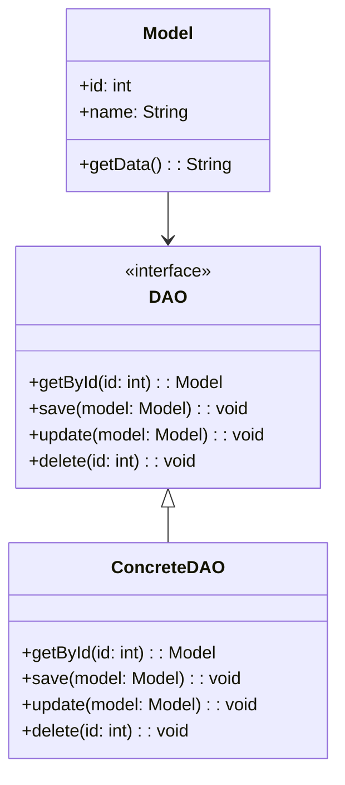

## 8.2 Data Access Object (DAO) Pattern

In the realm of enterprise software development, managing data access efficiently is crucial. The Data Access Object (DAO) pattern is a structural pattern that provides a systematic approach to abstract and encapsulate all access to a data source. By doing so, it offers a clear separation between business logic and data persistence, promoting a modular architecture that enhances maintainability and adaptability.

### Understanding the DAO Pattern

The DAO pattern is a design pattern that provides an abstract interface to some type of database or other persistence mechanism. By mapping application calls to the persistence layer, the DAO pattern provides specific data operations without exposing details of the database. This abstraction allows for a clean separation of concerns, where the business logic is decoupled from the data access logic.

#### Intent of the DAO Pattern

The primary intent of the DAO pattern is to:

- **Encapsulate Data Access Logic**: By providing a separate layer for data access, the DAO pattern encapsulates the logic required to interact with the data source, whether it's a database, a file, or a web service.
- **Promote Reusability and Maintainability**: By isolating data access code, the DAO pattern allows for easier maintenance and reuse of code. Changes to the data source or the way data is accessed can be made without affecting the business logic.
- **Enhance Testability**: By separating data access from business logic, the DAO pattern makes it easier to test business logic independently of the data access code.

### Components of the DAO Pattern

The DAO pattern typically consists of the following components:

1. **DAO Interface**: Defines the standard operations to be performed on a model object(s). It acts as a contract for the concrete DAO implementations.
2. **Concrete DAO Implementation**: Provides the actual implementation of the DAO interface. This class contains the logic to interact with the data source.
3. **Model Objects**: These are the objects that represent the data to be accessed and manipulated.
4. **Data Source**: The actual source of data, such as a database, file, or web service.

#### UML Diagram of the DAO Pattern

To better understand the structure of the DAO pattern, let's visualize it using a UML class diagram:



In this diagram, the `DAO` interface defines the operations that can be performed on the `Model`. The `ConcreteDAO` class implements these operations, providing the actual data access logic.

### Advantages of Using the DAO Pattern

The DAO pattern offers several benefits that make it a popular choice in enterprise applications:

- **Improved Maintainability**: By isolating data access code, changes to the data source or the way data is accessed can be made without affecting the business logic. This separation of concerns leads to a more maintainable codebase.
- **Easier Adaptability**: The DAO pattern makes it easier to adapt to changes in data sources or persistence mechanisms. For example, switching from a SQL database to a NoSQL database can be done by changing the DAO implementation without affecting the rest of the application.
- **Enhanced Testability**: With the DAO pattern, business logic can be tested independently of the data access code. This separation allows for easier unit testing and mocking of data access operations.
- **Consistency and Reusability**: By providing a consistent interface for data access, the DAO pattern promotes code reuse and consistency across the application.

### Common Practices in Implementing the DAO Pattern

When implementing the DAO pattern, there are several common practices to consider:

- **Define a DAO for Each Business Entity**: Typically, a separate DAO is defined for each business entity or model. This approach allows for a clear separation of data access logic for different entities.
- **Use Interfaces to Define DAOs**: By defining DAOs as interfaces, you can easily switch between different implementations or mock the DAO for testing purposes.
- **Handle Transactions and Exceptions**: Managing transactions and handling exceptions within DAOs is crucial for ensuring data integrity and reliability.

### Practical Implementation Strategies

Let's explore a practical implementation of the DAO pattern in Java. We'll create a simple application that manages a list of users, each represented by a `User` model.

#### Step 1: Define the Model

First, we define the `User` model, which represents the data to be accessed and manipulated.

```java
public class User {
    private int id;
    private String name;
    private String email;

    // Constructors, getters, and setters
    public User(int id, String name, String email) {
        this.id = id;
        this.name = name;
        this.email = email;
    }

    public int getId() {
        return id;
    }

    public void setId(int id) {
        this.id = id;
    }

    public String getName() {
        return name;
    }

    public void setName(String name) {
        this.name = name;
    }

    public String getEmail() {
        return email;
    }

    public void setEmail(String email) {
        this.email = email;
    }
}
```

#### Step 2: Define the DAO Interface

Next, we define the `UserDAO` interface, which specifies the operations that can be performed on the `User` model.

```java
public interface UserDAO {
    User getById(int id);
    List<User> getAll();
    void save(User user);
    void update(User user);
    void delete(int id);
}
```

#### Step 3: Implement the Concrete DAO

Now, we implement the `UserDAO` interface in a `UserDAOImpl` class, which provides the actual data access logic. For simplicity, we'll use an in-memory list to store users.

```java
import java.util.ArrayList;
import java.util.List;

public class UserDAOImpl implements UserDAO {
    private List<User> users = new ArrayList<>();

    @Override
    public User getById(int id) {
        return users.stream()
                    .filter(user -> user.getId() == id)
                    .findFirst()
                    .orElse(null);
    }

    @Override
    public List<User> getAll() {
        return new ArrayList<>(users);
    }

    @Override
    public void save(User user) {
        users.add(user);
    }

    @Override
    public void update(User user) {
        User existingUser = getById(user.getId());
        if (existingUser != null) {
            existingUser.setName(user.getName());
            existingUser.setEmail(user.getEmail());
        }
    }

    @Override
    public void delete(int id) {
        users.removeIf(user -> user.getId() == id);
    }
}
```

### Handling Transactions and Exceptions

In a real-world application, DAOs often interact with databases, which requires careful management of transactions and exceptions. Here are some best practices:

- **Use Transactions**: Ensure that data operations are atomic by using transactions. In Java, this can be managed using frameworks like Spring, which provide transaction management capabilities.
- **Handle Exceptions Gracefully**: Catch and handle exceptions within DAOs to ensure that errors do not propagate to the business logic layer. This can involve logging errors and providing meaningful error messages.

### Challenges and Considerations

While the DAO pattern offers many benefits, there are some challenges to consider:

- **Complexity in Large Applications**: In large applications with many entities, managing a large number of DAOs can become complex. It's important to organize DAOs logically and consistently.
- **Performance Overhead**: Abstracting data access can introduce some performance overhead. It's important to optimize DAO implementations for performance, especially in high-traffic applications.
- **Transaction Management**: Managing transactions across multiple DAOs can be challenging. It's important to ensure that transactions are managed consistently and reliably.

### Try It Yourself

To get hands-on experience with the DAO pattern, try modifying the code examples provided. For instance, you can:

- Add new methods to the `UserDAO` interface, such as `findByEmail`.
- Implement a `UserDAOImpl` class that interacts with a database using JDBC.
- Create unit tests for the `UserDAOImpl` class using a mocking framework like Mockito.

### Conclusion

The Data Access Object (DAO) pattern is a powerful tool for managing data access in enterprise applications. By providing a clear separation between business logic and data persistence, the DAO pattern promotes a modular architecture that is easier to maintain, adapt, and test. As you continue to develop your skills in software design, consider how the DAO pattern can be applied to your projects to enhance data management and improve code quality.

## Quiz Time!



### What is the primary intent of the DAO pattern?

- [x] To encapsulate data access logic and promote separation of concerns
- [ ] To improve user interface design
- [ ] To enhance security features
- [ ] To optimize algorithm performance

> **Explanation:** The DAO pattern encapsulates data access logic, promoting separation of concerns between business logic and data persistence.


### What component in the DAO pattern defines the standard operations for data access?

- [x] DAO Interface
- [ ] Concrete DAO Implementation
- [ ] Model Objects
- [ ] Data Source

> **Explanation:** The DAO Interface defines the standard operations for data access, acting as a contract for concrete implementations.


### Which of the following is NOT an advantage of using the DAO pattern?

- [ ] Improved maintainability
- [x] Increased complexity of business logic
- [ ] Enhanced testability
- [ ] Easier adaptability to changes in data sources

> **Explanation:** The DAO pattern simplifies business logic by separating it from data access, thus not increasing its complexity.


### In a DAO pattern, what is the role of the Concrete DAO Implementation?

- [x] To provide the actual implementation of data access operations
- [ ] To define the standard operations for data access
- [ ] To represent the data to be accessed
- [ ] To act as the data source

> **Explanation:** The Concrete DAO Implementation provides the actual data access logic as defined by the DAO Interface.


### What is a common practice when implementing the DAO pattern?

- [x] Define a DAO for each business entity
- [ ] Use a single DAO for all entities
- [ ] Avoid using interfaces for DAOs
- [ ] Implement DAOs without considering transactions

> **Explanation:** A common practice is to define a separate DAO for each business entity to maintain a clear separation of data access logic.


### How does the DAO pattern enhance testability?

- [x] By allowing business logic to be tested independently of data access code
- [ ] By integrating data access with business logic
- [ ] By simplifying the user interface
- [ ] By optimizing database queries

> **Explanation:** The DAO pattern separates data access from business logic, making it easier to test business logic independently.


### What challenge might arise when using the DAO pattern in large applications?

- [x] Managing a large number of DAOs can become complex
- [ ] It simplifies transaction management
- [ ] It reduces the need for data access logic
- [ ] It eliminates the need for database connections

> **Explanation:** In large applications, managing many DAOs can become complex, requiring logical organization and consistency.


### What is a potential drawback of abstracting data access in the DAO pattern?

- [x] Performance overhead
- [ ] Increased security risks
- [ ] Reduced code readability
- [ ] Difficulty in testing

> **Explanation:** Abstracting data access can introduce performance overhead, especially in high-traffic applications.


### Which of the following is a best practice for handling transactions in DAOs?

- [x] Use transactions to ensure atomic data operations
- [ ] Avoid using transactions for simplicity
- [ ] Handle transactions in the business logic layer
- [ ] Use transactions only for read operations

> **Explanation:** Using transactions in DAOs ensures that data operations are atomic, maintaining data integrity.


### True or False: The DAO pattern can help in adapting to changes in data sources or persistence mechanisms.

- [x] True
- [ ] False

> **Explanation:** The DAO pattern allows for easier adaptation to changes in data sources or persistence mechanisms by isolating data access logic.


