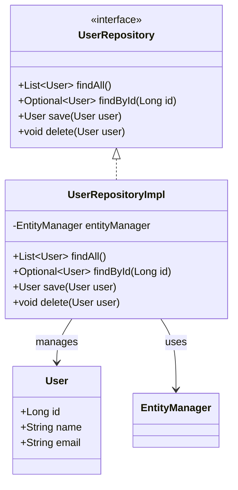

## 8.3.1 Implementing Repository in Java

In the realm of software engineering, managing data operations efficiently is crucial for building scalable and maintainable applications. The Repository pattern is a well-established design pattern that provides a central location for managing data operations, abstracting the data access logic from the business logic. In this section, we will delve into the implementation of the Repository pattern in Java, explore its integration with ORM frameworks like Hibernate and JPA, and discuss best practices for creating robust and flexible repositories.

### Understanding the Repository Pattern

The Repository pattern is a layer that mediates between the domain and data mapping layers, acting like an in-memory collection of domain objects. It provides a set of methods for accessing and manipulating data, allowing the business logic to remain agnostic of the underlying data access mechanisms.

#### Key Concepts

- **Repository Interface**: Defines a contract for data access operations, such as retrieving, saving, and deleting domain objects.
- **Domain Objects**: Represent the core entities of the application, encapsulating business logic and data.
- **Data Access Layer**: The underlying mechanism for interacting with the data source, such as a database or an external API.

### Defining Repository Interfaces

To implement the Repository pattern, we begin by defining repository interfaces that represent collections of domain objects. These interfaces should focus on domain-related data operations and avoid exposing data access implementation details.

```java
public interface UserRepository {
    List<User> findAll();
    Optional<User> findById(Long id);
    User save(User user);
    void delete(User user);
}
```

In this example, the `UserRepository` interface defines common methods for managing `User` entities, such as `findAll()`, `findById()`, `save()`, and `delete()`. These methods provide a clear contract for data operations without revealing how the data is accessed or stored.

### Implementing Repositories with Java Interfaces and Classes

Once the repository interfaces are defined, we can implement them using Java classes. The implementation should encapsulate the data access logic, allowing the business logic to interact with the repository through the defined interface.

```java
public class UserRepositoryImpl implements UserRepository {
    private final EntityManager entityManager;

    public UserRepositoryImpl(EntityManager entityManager) {
        this.entityManager = entityManager;
    }

    @Override
    public List<User> findAll() {
        return entityManager.createQuery("SELECT u FROM User u", User.class).getResultList();
    }

    @Override
    public Optional<User> findById(Long id) {
        User user = entityManager.find(User.class, id);
        return user != null ? Optional.of(user) : Optional.empty();
    }

    @Override
    public User save(User user) {
        if (user.getId() == null) {
            entityManager.persist(user);
            return user;
        } else {
            return entityManager.merge(user);
        }
    }

    @Override
    public void delete(User user) {
        entityManager.remove(entityManager.contains(user) ? user : entityManager.merge(user));
    }
}
```

In this implementation, the `UserRepositoryImpl` class uses JPA's `EntityManager` to perform data operations. The `findAll()` method retrieves all users, `findById()` fetches a user by ID, `save()` persists or updates a user, and `delete()` removes a user from the database.

### Integrating Repositories with ORM Frameworks

ORM (Object-Relational Mapping) frameworks like Hibernate and JPA simplify the process of mapping domain entities to database tables and executing complex queries. By integrating repositories with ORM frameworks, we can leverage their capabilities to manage data operations efficiently.

#### Mapping Domain Entities to Database Tables

To map domain entities to database tables, we use JPA annotations to define entity classes and their relationships.

```java
@Entity
@Table(name = "users")
public class User {
    @Id
    @GeneratedValue(strategy = GenerationType.IDENTITY)
    private Long id;

    @Column(nullable = false)
    private String name;

    @Column(unique = true, nullable = false)
    private String email;

    // Getters and setters
}
```

In this example, the `User` class is annotated with `@Entity` to indicate that it is a JPA entity. The `@Table` annotation specifies the corresponding database table, and `@Id` and `@GeneratedValue` define the primary key and its generation strategy.

#### Utilizing Criteria Queries or JPQL for Complex Queries

For complex queries, we can use JPA's Criteria API or JPQL (Java Persistence Query Language) to construct queries programmatically or using a SQL-like syntax.

```java
public List<User> findByEmailDomain(String domain) {
    String jpql = "SELECT u FROM User u WHERE u.email LIKE :domain";
    return entityManager.createQuery(jpql, User.class)
                        .setParameter("domain", "%" + domain)
                        .getResultList();
}
```

In this example, the `findByEmailDomain()` method uses JPQL to retrieve users whose email addresses match a specific domain. The query is constructed using a parameterized JPQL string, and the result is obtained by executing the query with the specified parameter.

### Best Practices for Implementing Repositories

When implementing repositories, it is important to follow best practices to ensure maintainability, flexibility, and performance.

#### Keep Repository Interfaces Focused on Domain-Related Data Operations

Repository interfaces should focus on domain-related data operations and avoid exposing data access implementation details. This separation of concerns allows the business logic to remain independent of the data access layer.

#### Avoid Exposing Data Access Implementation Details to the Domain Layer

The domain layer should not be aware of how data is accessed or stored. By encapsulating data access logic within repositories, we can change the underlying data source or access mechanism without affecting the domain logic.

#### Implement Custom Query Methods as Needed

While common repository methods like `findAll()`, `findById()`, `save()`, and `delete()` are often sufficient, there may be cases where custom query methods are needed to support specific business requirements. Implement these methods as needed, using criteria queries or JPQL to construct complex queries.

#### Encourage the Use of Generics to Create Type-Safe Repositories

Generics can be used to create type-safe repositories, allowing for greater flexibility and reusability.

```java
public interface GenericRepository<T, ID> {
    List<T> findAll();
    Optional<T> findById(ID id);
    T save(T entity);
    void delete(T entity);
}
```

By defining a `GenericRepository` interface with generic type parameters `T` and `ID`, we can create repositories for different domain entities while ensuring type safety.

### Try It Yourself

To deepen your understanding of the Repository pattern, try implementing a repository for a different domain entity, such as `Product` or `Order`. Experiment with integrating the repository with an ORM framework like Hibernate or JPA, and explore the use of criteria queries or JPQL for complex queries. Consider implementing custom query methods to support specific business requirements.

### Visualizing the Repository Pattern

To better understand the structure and flow of the Repository pattern, let's visualize the interaction between the repository, domain objects, and the data access layer.



In this class diagram, the `UserRepository` interface defines the contract for data operations, while the `UserRepositoryImpl` class implements the interface and manages `User` entities using an `EntityManager`.

### References and Links

- [Java Persistence API (JPA) - Oracle Documentation](https://docs.oracle.com/javaee/7/tutorial/persistence-intro.htm)
- [Hibernate ORM - Official Website](https://hibernate.org/orm/)
- [Spring Data JPA - Reference Documentation](https://docs.spring.io/spring-data/jpa/docs/current/reference/html/)

### Knowledge Check

- What is the purpose of the Repository pattern?
- How do repository interfaces differ from repository implementations?
- Why is it important to keep repository interfaces focused on domain-related data operations?
- How can generics be used to create type-safe repositories?

### Embrace the Journey

Remember, mastering the Repository pattern is just one step in your journey as a software engineer. As you continue to explore design patterns and best practices, you'll build more robust and scalable applications. Keep experimenting, stay curious, and enjoy the journey!

## Quiz Time!



### What is the primary purpose of the Repository pattern?

- [x] To provide a central location for managing data operations
- [ ] To define the structure of a database
- [ ] To handle user authentication
- [ ] To manage application configuration

> **Explanation:** The Repository pattern provides a central location for managing data operations, abstracting the data access logic from the business logic.

### Which of the following is a common method defined in a repository interface?

- [x] findAll()
- [ ] authenticateUser()
- [ ] configureDatabase()
- [ ] initializeApplication()

> **Explanation:** The `findAll()` method is commonly defined in a repository interface to retrieve all domain objects.

### How do repository interfaces differ from repository implementations?

- [x] Interfaces define the contract, while implementations encapsulate the data access logic
- [ ] Interfaces handle data storage, while implementations manage user input
- [ ] Interfaces are used for testing, while implementations are used in production
- [ ] Interfaces are written in XML, while implementations are written in Java

> **Explanation:** Repository interfaces define the contract for data operations, while implementations encapsulate the data access logic.

### Why is it important to keep repository interfaces focused on domain-related data operations?

- [x] To maintain separation of concerns and keep business logic independent of data access
- [ ] To ensure that all data is stored in a single database
- [ ] To improve the performance of the application
- [ ] To reduce the number of classes in the application

> **Explanation:** Keeping repository interfaces focused on domain-related data operations maintains separation of concerns and keeps business logic independent of data access.

### How can generics be used to create type-safe repositories?

- [x] By defining repository interfaces with generic type parameters
- [ ] By using XML configuration files
- [ ] By implementing repositories in a scripting language
- [ ] By storing all data in a single table

> **Explanation:** Generics can be used to create type-safe repositories by defining repository interfaces with generic type parameters.

### What is the role of the EntityManager in a JPA-based repository implementation?

- [x] To manage the persistence context and perform data operations
- [ ] To handle user authentication
- [ ] To manage application configuration
- [ ] To define the structure of a database

> **Explanation:** The `EntityManager` manages the persistence context and performs data operations in a JPA-based repository implementation.

### Which annotation is used to indicate that a class is a JPA entity?

- [x] @Entity
- [ ] @Table
- [ ] @Id
- [ ] @Column

> **Explanation:** The `@Entity` annotation is used to indicate that a class is a JPA entity.

### What is the purpose of using JPQL in a repository implementation?

- [x] To construct queries using a SQL-like syntax
- [ ] To define the structure of a database
- [ ] To handle user authentication
- [ ] To manage application configuration

> **Explanation:** JPQL is used to construct queries using a SQL-like syntax in a repository implementation.

### Which of the following is a best practice for implementing repositories?

- [x] Avoid exposing data access implementation details to the domain layer
- [ ] Store all data in a single table
- [ ] Use XML configuration files for all data operations
- [ ] Implement repositories in a scripting language

> **Explanation:** A best practice for implementing repositories is to avoid exposing data access implementation details to the domain layer.

### True or False: The Repository pattern is used to manage application configuration.

- [ ] True
- [x] False

> **Explanation:** False. The Repository pattern is used to manage data operations, not application configuration.


