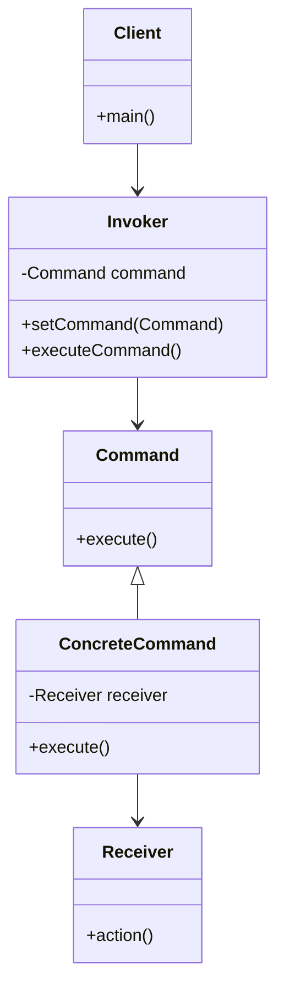

## 8.3.1 Implementing Command in Java

The Command pattern is a behavioral design pattern that turns a request into a stand-alone object containing all information about the request. This transformation allows for parameterization of clients with queues, requests, and operations. It also provides support for undoable operations. In this section, we will explore the Command pattern's intent, its participants, and how to implement it in Java.

### Intent and Benefits of the Command Pattern

The primary intent of the Command pattern is to encapsulate a request as an object, thereby allowing for parameterization of clients with different requests, queuing of requests, and logging of the requests. It also provides the capability to support undoable operations.

**Benefits of the Command Pattern:**

- **Decoupling:** It decouples the object that invokes the operation from the one that knows how to perform it.
- **Flexibility:** Commands can be parameterized, queued, logged, and undone.
- **Extensibility:** New commands can be added without changing existing code.
- **Undo/Redo Operations:** Supports undoable operations by storing state.

### Participants in the Command Pattern

The Command pattern involves several key participants:

- **Command:** Declares an interface for executing an operation.
- **ConcreteCommand:** Implements the Command interface and defines the binding between a Receiver object and an action.
- **Receiver:** Knows how to perform the operations associated with carrying out a request.
- **Invoker:** Asks the command to carry out the request.
- **Client:** Creates a ConcreteCommand object and sets its receiver.

### UML Diagram

Below is a UML diagram illustrating the relationships between the participants in the Command pattern:



*Caption: UML diagram showing the structure of the Command pattern.*

### Java Code Example

Let's implement a simple example of the Command pattern in Java. We'll create a scenario where a remote control (Invoker) can execute commands to turn on and off a light (Receiver).

#### Step 1: Define the Command Interface

```java
// Command interface
interface Command {
    void execute();
}
```

#### Step 2: Create ConcreteCommand Classes

```java
// Concrete Command to turn on the light
class LightOnCommand implements Command {
    private Light light;

    public LightOnCommand(Light light) {
        this.light = light;
    }

    @Override
    public void execute() {
        light.turnOn();
    }
}

// Concrete Command to turn off the light
class LightOffCommand implements Command {
    private Light light;

    public LightOffCommand(Light light) {
        this.light = light;
    }

    @Override
    public void execute() {
        light.turnOff();
    }
}
```

#### Step 3: Implement the Receiver

```java
// Receiver class
class Light {
    public void turnOn() {
        System.out.println("The light is on.");
    }

    public void turnOff() {
        System.out.println("The light is off.");
    }
}
```

#### Step 4: Create the Invoker

```java
// Invoker class
class RemoteControl {
    private Command command;

    public void setCommand(Command command) {
        this.command = command;
    }

    public void pressButton() {
        command.execute();
    }
}
```

#### Step 5: Implement the Client

```java
// Client class
public class Client {
    public static void main(String[] args) {
        Light livingRoomLight = new Light();
        
        Command lightOn = new LightOnCommand(livingRoomLight);
        Command lightOff = new LightOffCommand(livingRoomLight);
        
        RemoteControl remote = new RemoteControl();
        
        // Turn on the light
        remote.setCommand(lightOn);
        remote.pressButton();
        
        // Turn off the light
        remote.setCommand(lightOff);
        remote.pressButton();
    }
}
```

### Explanation of the Code

- **Command Interface:** The `Command` interface declares the `execute` method, which is implemented by all concrete commands.
- **ConcreteCommand Classes:** `LightOnCommand` and `LightOffCommand` implement the `Command` interface and define the actions to be performed on the `Light` receiver.
- **Receiver:** The `Light` class contains the actual business logic to turn the light on and off.
- **Invoker:** The `RemoteControl` class holds a command and calls its `execute` method.
- **Client:** The `Client` class is responsible for creating the `ConcreteCommand` objects and associating them with the `Receiver`.

### Decoupling and Flexibility

The Command pattern decouples the invoker from the receiver by introducing an intermediary command object. This separation allows for greater flexibility, as the invoker does not need to know the details of how the command is executed. This decoupling is particularly useful in scenarios where the set of commands is subject to change or extension.

### Supporting Undoable Operations

One of the powerful features of the Command pattern is its ability to support undoable operations. By storing the state before executing a command, you can easily implement undo functionality. Here's how you can extend the pattern to support undo:

#### Extending the Command Interface

```java
// Extended Command interface with undo
interface Command {
    void execute();
    void undo();
}
```

#### Implementing Undo in ConcreteCommand

```java
// Concrete Command with undo functionality
class LightOnCommand implements Command {
    private Light light;

    public LightOnCommand(Light light) {
        this.light = light;
    }

    @Override
    public void execute() {
        light.turnOn();
    }

    @Override
    public void undo() {
        light.turnOff();
    }
}

class LightOffCommand implements Command {
    private Light light;

    public LightOffCommand(Light light) {
        this.light = light;
    }

    @Override
    public void execute() {
        light.turnOff();
    }

    @Override
    public void undo() {
        light.turnOn();
    }
}
```

#### Enhancing the Invoker

```java
// Invoker with undo functionality
class RemoteControl {
    private Command command;

    public void setCommand(Command command) {
        this.command = command;
    }

    public void pressButton() {
        command.execute();
    }

    public void pressUndo() {
        command.undo();
    }
}
```

### Sample Use Cases

The Command pattern is widely used in various applications, including:

- **GUI Buttons:** Each button can be associated with a command that is executed when the button is pressed.
- **Transaction Management:** Commands can be used to encapsulate database transactions, allowing for rollback operations.
- **Macro Recording:** Commands can be recorded and replayed to automate repetitive tasks.

### Related Patterns

- **[6.6 Singleton Pattern]( "Singleton Pattern")**: Often used in conjunction with the Command pattern to ensure a single instance of the invoker.
- **[8.1 Strategy Pattern]( "Strategy Pattern")**: Similar in that both patterns encapsulate algorithms, but the Command pattern encapsulates requests.

### Known Uses

The Command pattern is used in many frameworks and libraries, such as:

- **Java Swing:** Action objects in Swing are an example of the Command pattern.
- **Apache Commons Chain:** A library that implements the Command pattern to process a chain of commands.

### Conclusion

The Command pattern is a versatile and powerful design pattern that provides a way to encapsulate requests as objects, allowing for parameterization, queuing, and undoable operations. By decoupling the invoker from the receiver, it enhances flexibility and maintainability in software design. Implementing this pattern in Java can significantly improve the structure and functionality of your applications.

---

## Test Your Knowledge: Command Pattern in Java Quiz



### What is the primary intent of the Command pattern?

- [x] To encapsulate a request as an object
- [ ] To create a single instance of a class
- [ ] To define a family of algorithms
- [ ] To provide a way to access the elements of an aggregate object

> **Explanation:** The Command pattern encapsulates a request as an object, allowing for parameterization and queuing of requests.

### Which participant in the Command pattern knows how to perform the operations?

- [ ] Command
- [ ] Invoker
- [x] Receiver
- [ ] Client

> **Explanation:** The Receiver knows how to perform the operations associated with carrying out a request.

### What is the role of the Invoker in the Command pattern?

- [x] To ask the command to carry out the request
- [ ] To implement the command interface
- [ ] To create a ConcreteCommand object
- [ ] To perform the operations

> **Explanation:** The Invoker asks the command to carry out the request by calling its execute method.

### How does the Command pattern support undoable operations?

- [x] By storing state before executing a command
- [ ] By using a single instance of a class
- [ ] By defining a family of algorithms
- [ ] By providing a way to access the elements of an aggregate object

> **Explanation:** The Command pattern supports undoable operations by storing state before executing a command, allowing for rollback.

### Which of the following is a benefit of using the Command pattern?

- [x] Decoupling the invoker from the receiver
- [ ] Increasing the number of classes
- [ ] Reducing the flexibility of the code
- [ ] Making the code less maintainable

> **Explanation:** The Command pattern decouples the invoker from the receiver, enhancing flexibility and maintainability.

### In the Command pattern, what is the role of the Client?

- [x] To create a ConcreteCommand object and set its receiver
- [ ] To execute the command
- [ ] To perform the operations
- [ ] To ask the command to carry out the request

> **Explanation:** The Client creates a ConcreteCommand object and sets its receiver.

### Which pattern is often used in conjunction with the Command pattern to ensure a single instance of the invoker?

- [x] Singleton Pattern
- [ ] Strategy Pattern
- [ ] Observer Pattern
- [ ] Factory Pattern

> **Explanation:** The Singleton Pattern is often used with the Command pattern to ensure a single instance of the invoker.

### What is a real-world example of the Command pattern?

- [x] GUI buttons executing commands
- [ ] A single instance of a class
- [ ] A family of algorithms
- [ ] Accessing elements of an aggregate object

> **Explanation:** GUI buttons executing commands is a real-world example of the Command pattern.

### Which pattern is similar to the Command pattern in that both encapsulate algorithms?

- [ ] Singleton Pattern
- [x] Strategy Pattern
- [ ] Observer Pattern
- [ ] Factory Pattern

> **Explanation:** The Strategy Pattern is similar to the Command pattern in that both encapsulate algorithms.

### True or False: The Command pattern increases the number of classes in a program.

- [x] True
- [ ] False

> **Explanation:** The Command pattern can increase the number of classes in a program, as each command is typically implemented as a separate class.



---
