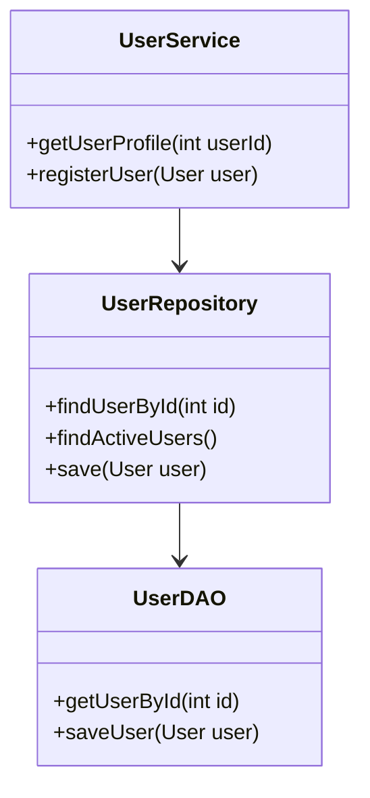

## 8.3.2 Repository vs. DAO

In the realm of software architecture, especially within enterprise applications, the Repository and Data Access Object (DAO) patterns are pivotal for managing data interactions. While both patterns aim to abstract data access, they serve distinct purposes and operate at different levels of abstraction. Understanding these differences is crucial for designing robust and maintainable applications.

### Understanding the DAO Pattern

The DAO pattern is a structural pattern that provides an abstract interface to some type of database or other persistence mechanism. It encapsulates all the complexities involved in performing CRUD (Create, Read, Update, Delete) operations, allowing the rest of the application to interact with the data source without being concerned with the underlying details.

#### Key Characteristics of DAO

- **Focus on Low-Level Operations**: DAOs are primarily concerned with the technical details of data access. They handle the intricacies of interacting with the database, such as opening connections, executing SQL queries, and managing transactions.
- **Tied to Persistence Mechanism**: DAOs are often closely aligned with the specific database technology being used. This means that changes in the persistence mechanism can necessitate changes in the DAO implementation.
- **Separation of Concerns**: By isolating data access logic, DAOs promote a clean separation of concerns, making it easier to manage and test the data access layer independently of the business logic.

#### Implementing a DAO in Java

Let's consider a simple example of a DAO implementation for a `User` entity using JDBC:

```java
public class UserDAO {

    private Connection connection;

    public UserDAO(Connection connection) {
        this.connection = connection;
    }

    public User getUserById(int id) throws SQLException {
        String query = "SELECT * FROM users WHERE id = ?";
        try (PreparedStatement statement = connection.prepareStatement(query)) {
            statement.setInt(1, id);
            try (ResultSet resultSet = statement.executeQuery()) {
                if (resultSet.next()) {
                    return new User(resultSet.getInt("id"), resultSet.getString("name"), resultSet.getString("email"));
                }
            }
        }
        return null;
    }

    public void saveUser(User user) throws SQLException {
        String query = "INSERT INTO users (name, email) VALUES (?, ?)";
        try (PreparedStatement statement = connection.prepareStatement(query)) {
            statement.setString(1, user.getName());
            statement.setString(2, user.getEmail());
            statement.executeUpdate();
        }
    }

    // Additional CRUD operations...
}
```

In this example, the `UserDAO` class handles the connection to the database and performs SQL operations directly. This encapsulation of data access logic allows the rest of the application to remain agnostic of the database details.

### Understanding the Repository Pattern

The Repository pattern, on the other hand, operates at a higher level of abstraction. It is closely aligned with domain-driven design and focuses on managing domain objects and providing business-specific data retrieval methods.

#### Key Characteristics of Repository

- **Focus on Domain Logic**: Repositories are concerned with the business logic and domain model. They provide a collection-like interface for accessing domain objects, abstracting the underlying data access details.
- **Business-Specific Queries**: Unlike DAOs, repositories offer methods that reflect business operations, such as `findActiveUsers` or `getOrdersByCustomer`.
- **Alignment with Domain-Driven Design**: Repositories are a core component of domain-driven design, emphasizing the importance of the domain model and ensuring that data access aligns with business concepts.

#### Implementing a Repository in Java

Consider the following example of a `UserRepository`:

```java
public class UserRepository {

    private UserDAO userDAO;

    public UserRepository(UserDAO userDAO) {
        this.userDAO = userDAO;
    }

    public User findUserById(int id) {
        return userDAO.getUserById(id);
    }

    public List<User> findActiveUsers() {
        // Business logic to find active users
        // This could involve calling multiple DAOs or applying business rules
        return new ArrayList<>(); // Placeholder for actual implementation
    }

    public void save(User user) {
        userDAO.saveUser(user);
    }

    // Additional business-specific methods...
}
```

In this example, the `UserRepository` uses a `UserDAO` to perform the actual data access. The repository focuses on business logic, providing methods that align with the application's domain model.

### Comparing Repository and DAO

While both patterns aim to abstract data access, they serve different purposes and are used in different contexts. Let's explore some key differences:

- **Level of Abstraction**: DAOs operate at a lower level, focusing on the specifics of data access. Repositories operate at a higher level, managing domain objects and business logic.
- **Purpose**: DAOs are concerned with technical details, while repositories focus on business operations and domain logic.
- **Alignment with Domain-Driven Design**: Repositories are a key component of domain-driven design, emphasizing the importance of the domain model. DAOs are more technical and less concerned with business concepts.

### When to Use DAO vs. Repository

Choosing between DAOs and repositories depends on the complexity of the application and the alignment with business concepts. Here are some guidelines:

- **Use DAOs for Simple Applications**: In simple applications where direct control over data access is required, DAOs are sufficient. They provide a straightforward way to manage data access without the overhead of domain logic.
- **Utilize Repositories in Complex Domains**: In complex domains where aligning closely with business concepts is beneficial, repositories are more appropriate. They provide a higher level of abstraction, focusing on business operations and domain logic.

### Layered Approach: Combining DAO and Repository

In many cases, a layered approach is beneficial, where both patterns coexist. DAOs handle the low-level data access, while repositories manage the domain logic. This separation of concerns allows for greater flexibility and maintainability.

#### Example of a Layered Approach

```java
public class UserService {

    private UserRepository userRepository;

    public UserService(UserRepository userRepository) {
        this.userRepository = userRepository;
    }

    public User getUserProfile(int userId) {
        User user = userRepository.findUserById(userId);
        // Additional business logic...
        return user;
    }

    public void registerUser(User user) {
        userRepository.save(user);
        // Additional business logic...
    }
}
```

In this example, the `UserService` uses a `UserRepository` to manage domain logic, while the repository itself uses a `UserDAO` for data access. This layered approach promotes a clean separation of concerns, making the application easier to manage and extend.

### Visualizing the Relationship Between Repository and DAO

To better understand the relationship between repositories and DAOs, let's visualize their interaction within an application architecture:



This diagram illustrates how the `UserService` interacts with the `UserRepository`, which in turn uses the `UserDAO` for data access. The separation of concerns is clear, with each layer focusing on its specific responsibilities.

### Guidelines for Choosing Between DAO and Repository

When deciding between DAOs and repositories, consider the following guidelines:

- **Project Complexity**: For simple projects, DAOs may suffice. For complex domains, repositories provide a higher level of abstraction and better alignment with business concepts.
- **Domain-Driven Design**: If your project follows domain-driven design principles, repositories are a natural fit. They emphasize the importance of the domain model and align data access with business operations.
- **Separation of Concerns**: A layered approach, where both patterns coexist, can provide the best of both worlds. DAOs handle low-level data access, while repositories manage domain logic, promoting a clean separation of concerns.

### Try It Yourself

To deepen your understanding of DAOs and repositories, try implementing both patterns for a simple application. Start with a basic DAO to handle data access, then build a repository to manage domain logic. Experiment with adding business-specific methods to the repository and see how it affects the overall architecture.

### Conclusion

In conclusion, while both the Repository and DAO patterns aim to abstract data access, they serve different purposes and operate at different levels of abstraction. DAOs focus on low-level data access operations, while repositories manage domain objects and provide business-specific data retrieval methods. By understanding these differences and following the guidelines provided, you can choose the right pattern for your project and design robust, maintainable applications.

## Quiz Time!



### Which pattern focuses on low-level data access operations?

- [x] DAO
- [ ] Repository
- [ ] Service
- [ ] Controller

> **Explanation:** The DAO pattern focuses on low-level data access operations, handling the technical details of interacting with the database.


### What is the primary focus of the Repository pattern?

- [ ] Low-level data access
- [x] Domain logic and business operations
- [ ] User interface management
- [ ] Transaction management

> **Explanation:** The Repository pattern focuses on domain logic and business operations, providing a higher level of abstraction over data access.


### In which scenario is it more appropriate to use a Repository?

- [ ] Simple applications with direct data access
- [x] Complex domains with business-specific queries
- [ ] Applications with no data persistence
- [ ] Applications focused solely on UI

> **Explanation:** Repositories are more appropriate in complex domains where aligning closely with business concepts is beneficial.


### How do DAOs and Repositories typically interact in a layered architecture?

- [x] Repositories use DAOs for data access
- [ ] DAOs use Repositories for data access
- [ ] They do not interact
- [ ] They are interchangeable

> **Explanation:** In a layered architecture, repositories use DAOs to perform the actual data access, allowing repositories to focus on domain logic.


### Which pattern is closely aligned with domain-driven design?

- [ ] DAO
- [x] Repository
- [ ] Singleton
- [ ] Observer

> **Explanation:** The Repository pattern is closely aligned with domain-driven design, emphasizing the importance of the domain model.


### What is a key benefit of using DAOs?

- [x] Separation of data access logic from business logic
- [ ] Direct manipulation of user interfaces
- [ ] Simplifying domain logic
- [ ] Enhancing UI responsiveness

> **Explanation:** DAOs provide a separation of data access logic from business logic, promoting a clean separation of concerns.


### What is a key characteristic of the DAO pattern?

- [x] Tied closely to the persistence mechanism
- [ ] Focuses on domain logic
- [ ] Provides business-specific queries
- [ ] Manages user interfaces

> **Explanation:** DAOs are often closely aligned with the specific database technology being used, focusing on the technical details of data access.


### What is the role of a UserService in a layered architecture?

- [x] Manage domain logic and use repositories
- [ ] Directly access the database
- [ ] Handle low-level data access
- [ ] Manage user interfaces

> **Explanation:** In a layered architecture, a UserService manages domain logic and uses repositories to interact with the data layer.


### True or False: Repositories are concerned with the technical details of data access.

- [ ] True
- [x] False

> **Explanation:** Repositories are not concerned with the technical details of data access; they focus on domain logic and business operations.


### Which pattern provides a collection-like interface for accessing domain objects?

- [ ] DAO
- [x] Repository
- [ ] Singleton
- [ ] Observer

> **Explanation:** The Repository pattern provides a collection-like interface for accessing domain objects, abstracting the underlying data access details.


