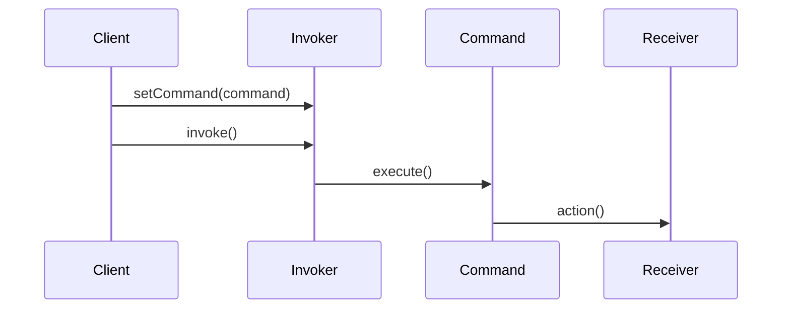

## 8.3.2 Invoker, Command, and Receiver Roles

The Command Pattern is a behavioral design pattern that turns a request into a stand-alone object that contains all information about the request. This transformation allows for parameterization of clients with queues, requests, and operations. It also provides support for undoable operations. In this section, we delve into the roles of the Invoker, Command, and Receiver, which are the core components of the Command Pattern.

### Understanding the Command Pattern

The Command Pattern encapsulates a request as an object, thereby allowing for parameterization of clients with different requests, queuing of requests, and logging of the requests. It also provides support for undoable operations. The pattern is particularly useful in scenarios where you need to issue requests to objects without knowing anything about the operation being requested or the receiver of the request.

### Key Roles in the Command Pattern

#### 1. Invoker

The **Invoker** is responsible for initiating requests. It holds a reference to the command object and triggers the command's execution. The Invoker does not know anything about the command's implementation or the receiver's details. Its primary role is to call the `execute` method on the command object.

#### 2. Command

The **Command** interface declares a method for executing a command. Concrete implementations of this interface, known as **ConcreteCommands**, encapsulate the action and the receiver. They implement the `execute` method, which calls the appropriate action on the receiver.

#### 3. Receiver

The **Receiver** is the component that knows how to perform the operations associated with carrying out a request. It contains the business logic that is executed when the command's `execute` method is called.

### Interactions Between Components

The interaction between these components can be visualized using a sequence diagram:



**Diagram Explanation**: The client sets a command on the invoker. When the invoker's `invoke` method is called, it calls the `execute` method on the command, which in turn calls the appropriate action on the receiver.

### Java Code Example

Let's illustrate these roles with a Java example. Suppose we are implementing a simple remote control system for a home automation system.

#### Command Interface

```java
// Command interface
public interface Command {
    void execute();
}
```

#### ConcreteCommand

```java
// ConcreteCommand class
public class LightOnCommand implements Command {
    private Light light;

    public LightOnCommand(Light light) {
        this.light = light;
    }

    @Override
    public void execute() {
        light.turnOn();
    }
}
```

#### Receiver

```java
// Receiver class
public class Light {
    public void turnOn() {
        System.out.println("The light is on.");
    }

    public void turnOff() {
        System.out.println("The light is off.");
    }
}
```

#### Invoker

```java
// Invoker class
public class RemoteControl {
    private Command command;

    public void setCommand(Command command) {
        this.command = command;
    }

    public void pressButton() {
        command.execute();
    }
}
```

#### Client

```java
// Client code
public class Client {
    public static void main(String[] args) {
        Light livingRoomLight = new Light();
        Command lightOn = new LightOnCommand(livingRoomLight);

        RemoteControl remote = new RemoteControl();
        remote.setCommand(lightOn);
        remote.pressButton(); // Output: The light is on.
    }
}
```

### Explanation of the Code

- **Command Interface**: The `Command` interface defines a method `execute()` that all concrete commands must implement.
- **ConcreteCommand**: The `LightOnCommand` class implements the `Command` interface and holds a reference to a `Light` object. The `execute` method calls the `turnOn` method on the `Light` object.
- **Receiver**: The `Light` class is the receiver that knows how to perform the actual work. It has methods `turnOn` and `turnOff`.
- **Invoker**: The `RemoteControl` class acts as the invoker. It stores a command and has a method `pressButton` that calls the command's `execute` method.
- **Client**: The client is responsible for creating the receiver, command, and invoker objects. It sets the command on the invoker and triggers the command execution.

### Practical Applications

The Command Pattern is widely used in GUI applications to handle user actions like button clicks. It is also useful in implementing transaction-based systems where operations need to be queued, logged, or undone.

### Historical Context

The Command Pattern was first introduced in the seminal book "Design Patterns: Elements of Reusable Object-Oriented Software" by Erich Gamma et al., also known as the "Gang of Four" (GoF). It has since become a staple in software design, particularly in scenarios requiring decoupling of sender and receiver.

### Advanced Java Features

In modern Java, the Command Pattern can be further enhanced using lambda expressions. Since Java 8, you can use lambdas to simplify the creation of command objects, especially when the command interface has a single method.

```java
// Using lambda expressions
RemoteControl remote = new RemoteControl();
Light livingRoomLight = new Light();

remote.setCommand(() -> livingRoomLight.turnOn());
remote.pressButton(); // Output: The light is on.
```

### Best Practices

- **Decouple the Invoker and Receiver**: Ensure that the invoker does not need to know the details of the receiver's implementation.
- **Use Command Pattern for Undoable Operations**: Implement an `undo` method in the command interface to support undo functionality.
- **Leverage Java 8 Features**: Use lambda expressions to reduce boilerplate code when implementing simple commands.

### Common Pitfalls

- **Overuse of the Pattern**: Avoid using the Command Pattern when a simple method call would suffice, as it can introduce unnecessary complexity.
- **Complex Command Logic**: Keep command logic simple and delegate complex operations to the receiver.

### Exercises

1. Modify the example to include a `LightOffCommand` and demonstrate toggling the light state.
2. Implement an `undo` feature for the `LightOnCommand` and `LightOffCommand`.
3. Experiment with using Java Streams to execute a series of commands.

### Summary

The Command Pattern is a powerful tool for decoupling the sender and receiver of a request. By encapsulating requests as objects, it allows for flexible and extensible designs. Understanding the roles of the Invoker, Command, and Receiver is crucial for effectively implementing this pattern in Java applications.

### Related Patterns

- **[6.6 Singleton Pattern]( "Singleton Pattern")**: Often used in conjunction with the Command Pattern to manage shared resources.
- **[8.4 Observer Pattern]( "Observer Pattern")**: Can be used to notify multiple receivers of command execution.

### Known Uses

- **Java's `javax.swing.Action`**: Uses the Command Pattern to encapsulate actions in GUI applications.
- **Apache Struts**: Utilizes the Command Pattern to handle requests in a web application framework.

## Test Your Knowledge: Command Pattern Roles Quiz



### What is the primary role of the Invoker in the Command Pattern?

- [x] To initiate requests by calling the execute method on a command.
- [ ] To perform the actual action associated with the command.
- [ ] To encapsulate the request as an object.
- [ ] To define the business logic of the operation.

> **Explanation:** The Invoker is responsible for initiating requests by calling the execute method on a command object.

### Which component in the Command Pattern knows how to perform the operations?

- [ ] Invoker
- [ ] Command
- [x] Receiver
- [ ] Client

> **Explanation:** The Receiver is the component that knows how to perform the operations associated with carrying out a request.

### What method must all ConcreteCommand classes implement?

- [x] execute()
- [ ] perform()
- [ ] run()
- [ ] action()

> **Explanation:** All ConcreteCommand classes must implement the execute() method as defined by the Command interface.

### How can the Command Pattern be enhanced using modern Java features?

- [x] By using lambda expressions to simplify command creation.
- [ ] By using reflection to dynamically invoke methods.
- [ ] By using annotations to define command behavior.
- [ ] By using inheritance to extend command functionality.

> **Explanation:** Lambda expressions can be used to simplify the creation of command objects, especially when the command interface has a single method.

### Which of the following is a benefit of using the Command Pattern?

- [x] It allows for parameterization of clients with different requests.
- [ ] It reduces the number of classes in a system.
- [x] It supports undoable operations.
- [ ] It simplifies the implementation of complex algorithms.

> **Explanation:** The Command Pattern allows for parameterization of clients with different requests and supports undoable operations.

### What is a common pitfall when using the Command Pattern?

- [x] Overuse of the pattern can introduce unnecessary complexity.
- [ ] It cannot be used with GUI applications.
- [ ] It requires a large number of interfaces.
- [ ] It is not compatible with modern Java features.

> **Explanation:** Overuse of the Command Pattern can introduce unnecessary complexity when a simple method call would suffice.

### In the provided example, what does the LightOnCommand class do?

- [x] It turns on the light by calling the turnOn method on the Light object.
- [ ] It turns off the light by calling the turnOff method on the Light object.
- [ ] It toggles the light state.
- [ ] It initializes the light object.

> **Explanation:** The LightOnCommand class turns on the light by calling the turnOn method on the Light object.

### What is the purpose of the Client in the Command Pattern?

- [x] To create the receiver, command, and invoker objects and set up their relationships.
- [ ] To execute the command directly.
- [ ] To perform the business logic of the operation.
- [ ] To define the command interface.

> **Explanation:** The Client is responsible for creating the receiver, command, and invoker objects and setting up their relationships.

### How does the Command Pattern support undoable operations?

- [x] By implementing an undo method in the command interface.
- [ ] By using a stack to store executed commands.
- [ ] By logging all executed commands.
- [ ] By reversing the command execution order.

> **Explanation:** The Command Pattern supports undoable operations by implementing an undo method in the command interface.

### True or False: The Invoker needs to know the details of the receiver's implementation.

- [ ] True
- [x] False

> **Explanation:** False. The Invoker does not need to know the details of the receiver's implementation; it only needs to call the execute method on the command object.


