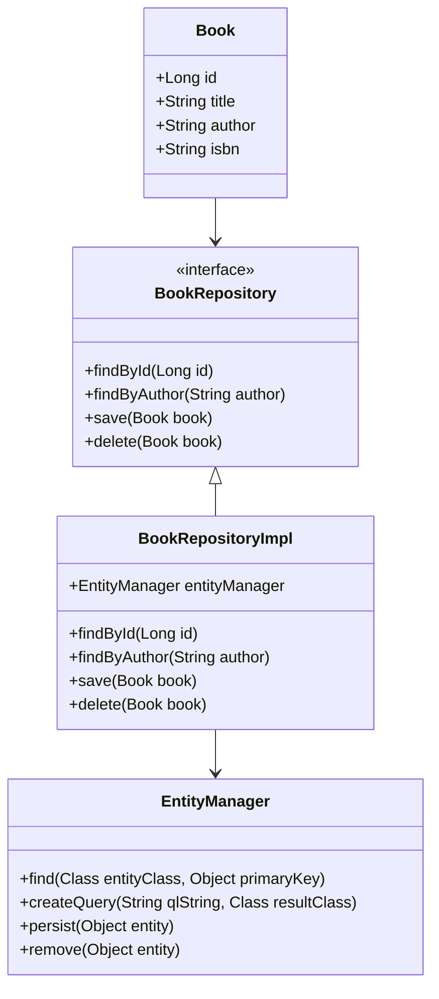

## 8.3.3 Use Cases and Examples

The Repository pattern is a pivotal design pattern in software engineering, particularly within the context of Domain-Driven Design (DDD). It acts as a bridge between the domain and data mapping layers, providing a more object-oriented view of the persistence layer. In this section, we will delve into the practical applications of the Repository pattern, especially in systems with rich domain models and complex business logic. We will explore how this pattern enhances design, facilitates unit testing, and aligns the data access layer with domain concepts.

### Understanding the Repository Pattern

Before diving into use cases and examples, let's briefly revisit what the Repository pattern is. In essence, a repository mediates between the domain and data mapping layers using a collection-like interface for accessing domain objects. It abstracts the data access logic, allowing the domain model to focus on business logic without being concerned with data retrieval or storage.

### Use Cases for the Repository Pattern

#### 1. Applications with Rich Domain Models

In applications with rich domain models, where business logic is complex and intertwined with the data, the Repository pattern provides a clean separation of concerns. By abstracting data access, repositories allow the domain model to evolve independently of the persistence logic.

**Example:** Consider an e-commerce platform with complex pricing rules, customer segmentation, and order processing logic. The domain model might include entities like `Product`, `Order`, and `Customer`, each with intricate relationships and behaviors. A repository for each entity can encapsulate the data access logic, allowing the domain model to focus solely on business rules.

#### 2. Systems Requiring Sophisticated Querying

In systems where domain-specific data retrieval is crucial, repositories can encapsulate complex querying logic. This is particularly useful in applications that need to perform advanced searches or aggregations based on domain criteria.

**Example:** A customer relationship management (CRM) system might require queries to find customers based on their purchase history, interaction frequency, or demographic data. A `CustomerRepository` can provide methods like `findByPurchaseHistory` or `findByInteractionFrequency`, encapsulating the complex querying logic within the repository.

### Code Example: Implementing a Repository in a DDD Application

Let's consider a simple domain model for a library system. We'll implement a repository for managing `Book` entities.

```java
// Domain Entity
public class Book {
    private Long id;
    private String title;
    private String author;
    private String isbn;

    // Constructors, getters, and setters
}

// Repository Interface
public interface BookRepository {
    Book findById(Long id);
    List<Book> findByAuthor(String author);
    void save(Book book);
    void delete(Book book);
}

// Repository Implementation
public class BookRepositoryImpl implements BookRepository {
    private EntityManager entityManager;

    public BookRepositoryImpl(EntityManager entityManager) {
        this.entityManager = entityManager;
    }

    @Override
    public Book findById(Long id) {
        return entityManager.find(Book.class, id);
    }

    @Override
    public List<Book> findByAuthor(String author) {
        return entityManager.createQuery("SELECT b FROM Book b WHERE b.author = :author", Book.class)
                            .setParameter("author", author)
                            .getResultList();
    }

    @Override
    public void save(Book book) {
        entityManager.getTransaction().begin();
        entityManager.persist(book);
        entityManager.getTransaction().commit();
    }

    @Override
    public void delete(Book book) {
        entityManager.getTransaction().begin();
        entityManager.remove(book);
        entityManager.getTransaction().commit();
    }
}
```

In this example, the `BookRepository` interface defines the contract for data access operations, while `BookRepositoryImpl` provides the actual implementation using an `EntityManager`. This separation allows the domain logic to interact with the repository without being tied to the persistence mechanism.

### Facilitating Unit Testing with Repositories

One of the significant advantages of the Repository pattern is its ability to facilitate unit testing. By abstracting data access, repositories allow domain logic to be tested independently of the database or other persistence mechanisms. This can be achieved by mocking the repository interfaces in unit tests.

**Example:** Testing a service that uses the `BookRepository`.

```java
import static org.mockito.Mockito.*;
import static org.junit.Assert.*;

public class BookServiceTest {

    private BookRepository bookRepository;
    private BookService bookService;

    @Before
    public void setUp() {
        bookRepository = mock(BookRepository.class);
        bookService = new BookService(bookRepository);
    }

    @Test
    public void testFindBookByAuthor() {
        Book book = new Book(1L, "Effective Java", "Joshua Bloch", "978-0134685991");
        when(bookRepository.findByAuthor("Joshua Bloch")).thenReturn(Collections.singletonList(book));

        List<Book> books = bookService.findBooksByAuthor("Joshua Bloch");
        assertEquals(1, books.size());
        assertEquals("Effective Java", books.get(0).getTitle());
    }
}
```

In this test, we use Mockito to create a mock `BookRepository`. This allows us to test the `BookService` independently of the actual data access logic, ensuring that our tests are fast and reliable.

### Case Studies: Improving Maintainability with the Repository Pattern

#### Case Study 1: E-Commerce Platform

An e-commerce platform initially had its data access logic scattered across various services, leading to tight coupling and difficulty in maintaining the codebase. By adopting the Repository pattern, the platform was able to centralize data access logic, making it easier to manage and evolve the domain model. This change improved the maintainability of the codebase and allowed the development team to implement new features more rapidly.

#### Case Study 2: Financial Services Application

A financial services application dealing with complex transaction processing and reporting requirements benefited from the Repository pattern by aligning the data access layer with domain concepts. This alignment made it easier to implement domain-specific queries and business rules, leading to a more robust and flexible system architecture.

### Encouraging the Use of the Repository Pattern

When building applications with a strong emphasis on the domain model, consider using the Repository pattern to enhance design and maintainability. By abstracting data access logic, repositories allow the domain model to focus on business concerns, leading to a more cohesive and adaptable system.

### Visualizing the Repository Pattern

To better understand the Repository pattern's role in a DDD application, let's visualize the interaction between the domain model, repository, and data source.



This diagram illustrates how the `Book` entity interacts with the `BookRepository` interface, which is implemented by `BookRepositoryImpl`. The `EntityManager` is used within the implementation to perform data access operations.

### Try It Yourself

To deepen your understanding of the Repository pattern, try extending the example above:

1. **Add New Methods:** Implement additional methods in the `BookRepository` for more complex queries, such as `findByTitle` or `findByIsbn`.

2. **Mocking Practice:** Create unit tests for these new methods using mocking frameworks like Mockito.

3. **Experiment with Different Persistence Technologies:** Replace the `EntityManager` with another persistence technology, such as JDBC or a NoSQL database, to see how the repository abstraction allows for flexibility in the persistence layer.

### Conclusion

The Repository pattern is an essential tool in the software engineer's toolkit, especially in the context of Domain-Driven Design. By providing a clean separation between the domain and data access layers, it enhances maintainability, facilitates unit testing, and aligns the data access layer with domain concepts. As you continue your journey in software development, consider the Repository pattern when building applications with rich domain models and complex business logic.

## Quiz Time!



### What is the primary role of the Repository pattern in software design?

- [x] To mediate between the domain and data mapping layers.
- [ ] To handle all business logic within the application.
- [ ] To provide a user interface for data access.
- [ ] To replace the need for a database.

> **Explanation:** The Repository pattern acts as a bridge between the domain and data mapping layers, providing a collection-like interface for accessing domain objects.

### How does the Repository pattern facilitate unit testing?

- [x] By allowing domain logic to be tested independently of data access code.
- [ ] By eliminating the need for a database in tests.
- [ ] By providing a graphical interface for testing.
- [ ] By automatically generating test cases.

> **Explanation:** The Repository pattern abstracts data access, allowing domain logic to be tested independently of the database or other persistence mechanisms.

### In the provided code example, what is the purpose of the `EntityManager`?

- [x] To manage data access operations such as find, persist, and remove.
- [ ] To handle user authentication and authorization.
- [ ] To provide a graphical user interface for the application.
- [ ] To generate reports based on domain data.

> **Explanation:** The `EntityManager` is used within the repository implementation to perform data access operations like finding, persisting, and removing entities.

### Which of the following is a benefit of using the Repository pattern?

- [x] Improved maintainability of the codebase.
- [ ] Increased complexity of the domain model.
- [ ] Reduced need for domain-specific logic.
- [ ] Elimination of all data access code.

> **Explanation:** The Repository pattern improves maintainability by centralizing data access logic and allowing the domain model to focus on business concerns.

### What is a common use case for the Repository pattern?

- [x] Applications with rich domain models and complex business logic.
- [ ] Simple applications with minimal data access needs.
- [ ] Applications that do not require any data persistence.
- [ ] Static websites with no dynamic content.

> **Explanation:** The Repository pattern is particularly useful in applications with rich domain models and complex business logic, where it provides a clean separation of concerns.

### How does the Repository pattern align the data access layer with domain concepts?

- [x] By encapsulating data access logic within domain-specific interfaces.
- [ ] By eliminating the need for a database.
- [ ] By providing a user interface for data access.
- [ ] By replacing the need for domain models.

> **Explanation:** The Repository pattern aligns the data access layer with domain concepts by encapsulating data access logic within domain-specific interfaces.

### What is the relationship between the `Book` entity and the `BookRepository` in the provided diagram?

- [x] The `Book` entity interacts with the `BookRepository` for data access operations.
- [ ] The `Book` entity inherits from the `BookRepository`.
- [ ] The `BookRepository` is a subclass of the `Book` entity.
- [ ] The `Book` entity and `BookRepository` are unrelated.

> **Explanation:** In the diagram, the `Book` entity interacts with the `BookRepository` interface for data access operations.

### Which of the following is a method that might be included in a `CustomerRepository`?

- [x] findByPurchaseHistory
- [ ] displayCustomerUI
- [ ] calculateDiscount
- [ ] authenticateUser

> **Explanation:** A `CustomerRepository` might include methods like `findByPurchaseHistory` to encapsulate complex querying logic related to customer data.

### What is a key advantage of using repositories in domain-driven design?

- [x] They allow the domain model to evolve independently of the persistence logic.
- [ ] They eliminate the need for business logic in the application.
- [ ] They provide a graphical user interface for the domain model.
- [ ] They automatically generate domain models.

> **Explanation:** Repositories allow the domain model to evolve independently of the persistence logic by abstracting data access concerns.

### True or False: The Repository pattern can only be used with relational databases.

- [ ] True
- [x] False

> **Explanation:** The Repository pattern can be used with various persistence technologies, including relational databases, NoSQL databases, and even in-memory data stores.


