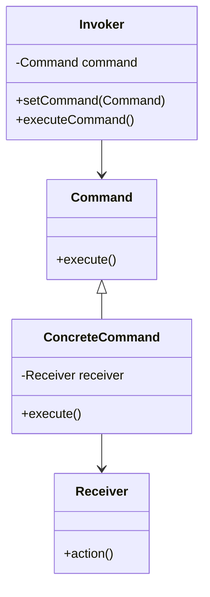

## 8.3.4 Command Pattern in Multithreading

The Command Pattern is a behavioral design pattern that turns a request into a stand-alone object containing all information about the request. This transformation allows for parameterization of clients with queues, requests, and operations. In multithreaded applications, the Command Pattern can be particularly powerful, enabling asynchronous command execution and efficient task management.

### Intent

- **Description**: The Command Pattern encapsulates a request as an object, thereby allowing for parameterization of clients with queues, requests, and operations. It also provides support for undoable operations.

### Motivation

In a multithreaded environment, tasks often need to be executed asynchronously. The Command Pattern is ideal for such scenarios, as it allows for the queuing of commands that can be executed by worker threads. This is particularly useful in producer-consumer scenarios where commands are produced by one or more threads and consumed by others.

### Applicability

- **Guidelines**: Use the Command Pattern in multithreaded applications where tasks need to be queued and executed asynchronously. It is particularly useful in scenarios where tasks are produced at a different rate than they are consumed.

### Structure



**Caption**: The structure of the Command Pattern showing the relationships between the Command, ConcreteCommand, Receiver, and Invoker.

### Participants

- **Command**: Declares an interface for executing an operation.
- **ConcreteCommand**: Defines a binding between a Receiver object and an action. Implements the execute method by invoking the corresponding operations on Receiver.
- **Receiver**: Knows how to perform the operations associated with carrying out a request.
- **Invoker**: Asks the command to carry out the request.

### Collaborations

- The Invoker holds a command and at some point asks the command to carry out a request by calling its execute method.
- The ConcreteCommand passes the request to the Receiver to perform the action.

### Consequences

- **Decoupling**: The Command Pattern decouples the object that invokes the operation from the one that knows how to perform it.
- **Flexibility**: Commands can be manipulated and extended without changing existing code.
- **Complexity**: Introducing the Command Pattern can increase the complexity of the codebase.

### Implementation

#### Using Java's Concurrency Utilities

Java provides several concurrency utilities that can be leveraged to implement the Command Pattern in a multithreaded environment. One of the most useful is the `BlockingQueue`, which can be used to queue commands for execution by worker threads.

```java
import java.util.concurrent.BlockingQueue;
import java.util.concurrent.LinkedBlockingQueue;

// Command Interface
interface Command {
    void execute();
}

// Concrete Command
class PrintCommand implements Command {
    private final String message;

    public PrintCommand(String message) {
        this.message = message;
    }

    @Override
    public void execute() {
        System.out.println(message);
    }
}

// Invoker
class CommandProcessor extends Thread {
    private final BlockingQueue<Command> commandQueue;

    public CommandProcessor(BlockingQueue<Command> commandQueue) {
        this.commandQueue = commandQueue;
    }

    @Override
    public void run() {
        try {
            while (true) {
                Command command = commandQueue.take();
                command.execute();
            }
        } catch (InterruptedException e) {
            Thread.currentThread().interrupt();
        }
    }
}

// Client
public class CommandPatternMultithreading {
    public static void main(String[] args) {
        BlockingQueue<Command> queue = new LinkedBlockingQueue<>();
        CommandProcessor processor = new CommandProcessor(queue);
        processor.start();

        queue.add(new PrintCommand("Hello, World!"));
        queue.add(new PrintCommand("Command Pattern in Multithreading"));
    }
}
```

**Explanation**: In this example, the `CommandProcessor` acts as the Invoker, processing commands from a `BlockingQueue`. The `PrintCommand` is a simple implementation of the Command interface, encapsulating a print operation. The `BlockingQueue` ensures thread-safe communication between the producer (main thread) and consumer (CommandProcessor thread).

#### Thread Safety and Synchronization

When implementing the Command Pattern in a multithreaded environment, thread safety and synchronization are critical considerations. The `BlockingQueue` used in the example above is inherently thread-safe, making it a suitable choice for command queuing. However, care must be taken to ensure that the commands themselves are thread-safe, especially if they modify shared resources.

### Sample Use Cases

- **Task Scheduling**: Use the Command Pattern to schedule tasks for execution by worker threads in a server application.
- **Undo Operations**: Implement undo functionality in a text editor by storing executed commands and reversing them as needed.

### Related Patterns

- **[6.6 Singleton Pattern]( "Singleton Pattern")**: Often used to manage the lifecycle of command processors.
- **[8.1 Strategy Pattern]( "Strategy Pattern")**: Similar in that both encapsulate algorithms, but the Command Pattern focuses on encapsulating requests.

### Known Uses

- **Java's `ExecutorService`**: The `ExecutorService` framework in Java uses a similar pattern to manage and execute tasks asynchronously.
- **GUI Frameworks**: Many GUI frameworks use the Command Pattern to handle user actions.

### Best Practices

- **Use Immutable Commands**: Ensure that command objects are immutable to avoid issues with shared state.
- **Leverage Java's Concurrency Utilities**: Utilize classes like `BlockingQueue` and `ExecutorService` to manage command execution efficiently.
- **Handle Interruptions Gracefully**: Ensure that threads can be interrupted and shut down cleanly.

### Conclusion

The Command Pattern is a powerful tool in the arsenal of a Java developer, especially in multithreaded applications. By encapsulating requests as objects, it allows for flexible and decoupled task management. When combined with Java's concurrency utilities, it provides a robust framework for asynchronous command execution.

---

## Test Your Knowledge: Command Pattern in Multithreading Quiz



### What is the primary benefit of using the Command Pattern in multithreaded applications?

- [x] It allows for asynchronous command execution.
- [ ] It simplifies the codebase.
- [ ] It eliminates the need for synchronization.
- [ ] It increases the speed of execution.

> **Explanation:** The Command Pattern encapsulates requests as objects, allowing them to be queued and executed asynchronously by worker threads.

### Which Java concurrency utility is commonly used with the Command Pattern for queuing commands?

- [x] BlockingQueue
- [ ] Semaphore
- [ ] CountDownLatch
- [ ] CyclicBarrier

> **Explanation:** `BlockingQueue` is a thread-safe queue that is commonly used to queue commands for execution by worker threads.

### How does the Command Pattern contribute to decoupling in software design?

- [x] By separating the object that invokes the operation from the one that knows how to perform it.
- [ ] By combining the command and receiver into a single class.
- [ ] By eliminating the need for interfaces.
- [ ] By using static methods for execution.

> **Explanation:** The Command Pattern decouples the invoker from the receiver by encapsulating requests as objects.

### What is a key consideration when implementing the Command Pattern in a multithreaded environment?

- [x] Thread safety and synchronization
- [ ] Reducing the number of classes
- [ ] Avoiding the use of interfaces
- [ ] Using static methods

> **Explanation:** Thread safety and synchronization are critical when implementing the Command Pattern in a multithreaded environment to ensure safe execution of commands.

### Which of the following is a real-world use case for the Command Pattern?

- [x] Task scheduling in server applications
- [ ] Implementing a singleton logger
- [ ] Managing database connections
- [ ] Parsing XML files

> **Explanation:** The Command Pattern is often used for task scheduling in server applications, where tasks need to be executed asynchronously.

### What is the role of the Invoker in the Command Pattern?

- [x] It asks the command to carry out the request.
- [ ] It performs the action associated with the command.
- [ ] It creates the command object.
- [ ] It manages the lifecycle of the command.

> **Explanation:** The Invoker holds a command and asks it to carry out the request by calling its execute method.

### Why is it recommended to use immutable commands in a multithreaded environment?

- [x] To avoid issues with shared state
- [ ] To increase execution speed
- [ ] To simplify the command interface
- [ ] To reduce memory usage

> **Explanation:** Immutable commands help avoid issues with shared state, making them safer to use in a multithreaded environment.

### How can interruptions be handled gracefully in a multithreaded command processor?

- [x] By catching `InterruptedException` and shutting down cleanly
- [ ] By ignoring the interruption
- [ ] By restarting the thread
- [ ] By using a busy-wait loop

> **Explanation:** Handling `InterruptedException` and shutting down cleanly ensures that threads can be interrupted and stopped gracefully.

### Which pattern is often used in conjunction with the Command Pattern to manage the lifecycle of command processors?

- [x] Singleton Pattern
- [ ] Strategy Pattern
- [ ] Observer Pattern
- [ ] Factory Pattern

> **Explanation:** The Singleton Pattern is often used to manage the lifecycle of command processors, ensuring a single instance is used.

### True or False: The Command Pattern eliminates the need for synchronization in multithreaded applications.

- [ ] True
- [x] False

> **Explanation:** While the Command Pattern helps manage tasks asynchronously, synchronization is still necessary to ensure thread safety.



---

By understanding and implementing the Command Pattern in multithreaded applications, Java developers can create more robust, maintainable, and efficient systems. This pattern not only enhances the flexibility of task management but also leverages Java's powerful concurrency utilities to handle asynchronous operations effectively.
