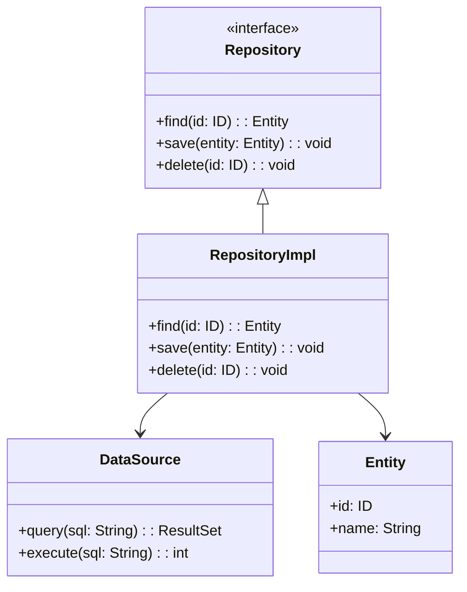

## 8.3 Repository Pattern

In the realm of software engineering, the Repository pattern stands as a pivotal design pattern that serves to mediate between the domain and data mapping layers. It provides a collection-like interface for accessing domain objects, thereby abstracting the complexities of data access and manipulation. This section delves into the intricacies of the Repository pattern, elucidating its intent, structure, and benefits, and preparing you for its implementation in Java.

### Understanding the Repository Pattern

The Repository pattern is a design pattern that encapsulates the logic required to access data sources. It acts as an intermediary between the domain model and the data mapping layers, offering a collection-like interface for managing domain objects. The primary intent of the Repository pattern is to decouple the domain logic from the data access logic, thereby promoting a clean separation of concerns.

#### Intent of the Repository Pattern

The Repository pattern aims to:

- **Abstract Data Access**: By providing a collection-like interface, the Repository pattern abstracts the underlying data access logic, allowing developers to interact with domain objects without concerning themselves with the complexities of data retrieval and persistence.
- **Promote Domain-Driven Design**: The pattern aligns with domain-driven design principles by ensuring that the domain model remains free from data access concerns, thereby allowing it to evolve independently.
- **Enhance Testability**: By decoupling the domain logic from data access logic, the Repository pattern facilitates the use of mock repositories during testing, thereby enhancing the testability of the application.

### Repository vs. DAO Pattern

While the Repository and Data Access Object (DAO) patterns share similarities in abstracting data access, they differ in their focus and application:

- **Repository Pattern**: Focuses on the domain model, providing a collection-like interface for managing domain objects. It is often used in domain-driven design to encapsulate the logic required to access data sources, ensuring that the domain model remains free from data access concerns.
- **DAO Pattern**: Focuses on the data source, encapsulating the logic required to access and manipulate data in a specific data source. It is often used to provide a low-level abstraction over data access operations, such as CRUD operations.

#### Similarities

- Both patterns abstract data access logic, promoting a separation of concerns.
- Both patterns enhance testability by decoupling data access logic from business logic.

#### Differences

- The Repository pattern is more aligned with domain-driven design principles, focusing on the domain model, while the DAO pattern focuses on the data source.
- The Repository pattern provides a higher-level abstraction, often encapsulating multiple DAOs, while the DAO pattern provides a lower-level abstraction over data access operations.

### Structure of a Repository

The structure of a Repository typically aligns with domain-driven design principles, encapsulating the logic required to access data sources and providing a collection-like interface for managing domain objects. A typical Repository consists of the following components:

- **Repository Interface**: Defines the contract for data access operations, such as `find`, `save`, `delete`, and `update`.
- **Repository Implementation**: Implements the Repository interface, encapsulating the logic required to access data sources.
- **Domain Model**: Represents the domain objects managed by the Repository.
- **Data Source**: Represents the underlying data source, such as a database or an external API.

#### UML Diagram

The following UML diagram illustrates the relationships between Repositories, Entities, and the Domain Model:



### Benefits of Using the Repository Pattern

The Repository pattern offers several benefits, including:

- **Clean Separation of Concerns**: By decoupling the domain logic from data access logic, the Repository pattern promotes a clean separation of concerns, allowing the domain model to evolve independently.
- **Simplified Data Access**: The pattern provides intuitive methods that represent business concepts, simplifying data access and manipulation.
- **Enhanced Testability**: By allowing for mock repositories, the pattern enhances the testability of the application, facilitating unit testing and integration testing.

### Implementation Details

In the following subsections, we will explore the implementation details of the Repository pattern in Java, including how to define and implement a Repository interface, how to integrate with ORM tools, and how to handle complex queries.

#### Defining a Repository Interface

To define a Repository interface in Java, we typically start by identifying the data access operations required by the domain model. These operations are then encapsulated in a Repository interface, which serves as the contract for data access operations.

```java
public interface UserRepository {
    User findById(Long id);
    List<User> findAll();
    void save(User user);
    void delete(Long id);
}
```

#### Implementing a Repository

The implementation of a Repository involves encapsulating the logic required to access data sources. This often involves integrating with ORM tools, such as Hibernate or JPA, to simplify data access and manipulation.

```java
public class UserRepositoryImpl implements UserRepository {
    private final EntityManager entityManager;

    public UserRepositoryImpl(EntityManager entityManager) {
        this.entityManager = entityManager;
    }

    @Override
    public User findById(Long id) {
        return entityManager.find(User.class, id);
    }

    @Override
    public List<User> findAll() {
        return entityManager.createQuery("SELECT u FROM User u", User.class).getResultList();
    }

    @Override
    public void save(User user) {
        entityManager.getTransaction().begin();
        entityManager.persist(user);
        entityManager.getTransaction().commit();
    }

    @Override
    public void delete(Long id) {
        entityManager.getTransaction().begin();
        User user = findById(id);
        if (user != null) {
            entityManager.remove(user);
        }
        entityManager.getTransaction().commit();
    }
}
```

### Handling Complex Queries

Handling complex queries in a Repository often involves using query languages, such as JPQL or Criteria API, to express complex data retrieval operations. The Repository pattern provides a convenient abstraction for encapsulating these queries, allowing developers to focus on business logic rather than data access logic.

```java
public List<User> findByLastName(String lastName) {
    return entityManager.createQuery("SELECT u FROM User u WHERE u.lastName = :lastName", User.class)
                        .setParameter("lastName", lastName)
                        .getResultList();
}
```

### Integrating with ORM Tools

Integrating with ORM tools, such as Hibernate or JPA, can simplify the implementation of a Repository by providing a higher-level abstraction over data access operations. ORM tools often provide features such as automatic mapping of domain objects to database tables, transaction management, and caching, which can enhance the performance and scalability of the application.

### Considerations for Using the Repository Pattern

When using the Repository pattern, it is important to consider the following:

- **Complex Queries**: While the Repository pattern provides a convenient abstraction for encapsulating data access logic, handling complex queries may require additional considerations, such as using query languages or integrating with ORM tools.
- **Performance**: The performance of a Repository can be impacted by factors such as the complexity of queries, the size of the data set, and the efficiency of the underlying data source. It is important to optimize data access operations to ensure the performance and scalability of the application.

### Try It Yourself

To gain a deeper understanding of the Repository pattern, try implementing a simple Repository for a domain model of your choice. Experiment with different data access operations, such as finding, saving, and deleting domain objects, and explore how the Repository pattern can simplify data access and enhance testability.

### Conclusion

The Repository pattern is a powerful design pattern that mediates between the domain and data mapping layers, providing a collection-like interface for managing domain objects. By abstracting data access logic, the pattern promotes a clean separation of concerns, simplifies data access, and enhances testability. As you continue your journey in software engineering, consider how the Repository pattern can be applied to your projects to improve the design and maintainability of your applications.

## Quiz Time!



### What is the primary intent of the Repository pattern?

- [x] To abstract data access and promote a clean separation of concerns.
- [ ] To provide a low-level abstraction over data access operations.
- [ ] To encapsulate the logic required to access and manipulate data in a specific data source.
- [ ] To focus on the data source rather than the domain model.

> **Explanation:** The primary intent of the Repository pattern is to abstract data access and promote a clean separation of concerns between the domain and data mapping layers.

### How does the Repository pattern differ from the DAO pattern?

- [x] The Repository pattern focuses on the domain model, while the DAO pattern focuses on the data source.
- [ ] The Repository pattern provides a lower-level abstraction over data access operations.
- [ ] The DAO pattern promotes domain-driven design principles.
- [ ] The Repository pattern encapsulates the logic required to access a specific data source.

> **Explanation:** The Repository pattern focuses on the domain model, providing a higher-level abstraction, while the DAO pattern focuses on the data source, providing a lower-level abstraction.

### What is a key benefit of using the Repository pattern?

- [x] Enhanced testability by allowing for mock repositories.
- [ ] Simplified data access by providing low-level data access operations.
- [ ] Improved performance by optimizing data access operations.
- [ ] Reduced complexity by focusing on the data source.

> **Explanation:** The Repository pattern enhances testability by allowing for mock repositories, facilitating unit testing and integration testing.

### What does a typical Repository interface define?

- [x] The contract for data access operations, such as `find`, `save`, `delete`, and `update`.
- [ ] The logic required to access and manipulate data in a specific data source.
- [ ] The structure of the domain model.
- [ ] The implementation details of data access operations.

> **Explanation:** A typical Repository interface defines the contract for data access operations, such as `find`, `save`, `delete`, and `update`.

### What role does the Repository pattern play in domain-driven design?

- [x] It aligns with domain-driven design principles by ensuring that the domain model remains free from data access concerns.
- [ ] It focuses on the data source, providing a low-level abstraction over data access operations.
- [ ] It encapsulates the logic required to access and manipulate data in a specific data source.
- [ ] It provides a higher-level abstraction over data access operations.

> **Explanation:** The Repository pattern aligns with domain-driven design principles by ensuring that the domain model remains free from data access concerns, allowing it to evolve independently.

### How can complex queries be handled in a Repository?

- [x] By using query languages, such as JPQL or Criteria API, to express complex data retrieval operations.
- [ ] By focusing on the data source and encapsulating the logic required to access and manipulate data.
- [ ] By providing low-level data access operations.
- [ ] By optimizing data access operations to ensure performance and scalability.

> **Explanation:** Complex queries can be handled in a Repository by using query languages, such as JPQL or Criteria API, to express complex data retrieval operations.

### What is a consideration when using the Repository pattern?

- [x] The performance of a Repository can be impacted by factors such as the complexity of queries and the size of the data set.
- [ ] The Repository pattern focuses on the data source, providing a low-level abstraction over data access operations.
- [ ] The Repository pattern simplifies data access by providing low-level data access operations.
- [ ] The Repository pattern reduces complexity by focusing on the data source.

> **Explanation:** When using the Repository pattern, it is important to consider the performance impact of factors such as the complexity of queries and the size of the data set.

### What is a typical component of a Repository?

- [x] Repository Interface
- [ ] Data Access Object
- [ ] Service Layer
- [ ] Presentation Layer

> **Explanation:** A typical component of a Repository is the Repository Interface, which defines the contract for data access operations.

### What is the role of ORM tools in a Repository?

- [x] They provide a higher-level abstraction over data access operations, simplifying the implementation of a Repository.
- [ ] They focus on the data source, providing a low-level abstraction over data access operations.
- [ ] They encapsulate the logic required to access and manipulate data in a specific data source.
- [ ] They provide low-level data access operations.

> **Explanation:** ORM tools provide a higher-level abstraction over data access operations, simplifying the implementation of a Repository by offering features such as automatic mapping of domain objects to database tables.

### True or False: The Repository pattern promotes a clean separation of concerns by decoupling the domain logic from data access logic.

- [x] True
- [ ] False

> **Explanation:** True. The Repository pattern promotes a clean separation of concerns by decoupling the domain logic from data access logic, allowing the domain model to evolve independently.


