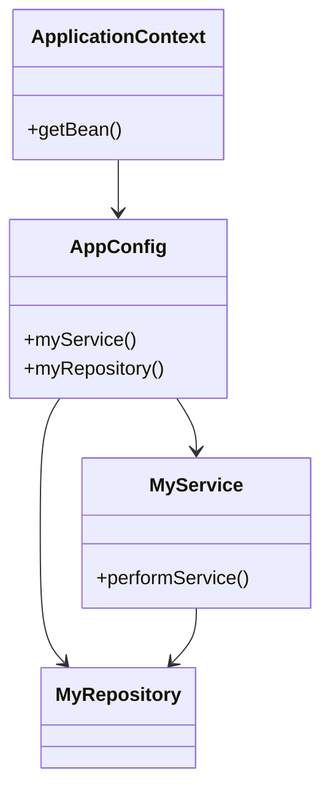

## 8.4.1 Implementing Dependency Injection in Java

Dependency Injection (DI) is a cornerstone of modern software development, particularly in Java, where it is widely used to create flexible, maintainable, and testable code. In this section, we will explore how to implement DI in Java using popular frameworks, with a focus on the Spring Framework. We will delve into various methods of defining beans and configuring dependencies, including XML configuration, Java-based configuration, and component scanning. Additionally, we will discuss best practices and how to integrate DI with other technologies in Java applications.

### Introduction to Dependency Injection

Dependency Injection is a design pattern used to implement Inversion of Control (IoC), allowing the creation of dependent objects outside of a class and providing those objects to a class through various means. This pattern helps in decoupling the creation of objects from their usage, promoting loose coupling and enhancing code reusability.

### Popular DI Frameworks in Java

Several frameworks facilitate DI in Java, with Spring being the most prevalent. Other notable frameworks include Google Guice and CDI (Contexts and Dependency Injection) as part of the Java EE specification. However, Spring's extensive ecosystem and ease of use make it a popular choice for Java developers.

### Spring Framework: An Overview

Spring Framework is a comprehensive programming and configuration model for modern Java-based enterprise applications. It provides infrastructure support for developing Java applications, allowing developers to focus on business logic. Spring's core feature is its IoC container, which manages the lifecycle and configuration of application objects.

### Defining Beans and Configuring Dependencies

In Spring, a "bean" is an object that is instantiated, assembled, and managed by the Spring IoC container. There are several ways to define beans and configure dependencies:

#### XML Configuration

XML configuration was the original method for defining beans in Spring. Although less common today due to the advent of annotation-based configurations, it remains a powerful tool, especially for complex configurations.

**Example: XML Configuration**

```xml
<!-- applicationContext.xml -->
<beans xmlns="http://www.springframework.org/schema/beans"
       xmlns:xsi="http://www.w3.org/2001/XMLSchema-instance"
       xsi:schemaLocation="http://www.springframework.org/schema/beans
       http://www.springframework.org/schema/beans/spring-beans.xsd">

    <!-- Define a bean for the service -->
    <bean id="myService" class="com.example.MyService">
        <!-- Inject dependencies -->
        <property name="repository" ref="myRepository"/>
    </bean>

    <!-- Define a bean for the repository -->
    <bean id="myRepository" class="com.example.MyRepository"/>
</beans>
```

In this example, `myService` is a bean that depends on `myRepository`. The `property` element is used to inject the `myRepository` bean into `myService`.

#### Java-Based Configuration

Java-based configuration uses annotations to define beans and their dependencies, providing a more type-safe and refactor-friendly approach.

**Example: Java-Based Configuration**

```java
import org.springframework.context.annotation.Bean;
import org.springframework.context.annotation.Configuration;

@Configuration
public class AppConfig {

    @Bean
    public MyService myService() {
        return new MyService(myRepository());
    }

    @Bean
    public MyRepository myRepository() {
        return new MyRepository();
    }
}
```

Here, `AppConfig` is a configuration class annotated with `@Configuration`. The `@Bean` annotation indicates that a method instantiates, configures, and returns a new bean to be managed by the Spring container.

#### Component Scanning

Component scanning is a powerful feature that automatically detects and registers beans within the application context by scanning the classpath for annotations like `@Component`, `@Service`, `@Repository`, and `@Controller`.

**Example: Component Scanning**

```java
import org.springframework.stereotype.Service;
import org.springframework.beans.factory.annotation.Autowired;

@Service
public class MyService {

    private final MyRepository myRepository;

    @Autowired
    public MyService(MyRepository myRepository) {
        this.myRepository = myRepository;
    }
}

import org.springframework.stereotype.Repository;

@Repository
public class MyRepository {
    // Repository implementation
}
```

In this example, `MyService` is annotated with `@Service`, and `MyRepository` with `@Repository`. The `@Autowired` annotation is used to inject `MyRepository` into `MyService`.

### Setting Up a Simple Application Context

To use Spring's DI capabilities, you need to set up an application context, which is the Spring IoC container responsible for instantiating, configuring, and assembling beans.

**Example: Setting Up Application Context**

```java
import org.springframework.context.ApplicationContext;
import org.springframework.context.annotation.AnnotationConfigApplicationContext;

public class MainApplication {

    public static void main(String[] args) {
        ApplicationContext context = new AnnotationConfigApplicationContext(AppConfig.class);

        MyService myService = context.getBean(MyService.class);
        myService.performService();
    }
}
```

In this example, `AnnotationConfigApplicationContext` is used to load the configuration class `AppConfig`, and the `getBean` method retrieves the `MyService` bean from the context.

### How Spring Resolves Dependencies

Spring resolves dependencies through a process known as dependency injection. When a bean is created, Spring checks its dependencies and injects the required beans. This process can occur via constructor injection, setter injection, or field injection.

- **Constructor Injection**: Dependencies are provided through a class constructor.
- **Setter Injection**: Dependencies are provided through setter methods.
- **Field Injection**: Dependencies are injected directly into fields.

### Managing the Lifecycle of Beans

Spring manages the lifecycle of beans, from instantiation to destruction. The lifecycle includes several phases:

1. **Instantiation**: The bean is created.
2. **Dependency Injection**: Dependencies are injected.
3. **Initialization**: Custom initialization logic can be executed.
4. **Destruction**: Custom destruction logic can be executed before the bean is destroyed.

You can define custom initialization and destruction methods using annotations or XML configuration.

**Example: Bean Lifecycle Methods**

```java
import javax.annotation.PostConstruct;
import javax.annotation.PreDestroy;

@Service
public class MyService {

    @PostConstruct
    public void init() {
        // Initialization logic
    }

    @PreDestroy
    public void destroy() {
        // Destruction logic
    }
}
```

### Best Practices for Using DI Frameworks

To effectively use DI frameworks like Spring, consider the following best practices:

- **Organize Configurations**: Keep configuration files organized and modular. Use separate configuration classes for different parts of the application.
- **Externalize Configurations**: Use property files or environment variables to manage external configurations, making applications more flexible and environment-independent.
- **Avoid Overuse of Annotations**: While annotations are powerful, overusing them can lead to tightly coupled code. Use them judiciously.
- **Testability**: Design beans to be easily testable. Use DI to inject mock dependencies during testing.

### Integrating DI with Other Frameworks

Spring's DI can be seamlessly integrated with other frameworks and technologies, such as:

- **Hibernate**: Use Spring's transaction management and DI to manage Hibernate sessions and transactions.
- **JPA**: Integrate Spring with JPA for ORM capabilities.
- **RESTful Services**: Use Spring MVC or Spring Boot to create RESTful services with DI.
- **Microservices**: Leverage Spring Cloud to build microservices with DI.

### Visualizing Dependency Injection in Spring

To better understand how DI works in Spring, let's visualize the process using a class diagram.



**Diagram Description**: This class diagram illustrates the relationship between the `ApplicationContext`, `AppConfig`, `MyService`, and `MyRepository`. The `ApplicationContext` manages the beans defined in `AppConfig`, and `MyService` depends on `MyRepository`.

### Try It Yourself

Now that we've covered the basics, try modifying the code examples to experiment with different configurations. For instance, add a new service or repository, and see how Spring manages the dependencies. You can also try using different injection methods, such as setter injection, to see how they affect the code.

### Conclusion

Implementing Dependency Injection in Java using frameworks like Spring can significantly enhance the flexibility, maintainability, and testability of your applications. By understanding the various methods of defining beans and configuring dependencies, you can leverage Spring's powerful IoC container to build robust Java applications.

Remember, this is just the beginning. As you progress, you'll discover more advanced features and techniques to further optimize your applications. Keep experimenting, stay curious, and enjoy the journey!

## Quiz Time!



### What is Dependency Injection (DI)?

- [x] A design pattern used to implement Inversion of Control.
- [ ] A method for creating new instances of objects.
- [ ] A way to manage database transactions.
- [ ] A technique for optimizing code performance.

> **Explanation:** Dependency Injection is a design pattern that implements Inversion of Control, allowing the creation of dependent objects outside of a class.

### Which framework is most commonly associated with Dependency Injection in Java?

- [x] Spring Framework
- [ ] Hibernate
- [ ] Apache Struts
- [ ] JavaServer Faces (JSF)

> **Explanation:** The Spring Framework is the most commonly used framework for Dependency Injection in Java.

### What is the primary purpose of the `@Configuration` annotation in Spring?

- [x] To indicate that a class declares one or more `@Bean` methods.
- [ ] To specify the database configuration for an application.
- [ ] To enable component scanning in a package.
- [ ] To define a REST controller in a Spring application.

> **Explanation:** The `@Configuration` annotation is used to indicate that a class declares one or more `@Bean` methods.

### How does Spring resolve dependencies for beans?

- [x] Through dependency injection, using constructor, setter, or field injection.
- [ ] By creating new instances of beans every time they are needed.
- [ ] By using static methods to provide dependencies.
- [ ] By reading dependencies from a configuration file at runtime.

> **Explanation:** Spring resolves dependencies through dependency injection, which can be done via constructor, setter, or field injection.

### Which annotation is used to automatically detect and register beans in Spring?

- [x] `@Component`
- [ ] `@Bean`
- [ ] `@Service`
- [ ] `@Repository`

> **Explanation:** The `@Component` annotation is used to automatically detect and register beans in Spring.

### What is the role of the `ApplicationContext` in Spring?

- [x] It is the IoC container responsible for managing the lifecycle of beans.
- [ ] It is used to configure database connections.
- [ ] It is a class for handling HTTP requests.
- [ ] It is a utility for logging application events.

> **Explanation:** The `ApplicationContext` is the IoC container in Spring that manages the lifecycle of beans.

### What is a best practice for managing external configurations in Spring applications?

- [x] Use property files or environment variables.
- [ ] Hard-code configurations in the application code.
- [ ] Store configurations in a database.
- [ ] Use XML files exclusively for all configurations.

> **Explanation:** Using property files or environment variables is a best practice for managing external configurations in Spring applications.

### What is the benefit of using Dependency Injection in Java applications?

- [x] It promotes loose coupling and enhances code reusability.
- [ ] It increases the complexity of the application.
- [ ] It reduces the need for testing.
- [ ] It eliminates the need for configuration files.

> **Explanation:** Dependency Injection promotes loose coupling and enhances code reusability, making applications more flexible and maintainable.

### Which of the following is NOT a method of dependency injection in Spring?

- [ ] Constructor Injection
- [ ] Setter Injection
- [ ] Field Injection
- [x] Interface Injection

> **Explanation:** Interface Injection is not a method of dependency injection in Spring. Spring uses constructor, setter, and field injection.

### True or False: Spring's DI can be integrated with Hibernate for ORM capabilities.

- [x] True
- [ ] False

> **Explanation:** True. Spring's DI can be integrated with Hibernate to manage sessions and transactions for ORM capabilities.


