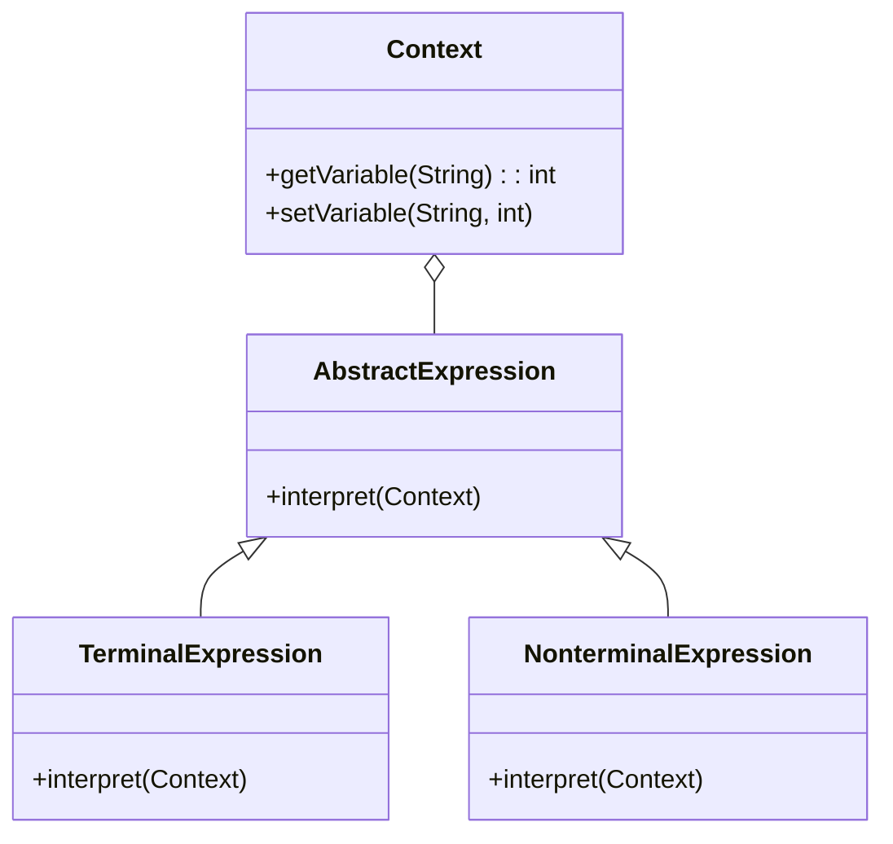

## 8.4.1 Implementing Interpreter in Java

The Interpreter pattern is a powerful behavioral design pattern that provides a way to evaluate language grammar or expressions. It is particularly useful when you need to interpret sentences in a language or evaluate expressions. This section delves into the implementation of the Interpreter pattern in Java, offering insights into its components, structure, and practical applications.

### Intent

The **Interpreter pattern** defines a representation for a language's grammar and provides an interpreter to interpret sentences in the language. It is used to design a component that interprets a particular language or expression, allowing for the evaluation of expressions or commands.

### Components of the Interpreter Pattern

The Interpreter pattern consists of several key components:

- **AbstractExpression**: Declares an abstract `interpret` method that is common to all nodes in the abstract syntax tree.
- **TerminalExpression**: Implements the `interpret` operation for terminal symbols in the grammar.
- **NonterminalExpression**: Represents non-terminal symbols in the grammar and maintains references to child expressions.
- **Context**: Contains information that's global to the interpreter, such as variable values or external resources.

### Structure

The structure of the Interpreter pattern can be visualized using a UML diagram. This diagram illustrates the relationships between the components and how they interact to interpret expressions.



**Diagram Explanation**: The UML diagram shows the hierarchy of expressions, with `AbstractExpression` as the base class. `TerminalExpression` and `NonterminalExpression` extend `AbstractExpression`, implementing the `interpret` method. The `Context` class interacts with these expressions to provide necessary information for interpretation.

### Java Code Example: Implementing a Simple Expression Evaluator

Let's implement a simple arithmetic expression evaluator using the Interpreter pattern in Java. This example will demonstrate how to parse and evaluate expressions like "3 + 5 - 2".

#### Step 1: Define the Context

The `Context` class holds the variables and their values. In this simple example, it will not be used extensively, but it is essential for more complex scenarios.

```java
public class Context {
    // In a more complex scenario, this would hold variable values
}
```

#### Step 2: Create the AbstractExpression Interface

The `AbstractExpression` interface declares the `interpret` method.

```java
public interface AbstractExpression {
    int interpret(Context context);
}
```

#### Step 3: Implement TerminalExpression

The `TerminalExpression` class represents numbers in our expression.

```java
public class NumberExpression implements AbstractExpression {
    private final int number;

    public NumberExpression(int number) {
        this.number = number;
    }

    @Override
    public int interpret(Context context) {
        return number;
    }
}
```

#### Step 4: Implement NonterminalExpression

The `NonterminalExpression` class represents operations like addition and subtraction.

```java
public class AddExpression implements AbstractExpression {
    private final AbstractExpression leftExpression;
    private final AbstractExpression rightExpression;

    public AddExpression(AbstractExpression leftExpression, AbstractExpression rightExpression) {
        this.leftExpression = leftExpression;
        this.rightExpression = rightExpression;
    }

    @Override
    public int interpret(Context context) {
        return leftExpression.interpret(context) + rightExpression.interpret(context);
    }
}

public class SubtractExpression implements AbstractExpression {
    private final AbstractExpression leftExpression;
    private final AbstractExpression rightExpression;

    public SubtractExpression(AbstractExpression leftExpression, AbstractExpression rightExpression) {
        this.leftExpression = leftExpression;
        this.rightExpression = rightExpression;
    }

    @Override
    public int interpret(Context context) {
        return leftExpression.interpret(context) - rightExpression.interpret(context);
    }
}
```

#### Step 5: Evaluate an Expression

Now, let's evaluate the expression "3 + 5 - 2" using our interpreter.

```java
public class InterpreterDemo {
    public static void main(String[] args) {
        Context context = new Context();

        // Construct the expression tree for "3 + 5 - 2"
        AbstractExpression expression = new SubtractExpression(
            new AddExpression(
                new NumberExpression(3),
                new NumberExpression(5)
            ),
            new NumberExpression(2)
        );

        // Interpret the expression
        int result = expression.interpret(context);
        System.out.println("Result: " + result); // Output: Result: 6
    }
}
```

### Explanation of the Code

- **NumberExpression**: Represents a terminal expression, which is a number in this case.
- **AddExpression and SubtractExpression**: Represent non-terminal expressions for addition and subtraction, respectively. They combine other expressions and interpret them recursively.
- **InterpreterDemo**: Constructs an expression tree and evaluates it using the `interpret` method.

### Facilitating New Operations

The Interpreter pattern makes it easy to add new operations related to the grammar. For instance, to add multiplication, you would create a `MultiplyExpression` class similar to `AddExpression` and `SubtractExpression`. This extensibility is one of the key benefits of the Interpreter pattern.

### Practical Applications

The Interpreter pattern is particularly useful in scenarios where you need to interpret or evaluate expressions, such as:

- **Scripting Languages**: Implementing interpreters for domain-specific languages (DSLs).
- **Configuration Files**: Parsing and evaluating configuration files or scripts.
- **Mathematical Expressions**: Evaluating mathematical expressions in calculators or spreadsheets.

### Conclusion

The Interpreter pattern provides a robust framework for interpreting and evaluating expressions or languages. By defining a clear grammar and implementing interpreters for each expression type, you can create flexible and extensible systems. This pattern is especially beneficial when dealing with complex language parsing or expression evaluation tasks.

### Related Patterns

- **[Visitor Pattern]( "Visitor Pattern")**: Often used in conjunction with the Interpreter pattern to separate operations from the object structure.
- **[Composite Pattern]( "Composite Pattern")**: Used to represent part-whole hierarchies, similar to the structure of expressions in the Interpreter pattern.

### Known Uses

- **ANTLR**: A powerful parser generator for reading, processing, executing, or translating structured text or binary files.
- **SQL Parsers**: Many SQL engines use the Interpreter pattern to parse and execute SQL queries.

By understanding and implementing the Interpreter pattern, developers can create systems that are both flexible and maintainable, capable of interpreting complex expressions with ease.

## Test Your Knowledge: Java Interpreter Pattern Quiz



### What is the primary purpose of the Interpreter pattern?

- [x] To define a representation for a language's grammar and provide an interpreter to interpret sentences in the language.
- [ ] To separate the construction of a complex object from its representation.
- [ ] To provide a way to access the elements of an aggregate object sequentially.
- [ ] To define a family of algorithms, encapsulate each one, and make them interchangeable.

> **Explanation:** The Interpreter pattern is specifically designed to define a grammar and provide an interpreter for interpreting sentences in that language.

### Which component of the Interpreter pattern represents terminal symbols in the grammar?

- [x] TerminalExpression
- [ ] NonterminalExpression
- [ ] Context
- [ ] AbstractExpression

> **Explanation:** TerminalExpression is responsible for implementing the interpret operation for terminal symbols in the grammar.

### How does the Interpreter pattern facilitate adding new operations?

- [x] By allowing new expression classes to be added without modifying existing classes.
- [ ] By using a single class to handle all operations.
- [ ] By requiring changes to all existing expression classes.
- [ ] By using a global variable to manage operations.

> **Explanation:** The Interpreter pattern's structure allows new operations to be added by creating new expression classes, without altering existing ones.

### In the provided Java example, what does the Context class represent?

- [x] It holds information that's global to the interpreter, such as variable values.
- [ ] It represents terminal symbols in the grammar.
- [ ] It defines the grammar for the language.
- [ ] It is responsible for interpreting expressions.

> **Explanation:** The Context class is used to store global information needed by the interpreter, such as variable values.

### Which design pattern is often used in conjunction with the Interpreter pattern?

- [x] Visitor Pattern
- [ ] Singleton Pattern
- [x] Composite Pattern
- [ ] Strategy Pattern

> **Explanation:** The Visitor pattern is often used with the Interpreter pattern to separate operations from the object structure, and the Composite pattern is used to represent part-whole hierarchies.

### What is a common use case for the Interpreter pattern?

- [x] Implementing interpreters for domain-specific languages.
- [ ] Managing object creation.
- [ ] Providing a way to access elements of an aggregate object.
- [ ] Defining a family of algorithms.

> **Explanation:** The Interpreter pattern is commonly used for implementing interpreters for domain-specific languages, among other use cases.

### What is the role of the NonterminalExpression in the Interpreter pattern?

- [x] It represents non-terminal symbols in the grammar and maintains references to child expressions.
- [ ] It holds global information for the interpreter.
- [ ] It represents terminal symbols in the grammar.
- [ ] It defines the grammar for the language.

> **Explanation:** NonterminalExpression represents non-terminal symbols and maintains references to child expressions, allowing for recursive interpretation.

### What is the output of the provided Java example when evaluating the expression "3 + 5 - 2"?

- [x] 6
- [ ] 8
- [ ] 10
- [ ] 0

> **Explanation:** The expression "3 + 5 - 2" evaluates to 6, as demonstrated in the example.

### Which of the following is NOT a component of the Interpreter pattern?

- [x] Builder
- [ ] AbstractExpression
- [ ] TerminalExpression
- [ ] Context

> **Explanation:** Builder is not a component of the Interpreter pattern; it is a separate design pattern.

### True or False: The Interpreter pattern is best suited for scenarios with complex language parsing or expression evaluation tasks.

- [x] True
- [ ] False

> **Explanation:** The Interpreter pattern is indeed well-suited for complex language parsing or expression evaluation tasks, providing a structured approach to interpreting expressions.



By mastering the Interpreter pattern, Java developers can enhance their ability to create systems that efficiently interpret and evaluate complex expressions, leveraging the power of design patterns to build robust and maintainable software solutions.
