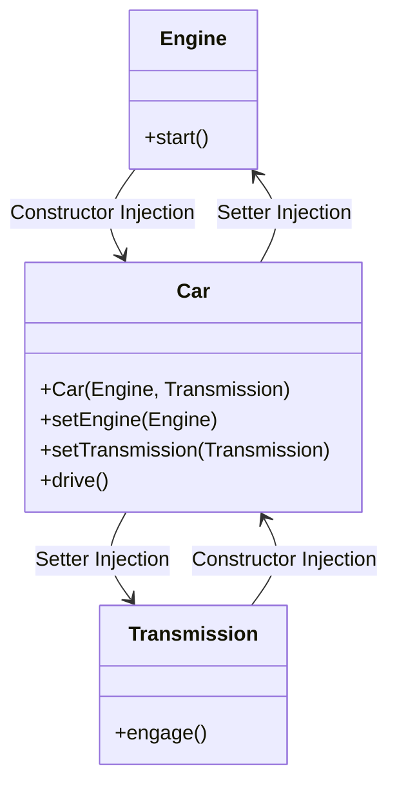

## 8.4.2 Types of Injection

In the world of Java programming, dependency injection (DI) is a pivotal concept that enhances the modularity and testability of code. By decoupling the creation of an object from its dependencies, DI allows for more flexible and maintainable code. In this section, we delve into the three primary types of dependency injection: Constructor Injection, Setter Injection, and Interface Injection. Each method has its unique characteristics, advantages, and potential drawbacks. Understanding these will enable you to make informed decisions about which type of injection to use in different scenarios.

### Constructor Injection

Constructor Injection is a technique where dependencies are provided to a class through its constructor. This method is often favored for its simplicity and the immutability it can provide to the objects.

#### Benefits of Constructor Injection

- **Immutability**: By injecting dependencies through the constructor, you can create immutable objects. Once an object is constructed, its dependencies cannot be changed, which can lead to more predictable and stable code.
- **Ease of Testing**: Constructor Injection makes it straightforward to test classes in isolation. Since dependencies are provided at the time of object creation, you can easily substitute mock objects or stubs during testing.
- **Clear Dependencies**: The constructor explicitly lists all the dependencies required by the class, making it clear what the class needs to function correctly.

#### Code Example: Constructor Injection

Let's consider a simple example where we have a `Car` class that depends on an `Engine` and a `Transmission`.

```java
public class Engine {
    public void start() {
        System.out.println("Engine started.");
    }
}

public class Transmission {
    public void engage() {
        System.out.println("Transmission engaged.");
    }
}

public class Car {
    private final Engine engine;
    private final Transmission transmission;

    // Constructor Injection
    public Car(Engine engine, Transmission transmission) {
        this.engine = engine;
        this.transmission = transmission;
    }

    public void drive() {
        engine.start();
        transmission.engage();
        System.out.println("Car is driving.");
    }
}

// Usage
public class Main {
    public static void main(String[] args) {
        Engine engine = new Engine();
        Transmission transmission = new Transmission();
        Car car = new Car(engine, transmission);
        car.drive();
    }
}
```

In this example, the `Car` class receives its dependencies (`Engine` and `Transmission`) through its constructor, ensuring that the car cannot be created without these essential components.

### Setter Injection

Setter Injection involves providing dependencies to a class through setter methods after the object has been constructed. This approach offers flexibility in configuring objects.

#### Benefits of Setter Injection

- **Optional Dependencies**: Setter Injection allows for optional dependencies. You can choose to inject only the necessary dependencies and leave others unset.
- **Reconfiguration**: It provides the ability to change dependencies after the object has been created, which can be useful in certain scenarios where dynamic reconfiguration is needed.

#### Code Example: Setter Injection

Let's modify the previous example to use Setter Injection.

```java
public class Car {
    private Engine engine;
    private Transmission transmission;

    // Setter Injection
    public void setEngine(Engine engine) {
        this.engine = engine;
    }

    public void setTransmission(Transmission transmission) {
        this.transmission = transmission;
    }

    public void drive() {
        if (engine != null && transmission != null) {
            engine.start();
            transmission.engage();
            System.out.println("Car is driving.");
        } else {
            System.out.println("Car cannot drive without engine and transmission.");
        }
    }
}

// Usage
public class Main {
    public static void main(String[] args) {
        Engine engine = new Engine();
        Transmission transmission = new Transmission();
        Car car = new Car();
        car.setEngine(engine);
        car.setTransmission(transmission);
        car.drive();
    }
}
```

In this version, the `Car` class allows its dependencies to be set after the object has been created, providing more flexibility in how the object is configured.

### Interface Injection

Interface Injection is a less common form of dependency injection in Java, where dependencies are provided through an interface that the class implements. This method is not widely used due to its complexity and the availability of simpler alternatives.

#### Why Interface Injection is Less Favored

- **Complexity**: Interface Injection can add unnecessary complexity to the codebase. It requires additional interfaces and implementation classes, which can make the code harder to read and maintain.
- **Limited Use Cases**: There are fewer scenarios where Interface Injection is the most appropriate choice compared to Constructor and Setter Injection.

#### Code Example: Interface Injection

Here's an example illustrating Interface Injection.

```java
public interface EngineAware {
    void setEngine(Engine engine);
}

public class Car implements EngineAware {
    private Engine engine;

    @Override
    public void setEngine(Engine engine) {
        this.engine = engine;
    }

    public void drive() {
        if (engine != null) {
            engine.start();
            System.out.println("Car is driving.");
        } else {
            System.out.println("Car cannot drive without an engine.");
        }
    }
}

// Usage
public class Main {
    public static void main(String[] args) {
        Engine engine = new Engine();
        Car car = new Car();
        car.setEngine(engine);
        car.drive();
    }
}
```

In this example, the `Car` class implements the `EngineAware` interface, which provides a method for setting the engine dependency.

### Pros and Cons of Each Injection Type

#### Constructor Injection

**Pros:**
- Promotes immutability.
- Dependencies are clearly defined and required at object creation.
- Simplifies testing by making dependencies explicit.

**Cons:**
- Can become cumbersome with a large number of dependencies.
- Does not allow for optional dependencies.

#### Setter Injection

**Pros:**
- Supports optional dependencies.
- Allows for reconfiguration after object creation.

**Cons:**
- Can lead to incomplete object configuration if dependencies are not set.
- May result in mutable objects, which can be less predictable.

#### Interface Injection

**Pros:**
- Provides a way to inject dependencies through interfaces.

**Cons:**
- Adds complexity to the codebase.
- Less intuitive and harder to maintain.

### Guidelines for Choosing the Appropriate Injection Method

When deciding which type of injection to use, consider the following guidelines:

1. **Use Constructor Injection for Required Dependencies**: If a class cannot function without certain dependencies, constructor injection is the best choice. It ensures that all necessary dependencies are provided at the time of object creation.

2. **Use Setter Injection for Optional Dependencies**: If a class has optional dependencies, setter injection allows you to configure these dependencies as needed without requiring them at construction time.

3. **Avoid Interface Injection Unless Necessary**: Due to its complexity and limited advantages, interface injection should be used sparingly and only when it provides a clear benefit.

4. **Consistency is Key**: Once you choose an injection strategy for a project, strive to maintain consistency. This makes the codebase easier to understand and maintain.

5. **Consider Immutability**: If immutability is important for your application, prefer constructor injection to ensure that dependencies cannot be changed after object creation.

### Try It Yourself

To deepen your understanding of these injection types, try modifying the code examples provided:

- **Experiment with Constructor Injection**: Add more dependencies to the `Car` class and see how the constructor changes. Consider how this affects the immutability of the class.
- **Explore Setter Injection**: Try adding optional features to the `Car` class using setter methods. Observe how this impacts the flexibility of the class configuration.
- **Implement Interface Injection**: Create a new interface for another dependency and implement it in the `Car` class. Reflect on the complexity this adds to the code.

### Visualizing Dependency Injection

To better understand the flow of dependencies in these injection types, let's visualize them using a class diagram.



This diagram illustrates how the `Car` class interacts with its dependencies through constructor and setter injection.

### References and Links

For further reading on dependency injection and its applications in Java, consider the following resources:

- [Spring Framework Documentation](https://spring.io/projects/spring-framework)
- [Java Dependency Injection with Dagger](https://dagger.dev/)
- [Understanding Dependency Injection in Java](https://www.baeldung.com/inversion-control-and-dependency-injection-in-spring)

### Knowledge Check

To reinforce your understanding of dependency injection types, consider the following questions:

- What are the main benefits of using constructor injection?
- How does setter injection support optional dependencies?
- Why is interface injection less commonly used in Java?
- When should you prefer constructor injection over setter injection?

### Embrace the Journey

Remember, mastering dependency injection is a journey. As you continue to explore and implement these concepts, you'll find new ways to enhance the modularity and testability of your Java applications. Keep experimenting, stay curious, and enjoy the process!

## Quiz Time!



### Which type of injection promotes immutability in Java?

- [x] Constructor Injection
- [ ] Setter Injection
- [ ] Interface Injection
- [ ] None of the above

> **Explanation:** Constructor Injection promotes immutability by ensuring dependencies are provided at object creation and cannot be changed later.


### What is a key advantage of setter injection?

- [ ] Immutability
- [x] Optional Dependencies
- [ ] Complexity
- [ ] Performance

> **Explanation:** Setter Injection allows for optional dependencies, enabling configuration flexibility after object creation.


### Why is interface injection less favored in Java?

- [ ] It promotes immutability
- [ ] It simplifies code
- [x] It adds complexity
- [ ] It is more efficient

> **Explanation:** Interface Injection adds complexity by requiring additional interfaces and implementations, making it less intuitive.


### Which injection type should be used for required dependencies?

- [x] Constructor Injection
- [ ] Setter Injection
- [ ] Interface Injection
- [ ] Any of the above

> **Explanation:** Constructor Injection is ideal for required dependencies as it ensures they are provided at object creation.


### What is a disadvantage of setter injection?

- [ ] Supports optional dependencies
- [x] Can lead to incomplete configuration
- [ ] Promotes immutability
- [ ] Reduces flexibility

> **Explanation:** Setter Injection can result in incomplete configuration if dependencies are not set, leading to potential issues.


### Which injection method is best for reconfiguration after object creation?

- [ ] Constructor Injection
- [x] Setter Injection
- [ ] Interface Injection
- [ ] None of the above

> **Explanation:** Setter Injection allows for reconfiguration after object creation, providing flexibility in changing dependencies.


### What is a common use case for constructor injection?

- [x] Providing all necessary dependencies at object creation
- [ ] Allowing optional dependencies
- [ ] Adding complexity to the codebase
- [ ] Enhancing performance

> **Explanation:** Constructor Injection is commonly used to provide all necessary dependencies at the time of object creation.


### Which injection type is less common due to its complexity?

- [ ] Constructor Injection
- [ ] Setter Injection
- [x] Interface Injection
- [ ] None of the above

> **Explanation:** Interface Injection is less common in Java due to the added complexity it introduces.


### What should be considered when choosing an injection method?

- [x] Consistency
- [x] Immutability
- [ ] Complexity
- [ ] None of the above

> **Explanation:** Consistency and immutability are important considerations when choosing an injection method to ensure maintainability and predictability.


### True or False: Setter Injection is the best choice for all dependencies.

- [ ] True
- [x] False

> **Explanation:** Setter Injection is not always the best choice; it is suitable for optional dependencies but not for required ones.


