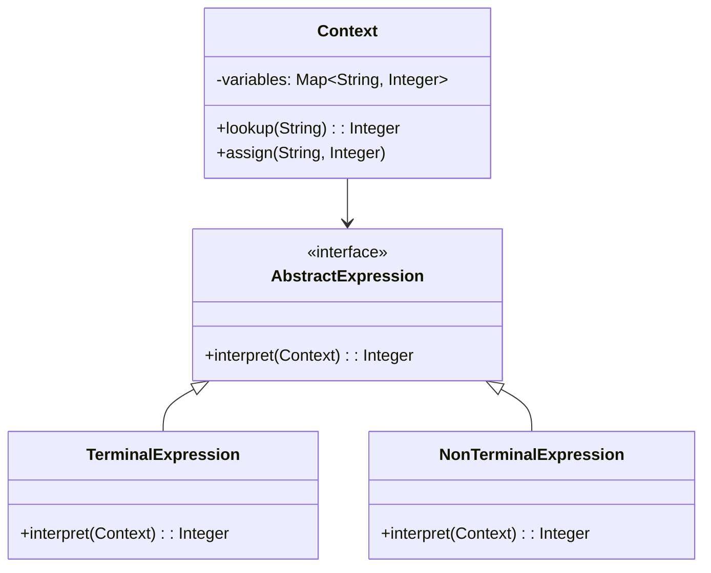

## 8.4.3 Performance Considerations

The Interpreter Pattern is a powerful tool in the realm of software design, particularly when dealing with languages and grammars. However, it is crucial to understand the performance implications associated with this pattern, especially in Java, where execution speed and resource management are paramount. This section delves into the performance considerations of the Interpreter Pattern, offering strategies to mitigate potential inefficiencies and exploring scenarios where interpreting is advantageous or where alternatives should be considered.

### Understanding the Performance Implications

Interpreting code, by its nature, tends to be slower than executing compiled code. This is primarily because interpretation involves parsing and executing instructions at runtime, which introduces overhead. In contrast, compiled code is translated into machine language before execution, allowing for faster execution times.

#### Key Performance Challenges

1. **Runtime Overhead**: Each time an expression is evaluated, the interpreter must parse and execute it, which can be computationally expensive.
2. **Memory Usage**: Interpreters often require additional memory to store the abstract syntax tree (AST) and other intermediate representations.
3. **Scalability**: As the complexity of the language or the number of expressions increases, the interpreter's performance can degrade significantly.

### Strategies for Performance Optimization

To address these challenges, several optimization techniques can be employed:

#### 1. Caching Results

Caching is a technique that stores the results of expensive function calls and reuses them when the same inputs occur again. This can significantly reduce the overhead of repeated evaluations.

```java
import java.util.HashMap;
import java.util.Map;

// A simple interpreter with caching
public class InterpreterWithCaching {
    private Map<String, Integer> cache = new HashMap<>();

    public int interpret(String expression) {
        if (cache.containsKey(expression)) {
            return cache.get(expression);
        }
        int result = evaluate(expression);
        cache.put(expression, result);
        return result;
    }

    private int evaluate(String expression) {
        // Simulate complex evaluation
        return expression.length(); // Placeholder for actual evaluation logic
    }
}
```

**Explanation**: In this example, the `interpret` method checks if the result of an expression is already cached. If so, it returns the cached result; otherwise, it evaluates the expression and caches the result for future use.

#### 2. Optimizing the Grammar

Simplifying and optimizing the grammar can lead to more efficient parsing and execution. This involves reducing the complexity of the language and eliminating unnecessary constructs.

- **Simplify Rules**: Remove redundant rules and combine similar ones to reduce parsing time.
- **Precompute Constants**: Identify constant expressions that can be precomputed at compile time rather than runtime.

#### 3. Just-In-Time Compilation (JIT)

Just-In-Time Compilation is a hybrid approach that combines interpretation and compilation. It compiles frequently executed code paths into native machine code at runtime, improving performance.

- **JIT in Java**: The Java Virtual Machine (JVM) already employs JIT compilation, which can be leveraged to optimize interpreted code.
- **Custom JIT**: For specific use cases, implementing a custom JIT compiler for the interpreter can yield significant performance gains.

### When Interpreting is Acceptable

Interpreting is suitable in scenarios where flexibility and ease of modification outweigh the need for raw performance. Examples include:

- **Prototyping**: Rapid development and testing of new language features.
- **Domain-Specific Languages (DSLs)**: Where the language is tailored to a specific problem domain and performance is not the primary concern.
- **Educational Tools**: Where simplicity and clarity are more important than execution speed.

### When to Consider Alternatives

In performance-critical applications, interpreting may not be feasible. Consider alternatives such as:

- **Compilers**: For applications where execution speed is critical, a compiler that translates code into machine language may be more appropriate.
- **Hybrid Approaches**: Combining interpreting with compiled code can offer a balance between flexibility and performance.

### Hybrid Approaches

Hybrid approaches leverage the strengths of both interpreting and compiling. This can involve:

- **Selective Compilation**: Compile only the performance-critical parts of the code while interpreting the rest.
- **Dynamic Optimization**: Use profiling information to identify hot spots and optimize them at runtime.

```java
// Example of a hybrid approach using selective compilation
public class HybridInterpreter {
    private boolean isCompiled = false;

    public void execute(String code) {
        if (isCompiled) {
            executeCompiled(code);
        } else {
            interpret(code);
        }
    }

    private void interpret(String code) {
        // Interpret the code
        System.out.println("Interpreting: " + code);
    }

    private void executeCompiled(String code) {
        // Execute compiled code
        System.out.println("Executing compiled code: " + code);
    }

    public void compile(String code) {
        // Compile the code
        isCompiled = true;
        System.out.println("Compiling code: " + code);
    }
}
```

**Explanation**: This example demonstrates a hybrid interpreter that can switch between interpreting and executing compiled code. The `compile` method sets a flag indicating that the code has been compiled, allowing the `execute` method to choose the appropriate execution path.

### Visualizing the Interpreter Pattern

To better understand the structure and interactions within the Interpreter Pattern, consider the following class diagram:



**Caption**: This diagram illustrates the structure of the Interpreter Pattern, highlighting the relationships between the `Context`, `AbstractExpression`, `TerminalExpression`, and `NonTerminalExpression` classes.

### Conclusion

The Interpreter Pattern offers a flexible and powerful approach to handling languages and grammars in software design. However, it is essential to consider the performance implications and employ strategies to mitigate potential inefficiencies. By leveraging techniques such as caching, grammar optimization, and just-in-time compilation, developers can enhance the performance of interpreters. Additionally, understanding when interpreting is appropriate and when alternatives are necessary is crucial for making informed design decisions.

### Key Takeaways

- Interpreting can introduce runtime overhead and memory usage challenges.
- Caching, grammar optimization, and JIT compilation are effective strategies for improving interpreter performance.
- Interpreting is suitable for prototyping, DSLs, and educational tools, but may not be ideal for performance-critical applications.
- Hybrid approaches offer a balance between flexibility and performance, combining interpreting with compiled code.

### Encouragement for Further Exploration

Consider how these performance considerations apply to your projects. Experiment with different optimization techniques and explore hybrid approaches to find the best balance for your specific use case.

## Test Your Knowledge: Performance Optimization in Java Design Patterns



### What is a primary disadvantage of using the Interpreter Pattern?

- [x] It can be slower than compiled execution.
- [ ] It is difficult to implement.
- [ ] It is not flexible.
- [ ] It cannot handle complex languages.

> **Explanation:** The Interpreter Pattern can be slower than compiled execution due to the overhead of parsing and executing instructions at runtime.

### Which technique can improve the performance of an interpreter by storing results of expensive function calls?

- [x] Caching
- [ ] Grammar optimization
- [ ] Just-In-Time Compilation
- [ ] Hybrid approaches

> **Explanation:** Caching stores the results of expensive function calls and reuses them when the same inputs occur again, reducing overhead.

### What is Just-In-Time Compilation?

- [x] A technique that compiles frequently executed code paths into native machine code at runtime.
- [ ] A method for precomputing constant expressions.
- [ ] A way to simplify grammar rules.
- [ ] A form of caching.

> **Explanation:** Just-In-Time Compilation compiles frequently executed code paths into native machine code at runtime, improving performance.

### In which scenario is interpreting generally acceptable?

- [x] Prototyping
- [ ] Performance-critical applications
- [ ] Real-time systems
- [ ] High-frequency trading

> **Explanation:** Interpreting is generally acceptable in prototyping, where flexibility and ease of modification are more important than execution speed.

### What is a hybrid approach in the context of the Interpreter Pattern?

- [x] Combining interpreting with compiled code.
- [ ] Using only compiled code.
- [ ] Interpreting all code paths.
- [ ] Avoiding any form of compilation.

> **Explanation:** A hybrid approach combines interpreting with compiled code to balance flexibility and performance.

### How can grammar optimization improve interpreter performance?

- [x] By simplifying rules and removing redundancies.
- [ ] By increasing the complexity of the language.
- [ ] By adding more constructs.
- [ ] By using more memory.

> **Explanation:** Grammar optimization improves performance by simplifying rules and removing redundancies, reducing parsing time.

### What is the role of the Context class in the Interpreter Pattern?

- [x] It stores variables and provides methods for variable lookup and assignment.
- [ ] It interprets expressions.
- [ ] It defines the grammar of the language.
- [ ] It compiles code.

> **Explanation:** The Context class stores variables and provides methods for variable lookup and assignment, supporting the interpretation process.

### Which of the following is NOT a benefit of using caching in an interpreter?

- [ ] Reduces repeated evaluations.
- [ ] Improves performance.
- [x] Increases memory usage.
- [ ] Stores results of expensive function calls.

> **Explanation:** While caching reduces repeated evaluations and improves performance, it can increase memory usage, which is not a benefit.

### What is the main advantage of using a hybrid approach?

- [x] It balances flexibility and performance.
- [ ] It eliminates the need for interpreting.
- [ ] It requires less memory.
- [ ] It simplifies the codebase.

> **Explanation:** A hybrid approach balances flexibility and performance by combining interpreting with compiled code.

### True or False: The Interpreter Pattern is always the best choice for performance-critical applications.

- [ ] True
- [x] False

> **Explanation:** The Interpreter Pattern is not always the best choice for performance-critical applications due to its potential runtime overhead.



By understanding and applying these performance considerations, Java developers and software architects can effectively utilize the Interpreter Pattern while maintaining optimal performance in their applications.
