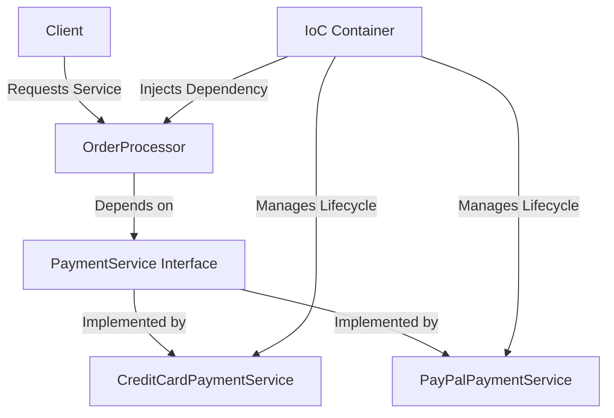

## 8.4.3 Benefits of Dependency Injection in Testing and Maintenance

In the realm of software engineering, particularly in Java development, Dependency Injection (DI) plays a pivotal role in enhancing both testing and maintenance. By decoupling components and managing dependencies effectively, DI not only simplifies the testing process but also contributes significantly to the maintainability of applications. In this section, we will delve into the various benefits of DI, supported by examples and best practices, to demonstrate how it can be leveraged to improve code quality and maintainability.

### Enhancing Testability with Dependency Injection

One of the primary advantages of using Dependency Injection is the ease it brings to the testing process. By allowing dependencies to be injected rather than hard-coded, DI enables developers to substitute real implementations with mock or stub versions during unit testing. This capability is crucial for isolating the unit under test and ensuring that tests are both focused and reliable.

#### Substituting Dependencies with Mocks and Stubs

When testing a component, it's essential to isolate it from its dependencies to ensure that the test results are not influenced by external factors. DI facilitates this by allowing us to inject mock or stub implementations of dependencies. Let's consider a simple example:

```java
// Service interface
public interface PaymentService {
    boolean processPayment(double amount);
}

// Real implementation
public class CreditCardPaymentService implements PaymentService {
    @Override
    public boolean processPayment(double amount) {
        // Logic to process payment
        return true;
    }
}

// Mock implementation for testing
public class MockPaymentService implements PaymentService {
    @Override
    public boolean processPayment(double amount) {
        // Simulate payment processing
        return true;
    }
}

// Class under test
public class OrderProcessor {
    private PaymentService paymentService;

    // Dependency Injection via constructor
    public OrderProcessor(PaymentService paymentService) {
        this.paymentService = paymentService;
    }

    public boolean processOrder(double amount) {
        return paymentService.processPayment(amount);
    }
}

// Unit test
public class OrderProcessorTest {
    @Test
    public void testProcessOrder() {
        PaymentService mockService = new MockPaymentService();
        OrderProcessor orderProcessor = new OrderProcessor(mockService);

        assertTrue(orderProcessor.processOrder(100.0));
    }
}
```

In this example, the `OrderProcessor` class depends on the `PaymentService` interface. During testing, we inject a `MockPaymentService` instead of the real `CreditCardPaymentService`, allowing us to test the `OrderProcessor` in isolation.

#### Writing Cleaner and More Focused Tests

By isolating the unit under test, DI helps in writing cleaner and more focused tests. The tests become more about verifying the behavior of the unit rather than dealing with the intricacies of its dependencies. This separation of concerns leads to more maintainable test suites and reduces the likelihood of false positives or negatives.

### Facilitating Maintenance with Dependency Injection

Beyond testing, DI significantly contributes to the maintainability of software applications. It simplifies the process of changing or upgrading components, centralizes configuration, and enhances the overall manageability of the application.

#### Simplifying Component Changes

In a typical application, components often depend on each other. Changing a component can have ripple effects, requiring changes in all dependent components. DI mitigates this issue by decoupling components through interfaces, making it easier to swap out implementations without affecting the rest of the system.

```java
// New implementation of PaymentService
public class PayPalPaymentService implements PaymentService {
    @Override
    public boolean processPayment(double amount) {
        // Logic to process payment via PayPal
        return true;
    }
}

// Switching to the new implementation
PaymentService paymentService = new PayPalPaymentService();
OrderProcessor orderProcessor = new OrderProcessor(paymentService);
```

In this scenario, switching from `CreditCardPaymentService` to `PayPalPaymentService` requires no changes to the `OrderProcessor` class, demonstrating how DI facilitates component upgrades.

#### Centralizing Configuration

DI also centralizes configuration, making it easier to manage application settings. By using an IoC (Inversion of Control) container, developers can define dependencies and configurations in a single location, often through configuration files or annotations. This centralization simplifies the process of managing dependencies and enhances the flexibility of the application.

```java
// Spring configuration using annotations
@Configuration
public class AppConfig {
    @Bean
    public PaymentService paymentService() {
        return new PayPalPaymentService();
    }

    @Bean
    public OrderProcessor orderProcessor() {
        return new OrderProcessor(paymentService());
    }
}
```

In this example, the Spring framework is used to manage dependencies through configuration, allowing for easy changes and centralized management.

### Role of IoC Containers

IoC containers are instrumental in managing object lifecycles and dependencies. They automatically instantiate and inject dependencies, reducing boilerplate code and ensuring that the application components are properly configured.

#### Managing Object Lifecycles

IoC containers manage the lifecycle of objects, ensuring that they are created, configured, and destroyed appropriately. This management is crucial for resources that require specific initialization or cleanup, such as database connections or network sockets.

```java
// Spring IoC container example
ApplicationContext context = new AnnotationConfigApplicationContext(AppConfig.class);
OrderProcessor orderProcessor = context.getBean(OrderProcessor.class);
```

In this example, the Spring IoC container manages the lifecycle of the `OrderProcessor` and its dependencies, ensuring that they are properly initialized and available for use.

### Designing Components with Interfaces

To maximize the benefits of DI, it's essential to design components with interfaces. Interfaces define contracts that components must adhere to, allowing for greater flexibility and interchangeability of implementations.

#### Emphasizing Interface-Based Design

By designing components with interfaces, developers can easily swap out implementations without affecting the rest of the system. This design principle is fundamental to achieving the decoupling that DI aims to provide.

```java
// Interface for a logging service
public interface LoggingService {
    void log(String message);
}

// Console implementation
public class ConsoleLoggingService implements LoggingService {
    @Override
    public void log(String message) {
        System.out.println(message);
    }
}

// File implementation
public class FileLoggingService implements LoggingService {
    @Override
    public void log(String message) {
        // Logic to write message to a file
    }
}
```

In this example, the `LoggingService` interface allows for different logging implementations, such as console or file logging, to be used interchangeably.

### Encouraging Adoption of Dependency Injection

Adopting DI as a standard practice can significantly improve code quality and maintainability. By promoting decoupling and enhancing testability, DI leads to more robust and adaptable software systems.

#### Improving Code Quality

DI encourages a modular design approach, where components are loosely coupled and focused on a single responsibility. This modularity improves code readability, reduces complexity, and enhances the overall quality of the software.

#### Enhancing Maintainability

By simplifying component changes and centralizing configuration, DI makes it easier to maintain and evolve software applications. This ease of maintenance is particularly valuable in large-scale systems, where changes can have widespread impacts.

### Try It Yourself

To reinforce your understanding of Dependency Injection, try modifying the examples provided. Experiment with different implementations of the `PaymentService` interface or create your own IoC container to manage dependencies. Consider how these changes affect the testability and maintainability of the application.

### Visualizing Dependency Injection

Below is a diagram illustrating the flow of Dependency Injection in a Java application, highlighting the interaction between components, interfaces, and the IoC container.



**Diagram Description:** This diagram shows a client interacting with an `OrderProcessor`, which depends on a `PaymentService` interface. The IoC container manages the lifecycle and injection of dependencies, allowing for different implementations of the `PaymentService`.

### Key Takeaways

- **Dependency Injection enhances testability** by allowing easy substitution of dependencies with mock or stub implementations.
- **DI facilitates maintenance** by simplifying component changes and centralizing configuration.
- **IoC containers manage object lifecycles** and dependencies, reducing boilerplate code.
- **Designing components with interfaces** maximizes the benefits of DI by promoting flexibility and interchangeability.
- **Adopting DI as a standard practice** improves code quality and maintainability.

## Quiz Time!



### How does Dependency Injection enhance testability?

- [x] By allowing easy substitution of dependencies with mock implementations
- [ ] By making code more complex
- [ ] By increasing the number of dependencies
- [ ] By hardcoding dependencies

> **Explanation:** Dependency Injection allows for easy substitution of dependencies with mock implementations, which enhances testability by isolating the unit under test.

### What is the role of an IoC container in Dependency Injection?

- [x] Managing object lifecycles and dependencies
- [ ] Increasing code complexity
- [ ] Hardcoding dependencies
- [ ] Reducing the number of dependencies

> **Explanation:** An IoC container manages object lifecycles and dependencies, ensuring that components are properly configured and available for use.

### Why is designing components with interfaces important in DI?

- [x] It promotes flexibility and interchangeability of implementations
- [ ] It increases code complexity
- [ ] It reduces the number of dependencies
- [ ] It hardcodes dependencies

> **Explanation:** Designing components with interfaces promotes flexibility and interchangeability of implementations, which is essential for maximizing the benefits of Dependency Injection.

### What is a key benefit of centralizing configuration in DI?

- [x] Easier management of application settings
- [ ] Increased code complexity
- [ ] Hardcoding dependencies
- [ ] Reducing the number of dependencies

> **Explanation:** Centralizing configuration makes it easier to manage application settings and enhances the flexibility of the application.

### How does DI contribute to ease of maintenance?

- [x] By simplifying component changes and centralizing configuration
- [ ] By increasing code complexity
- [ ] By hardcoding dependencies
- [ ] By reducing the number of dependencies

> **Explanation:** DI contributes to ease of maintenance by simplifying component changes and centralizing configuration, making it easier to manage and evolve software applications.

### What is the primary advantage of using mock implementations in testing?

- [x] Isolating the unit under test
- [ ] Increasing code complexity
- [ ] Hardcoding dependencies
- [ ] Reducing the number of dependencies

> **Explanation:** Using mock implementations allows for isolating the unit under test, ensuring that tests are focused and reliable.

### How does DI improve code quality?

- [x] By encouraging a modular design approach
- [ ] By increasing code complexity
- [ ] By hardcoding dependencies
- [ ] By reducing the number of dependencies

> **Explanation:** DI improves code quality by encouraging a modular design approach, which enhances readability and reduces complexity.

### What is a key feature of IoC containers?

- [x] Managing object lifecycles
- [ ] Increasing code complexity
- [ ] Hardcoding dependencies
- [ ] Reducing the number of dependencies

> **Explanation:** A key feature of IoC containers is managing object lifecycles, ensuring that components are properly initialized and available for use.

### Why is it beneficial to adopt DI as a standard practice?

- [x] It improves code quality and maintainability
- [ ] It increases code complexity
- [ ] It hardcodes dependencies
- [ ] It reduces the number of dependencies

> **Explanation:** Adopting DI as a standard practice improves code quality and maintainability by promoting decoupling and enhancing testability.

### Dependency Injection allows for easy substitution of dependencies with mock implementations.

- [x] True
- [ ] False

> **Explanation:** True. Dependency Injection allows for easy substitution of dependencies with mock implementations, enhancing testability by isolating the unit under test.


