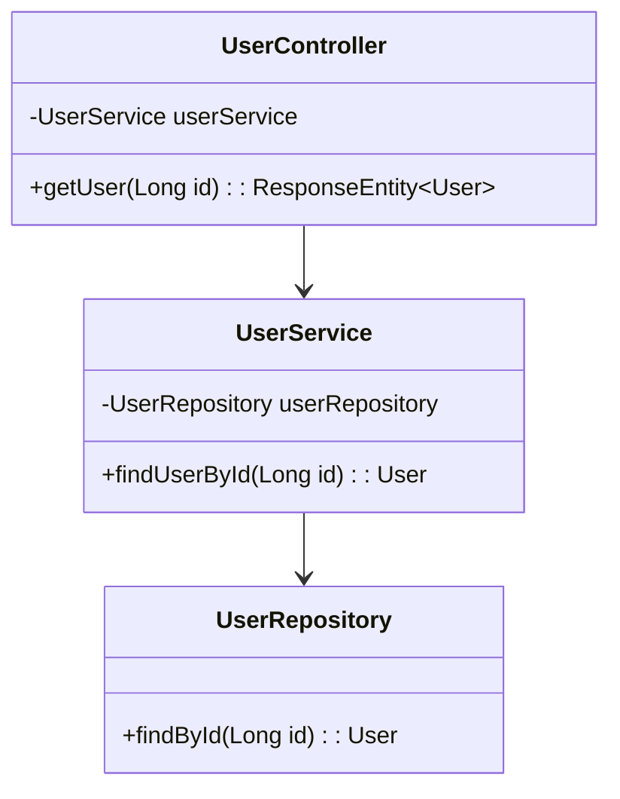

## 8.4.4 Use Cases and Examples

Dependency Injection (DI) is a powerful design pattern that plays a crucial role in enterprise applications and plugin architectures. It allows developers to build flexible, maintainable, and testable applications by decoupling components and managing their dependencies efficiently. In this section, we will explore various use cases and examples where DI is applied, demonstrating its benefits and practical implementations.

### Enterprise Applications

Enterprise applications are complex systems that require seamless integration of various components such as services, repositories, and controllers. DI simplifies the process of wiring these components together, enhancing the modularity and scalability of the application.

#### Example: Injecting Services into Controllers

Consider a typical enterprise application with a service layer and a controller layer. The service layer contains business logic, while the controller layer handles HTTP requests and responses. DI can be used to inject services into controllers, promoting separation of concerns and improving testability.

```java
// Service Interface
public interface UserService {
    User findUserById(Long id);
}

// Service Implementation
public class UserServiceImpl implements UserService {
    private final UserRepository userRepository;

    // Constructor Injection
    public UserServiceImpl(UserRepository userRepository) {
        this.userRepository = userRepository;
    }

    @Override
    public User findUserById(Long id) {
        return userRepository.findById(id);
    }
}

// Controller
@RestController
@RequestMapping("/users")
public class UserController {
    private final UserService userService;

    // Constructor Injection
    public UserController(UserService userService) {
        this.userService = userService;
    }

    @GetMapping("/{id}")
    public ResponseEntity<User> getUser(@PathVariable Long id) {
        User user = userService.findUserById(id);
        return ResponseEntity.ok(user);
    }
}
```

In the above example, `UserService` is injected into `UserController` using constructor injection. This approach ensures that the controller is not responsible for creating the service, adhering to the Single Responsibility Principle (SRP).

#### Benefits of DI in Enterprise Applications

1. **Modularity**: DI promotes modular design by decoupling components, making it easier to develop, test, and maintain each module independently.

2. **Scalability**: As the application grows, DI allows for seamless integration of new components without affecting existing ones.

3. **Testability**: By injecting dependencies, components can be easily mocked or stubbed during testing, leading to more reliable and isolated tests.

4. **Configuration Management**: DI frameworks like Spring provide configuration management capabilities, allowing developers to define dependencies in configuration files or annotations, simplifying the setup process.

### Plugin Architectures

Plugin architectures enable applications to load and inject plugins dynamically at runtime, providing extensibility and flexibility. DI facilitates the dynamic loading and injection of plugins, allowing applications to adapt to changing requirements without redeployment.

#### Example: Dynamic Plugin Loading

Consider an application that supports various payment methods as plugins. Each payment method is implemented as a plugin, and DI is used to inject the appropriate plugin at runtime.

```java
// Payment Plugin Interface
public interface PaymentPlugin {
    void processPayment(double amount);
}

// PayPal Plugin Implementation
public class PayPalPlugin implements PaymentPlugin {
    @Override
    public void processPayment(double amount) {
        System.out.println("Processing payment of $" + amount + " through PayPal.");
    }
}

// Stripe Plugin Implementation
public class StripePlugin implements PaymentPlugin {
    @Override
    public void processPayment(double amount) {
        System.out.println("Processing payment of $" + amount + " through Stripe.");
    }
}

// Plugin Manager
public class PluginManager {
    private final Map<String, PaymentPlugin> plugins = new HashMap<>();

    public void registerPlugin(String name, PaymentPlugin plugin) {
        plugins.put(name, plugin);
    }

    public PaymentPlugin getPlugin(String name) {
        return plugins.get(name);
    }
}

// Application
public class PaymentApplication {
    private final PluginManager pluginManager;

    // Constructor Injection
    public PaymentApplication(PluginManager pluginManager) {
        this.pluginManager = pluginManager;
    }

    public void processPayment(String pluginName, double amount) {
        PaymentPlugin plugin = pluginManager.getPlugin(pluginName);
        if (plugin != null) {
            plugin.processPayment(amount);
        } else {
            System.out.println("Plugin not found: " + pluginName);
        }
    }
}
```

In this example, `PluginManager` manages the registration and retrieval of payment plugins. `PaymentApplication` uses DI to inject `PluginManager` and dynamically load the appropriate plugin based on user input.

#### Benefits of DI in Plugin Architectures

1. **Extensibility**: DI allows new plugins to be added without modifying existing code, supporting the Open/Closed Principle (OCP).

2. **Flexibility**: Plugins can be loaded and unloaded at runtime, enabling applications to adapt to new requirements or environments.

3. **Decoupling**: By abstracting plugin implementations, DI reduces dependencies between the core application and plugins, enhancing maintainability.

### Configuration Flexibility

Applications often require configuration flexibility, such as swapping implementations for logging or data access. DI provides a mechanism to manage configurations dynamically, allowing developers to change implementations without altering the application code.

#### Example: Swapping Logging Implementations

Consider an application that uses different logging frameworks based on the environment (e.g., development, production). DI can be used to inject the appropriate logging implementation at runtime.

```java
// Logger Interface
public interface Logger {
    void log(String message);
}

// Console Logger Implementation
public class ConsoleLogger implements Logger {
    @Override
    public void log(String message) {
        System.out.println("Console Logger: " + message);
    }
}

// File Logger Implementation
public class FileLogger implements Logger {
    @Override
    public void log(String message) {
        // Write message to a file
        System.out.println("File Logger: " + message);
    }
}

// Application
public class LoggingApplication {
    private final Logger logger;

    // Constructor Injection
    public LoggingApplication(Logger logger) {
        this.logger = logger;
    }

    public void performTask() {
        logger.log("Performing a task...");
    }
}

// Configuration
@Configuration
public class AppConfig {
    @Bean
    public Logger logger() {
        // Choose logger based on environment
        if (isProductionEnvironment()) {
            return new FileLogger();
        } else {
            return new ConsoleLogger();
        }
    }
}
```

In this example, `AppConfig` is a configuration class that defines the `Logger` bean. The appropriate logger implementation is injected into `LoggingApplication` based on the environment, demonstrating configuration flexibility.

#### Benefits of DI in Configuration Management

1. **Dynamic Configuration**: DI allows configurations to be defined externally, enabling changes without recompiling the application.

2. **Environment-Specific Implementations**: Different implementations can be injected based on the environment, supporting diverse deployment scenarios.

3. **Simplified Setup**: DI frameworks provide tools for managing configurations, reducing the complexity of setup and deployment.

### Scaling Applications with DI

As applications grow, scaling becomes a critical concern. DI facilitates scaling by promoting modular design and efficient resource management.

#### Example: Scaling a Web Application

Consider a web application that handles a large number of concurrent requests. DI can be used to manage resources such as database connections, caching, and session management, ensuring efficient scaling.

```java
// Database Connection Pool
public class ConnectionPool {
    private final DataSource dataSource;

    // Constructor Injection
    public ConnectionPool(DataSource dataSource) {
        this.dataSource = dataSource;
    }

    public Connection getConnection() throws SQLException {
        return dataSource.getConnection();
    }
}

// Caching Service
public class CachingService {
    private final CacheManager cacheManager;

    // Constructor Injection
    public CachingService(CacheManager cacheManager) {
        this.cacheManager = cacheManager;
    }

    public void cacheData(String key, Object data) {
        cacheManager.put(key, data);
    }
}

// Web Application
public class WebApplication {
    private final ConnectionPool connectionPool;
    private final CachingService cachingService;

    // Constructor Injection
    public WebApplication(ConnectionPool connectionPool, CachingService cachingService) {
        this.connectionPool = connectionPool;
        this.cachingService = cachingService;
    }

    public void handleRequest(Request request) {
        // Handle request using connection pool and caching service
    }
}
```

In this example, `ConnectionPool` and `CachingService` are injected into `WebApplication`, allowing efficient management of resources. DI promotes scalability by enabling the application to handle increased load without significant changes to the codebase.

#### Benefits of DI in Scaling Applications

1. **Resource Management**: DI facilitates the management of shared resources, such as database connections and caches, optimizing performance.

2. **Modular Design**: By decoupling components, DI supports the addition of new features and services as the application scales.

3. **Load Balancing**: DI frameworks can be integrated with load balancers to distribute requests across multiple instances, enhancing scalability.

### Encouraging Modular Development

Modular development is a key aspect of building maintainable and flexible applications. DI promotes modularity by enabling developers to design components that are independent and interchangeable.

#### Example: Modular E-Commerce Application

Consider an e-commerce application with modules for product management, order processing, and customer support. DI can be used to inject dependencies between modules, supporting modular development.

```java
// Product Service
public class ProductService {
    // Business logic for managing products
}

// Order Service
public class OrderService {
    private final ProductService productService;

    // Constructor Injection
    public OrderService(ProductService productService) {
        this.productService = productService;
    }

    public void processOrder(Order order) {
        // Use product service to manage order
    }
}

// Customer Support Service
public class CustomerSupportService {
    private final OrderService orderService;

    // Constructor Injection
    public CustomerSupportService(OrderService orderService) {
        this.orderService = orderService;
    }

    public void handleSupportRequest(SupportRequest request) {
        // Use order service to assist customer
    }
}

// E-Commerce Application
public class ECommerceApplication {
    private final CustomerSupportService customerSupportService;

    // Constructor Injection
    public ECommerceApplication(CustomerSupportService customerSupportService) {
        this.customerSupportService = customerSupportService;
    }

    public void run() {
        // Run the application
    }
}
```

In this example, `OrderService` and `CustomerSupportService` are injected with their respective dependencies, promoting modular development. Each module can be developed, tested, and maintained independently, enhancing the overall flexibility of the application.

#### Benefits of DI in Modular Development

1. **Independent Modules**: DI allows modules to be developed independently, reducing dependencies and simplifying maintenance.

2. **Interchangeable Components**: Components can be easily swapped or upgraded without affecting other parts of the application.

3. **Enhanced Collaboration**: Teams can work on different modules simultaneously, improving productivity and reducing development time.

### Visualizing Dependency Injection

To better understand the flow of dependencies in a DI-enabled application, let's visualize the relationships between components using a class diagram.



**Diagram Description**: This class diagram illustrates the relationships between `UserController`, `UserService`, and `UserRepository`. `UserController` depends on `UserService`, which in turn depends on `UserRepository`. DI is used to inject these dependencies, promoting a clean separation of concerns.

### Try It Yourself

Now that we've explored various use cases and examples of DI, let's encourage you to try it yourself. Experiment with the following modifications to the code examples:

1. **Add a New Payment Plugin**: Implement a new payment plugin (e.g., `BitcoinPlugin`) and register it with `PluginManager`. Test the application by processing a payment using the new plugin.

2. **Swap Logging Implementations**: Modify `AppConfig` to use a different logging implementation (e.g., `DatabaseLogger`) and observe how the application behavior changes.

3. **Scale the Web Application**: Introduce a new service (e.g., `NotificationService`) and inject it into `WebApplication`. Implement a method to send notifications and test the application's scalability.

4. **Enhance the E-Commerce Application**: Add a new module (e.g., `InventoryService`) and inject it into `OrderService`. Implement inventory management features and test the modularity of the application.

### Knowledge Check

Before we conclude, let's reinforce your understanding with a few questions:

- How does DI promote modularity in enterprise applications?
- What are the benefits of using DI in plugin architectures?
- How can DI facilitate configuration flexibility in applications?
- In what ways does DI support the scaling of applications?
- How does DI enhance testability in software development?

### Conclusion

Dependency Injection is a fundamental design pattern that empowers developers to build flexible, maintainable, and scalable applications. By decoupling components and managing dependencies efficiently, DI simplifies configuration management, promotes modular development, and supports dynamic plugin architectures. As you continue to explore and implement DI in your projects, remember to leverage its benefits to create enterprise-grade applications that are robust and adaptable to changing requirements.

## Quiz Time!



### How does Dependency Injection promote modularity in enterprise applications?

- [x] By decoupling components and managing dependencies efficiently.
- [ ] By increasing the number of lines of code.
- [ ] By making components tightly coupled.
- [ ] By reducing the number of available plugins.

> **Explanation:** Dependency Injection promotes modularity by decoupling components and managing dependencies efficiently, allowing each module to be developed and maintained independently.

### What is a key benefit of using Dependency Injection in plugin architectures?

- [x] It allows plugins to be loaded and unloaded at runtime.
- [ ] It makes the codebase more complex.
- [ ] It reduces the number of available plugins.
- [ ] It increases the number of dependencies.

> **Explanation:** Dependency Injection allows plugins to be loaded and unloaded at runtime, providing flexibility and adaptability to changing requirements.

### How can Dependency Injection facilitate configuration flexibility in applications?

- [x] By allowing configurations to be defined externally and changed without recompiling the application.
- [ ] By hardcoding configurations into the application code.
- [ ] By reducing the number of configuration options.
- [ ] By making configurations static and unchangeable.

> **Explanation:** Dependency Injection facilitates configuration flexibility by allowing configurations to be defined externally, enabling changes without recompiling the application.

### In what ways does Dependency Injection support the scaling of applications?

- [x] By promoting modular design and efficient resource management.
- [ ] By increasing the complexity of the codebase.
- [ ] By making components tightly coupled.
- [ ] By reducing the number of available resources.

> **Explanation:** Dependency Injection supports scaling by promoting modular design and efficient resource management, allowing applications to handle increased load without significant changes to the codebase.

### How does Dependency Injection enhance testability in software development?

- [x] By allowing dependencies to be easily mocked or stubbed during testing.
- [ ] By making tests more complex and harder to write.
- [ ] By reducing the number of test cases.
- [ ] By making components tightly coupled.

> **Explanation:** Dependency Injection enhances testability by allowing dependencies to be easily mocked or stubbed during testing, leading to more reliable and isolated tests.

### What is the primary role of a Plugin Manager in a DI-enabled application?

- [x] To manage the registration and retrieval of plugins.
- [ ] To increase the number of plugins.
- [ ] To reduce the number of available plugins.
- [ ] To make plugins tightly coupled.

> **Explanation:** The primary role of a Plugin Manager is to manage the registration and retrieval of plugins, allowing for dynamic loading and unloading of plugins at runtime.

### Which design principle does Dependency Injection support by allowing new plugins to be added without modifying existing code?

- [x] Open/Closed Principle (OCP)
- [ ] Single Responsibility Principle (SRP)
- [ ] Liskov Substitution Principle (LSP)
- [ ] Interface Segregation Principle (ISP)

> **Explanation:** Dependency Injection supports the Open/Closed Principle (OCP) by allowing new plugins to be added without modifying existing code, promoting extensibility.

### What is a common use case for Dependency Injection in enterprise applications?

- [x] Injecting services into controllers to promote separation of concerns.
- [ ] Hardcoding configurations into the application code.
- [ ] Making components tightly coupled.
- [ ] Reducing the number of available services.

> **Explanation:** A common use case for Dependency Injection in enterprise applications is injecting services into controllers to promote separation of concerns and improve testability.

### How does Dependency Injection simplify configuration management in large applications?

- [x] By allowing developers to define dependencies in configuration files or annotations.
- [ ] By hardcoding configurations into the application code.
- [ ] By reducing the number of configuration options.
- [ ] By making configurations static and unchangeable.

> **Explanation:** Dependency Injection simplifies configuration management by allowing developers to define dependencies in configuration files or annotations, reducing the complexity of setup and deployment.

### Dependency Injection can be used to inject dependencies at runtime.

- [x] True
- [ ] False

> **Explanation:** Dependency Injection can be used to inject dependencies at runtime, allowing for dynamic loading and unloading of components and plugins.


