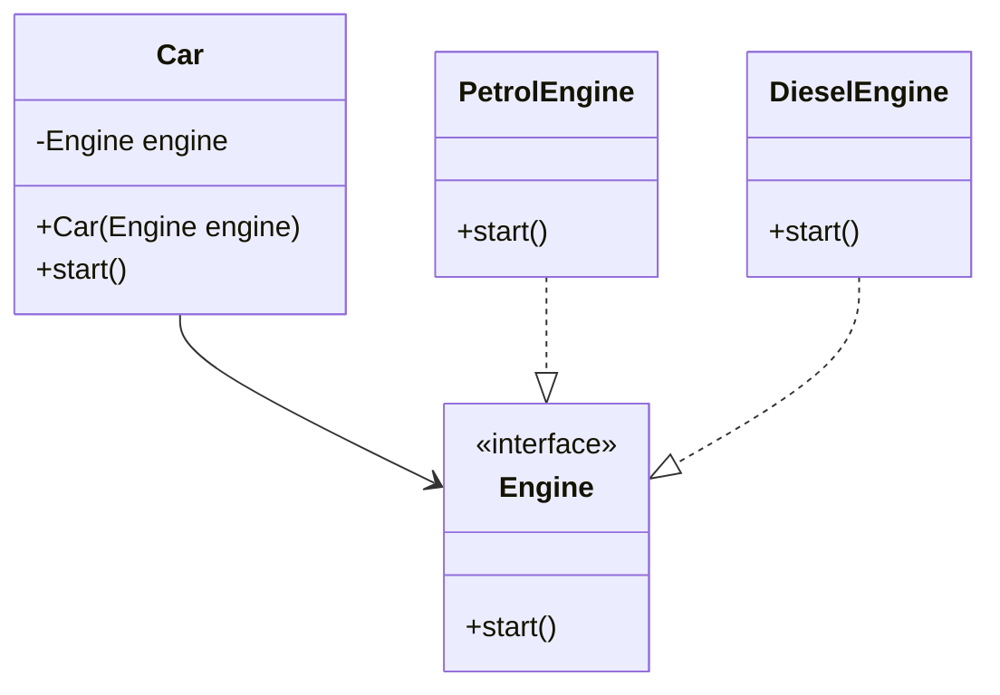

## 8.4 Dependency Injection and Inversion of Control

In the realm of software design, achieving a high degree of modularity and testability is paramount. Dependency Injection (DI) and Inversion of Control (IoC) are two closely related concepts that facilitate these goals by decoupling components and managing dependencies effectively. In this section, we will delve into the intricacies of DI and IoC, exploring their relationship, benefits, and practical implementation in Java.

### Understanding Dependency Injection and Inversion of Control

**Dependency Injection** is a design pattern that allows a class to receive its dependencies from an external source rather than creating them internally. This approach promotes loose coupling between components, making it easier to modify and test individual parts of an application.

**Inversion of Control** is a broader principle that shifts the control of object creation and dependency management from the application code to a container or framework. DI is one of the most common ways to implement IoC, but IoC can also be achieved through other patterns such as Service Locator.

#### Relationship Between DI and IoC

The relationship between DI and IoC can be understood as follows: IoC is the overarching principle that dictates that the control of dependencies should be inverted, while DI is a specific technique that implements this principle by injecting dependencies into classes. By using DI, we adhere to the IoC principle, allowing for more flexible and maintainable code.

### Promoting Loose Coupling with Dependency Injection

Loose coupling is a design goal that aims to reduce the interdependencies between components, making them easier to manage and modify independently. DI achieves loose coupling by injecting dependencies into a class rather than hard-coding them. This means that a class does not need to know how to create its dependencies; it only needs to know how to use them.

#### Example of Tight Coupling

Consider a scenario where a `Car` class depends on an `Engine` class. In a tightly coupled design, the `Car` class might instantiate the `Engine` class directly:

```java
public class Car {
    private Engine engine;

    public Car() {
        this.engine = new Engine(); // Tight coupling
    }
}
```

In this example, the `Car` class is tightly coupled to the `Engine` class because it creates an instance of `Engine` directly. This makes it difficult to change the implementation of `Engine` or to test the `Car` class in isolation.

#### Achieving Loose Coupling with DI

With DI, we can decouple the `Car` class from the `Engine` class by injecting the `Engine` dependency:

```java
public class Car {
    private Engine engine;

    public Car(Engine engine) {
        this.engine = engine; // Dependency Injection
    }
}
```

In this revised example, the `Car` class receives an `Engine` instance through its constructor. This allows us to easily swap out the `Engine` implementation or mock it for testing purposes.

### Benefits of Using DI and IoC in Enterprise Applications

Implementing DI and IoC in enterprise applications offers several advantages that contribute to more maintainable and scalable systems.

#### Improved Modularity and Separation of Concerns

DI encourages the separation of concerns by allowing each class to focus on its primary responsibilities without worrying about the creation and management of its dependencies. This modularity makes it easier to understand, maintain, and extend the application.

#### Enhanced Testability

By decoupling components, DI makes it easier to test individual classes in isolation. Dependencies can be mocked or stubbed, allowing for unit tests that focus solely on the behavior of the class under test. This results in more reliable and faster-running tests.

#### Flexibility in Configuring and Swapping Implementations

DI provides the flexibility to configure and swap implementations without changing the dependent class. This is particularly useful in scenarios where different implementations are required for different environments (e.g., development, testing, production).

### Overview of Dependency Injection Frameworks

DI frameworks automate the process of injecting dependencies, reducing boilerplate code and ensuring consistency across the application. Popular DI frameworks in Java include Spring, Google Guice, and CDI (Contexts and Dependency Injection).

#### How DI Frameworks Work

DI frameworks typically use a configuration file or annotations to define the dependencies between components. The framework then manages the lifecycle of these components, injecting them where needed.

##### Example with Spring Framework

Spring is one of the most widely used DI frameworks in Java. It allows for configuration using XML, Java annotations, or Java-based configuration. Here's a simple example using annotations:

```java
import org.springframework.stereotype.Component;
import org.springframework.beans.factory.annotation.Autowired;

@Component
public class Car {
    private Engine engine;

    @Autowired
    public Car(Engine engine) {
        this.engine = engine;
    }
}

@Component
public class Engine {
    // Engine implementation
}
```

In this example, the `@Component` annotation marks the `Car` and `Engine` classes as Spring-managed beans. The `@Autowired` annotation tells Spring to inject an `Engine` instance into the `Car` constructor.

### Designing Components with Abstractions

To fully leverage the benefits of DI, it's important to design components with abstractions, such as interfaces or abstract classes. This allows for greater flexibility in swapping implementations and enhances the modularity of the application.

#### Example of Using Interfaces

Consider the following example where we use an interface to define the `Engine` abstraction:

```java
public interface Engine {
    void start();
}

public class PetrolEngine implements Engine {
    @Override
    public void start() {
        System.out.println("Petrol engine starting...");
    }
}

public class DieselEngine implements Engine {
    @Override
    public void start() {
        System.out.println("Diesel engine starting...");
    }
}

public class Car {
    private Engine engine;

    public Car(Engine engine) {
        this.engine = engine;
    }

    public void start() {
        engine.start();
    }
}
```

In this example, the `Car` class depends on the `Engine` interface rather than a specific implementation. This allows us to inject different `Engine` implementations, such as `PetrolEngine` or `DieselEngine`, without modifying the `Car` class.

### Practical Implementation Strategies

When implementing DI and IoC in your applications, consider the following strategies:

1. **Use a DI Framework**: Leverage a DI framework to automate the injection process and manage the lifecycle of your components.

2. **Design with Interfaces**: Define interfaces for your dependencies to allow for flexible swapping of implementations.

3. **Favor Constructor Injection**: Prefer constructor injection over field or setter injection for mandatory dependencies, as it ensures that dependencies are provided at the time of object creation.

4. **Use Annotations for Configuration**: Take advantage of annotations provided by DI frameworks to simplify configuration and reduce boilerplate code.

5. **Test with Mocks and Stubs**: Use mocking frameworks like Mockito to create mock implementations of your dependencies for testing purposes.

### Visualizing Dependency Injection

To better understand how DI works, let's visualize the process using a class diagram:



In this diagram, the `Car` class depends on the `Engine` interface, and both `PetrolEngine` and `DieselEngine` implement the `Engine` interface. This setup allows for flexible injection of different `Engine` implementations into the `Car` class.

### Try It Yourself

To deepen your understanding of DI, try modifying the code examples provided:

- **Experiment with Different Implementations**: Create additional `Engine` implementations and inject them into the `Car` class to see how the behavior changes.
- **Use a DI Framework**: Set up a simple Spring project and configure the `Car` and `Engine` beans using annotations or XML.
- **Test with Mocks**: Use a mocking framework to test the `Car` class in isolation by mocking the `Engine` dependency.

### Knowledge Check

- **What is the primary benefit of using DI in software design?**
- **How does IoC relate to DI?**
- **Why is it important to design components with interfaces when using DI?**

### Summary

Dependency Injection and Inversion of Control are powerful concepts that enhance the modularity, testability, and flexibility of Java applications. By decoupling components and managing dependencies externally, we can create systems that are easier to maintain and extend. As you continue to explore these concepts, remember to leverage DI frameworks and design with abstractions to maximize the benefits of DI and IoC.

## Quiz Time!



### What is Dependency Injection?

- [x] A design pattern that allows a class to receive its dependencies from an external source.
- [ ] A pattern that requires classes to create their own dependencies.
- [ ] A method of hard-coding dependencies within a class.
- [ ] A way to increase coupling between components.

> **Explanation:** Dependency Injection is a design pattern that allows a class to receive its dependencies from an external source, promoting loose coupling and flexibility.

### How does Inversion of Control relate to Dependency Injection?

- [x] DI is a specific technique to implement IoC.
- [ ] IoC and DI are unrelated concepts.
- [ ] IoC is a subset of DI.
- [ ] DI is a pattern that contradicts IoC.

> **Explanation:** Inversion of Control is a principle that shifts control of dependencies from the application code to a container or framework, and Dependency Injection is a specific technique to implement IoC.

### What is a key benefit of using Dependency Injection?

- [x] Enhanced testability through easier mocking of dependencies.
- [ ] Increased coupling between components.
- [ ] Hard-coding of dependencies.
- [ ] Reduced flexibility in configuring implementations.

> **Explanation:** Dependency Injection enhances testability by allowing dependencies to be mocked or stubbed, facilitating isolated testing of components.

### Which of the following is a common DI framework in Java?

- [x] Spring
- [ ] Hibernate
- [ ] JUnit
- [ ] Log4j

> **Explanation:** Spring is a widely used DI framework in Java that automates the injection process and manages component lifecycles.

### Why is it important to design components with interfaces when using DI?

- [x] To allow for flexible swapping of implementations.
- [ ] To increase the complexity of the code.
- [ ] To hard-code dependencies.
- [ ] To reduce modularity.

> **Explanation:** Designing components with interfaces allows for flexible swapping of implementations, enhancing modularity and flexibility.

### What is constructor injection?

- [x] A method of injecting dependencies through a class constructor.
- [ ] A method of injecting dependencies through setter methods.
- [ ] A method of injecting dependencies through field annotations.
- [ ] A method of injecting dependencies at runtime.

> **Explanation:** Constructor injection is a method of injecting dependencies through a class constructor, ensuring that dependencies are provided at the time of object creation.

### What is the role of the `@Autowired` annotation in Spring?

- [x] To indicate that a dependency should be injected automatically.
- [ ] To mark a class as a Spring-managed bean.
- [ ] To define a custom scope for a bean.
- [ ] To configure a bean's lifecycle.

> **Explanation:** The `@Autowired` annotation in Spring indicates that a dependency should be injected automatically by the framework.

### Which of the following is NOT a benefit of using DI?

- [ ] Improved modularity
- [ ] Enhanced testability
- [x] Increased coupling
- [ ] Flexibility in configuring implementations

> **Explanation:** Dependency Injection promotes loose coupling, not increased coupling, by decoupling components and managing dependencies externally.

### What is the primary purpose of using a DI framework?

- [x] To automate the injection process and manage component lifecycles.
- [ ] To increase the complexity of dependency management.
- [ ] To hard-code dependencies within the application.
- [ ] To reduce the flexibility of component configurations.

> **Explanation:** A DI framework automates the injection process and manages component lifecycles, reducing boilerplate code and ensuring consistency.

### True or False: Dependency Injection reduces the need for hard-coded dependencies.

- [x] True
- [ ] False

> **Explanation:** True. Dependency Injection reduces the need for hard-coded dependencies by allowing them to be injected from an external source, promoting loose coupling and flexibility.


