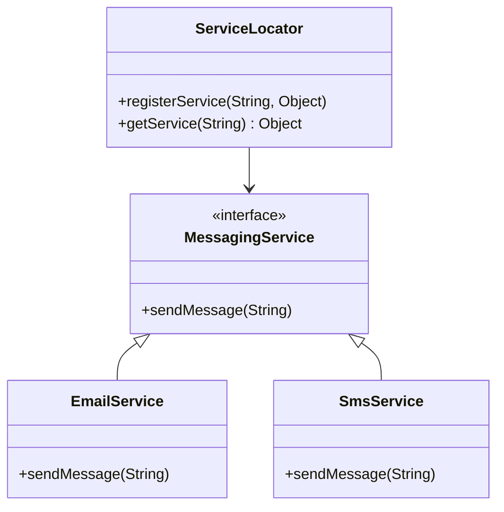

## 8.5.1 Implementing Service Locator in Java

In the realm of enterprise software development, managing dependencies and service lookups efficiently is crucial for building scalable and maintainable applications. The Service Locator pattern is a design pattern that provides a centralized registry to manage service access and lookup. This pattern is particularly useful in large-scale applications where services are numerous and may be distributed across different modules or even remote locations.

### Understanding the Service Locator Pattern

The Service Locator pattern is essentially a design pattern used to decouple the service consumers from the service providers. It acts as a central registry that maintains references to service instances, allowing clients to retrieve services without needing to know their specific implementations. This pattern can significantly reduce the complexity of managing dependencies in an application.

#### Key Concepts

- **Service Locator**: A central registry that holds references to service instances and provides methods to register and retrieve services.
- **Service Interface**: An abstraction that defines the contract for the service.
- **Service Implementation**: The concrete class that implements the service interface.
- **Caching**: The process of storing service instances in the locator to improve performance by avoiding repeated instantiation.

### Creating a Service Locator Class

Let's start by creating a basic Service Locator class in Java. This class will maintain a map of service names to service instances, allowing clients to register and retrieve services.

```java
import java.util.HashMap;
import java.util.Map;

public class ServiceLocator {
    private static Map<String, Object> services = new HashMap<>();

    // Register a service with the locator
    public static void registerService(String serviceName, Object service) {
        services.put(serviceName, service);
    }

    // Retrieve a service by name
    public static Object getService(String serviceName) {
        return services.get(serviceName);
    }
}
```

In this simple implementation, we use a `HashMap` to store service instances. The `registerService` method allows services to be registered with a unique name, while the `getService` method retrieves a service by its name.

### Using Caching to Improve Performance

Caching is an important aspect of the Service Locator pattern, as it can significantly improve performance by avoiding the overhead of creating service instances repeatedly. In our implementation, the `HashMap` acts as a cache by storing service instances.

#### Code Example: Registering and Retrieving Services

Let's demonstrate how to register and retrieve services using our Service Locator.

```java
public interface MessagingService {
    void sendMessage(String message);
}

public class EmailService implements MessagingService {
    @Override
    public void sendMessage(String message) {
        System.out.println("Email sent: " + message);
    }
}

public class SmsService implements MessagingService {
    @Override
    public void sendMessage(String message) {
        System.out.println("SMS sent: " + message);
    }
}

public class ServiceLocatorDemo {
    public static void main(String[] args) {
        // Register services
        ServiceLocator.registerService("emailService", new EmailService());
        ServiceLocator.registerService("smsService", new SmsService());

        // Retrieve and use services
        MessagingService emailService = (MessagingService) ServiceLocator.getService("emailService");
        emailService.sendMessage("Hello via Email!");

        MessagingService smsService = (MessagingService) ServiceLocator.getService("smsService");
        smsService.sendMessage("Hello via SMS!");
    }
}
```

In this example, we define a `MessagingService` interface and two implementations: `EmailService` and `SmsService`. We register these services with the Service Locator and then retrieve and use them in the `ServiceLocatorDemo` class.

### Handling Remote Services and Lazy Initialization

In some cases, services may be remote or require lazy initialization. The Service Locator pattern can accommodate these scenarios by deferring the creation of service instances until they are actually needed.

#### Lazy Initialization Example

```java
public class LazyServiceLocator {
    private static Map<String, Object> services = new HashMap<>();

    public static void registerService(String serviceName, Object service) {
        services.put(serviceName, service);
    }

    public static Object getService(String serviceName) {
        Object service = services.get(serviceName);
        if (service == null) {
            service = createService(serviceName);
            services.put(serviceName, service);
        }
        return service;
    }

    private static Object createService(String serviceName) {
        // Logic to create and return a new service instance
        System.out.println("Creating service: " + serviceName);
        if ("emailService".equals(serviceName)) {
            return new EmailService();
        } else if ("smsService".equals(serviceName)) {
            return new SmsService();
        }
        return null;
    }
}
```

In this implementation, the `getService` method checks if a service is already cached. If not, it calls `createService` to instantiate the service and cache it for future use. This approach ensures that services are only created when needed, which can be beneficial for resource-intensive services.

### Best Practices for Implementing the Service Locator Pattern

Implementing the Service Locator pattern effectively requires adherence to certain best practices:

1. **Ensure Thread Safety**: If the Service Locator is accessed by multiple threads, ensure that it is thread-safe. You can achieve this by using concurrent data structures or synchronizing access to the service map.

2. **Manage Service Lifecycle**: Properly manage the lifecycle of services, especially if they hold resources that need to be released. Consider implementing a shutdown or cleanup mechanism for services.

3. **Avoid Overuse**: While the Service Locator pattern can simplify service management, overusing it can lead to a less modular design. Use it judiciously and consider alternatives like Dependency Injection for better decoupling.

4. **Integration with Other Components**: Integrate the Service Locator with other components in the application, such as configuration management systems, to dynamically register services based on configuration.

### Thread Safety in Service Locator

To ensure thread safety, we can use a `ConcurrentHashMap` instead of a `HashMap`. This change allows the Service Locator to handle concurrent access without explicit synchronization.

```java
import java.util.concurrent.ConcurrentHashMap;
import java.util.concurrent.ConcurrentMap;

public class ThreadSafeServiceLocator {
    private static ConcurrentMap<String, Object> services = new ConcurrentHashMap<>();

    public static void registerService(String serviceName, Object service) {
        services.put(serviceName, service);
    }

    public static Object getService(String serviceName) {
        return services.get(serviceName);
    }
}
```

By using `ConcurrentHashMap`, we ensure that our Service Locator can safely handle concurrent access, making it suitable for multi-threaded applications.

### Managing Service Lifecycle

Managing the lifecycle of services is crucial, especially for services that hold resources like database connections or network sockets. Consider implementing a shutdown or cleanup method in your services and invoking it when the application shuts down.

```java
public interface LifecycleService {
    void start();
    void stop();
}

public class DatabaseService implements LifecycleService {
    @Override
    public void start() {
        System.out.println("DatabaseService started.");
    }

    @Override
    public void stop() {
        System.out.println("DatabaseService stopped.");
    }
}

public class ServiceLocatorWithLifecycle {
    private static ConcurrentMap<String, LifecycleService> services = new ConcurrentHashMap<>();

    public static void registerService(String serviceName, LifecycleService service) {
        services.put(serviceName, service);
        service.start();
    }

    public static LifecycleService getService(String serviceName) {
        return services.get(serviceName);
    }

    public static void shutdown() {
        for (LifecycleService service : services.values()) {
            service.stop();
        }
    }
}
```

In this example, we define a `LifecycleService` interface with `start` and `stop` methods. The `ServiceLocatorWithLifecycle` class manages the lifecycle of services by starting them upon registration and stopping them during shutdown.

### Integrating Service Locator with Other Components

Integrating the Service Locator with other components, such as configuration management systems, can enhance its flexibility. For instance, you can dynamically register services based on configuration files or environment variables.

```java
import java.util.Properties;
import java.io.InputStream;
import java.io.IOException;

public class ConfigurableServiceLocator {
    private static ConcurrentMap<String, Object> services = new ConcurrentHashMap<>();

    static {
        try (InputStream input = ConfigurableServiceLocator.class.getClassLoader().getResourceAsStream("services.properties")) {
            Properties prop = new Properties();
            if (input == null) {
                System.out.println("Sorry, unable to find services.properties");
                return;
            }
            prop.load(input);
            for (String serviceName : prop.stringPropertyNames()) {
                String serviceClass = prop.getProperty(serviceName);
                Class<?> clazz = Class.forName(serviceClass);
                Object service = clazz.getDeclaredConstructor().newInstance();
                registerService(serviceName, service);
            }
        } catch (IOException | ReflectiveOperationException ex) {
            ex.printStackTrace();
        }
    }

    public static void registerService(String serviceName, Object service) {
        services.put(serviceName, service);
    }

    public static Object getService(String serviceName) {
        return services.get(serviceName);
    }
}
```

In this implementation, we use a properties file (`services.properties`) to configure services. The `ConfigurableServiceLocator` class reads the configuration and dynamically registers services using reflection.

### Visualizing the Service Locator Pattern

To better understand the flow and interaction in the Service Locator pattern, let's visualize it using a class diagram.



**Diagram Description**: This class diagram illustrates the relationship between the `ServiceLocator`, `MessagingService` interface, and its implementations (`EmailService` and `SmsService`). The `ServiceLocator` maintains references to service instances and provides methods to register and retrieve them.

### Try It Yourself

To deepen your understanding of the Service Locator pattern, try modifying the code examples:

- **Add a New Service**: Implement a new service class, register it with the Service Locator, and retrieve it in the `ServiceLocatorDemo` class.
- **Implement Lazy Initialization**: Modify the `LazyServiceLocator` to support lazy initialization for the new service.
- **Ensure Thread Safety**: Convert the `ServiceLocator` to use `ConcurrentHashMap` and test it in a multi-threaded environment.
- **Integrate with Configuration**: Create a configuration file to dynamically register services using the `ConfigurableServiceLocator`.

### Knowledge Check

- **What is the primary purpose of the Service Locator pattern?**
- **How does caching improve the performance of a Service Locator?**
- **Why is thread safety important in a Service Locator?**
- **What are the benefits of integrating a Service Locator with configuration management systems?**

### Conclusion

The Service Locator pattern is a powerful tool for managing service dependencies in large-scale Java applications. By centralizing service access and lookup, it simplifies the management of dependencies and enhances the modularity of the application. However, it is important to implement it with care, considering aspects like thread safety, service lifecycle management, and integration with other components.

Remember, the Service Locator pattern is just one of many design patterns available to Java developers. As you continue your journey in software development, explore other patterns and techniques to build robust and maintainable applications.

## Quiz Time!



### What is the primary purpose of the Service Locator pattern?

- [x] To centralize service access and lookup
- [ ] To manage database connections
- [ ] To handle user authentication
- [ ] To optimize network communication

> **Explanation:** The Service Locator pattern centralizes service access and lookup, making it easier to manage dependencies.

### How does caching improve the performance of a Service Locator?

- [x] By avoiding repeated instantiation of services
- [ ] By reducing network latency
- [ ] By compressing data
- [ ] By increasing CPU usage

> **Explanation:** Caching stores service instances, avoiding the overhead of creating them repeatedly, which improves performance.

### Why is thread safety important in a Service Locator?

- [x] Because it may be accessed by multiple threads simultaneously
- [ ] Because it needs to encrypt data
- [ ] Because it handles user input
- [ ] Because it manages file I/O

> **Explanation:** Thread safety is crucial if the Service Locator is accessed by multiple threads to prevent data corruption.

### What is lazy initialization in the context of a Service Locator?

- [x] Deferring the creation of service instances until they are needed
- [ ] Creating all services at application startup
- [ ] Using a database to store services
- [ ] Encrypting service data

> **Explanation:** Lazy initialization defers the creation of service instances until they are actually needed, saving resources.

### What is a potential downside of overusing the Service Locator pattern?

- [x] It can lead to a less modular design
- [ ] It increases network traffic
- [ ] It requires more memory
- [ ] It complicates user interfaces

> **Explanation:** Overusing the Service Locator can lead to a less modular design by tightly coupling components to the locator.

### How can a Service Locator be integrated with configuration management systems?

- [x] By dynamically registering services based on configuration files
- [ ] By storing configurations in a database
- [ ] By using XML files exclusively
- [ ] By hardcoding service instances

> **Explanation:** Integrating with configuration management systems allows services to be registered dynamically based on configuration files.

### What is the role of the `LifecycleService` interface in the example?

- [x] To manage the start and stop lifecycle of services
- [ ] To encrypt service data
- [ ] To handle user authentication
- [ ] To manage network connections

> **Explanation:** The `LifecycleService` interface defines methods to manage the start and stop lifecycle of services.

### What is the benefit of using `ConcurrentHashMap` in a Service Locator?

- [x] It ensures thread-safe access to services
- [ ] It compresses data
- [ ] It increases memory usage
- [ ] It simplifies user interfaces

> **Explanation:** `ConcurrentHashMap` ensures thread-safe access to services, making the Service Locator suitable for multi-threaded applications.

### What is the advantage of using reflection in the `ConfigurableServiceLocator`?

- [x] It allows dynamic instantiation of services based on configuration
- [ ] It encrypts service data
- [ ] It simplifies user interfaces
- [ ] It increases network traffic

> **Explanation:** Reflection allows dynamic instantiation of services based on configuration, enhancing flexibility.

### True or False: The Service Locator pattern is always the best choice for managing dependencies in Java applications.

- [ ] True
- [x] False

> **Explanation:** The Service Locator pattern is not always the best choice; alternatives like Dependency Injection may offer better decoupling.


