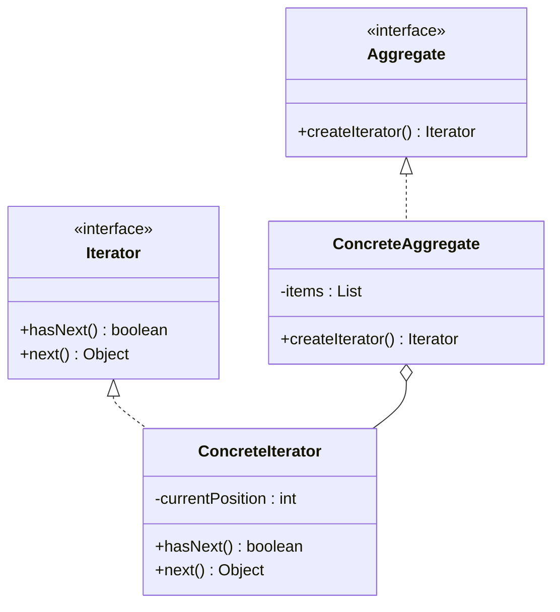

## 8.5.1 Implementing Iterator in Java

The **Iterator pattern** is a fundamental behavioral design pattern that provides a way to access the elements of an aggregate object sequentially without exposing its underlying representation. This pattern is particularly useful in scenarios where you need to traverse collections of objects, such as lists, trees, or graphs, in a consistent manner. In this section, we will delve into the implementation of the Iterator pattern in Java, exploring its intent, structure, and practical applications.

### Intent and Benefits of the Iterator Pattern

The primary intent of the Iterator pattern is to separate the traversal logic from the collection itself, thereby promoting encapsulation and reducing the complexity of the collection classes. By using iterators, you can:

- **Encapsulate the internal structure** of the collection, allowing changes without affecting client code.
- **Provide a uniform interface** for traversing different types of collections.
- **Support multiple traversal algorithms** without modifying the collection classes.
- **Simplify client code** by abstracting the traversal logic.

### Participants in the Iterator Pattern

The Iterator pattern involves several key participants:

1. **Iterator Interface**: Defines the interface for accessing and traversing elements.
2. **ConcreteIterator**: Implements the Iterator interface and maintains the current position in the traversal.
3. **Aggregate Interface**: Defines the interface for creating an Iterator object.
4. **ConcreteAggregate**: Implements the Aggregate interface and returns an instance of the ConcreteIterator.

### UML Diagram of the Iterator Pattern

The following UML diagram illustrates the structure of the Iterator pattern:



**Diagram Explanation**: The diagram shows the relationships between the Iterator interface, ConcreteIterator, Aggregate interface, and ConcreteAggregate. The ConcreteAggregate class creates an instance of ConcreteIterator to traverse its elements.

### Implementing Custom Iterators in Java

Java provides built-in `java.util.Iterator` and `Iterable` interfaces, which are widely used in the Java Collections Framework. However, there are scenarios where you might need to implement custom iterators for your specific data structures. Let's explore how to implement a custom iterator in Java.

#### Step-by-Step Implementation

1. **Define the Iterator Interface**: Create an interface that defines the methods for traversing elements.

```java
public interface Iterator<T> {
    boolean hasNext();
    T next();
}
```

2. **Implement the ConcreteIterator**: Create a class that implements the Iterator interface and maintains the current position.

```java
import java.util.List;

public class ConcreteIterator<T> implements Iterator<T> {
    private List<T> items;
    private int position = 0;

    public ConcreteIterator(List<T> items) {
        this.items = items;
    }

    @Override
    public boolean hasNext() {
        return position < items.size();
    }

    @Override
    public T next() {
        if (!hasNext()) {
            throw new NoSuchElementException();
        }
        return items.get(position++);
    }
}
```

3. **Define the Aggregate Interface**: Create an interface for creating an iterator.

```java
public interface Aggregate<T> {
    Iterator<T> createIterator();
}
```

4. **Implement the ConcreteAggregate**: Create a class that implements the Aggregate interface and returns an instance of ConcreteIterator.

```java
import java.util.ArrayList;
import java.util.List;

public class ConcreteAggregate<T> implements Aggregate<T> {
    private List<T> items = new ArrayList<>();

    public void addItem(T item) {
        items.add(item);
    }

    @Override
    public Iterator<T> createIterator() {
        return new ConcreteIterator<>(items);
    }
}
```

5. **Using the Iterator**: Demonstrate how to use the custom iterator to traverse elements.

```java
public class IteratorDemo {
    public static void main(String[] args) {
        ConcreteAggregate<String> aggregate = new ConcreteAggregate<>();
        aggregate.addItem("Item 1");
        aggregate.addItem("Item 2");
        aggregate.addItem("Item 3");

        Iterator<String> iterator = aggregate.createIterator();
        while (iterator.hasNext()) {
            System.out.println(iterator.next());
        }
    }
}
```

### Java's Built-in Iterator and Iterable Interfaces

Java provides the `java.util.Iterator` and `java.lang.Iterable` interfaces, which are integral to the Java Collections Framework. The `Iterator` interface includes methods such as `hasNext()`, `next()`, and `remove()`, while the `Iterable` interface requires the implementation of the `iterator()` method, allowing collections to be used in enhanced for-loops.

#### Example Using Java's Built-in Interfaces

```java
import java.util.ArrayList;
import java.util.Iterator;
import java.util.List;

public class JavaIteratorExample {
    public static void main(String[] args) {
        List<String> list = new ArrayList<>();
        list.add("Element 1");
        list.add("Element 2");
        list.add("Element 3");

        Iterator<String> iterator = list.iterator();
        while (iterator.hasNext()) {
            System.out.println(iterator.next());
        }
    }
}
```

### Promoting Encapsulation with the Iterator Pattern

The Iterator pattern promotes encapsulation by hiding the internal structure of the collection from the client. This allows the collection to change its internal representation without affecting the client code. By using iterators, you can also implement different traversal algorithms without modifying the collection classes, further enhancing flexibility and maintainability.

### Practical Applications and Real-World Scenarios

The Iterator pattern is widely used in various real-world scenarios, including:

- **Navigating through complex data structures** such as trees and graphs.
- **Implementing custom collections** that require specific traversal logic.
- **Providing a consistent interface** for traversing different types of collections in libraries and frameworks.

### Conclusion

The Iterator pattern is a powerful tool for managing the traversal of collections in Java. By implementing custom iterators, you can encapsulate the internal structure of your collections, promote flexibility, and simplify client code. Whether using Java's built-in interfaces or creating your own, the Iterator pattern is an essential component of robust and maintainable software design.

### Related Patterns

- **[Composite Pattern]( "Composite Pattern")**: Often used in conjunction with the Iterator pattern to traverse complex hierarchical structures.
- **[Visitor Pattern]( "Visitor Pattern")**: Can be combined with the Iterator pattern to perform operations on elements of an object structure.

### Known Uses

- **Java Collections Framework**: The `Iterator` and `Iterable` interfaces are extensively used in the Java Collections Framework.
- **Apache Commons Collections**: Provides additional iterator implementations for enhanced functionality.

## Test Your Knowledge: Iterator Pattern in Java Quiz



### What is the primary intent of the Iterator pattern?

- [x] To provide a way to access elements of an aggregate object sequentially without exposing its underlying representation.
- [ ] To allow multiple objects to be treated as a single object.
- [ ] To define a family of algorithms and make them interchangeable.
- [ ] To separate the construction of a complex object from its representation.

> **Explanation:** The Iterator pattern's primary intent is to provide a way to access elements of an aggregate object sequentially without exposing its underlying representation.

### Which interface in Java is used to create custom iterators?

- [x] Iterator
- [ ] Iterable
- [ ] Collection
- [ ] List

> **Explanation:** The `Iterator` interface in Java is used to create custom iterators, providing methods like `hasNext()` and `next()`.

### What method must be implemented when using the Iterable interface?

- [x] iterator()
- [ ] hasNext()
- [ ] next()
- [ ] remove()

> **Explanation:** The `iterator()` method must be implemented when using the `Iterable` interface, allowing the object to be used in enhanced for-loops.

### How does the Iterator pattern promote encapsulation?

- [x] By hiding the internal structure of the collection from the client.
- [ ] By allowing multiple objects to be treated as a single object.
- [ ] By defining a family of algorithms and making them interchangeable.
- [ ] By separating the construction of a complex object from its representation.

> **Explanation:** The Iterator pattern promotes encapsulation by hiding the internal structure of the collection from the client, allowing changes without affecting client code.

### Which of the following is a benefit of using the Iterator pattern?

- [x] It provides a uniform interface for traversing different types of collections.
- [ ] It allows multiple objects to be treated as a single object.
- [ ] It defines a family of algorithms and makes them interchangeable.
- [ ] It separates the construction of a complex object from its representation.

> **Explanation:** The Iterator pattern provides a uniform interface for traversing different types of collections, simplifying client code.

### What is the role of the ConcreteIterator in the Iterator pattern?

- [x] It implements the Iterator interface and maintains the current position in the traversal.
- [ ] It defines the interface for creating an Iterator object.
- [ ] It implements the Aggregate interface and returns an instance of the ConcreteIterator.
- [ ] It provides a way to access elements of an aggregate object sequentially.

> **Explanation:** The ConcreteIterator implements the Iterator interface and maintains the current position in the traversal.

### Which method in the Iterator interface is used to check if there are more elements to traverse?

- [x] hasNext()
- [ ] next()
- [ ] remove()
- [ ] iterator()

> **Explanation:** The `hasNext()` method in the Iterator interface is used to check if there are more elements to traverse.

### What is the primary difference between the Iterator and Iterable interfaces?

- [x] Iterator is used to traverse elements, while Iterable is used to create an Iterator.
- [ ] Iterable is used to traverse elements, while Iterator is used to create an Iterable.
- [ ] Both are used to traverse elements, but Iterable is more efficient.
- [ ] Both are used to create iterators, but Iterator is more efficient.

> **Explanation:** The primary difference is that the Iterator interface is used to traverse elements, while the Iterable interface is used to create an Iterator.

### Which pattern is often used in conjunction with the Iterator pattern to traverse complex hierarchical structures?

- [x] Composite Pattern
- [ ] Singleton Pattern
- [ ] Factory Pattern
- [ ] Observer Pattern

> **Explanation:** The Composite Pattern is often used in conjunction with the Iterator pattern to traverse complex hierarchical structures.

### True or False: The Iterator pattern allows for multiple traversal algorithms without modifying the collection classes.

- [x] True
- [ ] False

> **Explanation:** True. The Iterator pattern allows for multiple traversal algorithms without modifying the collection classes, enhancing flexibility.



By understanding and implementing the Iterator pattern, Java developers can create more flexible and maintainable applications, leveraging the power of encapsulation and abstraction to manage complex data structures effectively.
