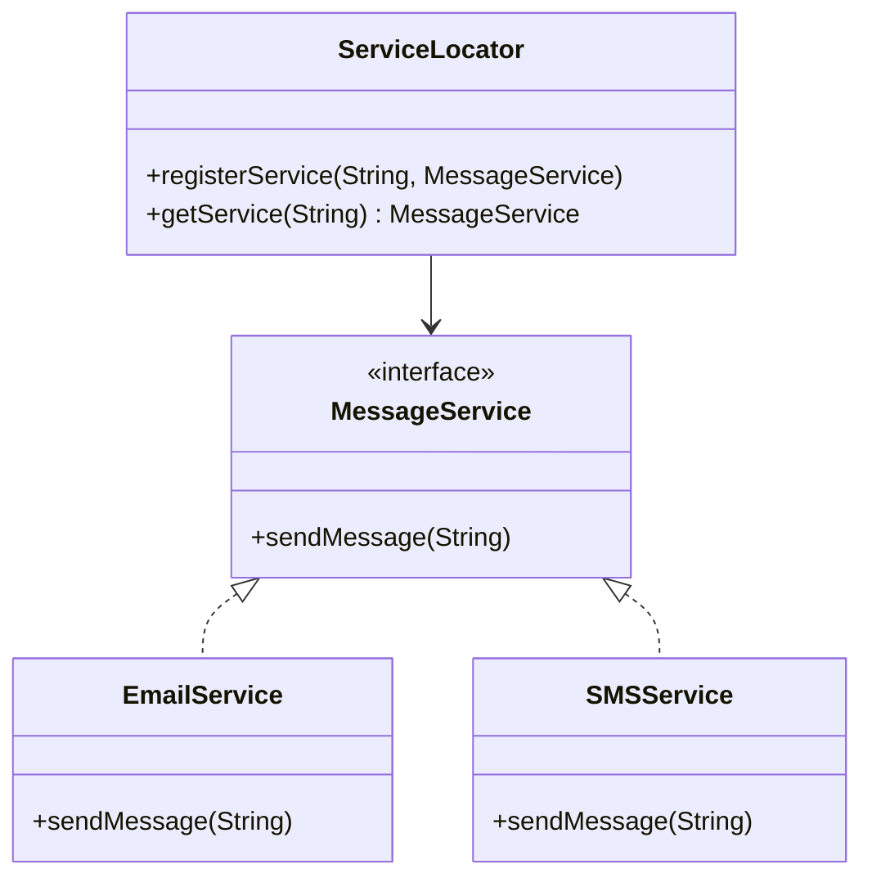

## 8.5.2 Reducing Dependency Overhead

In modern software development, managing dependencies efficiently is crucial for creating maintainable and scalable applications. The Service Locator pattern offers a solution by providing a centralized registry for service access, reducing the overhead associated with dependency management. In this section, we will delve into how the Service Locator pattern simplifies access to services, its benefits, potential drawbacks, and strategies to mitigate these challenges.

### Understanding the Service Locator Pattern

The Service Locator pattern is a design pattern used to decouple the service consumer from the service provider. It acts as a central registry that provides a way to obtain service instances without having direct dependencies injected into the consumer. This pattern is particularly useful in scenarios where dependency injection (DI) might be cumbersome or impractical.

#### Key Concepts

- **Centralized Access**: The Service Locator provides a single point of access for obtaining services, which can simplify the architecture by reducing the need for direct dependency injection.
- **Decoupling**: By using a locator, components do not need to know about the concrete implementation of the services they use, thus reducing coupling.
- **Flexibility**: The pattern allows for easy swapping of service implementations without affecting the consumers.

### Implementing the Service Locator Pattern in Java

Let's explore how to implement the Service Locator pattern in Java with a practical example. We'll create a simple application that demonstrates how to use the pattern to manage service dependencies.

#### Step-by-Step Implementation

1. **Define Service Interfaces**

   Start by defining interfaces for the services you want to manage. This allows for flexibility and easy swapping of implementations.

   ```java
   public interface MessageService {
       void sendMessage(String message);
   }
   ```

2. **Create Service Implementations**

   Implement the service interfaces. You can have multiple implementations for different purposes.

   ```java
   public class EmailService implements MessageService {
       @Override
       public void sendMessage(String message) {
           System.out.println("Email sent: " + message);
       }
   }

   public class SMSService implements MessageService {
       @Override
       public void sendMessage(String message) {
           System.out.println("SMS sent: " + message);
       }
   }
   ```

3. **Implement the Service Locator**

   The Service Locator will manage the registration and retrieval of services.

   ```java
   import java.util.HashMap;
   import java.util.Map;

   public class ServiceLocator {
       private static Map<String, MessageService> services = new HashMap<>();

       public static void registerService(String key, MessageService service) {
           services.put(key, service);
       }

       public static MessageService getService(String key) {
           return services.get(key);
       }
   }
   ```

4. **Register Services**

   Register the service implementations with the Service Locator.

   ```java
   public class ServiceLocatorDemo {
       public static void main(String[] args) {
           ServiceLocator.registerService("email", new EmailService());
           ServiceLocator.registerService("sms", new SMSService());

           MessageService emailService = ServiceLocator.getService("email");
           emailService.sendMessage("Hello via Email!");

           MessageService smsService = ServiceLocator.getService("sms");
           smsService.sendMessage("Hello via SMS!");
       }
   }
   ```

### Benefits of Using the Service Locator Pattern

#### Simplified Dependency Management

By centralizing service access, the Service Locator pattern reduces the complexity of managing dependencies across the application. Components can obtain the services they need without requiring them to be injected directly, which simplifies the codebase and reduces the need for extensive configuration.

#### Reduced Coupling

The pattern decouples the service consumer from the service provider, allowing for greater flexibility and easier maintenance. Changes to service implementations do not require changes to the consumers, as long as the interface remains consistent.

#### Flexibility and Extensibility

The Service Locator pattern allows for easy swapping of service implementations. This is particularly useful in scenarios where different environments or configurations require different service implementations. For example, you might use a mock service for testing and a real service for production.

### Trade-offs and Challenges

While the Service Locator pattern offers several benefits, it also comes with trade-offs that need to be considered.

#### Hidden Dependencies

One of the main criticisms of the Service Locator pattern is that it can lead to hidden dependencies. Since services are obtained from a global registry, it can be difficult to track which components depend on which services, leading to potential maintenance challenges.

#### Testing Challenges

The global nature of the Service Locator can make testing more difficult. Since services are accessed through a central registry, it can be challenging to isolate components for unit testing. This can be mitigated by using interfaces and mock implementations, but it requires careful design.

#### Potential for Misuse

The Service Locator pattern can be misused if not implemented correctly. For example, if the locator becomes a dumping ground for all services, it can lead to a monolithic design that is difficult to manage and maintain.

### Strategies for Mitigating Drawbacks

To address the challenges associated with the Service Locator pattern, consider the following strategies:

#### Use Interfaces

Always define service interfaces and register implementations with the Service Locator. This allows for easy swapping of implementations and facilitates testing with mock services.

#### Proper Encapsulation

Encapsulate the Service Locator within a well-defined boundary. Avoid exposing it directly to all components. Instead, provide access through a controlled interface that limits what services can be accessed and how.

#### Limit Global Access

Restrict the use of the Service Locator to specific layers or components within the application. This can help reduce the risk of hidden dependencies and make the architecture more manageable.

#### Combine with Dependency Injection

Consider using the Service Locator pattern in conjunction with dependency injection. For example, use DI for critical dependencies and the Service Locator for optional or environment-specific services.

### Visualizing the Service Locator Pattern

To better understand the flow and structure of the Service Locator pattern, let's visualize it using a class diagram.



**Diagram Description**: This class diagram illustrates the Service Locator pattern. The `ServiceLocator` class manages the registration and retrieval of `MessageService` implementations. `EmailService` and `SMSService` are concrete implementations of the `MessageService` interface.

### Try It Yourself

Experiment with the Service Locator pattern by modifying the code examples. Here are a few suggestions:

- **Add a New Service**: Implement a new service, such as `PushNotificationService`, and register it with the Service Locator.
- **Swap Implementations**: Change the implementation of a registered service and observe how it affects the application.
- **Test with Mocks**: Create a mock implementation of `MessageService` and use it for testing.

### References and Further Reading

- [Service Locator Pattern on Wikipedia](https://en.wikipedia.org/wiki/Service_locator_pattern)
- [Martin Fowler's Inversion of Control Containers and the Dependency Injection pattern](https://martinfowler.com/articles/injection.html)
- [Java Design Patterns](https://java-design-patterns.com/patterns/service-locator/)

### Knowledge Check

To reinforce your understanding of the Service Locator pattern, consider the following questions:

- How does the Service Locator pattern reduce dependency overhead?
- What are the potential drawbacks of using the Service Locator pattern?
- How can you mitigate the challenges associated with hidden dependencies?

### Embrace the Journey

Remember, the Service Locator pattern is just one tool in your software design toolkit. As you continue to explore design patterns, consider how they can be combined and adapted to suit your specific needs. Keep experimenting, stay curious, and enjoy the journey of mastering design patterns in Java!

## Quiz Time!



### What is the primary benefit of using the Service Locator pattern?

- [x] Simplified dependency management
- [ ] Increased coupling between components
- [ ] Direct injection of dependencies
- [ ] Reduced flexibility in service implementation

> **Explanation:** The Service Locator pattern simplifies dependency management by providing a centralized registry for service access, reducing the need for direct injection.

### How does the Service Locator pattern reduce coupling between components?

- [x] By decoupling service consumers from service providers
- [ ] By increasing the number of dependencies
- [ ] By requiring direct injection of all services
- [ ] By making all services globally accessible

> **Explanation:** The pattern decouples service consumers from service providers, allowing for greater flexibility and easier maintenance.

### What is a potential drawback of the Service Locator pattern?

- [x] Hidden dependencies
- [ ] Increased testability
- [ ] Simplified architecture
- [ ] Reduced flexibility

> **Explanation:** The Service Locator pattern can lead to hidden dependencies, making it difficult to track which components depend on which services.

### How can you mitigate the testing challenges associated with the Service Locator pattern?

- [x] Use interfaces and mock implementations
- [ ] Avoid using interfaces
- [ ] Expose the Service Locator globally
- [ ] Directly inject all dependencies

> **Explanation:** Using interfaces and mock implementations can help mitigate testing challenges by allowing for easier isolation of components.

### What is a strategy to reduce the risk of hidden dependencies in the Service Locator pattern?

- [x] Limit global access to the Service Locator
- [ ] Expose the Service Locator to all components
- [ ] Avoid using interfaces
- [ ] Register all services globally

> **Explanation:** Limiting global access to the Service Locator can help reduce the risk of hidden dependencies and make the architecture more manageable.

### Which of the following is NOT a benefit of the Service Locator pattern?

- [ ] Simplified dependency management
- [ ] Reduced coupling
- [x] Increased direct injection
- [ ] Flexibility in swapping implementations

> **Explanation:** The Service Locator pattern does not increase direct injection; instead, it provides a centralized registry for service access.

### How can the Service Locator pattern be combined with dependency injection?

- [x] Use DI for critical dependencies and the Service Locator for optional services
- [ ] Avoid using DI altogether
- [ ] Use the Service Locator for all dependencies
- [ ] Directly inject all services

> **Explanation:** Combining DI for critical dependencies and the Service Locator for optional services can provide a balanced approach to dependency management.

### What is a common misuse of the Service Locator pattern?

- [x] Using it as a dumping ground for all services
- [ ] Limiting its use to specific layers
- [ ] Encapsulating it within a well-defined boundary
- [ ] Using interfaces for service registration

> **Explanation:** Using the Service Locator as a dumping ground for all services can lead to a monolithic design that is difficult to manage.

### What is the role of interfaces in the Service Locator pattern?

- [x] They allow for easy swapping of implementations
- [ ] They increase coupling between components
- [ ] They require direct injection of dependencies
- [ ] They reduce flexibility

> **Explanation:** Interfaces allow for easy swapping of implementations and facilitate testing with mock services.

### True or False: The Service Locator pattern always improves testability.

- [ ] True
- [x] False

> **Explanation:** The Service Locator pattern can make testing more difficult due to its global nature, but using interfaces and mock implementations can help mitigate this challenge.


