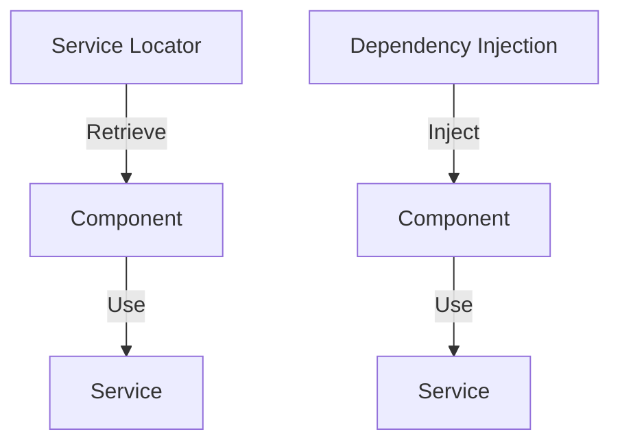

## 8.5.3 Service Locator vs. Dependency Injection

In the realm of software engineering, particularly when dealing with Java, the choice of design patterns can significantly influence the maintainability, scalability, and testability of an application. Two such patterns that often come under scrutiny are the **Service Locator** and **Dependency Injection** patterns. Both serve the purpose of managing dependencies within an application, but they do so in fundamentally different ways. This section delves into these differences, compares their pros and cons, and provides guidance on when to use each pattern.

### Understanding the Basics

#### Service Locator Pattern

The Service Locator pattern involves a central registry, known as the service locator, which holds references to various services. Components within the application actively retrieve their dependencies from this registry. This pattern centralizes the management of dependencies, making it easier to locate and manage services.

**Key Characteristics:**

- **Centralized Access**: All services are registered in a central location.
- **Active Retrieval**: Components request their dependencies from the service locator.
- **Global State**: The service locator often acts as a global state, which can be accessed from anywhere in the application.

#### Dependency Injection Pattern

Dependency Injection (DI) is a pattern where dependencies are provided to a component externally, rather than the component creating them itself. This is often managed by a DI framework, which injects the required dependencies into components at runtime.

**Key Characteristics:**

- **External Provision**: Dependencies are injected into components, rather than being requested.
- **Inversion of Control**: The control of dependency creation and management is inverted from the component to the framework.
- **Explicit Dependencies**: Dependencies are clearly defined and provided, enhancing readability and testability.

### Comparing Service Locator and Dependency Injection

#### Fundamental Differences

- **Dependency Retrieval**: In Service Locator, components actively retrieve dependencies, whereas in Dependency Injection, dependencies are passively received.
- **Control and Management**: Service Locator centralizes control in a registry, while Dependency Injection decentralizes it through external provisioning.
- **Visibility of Dependencies**: Dependency Injection makes dependencies explicit, improving code clarity, while Service Locator can obscure them, leading to hidden dependencies.

#### Pros and Cons

**Service Locator Pros:**

- **Centralized Management**: Easy to manage and locate services.
- **Flexibility**: Can dynamically change service implementations at runtime.
- **Simplicity**: Straightforward to implement without additional frameworks.

**Service Locator Cons:**

- **Global State**: Can lead to issues with global state management.
- **Hidden Dependencies**: Dependencies are not explicit, making the code harder to understand and test.
- **Tight Coupling**: Components are tightly coupled to the service locator.

**Dependency Injection Pros:**

- **Explicit Dependencies**: Enhances code readability and maintainability.
- **Testability**: Easier to test components in isolation due to clear dependencies.
- **Loose Coupling**: Components are loosely coupled, promoting modularity.

**Dependency Injection Cons:**

- **Complexity**: Can introduce complexity, especially in large applications.
- **Framework Dependency**: Often relies on external frameworks, which can add overhead.
- **Initial Setup**: Requires initial setup and configuration, which can be time-consuming.

### Code Examples

Let's explore how both patterns can be implemented in a simple Java application scenario.

#### Service Locator Example

```java
// Service interface
public interface MessagingService {
    void sendMessage(String message);
}

// Concrete service implementation
public class EmailService implements MessagingService {
    @Override
    public void sendMessage(String message) {
        System.out.println("Email sent: " + message);
    }
}

// Service Locator
public class ServiceLocator {
    private static Map<String, MessagingService> services = new HashMap<>();

    public static void registerService(String key, MessagingService service) {
        services.put(key, service);
    }

    public static MessagingService getService(String key) {
        return services.get(key);
    }
}

// Client code
public class Client {
    public static void main(String[] args) {
        // Registering service
        ServiceLocator.registerService("email", new EmailService());

        // Retrieving and using service
        MessagingService service = ServiceLocator.getService("email");
        service.sendMessage("Hello, World!");
    }
}
```

#### Dependency Injection Example

Using a simple DI framework like Spring, we can achieve the same functionality with Dependency Injection.

```java
// Service interface
public interface MessagingService {
    void sendMessage(String message);
}

// Concrete service implementation
public class EmailService implements MessagingService {
    @Override
    public void sendMessage(String message) {
        System.out.println("Email sent: " + message);
    }
}

// Client code with DI
public class Client {
    private MessagingService messagingService;

    // Constructor injection
    public Client(MessagingService messagingService) {
        this.messagingService = messagingService;
    }

    public void send(String message) {
        messagingService.sendMessage(message);
    }

    public static void main(String[] args) {
        // Using a DI framework like Spring to inject dependencies
        ApplicationContext context = new AnnotationConfigApplicationContext(AppConfig.class);
        Client client = context.getBean(Client.class);
        client.send("Hello, World!");
    }
}

// Configuration class for DI
@Configuration
public class AppConfig {
    @Bean
    public MessagingService emailService() {
        return new EmailService();
    }

    @Bean
    public Client client() {
        return new Client(emailService());
    }
}
```

### Visualizing the Differences

To better understand the differences between Service Locator and Dependency Injection, let's visualize how they operate.



**Diagram Explanation:**

- **Service Locator**: The component actively retrieves the service from the service locator.
- **Dependency Injection**: The service is injected into the component, which then uses it.

### Choosing Between Service Locator and Dependency Injection

The choice between Service Locator and Dependency Injection often depends on several factors:

- **Project Size and Complexity**: For smaller projects, Service Locator might be sufficient due to its simplicity. However, for larger, more complex projects, Dependency Injection is often preferred for its scalability and maintainability.
- **Team Preferences and Expertise**: Teams familiar with DI frameworks like Spring may prefer Dependency Injection, while others might opt for the simplicity of Service Locator.
- **Testing Requirements**: If testability is a priority, Dependency Injection is generally more favorable due to its explicit dependencies.
- **Performance Considerations**: Service Locator can sometimes offer better performance due to its simplicity, but at the cost of maintainability and testability.

### Critical Evaluation

When evaluating which pattern to use, consider the following:

- **Understand the Trade-offs**: Each pattern has its strengths and weaknesses. Understanding these can help make an informed decision.
- **Consider Future Maintenance**: Think about how easy it will be to maintain and extend the application in the future.
- **Evaluate Framework Dependencies**: Dependency Injection often involves using frameworks, which can add complexity and dependencies.

### Try It Yourself

Experiment with the code examples provided. Try modifying the Service Locator to handle multiple types of services or implement a different DI framework. This hands-on approach will deepen your understanding of both patterns.

### References and Further Reading

- [Service Locator Pattern](https://martinfowler.com/articles/injection.html#UsingAServiceLocator)
- [Dependency Injection](https://spring.io/guides/gs/constructor-injection/)
- [Java Design Patterns](https://www.oracle.com/technical-resources/articles/java/javadesignpatterns.html)

### Knowledge Check

- **What are the main differences between Service Locator and Dependency Injection?**
- **How does Dependency Injection improve testability?**
- **What are the potential drawbacks of using a Service Locator?**

### Embrace the Journey

Remember, choosing the right design pattern is a journey. As you gain experience, you'll develop an intuition for which patterns suit different scenarios. Keep experimenting, stay curious, and enjoy the process of crafting elegant and maintainable software solutions.

## Quiz Time!



### What is a key characteristic of the Service Locator pattern?

- [x] Centralized access to services
- [ ] Dependencies are injected externally
- [ ] Promotes loose coupling
- [ ] Requires a DI framework

> **Explanation:** The Service Locator pattern involves a central registry where services are accessed, making it a centralized access point.

### How does Dependency Injection improve testability?

- [x] By making dependencies explicit
- [ ] By centralizing service access
- [ ] By hiding dependencies
- [ ] By reducing the need for frameworks

> **Explanation:** Dependency Injection makes dependencies explicit, which allows for easier testing of components in isolation.

### What is a disadvantage of using the Service Locator pattern?

- [x] It can lead to hidden dependencies
- [ ] It requires a DI framework
- [ ] It makes dependencies explicit
- [ ] It promotes loose coupling

> **Explanation:** The Service Locator pattern can obscure dependencies, making them hidden and harder to manage.

### Which pattern typically requires a framework for implementation?

- [ ] Service Locator
- [x] Dependency Injection
- [ ] Both
- [ ] Neither

> **Explanation:** Dependency Injection often involves using frameworks like Spring to manage the injection of dependencies.

### What is a benefit of using Dependency Injection over Service Locator?

- [x] Promotes loose coupling
- [ ] Centralizes service access
- [ ] Requires less setup
- [ ] Hides dependencies

> **Explanation:** Dependency Injection promotes loose coupling by providing dependencies externally, making components more modular.

### In which scenario might Service Locator be more suitable than Dependency Injection?

- [x] In small, simple projects
- [ ] In large, complex applications
- [ ] When testability is a priority
- [ ] When using a DI framework

> **Explanation:** Service Locator can be more suitable for small, simple projects due to its straightforward implementation.

### What is a common issue with global state in Service Locator?

- [x] It can lead to tight coupling
- [ ] It makes dependencies explicit
- [ ] It enhances testability
- [ ] It simplifies maintenance

> **Explanation:** Global state in Service Locator can lead to tight coupling between components and the service locator.

### Which pattern is often associated with the term "Inversion of Control"?

- [ ] Service Locator
- [x] Dependency Injection
- [ ] Both
- [ ] Neither

> **Explanation:** Dependency Injection is associated with Inversion of Control, where the control of dependency management is inverted to a framework.

### What is a potential drawback of Dependency Injection?

- [x] It can introduce complexity
- [ ] It centralizes service access
- [ ] It hides dependencies
- [ ] It requires a service registry

> **Explanation:** Dependency Injection can introduce complexity, especially in large applications with many dependencies.

### True or False: Service Locator and Dependency Injection are interchangeable patterns.

- [ ] True
- [x] False

> **Explanation:** Service Locator and Dependency Injection are not interchangeable; they have different approaches and use cases for managing dependencies.


