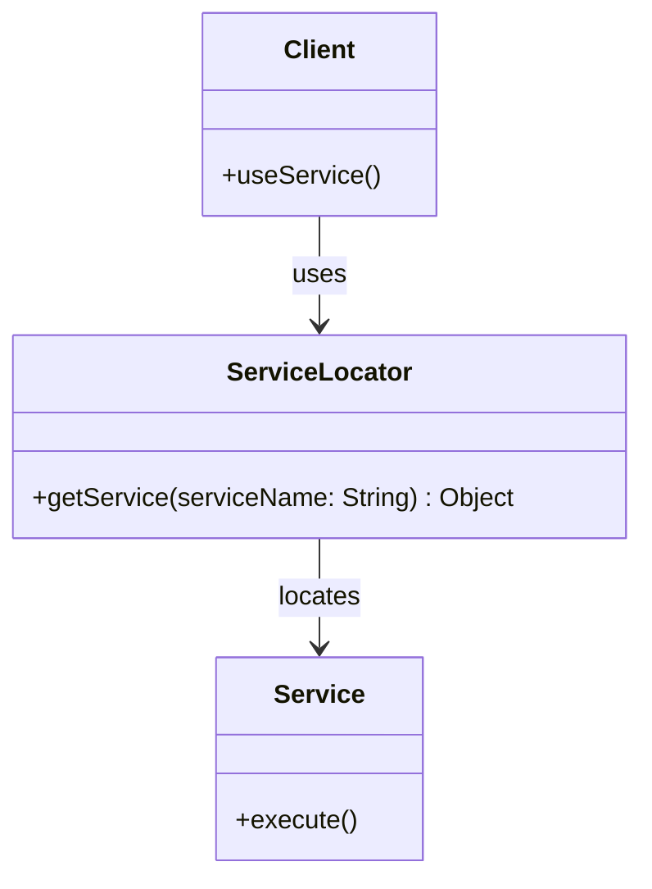

## 8.5.4 Use Cases and Examples

The Service Locator pattern is a design pattern used to encapsulate the processes involved in obtaining a service. This pattern is particularly useful in large-scale enterprise applications where services need to be dynamically discovered and accessed. In this section, we will explore various use cases and examples where the Service Locator pattern is applied, such as in enterprise application servers, middleware systems, and legacy systems. We will also provide code snippets and diagrams to illustrate the pattern in action, discuss the benefits and potential drawbacks, and encourage readers to consider the Service Locator pattern when centralizing service management is advantageous.

### Use Case 1: Enterprise Application Server with JNDI

Enterprise application servers often provide a Java Naming and Directory Interface (JNDI) registry for resource lookup. The Service Locator pattern is a natural fit for this environment, as it allows for centralized management and access to various services.

#### Example: JNDI Service Locator

In a typical enterprise application server, services such as database connections, messaging queues, and other resources are registered in a JNDI registry. The Service Locator pattern can be used to abstract the complexity of looking up these resources, providing a simple interface for clients to access them.

```java
public class JNDIServiceLocator {
    private static InitialContext initialContext;

    static {
        try {
            initialContext = new InitialContext();
        } catch (NamingException e) {
            e.printStackTrace();
        }
    }

    public static Object getService(String jndiName) {
        try {
            return initialContext.lookup(jndiName);
        } catch (NamingException e) {
            e.printStackTrace();
            return null;
        }
    }
}
```

In this example, the `JNDIServiceLocator` class provides a static method `getService` that takes a JNDI name as a parameter and returns the corresponding service object. This encapsulates the complexity of interacting with the JNDI API and provides a simple interface for clients to use.

#### Benefits

- **Centralized Management**: The Service Locator pattern centralizes the management of service lookups, making it easier to maintain and update service configurations.
- **Simplified Access**: Clients can access services using a simple interface, without needing to understand the underlying JNDI API.

#### Drawbacks

- **Tight Coupling**: The Service Locator pattern can introduce tight coupling between the client and the service locator, making it difficult to change the service implementation.
- **Hidden Dependencies**: Services are accessed through a centralized locator, which can make dependencies less explicit and harder to track.

### Use Case 2: Middleware Systems

Middleware systems often require dynamic discovery and access to services. The Service Locator pattern can be used to provide a flexible and centralized mechanism for service lookup in these environments.

#### Example: Middleware Service Locator

Consider a middleware system that needs to dynamically discover and access various services, such as authentication, logging, and data processing services. The Service Locator pattern can be used to provide a centralized registry for these services.

```java
public class MiddlewareServiceLocator {
    private static Map<String, Object> serviceRegistry = new HashMap<>();

    public static void registerService(String serviceName, Object service) {
        serviceRegistry.put(serviceName, service);
    }

    public static Object getService(String serviceName) {
        return serviceRegistry.get(serviceName);
    }
}
```

In this example, the `MiddlewareServiceLocator` class provides methods for registering and retrieving services. Services are stored in a `Map`, allowing for dynamic discovery and access.

#### Benefits

- **Flexibility**: Services can be registered and accessed dynamically, providing flexibility in service management.
- **Centralized Registry**: The service registry provides a centralized mechanism for managing services, simplifying service discovery and access.

#### Drawbacks

- **Performance Overhead**: The use of a centralized registry can introduce performance overhead, particularly in high-load environments.
- **Complexity**: Managing a large number of services in a centralized registry can become complex and difficult to maintain.

### Use Case 3: Legacy Systems

In legacy systems, integrating modern dependency injection frameworks may not be feasible due to compatibility issues or resource constraints. The Service Locator pattern can provide a viable alternative for managing service dependencies in these environments.

#### Example: Legacy System Service Locator

Consider a legacy system that needs to access various services, such as data access and business logic services. The Service Locator pattern can be used to provide a centralized mechanism for service lookup.

```java
public class LegacyServiceLocator {
    private static final Map<String, Object> services = new HashMap<>();

    static {
        services.put("DataService", new DataService());
        services.put("BusinessService", new BusinessService());
    }

    public static Object getService(String serviceName) {
        return services.get(serviceName);
    }
}
```

In this example, the `LegacyServiceLocator` class provides a static method `getService` that returns the requested service object. Services are registered in a static block, providing a simple and centralized mechanism for service lookup.

#### Benefits

- **Compatibility**: The Service Locator pattern can be used in environments where modern dependency injection frameworks are not compatible.
- **Simplicity**: The pattern provides a simple and straightforward mechanism for managing service dependencies.

#### Drawbacks

- **Limited Flexibility**: The static nature of the service registry can limit flexibility in service management.
- **Scalability Issues**: Managing a large number of services in a static registry can become difficult as the system grows.

### Visualizing the Service Locator Pattern

To better understand the Service Locator pattern, let's visualize its structure using a class diagram.



In this diagram, the `Client` class uses the `ServiceLocator` to locate and access the `Service`. The `ServiceLocator` provides a centralized mechanism for service lookup, encapsulating the complexity of service discovery.

### Try It Yourself

To gain a deeper understanding of the Service Locator pattern, try modifying the code examples provided. For instance, you can:

- Add new services to the `MiddlewareServiceLocator` and experiment with dynamic service registration and access.
- Implement caching in the `JNDIServiceLocator` to improve performance by storing frequently accessed services.
- Extend the `LegacyServiceLocator` to support service removal and update operations.

### Knowledge Check

To reinforce your understanding of the Service Locator pattern, consider the following questions:

- What are the main benefits of using the Service Locator pattern in enterprise applications?
- How does the Service Locator pattern differ from dependency injection?
- What are some potential drawbacks of the Service Locator pattern, and how can they be addressed?

### Conclusion

The Service Locator pattern provides a centralized mechanism for service lookup, making it a valuable tool in enterprise applications, middleware systems, and legacy environments. While it offers several benefits, such as simplified service access and centralized management, it also has potential drawbacks, such as tight coupling and hidden dependencies. By understanding these trade-offs and considering the specific needs of your application, you can effectively leverage the Service Locator pattern to manage service dependencies.

## Quiz Time!



### What is a primary benefit of using the Service Locator pattern in enterprise applications?

- [x] Centralized management of service lookups
- [ ] Decentralized service management
- [ ] Increased coupling between components
- [ ] Reduced flexibility in service access

> **Explanation:** The Service Locator pattern centralizes the management of service lookups, making it easier to maintain and update service configurations.

### How does the Service Locator pattern differ from dependency injection?

- [x] Service Locator centralizes service access, while dependency injection provides dependencies directly to objects
- [ ] Service Locator is more flexible than dependency injection
- [ ] Dependency injection centralizes service access, while Service Locator provides dependencies directly to objects
- [ ] They are essentially the same pattern

> **Explanation:** The Service Locator pattern centralizes service access through a locator, while dependency injection provides dependencies directly to objects, promoting loose coupling.

### What is a potential drawback of the Service Locator pattern?

- [x] Tight coupling between the client and the service locator
- [ ] Increased complexity in service management
- [ ] Decentralized service access
- [ ] Reduced performance due to direct service access

> **Explanation:** The Service Locator pattern can introduce tight coupling between the client and the service locator, making it difficult to change the service implementation.

### In which environment is the Service Locator pattern particularly useful?

- [x] Legacy systems where integrating DI frameworks is not feasible
- [ ] Systems with minimal service dependencies
- [ ] Small-scale applications
- [ ] Applications with no need for service discovery

> **Explanation:** The Service Locator pattern is useful in legacy systems where integrating modern DI frameworks is not feasible due to compatibility issues.

### What is a common use case for the Service Locator pattern in middleware systems?

- [x] Dynamic discovery and access to services
- [ ] Static service registration
- [ ] Direct service access without lookup
- [ ] Reducing service dependencies

> **Explanation:** Middleware systems often require dynamic discovery and access to services, which the Service Locator pattern can provide.

### How can the performance overhead of a centralized service registry be addressed?

- [x] Implement caching for frequently accessed services
- [ ] Increase the number of service locators
- [ ] Reduce the number of services in the registry
- [ ] Use direct service access instead

> **Explanation:** Implementing caching for frequently accessed services can help address the performance overhead of a centralized service registry.

### What is a key feature of the JNDI Service Locator example?

- [x] It abstracts the complexity of interacting with the JNDI API
- [ ] It provides direct access to services without lookup
- [ ] It decentralizes service management
- [ ] It increases the complexity of service access

> **Explanation:** The JNDI Service Locator example abstracts the complexity of interacting with the JNDI API, providing a simple interface for clients to access services.

### What is a potential drawback of using a static service registry in the Service Locator pattern?

- [x] Limited flexibility in service management
- [ ] Increased flexibility in service management
- [ ] Decentralized service access
- [ ] Reduced complexity in service management

> **Explanation:** A static service registry can limit flexibility in service management, making it difficult to update or remove services dynamically.

### What is the role of the Service Locator in the provided class diagram?

- [x] It locates and provides access to services for the client
- [ ] It directly executes services for the client
- [ ] It manages the lifecycle of services
- [ ] It decentralizes service management

> **Explanation:** In the class diagram, the Service Locator locates and provides access to services for the client, encapsulating the complexity of service discovery.

### True or False: The Service Locator pattern is always the best choice for managing service dependencies in modern applications.

- [ ] True
- [x] False

> **Explanation:** The Service Locator pattern is not always the best choice for managing service dependencies in modern applications, as it can introduce tight coupling and hidden dependencies. Dependency injection is often preferred for promoting loose coupling and explicit dependencies.


