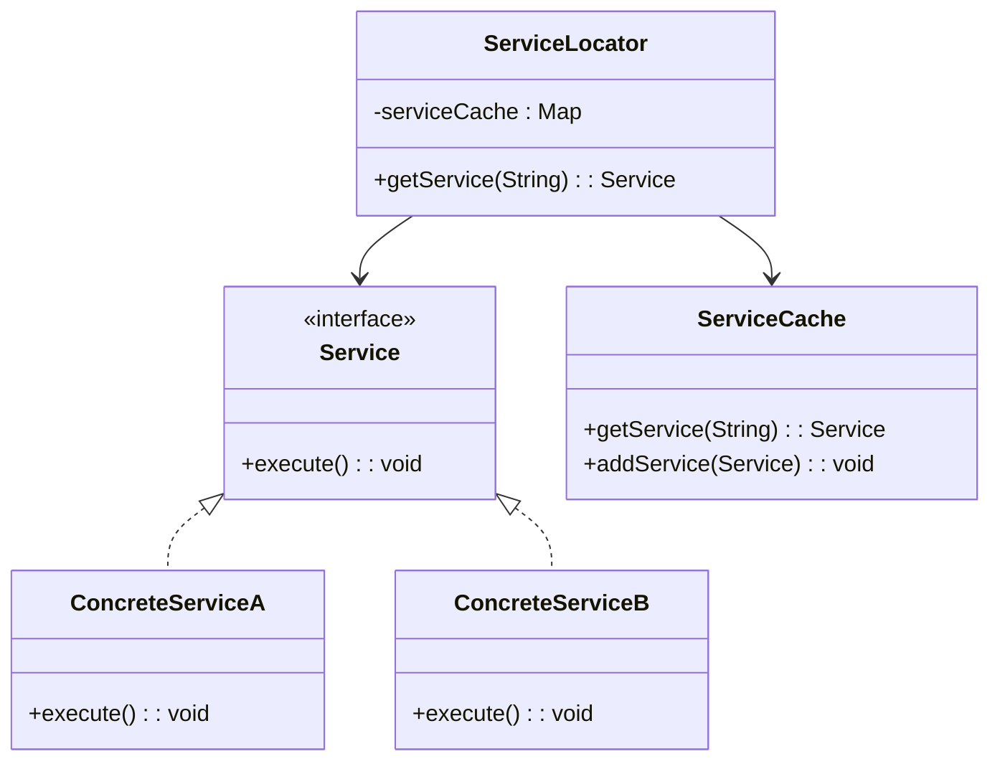
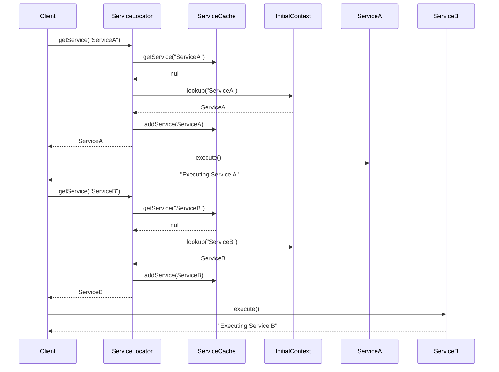

## 8.5 Service Locator Pattern

In the realm of software engineering, managing dependencies and service lookups efficiently is crucial for building scalable and maintainable applications. The Service Locator pattern is a design pattern that addresses this need by providing a centralized mechanism for obtaining service instances. This pattern is particularly useful in large-scale enterprise applications where services are numerous and often need to be accessed from various parts of the application.

### Understanding the Service Locator Pattern

The Service Locator pattern is a design pattern used to encapsulate the processes involved in obtaining a service instance. Its primary intent is to provide a central registry that simplifies the lookup and retrieval of services, thereby reducing the complexity of managing dependencies across different components of an application.

#### Intent of the Service Locator Pattern

The intent of the Service Locator pattern is to:

- **Centralize Service Management**: By providing a single point of access for service instances, the Service Locator pattern centralizes the management and retrieval of services.
- **Simplify Service Access**: It abstracts the complexities involved in locating and retrieving services, making it easier for different parts of an application to access the services they need.
- **Reduce Dependency Overhead**: By decoupling the service consumers from the service providers, the pattern reduces the overhead associated with managing dependencies.

### Components of the Service Locator Pattern

The Service Locator pattern consists of several key components:

1. **Service Locator**: The core component that provides a centralized registry for locating services. It acts as an intermediary between service consumers and service providers.
2. **Service Cache**: An optional component that stores service instances for quick retrieval. This cache helps improve performance by avoiding repeated lookups of the same service.
3. **Services**: The actual services that are being located and used by the application. These services can be anything from database connections to external APIs.

#### Diagram: Structure of the Service Locator Pattern

Below is a UML diagram illustrating the structure of the Service Locator pattern:



### Advantages of Using the Service Locator Pattern

The Service Locator pattern offers several advantages that make it a compelling choice for certain types of applications:

- **Simplified Access to Services**: By providing a centralized mechanism for service lookup, the pattern simplifies access to services across different parts of the application.
- **Reduced Dependency Injection Complexity**: In some cases, the Service Locator pattern can reduce the need for complex dependency injection configurations, especially in legacy systems where refactoring for dependency injection might be challenging.
- **Centralized Service Management**: The pattern centralizes service management and lookup logic, making it easier to maintain and update service configurations.

### Service Locator Pattern vs. Dependency Injection

While both the Service Locator pattern and Dependency Injection (DI) aim to manage dependencies, they do so in fundamentally different ways:

- **Service Locator**: The consumer explicitly requests a service from the locator, which can lead to tighter coupling between the consumer and the locator.
- **Dependency Injection**: Dependencies are injected into the consumer, promoting loose coupling and making the system more flexible and testable.

#### Key Differences

- **Control**: In DI, the control of service instantiation is inverted, whereas in the Service Locator pattern, the consumer retains control by requesting services.
- **Coupling**: DI tends to promote loose coupling, while the Service Locator pattern can introduce tighter coupling due to the explicit service requests.
- **Testability**: DI generally improves testability by allowing dependencies to be easily mocked or replaced, whereas the Service Locator pattern can complicate testing due to its centralized nature.

### Implementing the Service Locator Pattern in Java

Let's explore a practical implementation of the Service Locator pattern in Java. We'll create a simple application that uses the Service Locator pattern to manage and retrieve services.

#### Step 1: Define the Service Interface

First, we define a `Service` interface that all services will implement:

```java
public interface Service {
    void execute();
    String getName();
}
```

#### Step 2: Implement Concrete Services

Next, we implement concrete services that will be managed by the Service Locator:

```java
public class ConcreteServiceA implements Service {
    @Override
    public void execute() {
        System.out.println("Executing Service A");
    }

    @Override
    public String getName() {
        return "ServiceA";
    }
}

public class ConcreteServiceB implements Service {
    @Override
    public void execute() {
        System.out.println("Executing Service B");
    }

    @Override
    public String getName() {
        return "ServiceB";
    }
}
```

#### Step 3: Create the Service Locator

The Service Locator is responsible for managing service instances and providing them to consumers:

```java
import java.util.HashMap;
import java.util.Map;

public class ServiceLocator {
    private static ServiceCache cache = new ServiceCache();

    public static Service getService(String serviceName) {
        Service service = cache.getService(serviceName);

        if (service != null) {
            return service;
        }

        InitialContext context = new InitialContext();
        Service newService = (Service) context.lookup(serviceName);
        cache.addService(newService);
        return newService;
    }
}
```

#### Step 4: Implement the Service Cache

The Service Cache stores service instances for quick retrieval:

```java
public class ServiceCache {
    private Map<String, Service> services = new HashMap<>();

    public Service getService(String serviceName) {
        return services.get(serviceName);
    }

    public void addService(Service newService) {
        services.put(newService.getName(), newService);
    }
}
```

#### Step 5: Create the Initial Context

The Initial Context simulates the lookup of services:

```java
public class InitialContext {
    public Object lookup(String serviceName) {
        if (serviceName.equalsIgnoreCase("ServiceA")) {
            System.out.println("Looking up and creating a new ServiceA object");
            return new ConcreteServiceA();
        } else if (serviceName.equalsIgnoreCase("ServiceB")) {
            System.out.println("Looking up and creating a new ServiceB object");
            return new ConcreteServiceB();
        }
        return null;
    }
}
```

#### Step 6: Use the Service Locator

Finally, we use the Service Locator to retrieve and execute services:

```java
public class ServiceLocatorPatternDemo {
    public static void main(String[] args) {
        Service service = ServiceLocator.getService("ServiceA");
        service.execute();

        service = ServiceLocator.getService("ServiceB");
        service.execute();

        service = ServiceLocator.getService("ServiceA");
        service.execute();

        service = ServiceLocator.getService("ServiceB");
        service.execute();
    }
}
```

### Practical Considerations and Strategies

When implementing the Service Locator pattern, consider the following strategies and best practices:

- **Caching**: Use a service cache to improve performance by avoiding repeated lookups of the same service.
- **Lazy Initialization**: Consider using lazy initialization to defer the creation of service instances until they are actually needed.
- **Thread Safety**: Ensure that the Service Locator and Service Cache are thread-safe if they will be accessed by multiple threads concurrently.
- **Error Handling**: Implement robust error handling to manage scenarios where a requested service is not available.

### Try It Yourself

To deepen your understanding of the Service Locator pattern, try modifying the code examples provided:

- **Add a New Service**: Implement a new service and register it with the Service Locator.
- **Enhance the Cache**: Modify the Service Cache to include expiration logic for cached services.
- **Test Thread Safety**: Simulate concurrent access to the Service Locator and ensure it behaves correctly.

### Visualizing the Service Locator Pattern

To further enhance your understanding, let's visualize the workflow of the Service Locator pattern using a sequence diagram:



### Knowledge Check

Before we conclude, let's reinforce what we've learned:

- **What is the primary intent of the Service Locator pattern?**
- **How does the Service Locator pattern differ from Dependency Injection?**
- **What are the key components of the Service Locator pattern?**

### Embrace the Journey

Remember, mastering design patterns is a journey. As you continue to explore and implement patterns like the Service Locator, you'll gain deeper insights into building robust and scalable applications. Keep experimenting, stay curious, and enjoy the process!

## Quiz Time!



### What is the primary purpose of the Service Locator pattern?

- [x] To provide a centralized mechanism for obtaining service instances.
- [ ] To enforce strict type-checking in service retrieval.
- [ ] To replace all forms of dependency injection.
- [ ] To manage user authentication and authorization.

> **Explanation:** The Service Locator pattern is designed to centralize the management and retrieval of service instances, simplifying access across an application.

### Which component in the Service Locator pattern is responsible for storing service instances for quick retrieval?

- [ ] Service Locator
- [x] Service Cache
- [ ] Initial Context
- [ ] Service Provider

> **Explanation:** The Service Cache component stores service instances to improve performance by avoiding repeated lookups.

### How does the Service Locator pattern differ from Dependency Injection in terms of control?

- [x] In Service Locator, the consumer requests services explicitly.
- [ ] In Dependency Injection, the consumer requests services explicitly.
- [ ] Both patterns require explicit service requests by the consumer.
- [ ] Neither pattern involves explicit service requests by the consumer.

> **Explanation:** In the Service Locator pattern, the consumer explicitly requests a service, whereas Dependency Injection provides services without explicit requests.

### What is a potential disadvantage of using the Service Locator pattern?

- [x] It can introduce tighter coupling between consumers and the locator.
- [ ] It always improves testability of the application.
- [ ] It eliminates the need for service caching.
- [ ] It simplifies all aspects of dependency management.

> **Explanation:** The Service Locator pattern can lead to tighter coupling because consumers explicitly request services, which can complicate testing and maintenance.

### Which of the following is NOT a benefit of the Service Locator pattern?

- [ ] Simplifies access to services.
- [x] Guarantees loose coupling between components.
- [ ] Centralizes service management.
- [ ] Reduces dependency injection complexity in some cases.

> **Explanation:** While the Service Locator pattern simplifies access and centralizes management, it does not inherently guarantee loose coupling, unlike Dependency Injection.

### What is the role of the Initial Context in the Service Locator pattern?

- [ ] To cache service instances for quick access.
- [x] To simulate the lookup and creation of service instances.
- [ ] To enforce security policies on service access.
- [ ] To manage service lifecycle events.

> **Explanation:** The Initial Context is responsible for simulating the lookup and creation of new service instances when they are not found in the cache.

### In the provided Java example, which method is used to add a new service to the cache?

- [ ] getService()
- [ ] lookup()
- [x] addService()
- [ ] execute()

> **Explanation:** The `addService()` method is used to add new service instances to the cache for future retrieval.

### What is a practical consideration when implementing the Service Locator pattern?

- [x] Ensuring thread safety for concurrent access.
- [ ] Avoiding the use of service caching.
- [ ] Eliminating all forms of error handling.
- [ ] Using the pattern in all types of applications.

> **Explanation:** When implementing the Service Locator pattern, it's important to ensure thread safety if the locator will be accessed by multiple threads.

### How can the Service Locator pattern improve performance?

- [x] By caching service instances to avoid repeated lookups.
- [ ] By eliminating the need for service interfaces.
- [ ] By enforcing strict compile-time checks.
- [ ] By reducing the number of service providers.

> **Explanation:** The Service Locator pattern can improve performance by caching service instances, which reduces the need for repeated lookups.

### True or False: The Service Locator pattern is always preferable to Dependency Injection.

- [ ] True
- [x] False

> **Explanation:** The choice between the Service Locator pattern and Dependency Injection depends on the specific requirements and constraints of the application. Each has its own advantages and trade-offs.


