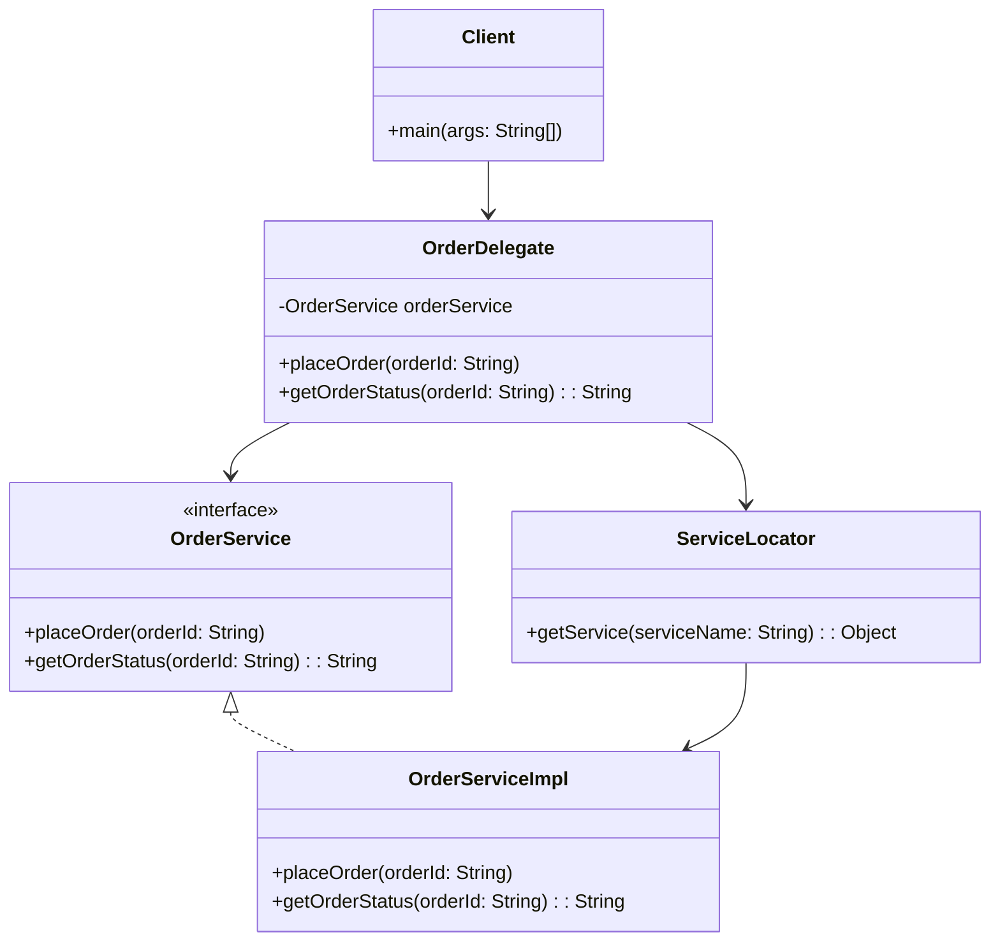

## 8.6.1 Implementing Business Delegate in Java

In this section, we delve into the implementation of the Business Delegate pattern in Java, a crucial design pattern for enterprise applications. The Business Delegate pattern acts as an intermediary between the client and the business services, providing a façade that simplifies client interactions with the underlying business logic. This pattern is particularly useful in reducing coupling between presentation and business tiers, thus enhancing maintainability and scalability.

### Understanding the Business Delegate Pattern

The Business Delegate pattern is a structural pattern that abstracts the complexity of interactions with business services. It provides a single entry point for clients to access various business services, encapsulating the service lookup and invocation logic. By doing so, it decouples the client from the implementation details of the business services, allowing for more flexible and maintainable code.

#### Key Components of the Business Delegate Pattern

1. **Business Delegate**: This is the main component that acts as a façade for the client. It provides methods for the client to interact with business services and handles service lookup and invocation.

2. **Business Service**: These are the actual services that contain the business logic. The Business Delegate interacts with these services to fulfill client requests.

3. **Service Locator**: This optional component is used by the Business Delegate to locate and obtain references to business services. It abstracts the complexity of service lookup, which can involve JNDI lookups or other mechanisms.

4. **Exception Handling**: The Business Delegate is responsible for translating exceptions from the business services into client-friendly messages or actions.

### Implementing the Business Delegate Pattern in Java

Let's walk through the implementation of a Business Delegate in Java with a practical example. We'll create a simple application that manages orders, with the Business Delegate pattern facilitating communication between the client and the order management services.

#### Step 1: Define the Business Service Interface

First, we define the interface for the business service. This interface declares the methods that the business service will implement.

```java
public interface OrderService {
    void placeOrder(String orderId);
    String getOrderStatus(String orderId);
}
```

#### Step 2: Implement the Business Service

Next, we implement the business service. This class contains the actual business logic for managing orders.

```java
public class OrderServiceImpl implements OrderService {
    @Override
    public void placeOrder(String orderId) {
        // Business logic to place an order
        System.out.println("Order placed: " + orderId);
    }

    @Override
    public String getOrderStatus(String orderId) {
        // Business logic to get order status
        return "Order status for " + orderId + ": Shipped";
    }
}
```

#### Step 3: Create the Service Locator

The Service Locator is responsible for locating and obtaining references to the business services. In a real-world application, this might involve JNDI lookups or other mechanisms.

```java
public class ServiceLocator {
    private static final Map<String, Object> services = new HashMap<>();

    static {
        services.put("OrderService", new OrderServiceImpl());
    }

    public static Object getService(String serviceName) {
        return services.get(serviceName);
    }
}
```

#### Step 4: Implement the Business Delegate

The Business Delegate acts as a façade for the client, providing methods to interact with the business services. It uses the Service Locator to obtain references to the services.

```java
public class OrderDelegate {
    private OrderService orderService;

    public OrderDelegate() {
        this.orderService = (OrderService) ServiceLocator.getService("OrderService");
    }

    public void placeOrder(String orderId) {
        try {
            orderService.placeOrder(orderId);
        } catch (Exception e) {
            handleException(e);
        }
    }

    public String getOrderStatus(String orderId) {
        try {
            return orderService.getOrderStatus(orderId);
        } catch (Exception e) {
            handleException(e);
            return "Error retrieving order status";
        }
    }

    private void handleException(Exception e) {
        // Log the exception and translate it into a client-friendly message
        System.err.println("An error occurred: " + e.getMessage());
    }
}
```

#### Step 5: Client Interaction with the Business Delegate

Finally, the client interacts with the Business Delegate to perform operations on the business services.

```java
public class Client {
    public static void main(String[] args) {
        OrderDelegate orderDelegate = new OrderDelegate();

        // Place an order
        orderDelegate.placeOrder("12345");

        // Get order status
        String status = orderDelegate.getOrderStatus("12345");
        System.out.println(status);
    }
}
```

### Best Practices for Implementing Business Delegate

1. **Focus on Communication**: The Business Delegate should focus solely on communication between the client and the business services. It should not contain any business logic itself.

2. **Transparency**: Ensure that the Business Delegate is transparent to clients in terms of service interaction details. Clients should not be aware of the underlying service lookup and invocation mechanisms.

3. **Exception Handling**: Handle exceptions gracefully within the Business Delegate and translate them into client-friendly messages or actions. This improves the robustness of the application.

4. **Use of Patterns**: Consider using other patterns like Proxy or Adapter within the Business Delegate to enhance flexibility and reusability.

### Potential Use of Proxy and Adapter Patterns

The Business Delegate pattern can be complemented by other patterns like Proxy and Adapter to further enhance its functionality.

- **Proxy Pattern**: A Proxy can be used within the Business Delegate to control access to the business services. This can be useful for implementing security checks or caching mechanisms.

- **Adapter Pattern**: An Adapter can be used to adapt the interface of a business service to match the expected interface of the Business Delegate. This is useful when integrating with legacy systems or third-party services.

### Visualizing the Business Delegate Pattern

Below is a class diagram that illustrates the relationships between the components of the Business Delegate pattern.



### Try It Yourself

To gain a deeper understanding of the Business Delegate pattern, try modifying the code examples above:

- **Add New Services**: Extend the Service Locator and Business Delegate to support additional services, such as a `PaymentService`.
- **Implement Caching**: Use the Proxy pattern to implement a caching mechanism within the Business Delegate.
- **Integrate with a Database**: Modify the `OrderServiceImpl` to interact with a database for order management.

### Knowledge Check

- **What is the primary role of the Business Delegate in the pattern?**
- **How does the Service Locator assist the Business Delegate?**
- **What are some best practices for implementing the Business Delegate pattern?**

### Conclusion

The Business Delegate pattern is a powerful tool for decoupling client applications from business services, enhancing modularity and maintainability. By following best practices and considering complementary patterns like Proxy and Adapter, you can create robust and flexible enterprise applications.

Remember, this is just the beginning. As you progress, you'll build more complex and interactive systems. Keep experimenting, stay curious, and enjoy the journey!

## Quiz Time!



### What is the primary role of the Business Delegate in the pattern?

- [x] To act as an intermediary between the client and business services
- [ ] To implement business logic
- [ ] To manage database connections
- [ ] To handle user interface rendering

> **Explanation:** The Business Delegate acts as an intermediary, providing a façade for business services and decoupling the client from the service implementation details.

### How does the Service Locator assist the Business Delegate?

- [x] By locating and obtaining references to business services
- [ ] By executing business logic
- [ ] By managing client sessions
- [ ] By rendering user interfaces

> **Explanation:** The Service Locator abstracts the complexity of service lookup, allowing the Business Delegate to obtain references to business services easily.

### What should the Business Delegate focus on?

- [x] Communication between the client and business services
- [ ] Implementing business logic
- [ ] Managing database transactions
- [ ] Rendering user interfaces

> **Explanation:** The Business Delegate should focus on communication and not contain any business logic itself.

### Which pattern can be used within the Business Delegate to control access to services?

- [x] Proxy Pattern
- [ ] Singleton Pattern
- [ ] Factory Pattern
- [ ] Builder Pattern

> **Explanation:** The Proxy Pattern can be used within the Business Delegate to control access to business services, such as implementing security checks or caching.

### What is a best practice for exception handling in the Business Delegate?

- [x] Translate exceptions into client-friendly messages
- [ ] Ignore exceptions
- [ ] Log exceptions without handling
- [ ] Directly propagate exceptions to the client

> **Explanation:** It is a best practice to handle exceptions gracefully within the Business Delegate and translate them into client-friendly messages or actions.

### What is the purpose of the Adapter Pattern in the context of the Business Delegate?

- [x] To adapt the interface of a business service to match the expected interface
- [ ] To create a single instance of a service
- [ ] To manage object creation
- [ ] To handle concurrent access

> **Explanation:** The Adapter Pattern is used to adapt the interface of a business service to match the expected interface of the Business Delegate, especially when integrating with legacy systems or third-party services.

### Which component is responsible for the actual business logic in the Business Delegate pattern?

- [x] Business Service
- [ ] Business Delegate
- [ ] Service Locator
- [ ] Client

> **Explanation:** The Business Service contains the actual business logic, while the Business Delegate acts as a façade for the client.

### What is a potential use of the Proxy Pattern within the Business Delegate?

- [x] Implementing caching mechanisms
- [ ] Managing database transactions
- [ ] Rendering user interfaces
- [ ] Handling user authentication

> **Explanation:** The Proxy Pattern can be used within the Business Delegate to implement caching mechanisms, controlling access to business services.

### Which of the following is NOT a component of the Business Delegate pattern?

- [ ] Business Delegate
- [ ] Business Service
- [ ] Service Locator
- [x] User Interface

> **Explanation:** The User Interface is not a component of the Business Delegate pattern. The pattern focuses on decoupling the client from business services.

### True or False: The Business Delegate pattern is primarily used for rendering user interfaces.

- [ ] True
- [x] False

> **Explanation:** False. The Business Delegate pattern is used to decouple the client from business services, not for rendering user interfaces.


