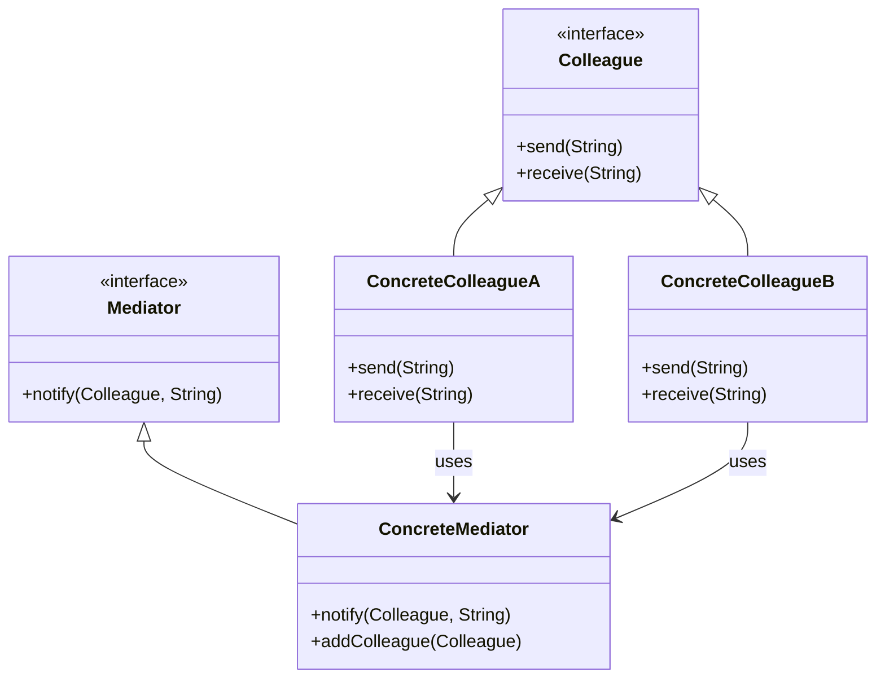

## 8.6.1 Implementing Mediator in Java

The Mediator pattern is a behavioral design pattern that defines an object, known as the mediator, to encapsulate the way a set of objects interact. By centralizing communication, the mediator promotes loose coupling between colleague objects, allowing them to interact without knowing each other's details. This pattern is particularly useful in scenarios where multiple objects need to communicate in a complex system, as it simplifies the communication logic and enhances maintainability.

### Intent

The primary intent of the Mediator pattern is to reduce the complexity of communication between multiple objects or classes. Instead of having each object communicate directly with others, the mediator acts as an intermediary, handling all interactions. This approach minimizes dependencies between objects, leading to a more modular and flexible system.

### Participants

The Mediator pattern involves several key participants:

- **Mediator**: An interface that defines the communication methods used by colleague objects.
- **ConcreteMediator**: A class that implements the Mediator interface and coordinates communication between colleague objects.
- **Colleague**: An abstract class or interface representing objects that communicate through the mediator.
- **ConcreteColleague**: Classes that implement the Colleague interface and interact with each other via the mediator.

### Structure

The following UML diagram illustrates the structure of the Mediator pattern:



**Diagram Explanation**: The diagram shows the relationships between the Mediator, ConcreteMediator, Colleague, and ConcreteColleague classes. The ConcreteMediator coordinates communication between ConcreteColleagueA and ConcreteColleagueB.

### Implementation

#### Java Code Example

Let's implement the Mediator pattern in Java with a simple chat room example, where users (colleagues) communicate through a chat room (mediator).

```java
// Mediator interface
interface ChatMediator {
    void sendMessage(String message, User user);
    void addUser(User user);
}

// ConcreteMediator class
class ChatRoom implements ChatMediator {
    private List<User> users = new ArrayList<>();

    @Override
    public void addUser(User user) {
        users.add(user);
    }

    @Override
    public void sendMessage(String message, User user) {
        for (User u : users) {
            // Message should not be received by the user sending it
            if (u != user) {
                u.receive(message);
            }
        }
    }
}

// Colleague interface
abstract class User {
    protected ChatMediator mediator;
    protected String name;

    public User(ChatMediator mediator, String name) {
        this.mediator = mediator;
        this.name = name;
    }

    public abstract void send(String message);
    public abstract void receive(String message);
}

// ConcreteColleague class
class ConcreteUser extends User {

    public ConcreteUser(ChatMediator mediator, String name) {
        super(mediator, name);
    }

    @Override
    public void send(String message) {
        System.out.println(this.name + " Sending Message: " + message);
        mediator.sendMessage(message, this);
    }

    @Override
    public void receive(String message) {
        System.out.println(this.name + " Received Message: " + message);
    }
}

// Client code
public class MediatorPatternDemo {
    public static void main(String[] args) {
        ChatMediator chatMediator = new ChatRoom();

        User user1 = new ConcreteUser(chatMediator, "Alice");
        User user2 = new ConcreteUser(chatMediator, "Bob");
        User user3 = new ConcreteUser(chatMediator, "Charlie");

        chatMediator.addUser(user1);
        chatMediator.addUser(user2);
        chatMediator.addUser(user3);

        user1.send("Hello, everyone!");
    }
}
```

**Explanation**: In this example, the `ChatRoom` class acts as the mediator, coordinating communication between `ConcreteUser` instances. Each user can send and receive messages through the chat room, demonstrating how the mediator pattern centralizes communication.

### Promoting Loose Coupling

The Mediator pattern promotes loose coupling by preventing direct communication between colleague objects. Instead, all interactions are managed by the mediator, which reduces dependencies and simplifies the system's architecture. This decoupling allows for easier maintenance and scalability, as changes to one colleague do not directly impact others.

### Trade-offs

While the Mediator pattern offers significant benefits, it also introduces some trade-offs:

- **Complexity**: The mediator can become a complex central point, especially in systems with numerous interactions. Managing this complexity requires careful design and implementation.
- **Single Point of Failure**: The mediator becomes a critical component, and any issues with it can affect the entire system's communication.

### Sample Use Cases

The Mediator pattern is commonly used in scenarios such as:

- **User Interface Components**: Coordinating interactions between UI elements, such as buttons and text fields.
- **Chat Applications**: Managing communication between users in a chat room.
- **Air Traffic Control Systems**: Centralizing communication between aircraft and control towers.

### Related Patterns

The Mediator pattern is related to other patterns, such as:

- **Observer Pattern**: While both patterns deal with communication, the Observer pattern focuses on notifying observers of changes, whereas the Mediator pattern centralizes communication.
- **Facade Pattern**: Both patterns provide a simplified interface, but the Facade pattern does not encapsulate communication between objects.

### Known Uses

The Mediator pattern is widely used in frameworks and libraries, such as:

- **Java Swing**: The `Action` class in Swing acts as a mediator between UI components and their actions.
- **Apache Camel**: Uses the Mediator pattern to route messages between different endpoints.

### Conclusion

The Mediator pattern is a powerful tool for managing complex interactions between objects in a system. By centralizing communication, it promotes loose coupling and enhances maintainability. However, it is essential to manage the complexity of the mediator itself to avoid it becoming a bottleneck or single point of failure.

### Exercises

1. Modify the chat room example to include a private message feature, allowing users to send messages directly to specific users.
2. Implement a logging mechanism in the `ChatRoom` class to track all messages sent through the mediator.
3. Explore how the Mediator pattern can be applied to a real-world scenario, such as a traffic light system.

## Test Your Knowledge: Mediator Pattern in Java Quiz



### What is the primary purpose of the Mediator pattern?

- [x] To encapsulate how a set of objects interact
- [ ] To create objects without specifying their concrete classes
- [ ] To provide a simplified interface to a complex subsystem
- [ ] To define a one-to-many dependency between objects

> **Explanation:** The Mediator pattern encapsulates how a set of objects interact, promoting loose coupling by centralizing communication.

### Which class in the provided Java example acts as the mediator?

- [ ] User
- [x] ChatRoom
- [ ] ConcreteUser
- [ ] MediatorPatternDemo

> **Explanation:** The `ChatRoom` class implements the `ChatMediator` interface and coordinates communication between users.

### How does the Mediator pattern promote loose coupling?

- [x] By preventing direct communication between colleague objects
- [ ] By allowing objects to communicate directly with each other
- [ ] By increasing dependencies between objects
- [ ] By centralizing object creation

> **Explanation:** The Mediator pattern promotes loose coupling by centralizing communication, preventing direct interactions between colleagues.

### What is a potential drawback of using the Mediator pattern?

- [x] The mediator can become a complex central point
- [ ] It increases direct dependencies between objects
- [ ] It simplifies communication logic
- [ ] It reduces the number of classes in a system

> **Explanation:** The mediator can become a complex central point, which requires careful management to avoid becoming a bottleneck.

### In which scenarios is the Mediator pattern commonly used?

- [x] User Interface Components
- [x] Chat Applications
- [ ] Singleton Pattern
- [ ] Factory Pattern

> **Explanation:** The Mediator pattern is commonly used in scenarios like UI components and chat applications to manage interactions.

### Which pattern is related to the Mediator pattern but focuses on notifying observers of changes?

- [ ] Facade Pattern
- [x] Observer Pattern
- [ ] Singleton Pattern
- [ ] Factory Pattern

> **Explanation:** The Observer pattern focuses on notifying observers of changes, whereas the Mediator pattern centralizes communication.

### What is a known use of the Mediator pattern in Java frameworks?

- [x] Java Swing's Action class
- [ ] Java's Stream API
- [ ] Java's Collection Framework
- [ ] Java's Reflection API

> **Explanation:** Java Swing's `Action` class acts as a mediator between UI components and their actions.

### How can the complexity of the mediator be managed?

- [x] By careful design and implementation
- [ ] By increasing the number of colleague objects
- [ ] By reducing the number of interactions
- [ ] By allowing direct communication between objects

> **Explanation:** Careful design and implementation are essential to manage the complexity of the mediator.

### What is a potential benefit of using the Mediator pattern?

- [x] Enhanced maintainability
- [ ] Increased complexity
- [ ] Direct communication between objects
- [ ] Reduced number of classes

> **Explanation:** The Mediator pattern enhances maintainability by centralizing communication and reducing dependencies.

### True or False: The Mediator pattern is a creational design pattern.

- [ ] True
- [x] False

> **Explanation:** The Mediator pattern is a behavioral design pattern, not a creational one.



By understanding and implementing the Mediator pattern, developers can create more modular and maintainable systems, effectively managing complex interactions between objects.
