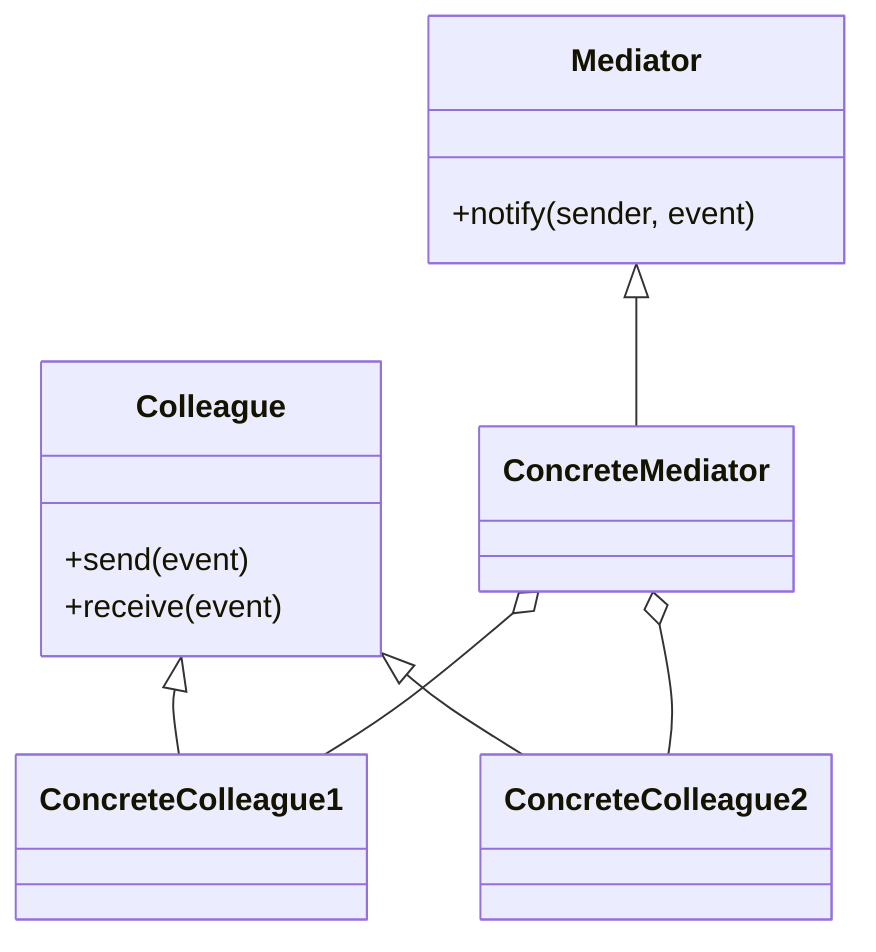

## 8.6.2 Reducing Tight Coupling

In the realm of software design, one of the perennial challenges is managing dependencies between objects. Tight coupling, where objects are heavily dependent on each other, can lead to systems that are difficult to maintain, extend, and test. The **Mediator Pattern**, a key behavioral design pattern, offers a solution by reducing direct dependencies between communicating objects, thereby enhancing the flexibility and maintainability of the codebase.

### Understanding Tight Coupling

**Tight coupling** occurs when classes are highly dependent on one another, meaning a change in one class often necessitates changes in others. This can lead to a fragile system where modifications become cumbersome and error-prone. Consider a scenario where multiple objects need to communicate with each other directly. Each object must be aware of the others, leading to a complex web of dependencies.

#### Problems with Direct Communication

Direct communication between objects can lead to several issues:

- **Complex Interdependencies**: As the number of objects increases, the interdependencies grow exponentially, making the system difficult to manage.
- **Reduced Reusability**: Tightly coupled objects are less reusable because they depend on specific implementations of other objects.
- **Difficult Maintenance**: Any change in one object might require changes in all the objects it interacts with, increasing the maintenance burden.
- **Limited Flexibility**: The system becomes rigid, making it challenging to introduce new features or modify existing ones without affecting the entire system.

### The Mediator Pattern: Centralizing Control

The **Mediator Pattern** addresses these issues by introducing a mediator object that centralizes control and communication between objects. Instead of communicating directly, objects send messages to the mediator, which then relays them to the appropriate recipients. This decouples the objects from each other, reducing dependencies and simplifying the system architecture.

#### How the Mediator Pattern Works

In the Mediator Pattern, the mediator object encapsulates how a set of objects interact. Objects no longer need to know about each other; they only need to know about the mediator. This pattern is particularly useful in scenarios where multiple objects interact in complex ways.



*Diagram: The Mediator Pattern structure showing the central role of the Mediator in managing communication between Colleagues.*

### Benefits of Using the Mediator Pattern

1. **Reduced Coupling**: By centralizing communication, the Mediator Pattern significantly reduces the coupling between objects. This makes the system more modular and easier to understand.

2. **Improved Maintainability**: Changes to one object do not affect others, as long as the mediator interface remains unchanged. This simplifies maintenance and reduces the risk of introducing bugs.

3. **Enhanced Flexibility**: New objects can be added to the system without affecting existing ones. The mediator can be extended to handle new types of interactions, making the system more adaptable to change.

4. **Simplified Communication**: The mediator handles the complexity of interactions, allowing individual objects to focus on their core responsibilities.

### Practical Application: A Chat Room Example

Consider a chat room application where users can send messages to each other. Without a mediator, each user would need to know about every other user to send messages, leading to a tightly coupled system. By introducing a mediator, the chat room itself becomes the central point of communication.

#### Implementing the Mediator Pattern in Java

Let's implement a simple chat room using the Mediator Pattern in Java.

```java
// Mediator interface
interface ChatMediator {
    void sendMessage(String message, User user);
    void addUser(User user);
}

// Concrete Mediator
class ChatRoom implements ChatMediator {
    private List<User> users = new ArrayList<>();

    @Override
    public void addUser(User user) {
        users.add(user);
    }

    @Override
    public void sendMessage(String message, User user) {
        for (User u : users) {
            // Message should not be received by the user sending it
            if (u != user) {
                u.receive(message);
            }
        }
    }
}

// Colleague class
abstract class User {
    protected ChatMediator mediator;
    protected String name;

    public User(ChatMediator mediator, String name) {
        this.mediator = mediator;
        this.name = name;
    }

    public abstract void send(String message);
    public abstract void receive(String message);
}

// Concrete Colleague
class ConcreteUser extends User {

    public ConcreteUser(ChatMediator mediator, String name) {
        super(mediator, name);
    }

    @Override
    public void send(String message) {
        System.out.println(this.name + " Sending Message: " + message);
        mediator.sendMessage(message, this);
    }

    @Override
    public void receive(String message) {
        System.out.println(this.name + " Received Message: " + message);
    }
}

// Client code
public class MediatorPatternDemo {
    public static void main(String[] args) {
        ChatMediator chatMediator = new ChatRoom();

        User user1 = new ConcreteUser(chatMediator, "Alice");
        User user2 = new ConcreteUser(chatMediator, "Bob");
        User user3 = new ConcreteUser(chatMediator, "Charlie");

        chatMediator.addUser(user1);
        chatMediator.addUser(user2);
        chatMediator.addUser(user3);

        user1.send("Hello, everyone!");
    }
}
```

*Explanation*: In this example, the `ChatRoom` class acts as the mediator, managing the communication between `User` objects. Each `User` can send and receive messages through the `ChatRoom`, which handles the distribution of messages to other users.

### Encouraging Experimentation

To deepen understanding, readers are encouraged to experiment with the code:

- **Add More Users**: Extend the example by adding more users and observe how the mediator handles communication.
- **Modify the Mediator**: Introduce new features in the `ChatRoom`, such as private messaging or message filtering.
- **Implement Alternative Mediators**: Create different types of mediators for other scenarios, such as a trading platform or a traffic control system.

### Alternative Implementations

While the above example uses a simple list to manage users, consider using more sophisticated data structures or patterns, such as:

- **Observer Pattern**: For scenarios where users need to be notified of specific events.
- **Command Pattern**: To encapsulate requests as objects, allowing for parameterization and queuing of requests.

### Historical Context and Evolution

The Mediator Pattern has evolved alongside the development of object-oriented programming. Initially, systems were designed with direct communication between objects, leading to tightly coupled architectures. As software systems grew in complexity, the need for decoupling became apparent, leading to the adoption of patterns like the Mediator.

### Common Pitfalls and How to Avoid Them

- **Over-reliance on the Mediator**: While the mediator simplifies communication, overloading it with too much logic can lead to a "god object" anti-pattern. Keep the mediator focused on communication and delegate other responsibilities to appropriate classes.
- **Ignoring Performance Impacts**: In systems with high communication frequency, the mediator can become a bottleneck. Optimize the mediator's implementation to handle high loads efficiently.

### Exercises and Practice Problems

1. **Extend the Chat Room**: Implement a feature where users can join specific chat groups, and messages are only sent to users within the same group.
2. **Implement a Traffic Control System**: Use the Mediator Pattern to manage communication between different traffic lights at an intersection.
3. **Design a Trading Platform**: Create a mediator that facilitates communication between buyers and sellers, handling bids and offers.

### Key Takeaways

- The Mediator Pattern reduces tight coupling by centralizing communication between objects.
- It enhances maintainability and flexibility, making systems easier to extend and modify.
- By decoupling objects, the pattern simplifies complex interactions and improves code readability.

### Reflection

Consider how the Mediator Pattern can be applied to your current projects. Are there areas where communication between objects is overly complex? Could introducing a mediator simplify the architecture and improve maintainability?

### Conclusion

The Mediator Pattern is a powerful tool for reducing tight coupling in Java applications. By centralizing control and communication, it enhances the flexibility and maintainability of the codebase, making it easier to adapt to changing requirements. As you continue to explore design patterns, consider how the principles of the Mediator Pattern can be applied to other areas of your software architecture.

## Test Your Knowledge: Reducing Tight Coupling with the Mediator Pattern Quiz



### What is the primary benefit of using the Mediator Pattern?

- [x] Reduces tight coupling between objects.
- [ ] Increases the speed of communication.
- [ ] Simplifies object creation.
- [ ] Enhances data encapsulation.

> **Explanation:** The Mediator Pattern reduces tight coupling by centralizing communication between objects, making the system more modular and easier to maintain.

### How does the Mediator Pattern improve maintainability?

- [x] By decoupling objects and centralizing communication.
- [ ] By increasing the number of classes.
- [ ] By making all objects aware of each other.
- [ ] By reducing the number of methods in each class.

> **Explanation:** The Mediator Pattern improves maintainability by decoupling objects, allowing changes to be made in one object without affecting others.

### In the Mediator Pattern, what role does the mediator play?

- [x] It centralizes control and communication between objects.
- [ ] It creates new objects.
- [ ] It stores data for objects.
- [ ] It manages object lifecycles.

> **Explanation:** The mediator centralizes control and communication, acting as an intermediary between objects to reduce dependencies.

### What is a potential drawback of the Mediator Pattern?

- [x] The mediator can become a bottleneck if overloaded with logic.
- [ ] It increases coupling between objects.
- [ ] It makes the system less flexible.
- [ ] It complicates object creation.

> **Explanation:** If the mediator is overloaded with too much logic, it can become a bottleneck, leading to performance issues.

### Which design pattern can be used alongside the Mediator Pattern for notification purposes?

- [x] Observer Pattern
- [ ] Singleton Pattern
- [ ] Factory Pattern
- [ ] Prototype Pattern

> **Explanation:** The Observer Pattern can be used alongside the Mediator Pattern to notify objects of specific events.

### What is a common anti-pattern associated with the Mediator Pattern?

- [x] God object
- [ ] Singleton
- [ ] Factory
- [ ] Prototype

> **Explanation:** A common anti-pattern is the "god object," where the mediator takes on too much responsibility, leading to a centralized point of failure.

### How can the Mediator Pattern enhance flexibility?

- [x] By allowing new objects to be added without affecting existing ones.
- [ ] By reducing the number of classes.
- [ ] By making all objects dependent on each other.
- [ ] By simplifying object creation.

> **Explanation:** The Mediator Pattern enhances flexibility by allowing new objects to be added without affecting existing ones, as communication is centralized through the mediator.

### What is a key characteristic of tightly coupled systems?

- [x] Objects are highly dependent on each other.
- [ ] Objects are completely independent.
- [ ] Objects have no communication.
- [ ] Objects are created dynamically.

> **Explanation:** In tightly coupled systems, objects are highly dependent on each other, making changes difficult and error-prone.

### How does the Mediator Pattern affect code readability?

- [x] It improves readability by simplifying complex interactions.
- [ ] It decreases readability by adding more classes.
- [ ] It has no effect on readability.
- [ ] It complicates the code structure.

> **Explanation:** The Mediator Pattern improves code readability by simplifying complex interactions and reducing dependencies between objects.

### True or False: The Mediator Pattern can be used to manage communication in a chat room application.

- [x] True
- [ ] False

> **Explanation:** True. The Mediator Pattern can be effectively used to manage communication in a chat room application by centralizing message distribution through a mediator.



By understanding and applying the Mediator Pattern, Java developers and software architects can create more robust, maintainable, and flexible applications. This pattern is a valuable addition to any developer's toolkit, providing a structured approach to managing complex interactions between objects.
