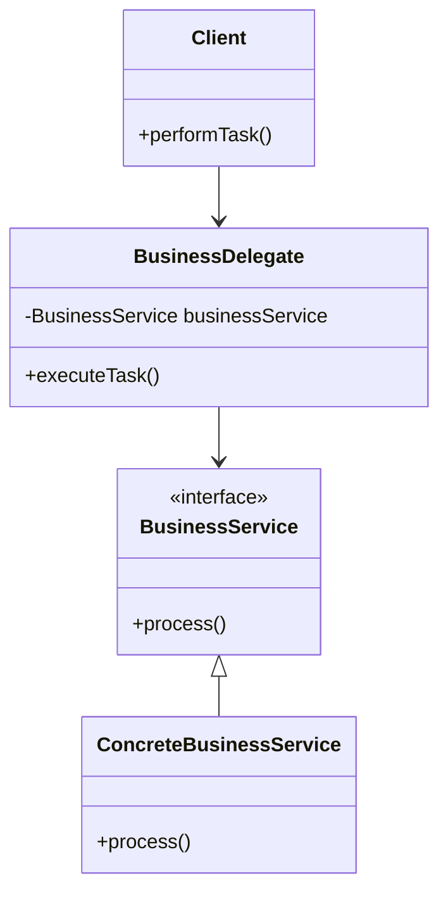

## 8.6.2 Reducing Coupling

In the realm of software engineering, coupling refers to the degree of direct knowledge that one class has about another. High coupling can lead to systems that are difficult to maintain and scale, as changes in one part of the system can have ripple effects throughout. The Business Delegate pattern is a structural pattern that helps reduce coupling by acting as an intermediary between client code and business services. This pattern is particularly useful in enterprise applications where business logic is often complex and subject to change.

### Understanding the Business Delegate Pattern

The Business Delegate pattern serves as a bridge between the presentation layer and the business services. It abstracts the complexities involved in interacting with business services, such as lookup mechanisms, remote communication, and resource management. By doing so, it reduces the coupling between the client and the business services, allowing for greater flexibility and easier maintenance.

#### Key Components of the Business Delegate Pattern

1. **Business Delegate**: This component acts as the intermediary between the client and the business service. It provides a simplified interface for the client to interact with, hiding the complexities of the underlying business service.

2. **Business Service**: This represents the actual service that performs the business logic. It can be a local or remote service, and its implementation details are hidden from the client.

3. **Service Locator**: Often used in conjunction with the Business Delegate, the Service Locator is responsible for locating and returning references to the business services.

4. **Client**: The client interacts with the Business Delegate to perform business operations. It is unaware of the complexities involved in accessing the business service.

### How the Business Delegate Reduces Coupling

The Business Delegate pattern reduces coupling in several ways:

- **Abstraction of Complexity**: The delegate abstracts the complexities involved in accessing business services, such as network communication and resource management. This allows the client to focus on its core responsibilities without being burdened by these details.

- **Encapsulation of Changes**: Changes in the business service implementation do not affect the client, as the delegate acts as a buffer. This encapsulation allows for easier maintenance and scalability.

- **Simplified Client Code**: By providing a simplified interface, the Business Delegate reduces the amount of code the client needs to interact with the business service. This leads to cleaner and more maintainable client code.

### Implementing the Business Delegate Pattern in Java

Let's explore a practical implementation of the Business Delegate pattern in Java. We'll create a simple application where a client interacts with a business service through a Business Delegate.

#### Step 1: Define the Business Service Interface

First, we define an interface for the business service. This interface declares the operations that the business service can perform.

```java
public interface BusinessService {
    void process();
}
```

#### Step 2: Implement the Business Service

Next, we implement the business service. This class contains the actual business logic.

```java
public class ConcreteBusinessService implements BusinessService {
    @Override
    public void process() {
        System.out.println("Processing task in ConcreteBusinessService.");
    }
}
```

#### Step 3: Create the Business Delegate

The Business Delegate interacts with the business service. It provides a simplified interface for the client and hides the complexities of the business service.

```java
public class BusinessDelegate {
    private BusinessService businessService;

    public BusinessDelegate() {
        // In a real-world scenario, this would use a Service Locator
        this.businessService = new ConcreteBusinessService();
    }

    public void executeTask() {
        businessService.process();
    }
}
```

#### Step 4: Implement the Client

The client interacts with the Business Delegate to perform business operations. It is unaware of the complexities involved in accessing the business service.

```java
public class Client {
    private BusinessDelegate businessDelegate;

    public Client(BusinessDelegate businessDelegate) {
        this.businessDelegate = businessDelegate;
    }

    public void performTask() {
        businessDelegate.executeTask();
    }
}
```

#### Step 5: Test the Implementation

Finally, we test the implementation by creating a client and executing a task through the Business Delegate.

```java
public class BusinessDelegatePatternDemo {
    public static void main(String[] args) {
        BusinessDelegate businessDelegate = new BusinessDelegate();
        Client client = new Client(businessDelegate);

        client.performTask();
    }
}
```

### Benefits of Using the Business Delegate Pattern

- **Reduced Coupling**: The client is decoupled from the business service, allowing for changes in the service without affecting the client.

- **Improved Maintainability**: With the complexities abstracted away, the client code is simpler and easier to maintain.

- **Enhanced Scalability**: As the business logic evolves, changes can be made to the business service without impacting the client.

- **Centralized Control**: The Business Delegate can manage cross-cutting concerns such as logging and security, centralizing control and reducing redundancy.

### Scenarios Where Business Delegate Excels

The Business Delegate pattern is particularly useful in scenarios where:

- **Frequent Changes in Business Logic**: When the business logic is subject to frequent changes, the delegate acts as a buffer, protecting the client from these changes.

- **Complex Business Logic**: In cases where the business logic involves complex operations, the delegate simplifies the client interaction by abstracting these complexities.

- **Remote Services**: When interacting with remote services, the delegate can handle network communication, retries, and error handling, providing a seamless experience for the client.

### Designing Resilient Business Delegates

To ensure that your Business Delegates are resilient to changes in the underlying services, consider the following best practices:

- **Use Interfaces**: Define interfaces for your business services. This allows for easy swapping of implementations without affecting the client.

- **Implement Caching**: If the business service involves expensive operations, consider implementing caching in the delegate to improve performance.

- **Handle Exceptions Gracefully**: Ensure that the delegate handles exceptions gracefully, providing meaningful error messages to the client.

- **Leverage Dependency Injection**: Use dependency injection to manage dependencies, making it easier to swap implementations and improve testability.

### Visualizing the Business Delegate Pattern

To better understand the interactions between the components of the Business Delegate pattern, let's visualize it using a class diagram.



**Diagram Description**: This class diagram illustrates the relationships between the Client, Business Delegate, Business Service interface, and Concrete Business Service. The Client interacts with the Business Delegate, which in turn interacts with the Business Service interface. The Concrete Business Service implements the Business Service interface.

### Try It Yourself

Now that we've explored the Business Delegate pattern, try modifying the code example to include multiple business services. Implement a Service Locator to dynamically locate and return the appropriate service based on the client's request. This exercise will help reinforce your understanding of how the Business Delegate pattern reduces coupling and enhances flexibility.

### Knowledge Check

- **Question**: How does the Business Delegate pattern reduce coupling between the client and business services?
- **Exercise**: Modify the code example to include exception handling in the Business Delegate. Ensure that meaningful error messages are provided to the client.

### Conclusion

The Business Delegate pattern is a powerful tool for reducing coupling in enterprise applications. By abstracting the complexities of business services and providing a simplified interface for the client, it enhances maintainability, scalability, and flexibility. As you continue to design and develop enterprise applications, consider incorporating the Business Delegate pattern to manage complexity and reduce coupling.

## Quiz Time!



### What is the primary role of the Business Delegate pattern?

- [x] To act as an intermediary between the client and business services, reducing coupling.
- [ ] To directly implement business logic within the client.
- [ ] To replace the need for business services entirely.
- [ ] To increase the complexity of client interactions.

> **Explanation:** The Business Delegate pattern serves as an intermediary, simplifying client interactions and reducing coupling with business services.

### How does the Business Delegate pattern improve maintainability?

- [x] By abstracting complexities and providing a simplified interface for clients.
- [ ] By embedding business logic directly in the client.
- [ ] By increasing the number of classes involved.
- [ ] By requiring clients to manage service lookups.

> **Explanation:** The pattern abstracts complexities, allowing clients to interact with a simplified interface, thus improving maintainability.

### Which component is responsible for locating business services in the Business Delegate pattern?

- [x] Service Locator
- [ ] Client
- [ ] Business Delegate
- [ ] Concrete Business Service

> **Explanation:** The Service Locator is responsible for locating and returning references to business services.

### How does the Business Delegate pattern handle changes in business service implementations?

- [x] By encapsulating changes, so they do not affect the client.
- [ ] By requiring clients to update their code.
- [ ] By removing the need for business services.
- [ ] By embedding changes directly in the client.

> **Explanation:** The Business Delegate encapsulates changes, shielding the client from them.

### What is a key benefit of using interfaces in the Business Delegate pattern?

- [x] They allow for easy swapping of implementations without affecting the client.
- [ ] They increase the complexity of the code.
- [ ] They eliminate the need for business services.
- [ ] They require clients to manage service lookups.

> **Explanation:** Interfaces enable easy swapping of implementations, enhancing flexibility and reducing coupling.

### In which scenarios is the Business Delegate pattern particularly useful?

- [x] When business logic is complex or subject to frequent changes.
- [ ] When there is no need for business services.
- [ ] When client code should manage service lookups.
- [ ] When increasing client complexity is desired.

> **Explanation:** The pattern is useful when business logic is complex or frequently changes, as it abstracts these complexities from the client.

### What is the role of the Client in the Business Delegate pattern?

- [x] To interact with the Business Delegate to perform business operations.
- [ ] To directly implement business logic.
- [ ] To manage service lookups.
- [ ] To replace the Business Delegate.

> **Explanation:** The Client interacts with the Business Delegate to perform business operations, without dealing with the complexities of the business service.

### How can the Business Delegate pattern enhance scalability?

- [x] By allowing changes in business logic without impacting the client.
- [ ] By embedding business logic in the client.
- [ ] By increasing the number of classes involved.
- [ ] By requiring clients to manage service lookups.

> **Explanation:** The pattern allows changes in business logic without impacting the client, thus enhancing scalability.

### What is a best practice for designing resilient Business Delegates?

- [x] Use interfaces and handle exceptions gracefully.
- [ ] Embed business logic directly in the client.
- [ ] Increase the complexity of the Business Delegate.
- [ ] Require clients to manage service lookups.

> **Explanation:** Using interfaces and handling exceptions gracefully are best practices for designing resilient Business Delegates.

### True or False: The Business Delegate pattern eliminates the need for business services.

- [ ] True
- [x] False

> **Explanation:** False. The Business Delegate pattern does not eliminate the need for business services; it acts as an intermediary to reduce coupling.


