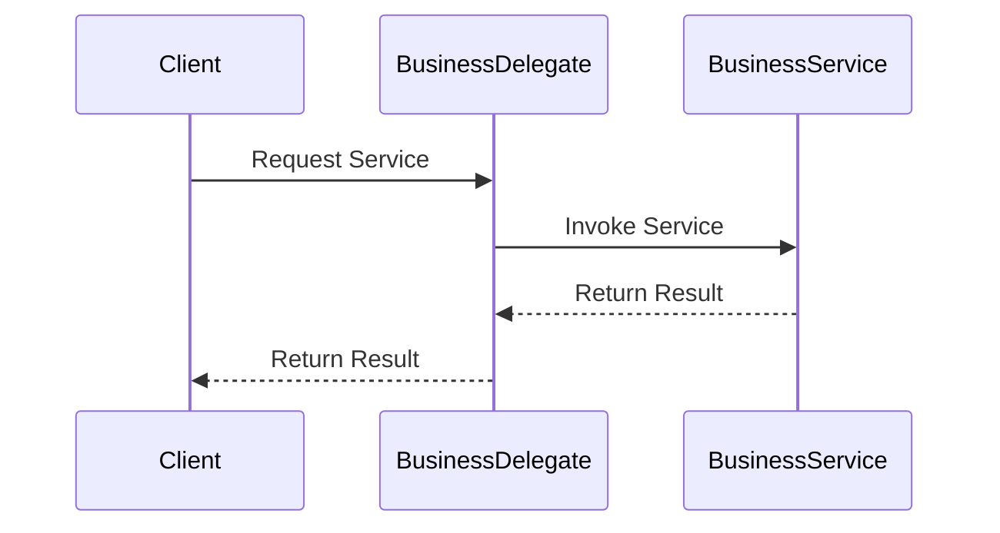

## 8.6.3 Use Cases and Examples

The Business Delegate pattern is a structural design pattern that provides an abstraction layer between the presentation tier and the business services. This pattern is particularly beneficial in enterprise applications, distributed systems, and web applications, where it helps manage complexity and reduce coupling between client code and business services. In this section, we will explore practical use cases and examples that demonstrate the application of the Business Delegate pattern in real-world scenarios.

### Enterprise Application with Remote EJB Services

Enterprise JavaBeans (EJB) are a common technology used in enterprise applications to encapsulate business logic. However, accessing EJB services directly from the presentation layer can lead to tightly coupled code and increased complexity. The Business Delegate pattern offers a solution by providing a unified interface to access these services.

#### Example Scenario

Consider an enterprise application that manages customer orders. The presentation layer needs to interact with remote EJB services to perform operations such as creating, updating, and retrieving orders. By implementing a Business Delegate, we can abstract the complexity of interacting with EJBs and provide a simplified interface for the presentation layer.

#### Code Example

```java
// Business Delegate
public class OrderBusinessDelegate {
    private OrderService orderService;

    public OrderBusinessDelegate() {
        this.orderService = lookupOrderService();
    }

    private OrderService lookupOrderService() {
        // Lookup logic for EJB service
        return new OrderServiceEJB();
    }

    public void createOrder(Order order) {
        orderService.createOrder(order);
    }

    public Order getOrder(int orderId) {
        return orderService.getOrder(orderId);
    }

    public void updateOrder(Order order) {
        orderService.updateOrder(order);
    }
}

// EJB Service Interface
public interface OrderService {
    void createOrder(Order order);
    Order getOrder(int orderId);
    void updateOrder(Order order);
}

// EJB Service Implementation
public class OrderServiceEJB implements OrderService {
    @Override
    public void createOrder(Order order) {
        // EJB logic to create order
    }

    @Override
    public Order getOrder(int orderId) {
        // EJB logic to retrieve order
        return new Order();
    }

    @Override
    public void updateOrder(Order order) {
        // EJB logic to update order
    }
}
```

#### Benefits

- **Simplified Client Code**: The presentation layer interacts with the `OrderBusinessDelegate` instead of directly with EJBs, reducing complexity.
- **Flexibility**: Changes to the EJB implementation do not affect the client code, as long as the interface remains consistent.
- **Decoupling**: The Business Delegate pattern decouples the presentation layer from the business services, allowing for easier maintenance and scalability.

#### Challenges and Mitigation

- **Performance Overhead**: Introducing an additional layer may add some performance overhead. This can be mitigated by optimizing the delegate layer and using caching strategies where appropriate.
- **Complexity in Implementation**: Designing the delegate layer requires careful planning to ensure it provides the necessary abstraction without becoming a bottleneck.

### Distributed System with Complex Communication Protocols

In distributed systems, services may be deployed across different servers and require complex communication protocols. The Business Delegate pattern can help manage these complexities by providing a single point of access to remote services.

#### Example Scenario

Imagine a distributed system for a financial institution where different services handle transactions, account management, and reporting. These services are deployed on different servers and communicate using various protocols such as REST, SOAP, or messaging queues.

#### Code Example

```java
// Business Delegate
public class FinancialServiceDelegate {
    private TransactionService transactionService;
    private AccountService accountService;
    private ReportingService reportingService;

    public FinancialServiceDelegate() {
        this.transactionService = lookupTransactionService();
        this.accountService = lookupAccountService();
        this.reportingService = lookupReportingService();
    }

    private TransactionService lookupTransactionService() {
        // Logic to lookup and connect to transaction service
        return new TransactionServiceREST();
    }

    private AccountService lookupAccountService() {
        // Logic to lookup and connect to account service
        return new AccountServiceSOAP();
    }

    private ReportingService lookupReportingService() {
        // Logic to lookup and connect to reporting service
        return new ReportingServiceMQ();
    }

    public void processTransaction(Transaction transaction) {
        transactionService.processTransaction(transaction);
    }

    public Account getAccountDetails(String accountId) {
        return accountService.getAccountDetails(accountId);
    }

    public Report generateReport(String reportId) {
        return reportingService.generateReport(reportId);
    }
}

// Service Interfaces and Implementations
public interface TransactionService {
    void processTransaction(Transaction transaction);
}

public class TransactionServiceREST implements TransactionService {
    @Override
    public void processTransaction(Transaction transaction) {
        // REST logic to process transaction
    }
}

public interface AccountService {
    Account getAccountDetails(String accountId);
}

public class AccountServiceSOAP implements AccountService {
    @Override
    public Account getAccountDetails(String accountId) {
        // SOAP logic to get account details
        return new Account();
    }
}

public interface ReportingService {
    Report generateReport(String reportId);
}

public class ReportingServiceMQ implements ReportingService {
    @Override
    public Report generateReport(String reportId) {
        // Messaging queue logic to generate report
        return new Report();
    }
}
```

#### Benefits

- **Unified Access**: The `FinancialServiceDelegate` provides a single point of access to various services, simplifying client interactions.
- **Protocol Abstraction**: The delegate abstracts the underlying communication protocols, allowing the client to focus on business logic.
- **Scalability**: New services can be added without affecting the client code, as long as they adhere to the defined interfaces.

#### Challenges and Mitigation

- **Service Discovery**: Discovering and connecting to remote services can be complex. This can be addressed by using service registries or discovery mechanisms.
- **Error Handling**: Handling errors across distributed services requires robust mechanisms. Implementing retries, fallbacks, and circuit breakers can help mitigate these challenges.

### Web Applications with Separated UI Logic

In web applications, separating UI logic from backend services is crucial for maintaining modularity and scalability. The Business Delegate pattern facilitates this separation by acting as an intermediary between the UI and backend services.

#### Example Scenario

Consider a web application for an online bookstore. The application needs to display book details, manage user accounts, and process orders. By using a Business Delegate, the UI can interact with backend services without being tightly coupled to their implementations.

#### Code Example

```java
// Business Delegate
public class BookstoreBusinessDelegate {
    private BookService bookService;
    private UserService userService;
    private OrderService orderService;

    public BookstoreBusinessDelegate() {
        this.bookService = lookupBookService();
        this.userService = lookupUserService();
        this.orderService = lookupOrderService();
    }

    private BookService lookupBookService() {
        // Logic to lookup book service
        return new BookServiceImpl();
    }

    private UserService lookupUserService() {
        // Logic to lookup user service
        return new UserServiceImpl();
    }

    private OrderService lookupOrderService() {
        // Logic to lookup order service
        return new OrderServiceImpl();
    }

    public Book getBookDetails(String bookId) {
        return bookService.getBookDetails(bookId);
    }

    public User getUserProfile(String userId) {
        return userService.getUserProfile(userId);
    }

    public void placeOrder(Order order) {
        orderService.placeOrder(order);
    }
}

// Service Interfaces and Implementations
public interface BookService {
    Book getBookDetails(String bookId);
}

public class BookServiceImpl implements BookService {
    @Override
    public Book getBookDetails(String bookId) {
        // Logic to get book details
        return new Book();
    }
}

public interface UserService {
    User getUserProfile(String userId);
}

public class UserServiceImpl implements UserService {
    @Override
    public User getUserProfile(String userId) {
        // Logic to get user profile
        return new User();
    }
}

public interface OrderService {
    void placeOrder(Order order);
}

public class OrderServiceImpl implements OrderService {
    @Override
    public void placeOrder(Order order) {
        // Logic to place order
    }
}
```

#### Benefits

- **Modularity**: The Business Delegate pattern helps separate UI logic from backend services, promoting modularity and maintainability.
- **Ease of Testing**: With a clear separation of concerns, testing becomes more straightforward, as UI and backend services can be tested independently.
- **Flexibility**: Changes to backend services do not affect the UI, as long as the interfaces remain consistent.

#### Challenges and Mitigation

- **Synchronization**: Ensuring that the UI and backend services remain in sync can be challenging. Implementing real-time updates or polling mechanisms can help address this issue.
- **Complexity in Large Applications**: In large applications, managing multiple delegates can become complex. Using a centralized registry or service locator can help manage this complexity.

### Visualizing the Business Delegate Pattern

To better understand the Business Delegate pattern, let's visualize the interaction between the presentation layer, business delegate, and business services using a sequence diagram.



#### Diagram Description

- **Client**: Represents the presentation layer or UI component that requests a service.
- **BusinessDelegate**: Acts as an intermediary, forwarding requests from the client to the appropriate business service.
- **BusinessService**: Represents the backend service that performs the requested operation.

### Considerations for Using the Business Delegate Pattern

When considering the Business Delegate pattern, it's essential to evaluate the specific needs of your application and the potential benefits and challenges. Here are some key considerations:

- **Use Case Suitability**: The pattern is most beneficial in applications where there is a need to abstract and manage interactions with complex or remote business services.
- **Performance Implications**: While the pattern simplifies client code, it may introduce some performance overhead. Ensure that the benefits outweigh the potential costs.
- **Scalability and Maintenance**: The pattern promotes scalability and ease of maintenance by decoupling the client from the business services. Consider how this aligns with your application's long-term goals.

### Try It Yourself

To gain a deeper understanding of the Business Delegate pattern, try implementing it in a sample application. Here are some suggestions for experimentation:

- **Modify the Code**: Change the underlying business service implementation and observe how the client code remains unaffected.
- **Add New Services**: Introduce new business services and extend the business delegate to support them.
- **Implement Caching**: Add caching to the business delegate to improve performance for frequently requested data.

### Conclusion

The Business Delegate pattern is a powerful tool for managing complexity and reducing coupling in enterprise applications, distributed systems, and web applications. By providing a unified interface to access business services, it simplifies client code and enhances flexibility. While there are challenges to consider, such as performance overhead and complexity, the benefits often outweigh these concerns, making the pattern a valuable addition to your design toolkit.

## Quiz Time!



### What is the primary benefit of using the Business Delegate pattern in enterprise applications?

- [x] Simplifies client code by abstracting service interactions
- [ ] Increases direct access to business services
- [ ] Reduces the need for service interfaces
- [ ] Enhances the complexity of the presentation layer

> **Explanation:** The Business Delegate pattern simplifies client code by providing a unified interface to interact with business services, reducing complexity and coupling.

### In the Business Delegate pattern, what role does the delegate play?

- [x] Acts as an intermediary between the client and business services
- [ ] Directly implements business logic
- [ ] Serves as the client interface
- [ ] Manages database connections

> **Explanation:** The delegate acts as an intermediary, forwarding requests from the client to the appropriate business service and returning results.

### Which of the following is a challenge associated with the Business Delegate pattern?

- [x] Performance overhead due to additional abstraction layer
- [ ] Increased coupling between client and services
- [ ] Difficulty in testing business services
- [ ] Lack of flexibility in modifying services

> **Explanation:** The additional abstraction layer introduced by the Business Delegate pattern can lead to performance overhead, which needs to be managed carefully.

### In a distributed system, how does the Business Delegate pattern help manage service interactions?

- [x] Provides a single point of access to remote services
- [ ] Eliminates the need for service protocols
- [ ] Directly connects clients to all services
- [ ] Increases the complexity of service discovery

> **Explanation:** The Business Delegate pattern provides a single point of access to remote services, simplifying client interactions and abstracting communication protocols.

### What is a common use case for the Business Delegate pattern in web applications?

- [x] Separating UI logic from backend services
- [ ] Directly embedding business logic in the UI
- [ ] Increasing the complexity of UI components
- [ ] Reducing the number of service interfaces

> **Explanation:** In web applications, the Business Delegate pattern is commonly used to separate UI logic from backend services, promoting modularity and maintainability.

### How can the Business Delegate pattern improve scalability in an application?

- [x] By decoupling the client from business services
- [ ] By increasing the number of service interfaces
- [ ] By embedding business logic in the client
- [ ] By reducing the number of services

> **Explanation:** The Business Delegate pattern improves scalability by decoupling the client from business services, allowing for easier maintenance and expansion.

### What is a potential solution to mitigate performance overhead in the Business Delegate pattern?

- [x] Implement caching strategies in the delegate layer
- [ ] Increase the number of service calls
- [ ] Embed business logic directly in the client
- [ ] Reduce the number of service interfaces

> **Explanation:** Implementing caching strategies in the delegate layer can help mitigate performance overhead by reducing the need for repeated service calls.

### In the sequence diagram for the Business Delegate pattern, what does the client do?

- [x] Requests a service through the Business Delegate
- [ ] Directly interacts with the Business Service
- [ ] Manages the Business Delegate
- [ ] Implements the Business Service

> **Explanation:** In the sequence diagram, the client requests a service through the Business Delegate, which then interacts with the Business Service.

### True or False: The Business Delegate pattern increases coupling between the client and business services.

- [ ] True
- [x] False

> **Explanation:** False. The Business Delegate pattern reduces coupling by providing an abstraction layer between the client and business services.

### What is a key consideration when deciding to use the Business Delegate pattern?

- [x] Evaluating the specific needs of the application and potential benefits
- [ ] Ensuring direct access to all business services
- [ ] Increasing the complexity of the client code
- [ ] Reducing the number of service interfaces

> **Explanation:** When deciding to use the Business Delegate pattern, it's important to evaluate the specific needs of the application and the potential benefits, such as reduced coupling and simplified client code.


