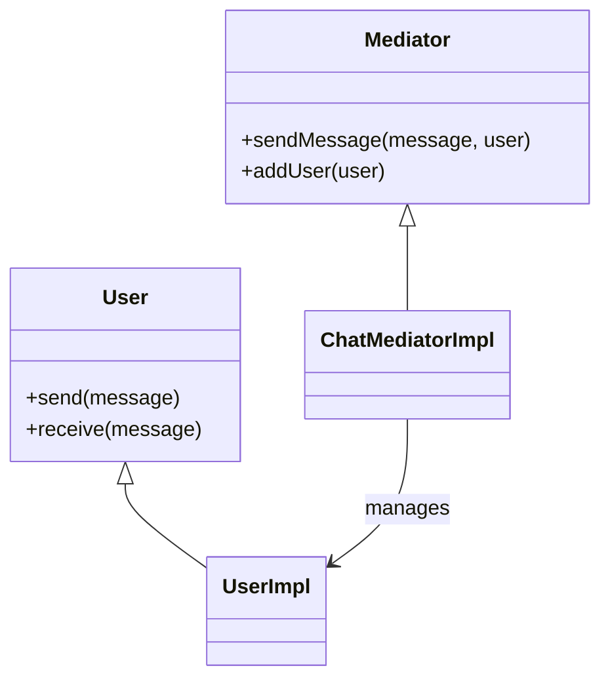
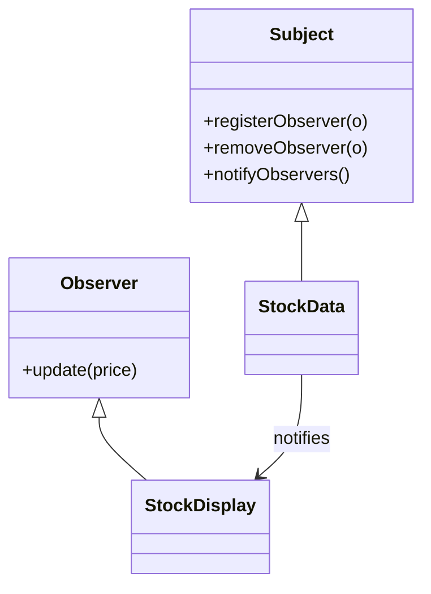

## 8.6.3 Mediator vs. Observer Pattern

In the realm of software design patterns, the **Mediator** and **Observer** patterns are pivotal in managing communication between objects. Both patterns aim to facilitate interaction, yet they differ significantly in their structure and purpose. Understanding these differences is crucial for software architects and developers who strive to create maintainable and efficient systems.

### Introduction to Mediator and Observer Patterns

Before delving into the comparison, it's essential to grasp the fundamental concepts of each pattern:

- **Mediator Pattern**: This pattern centralizes communication between objects, reducing the dependencies between them. It encapsulates how a set of objects interact, promoting loose coupling by keeping objects from referring to each other explicitly.

- **Observer Pattern**: This pattern defines a one-to-many dependency between objects. When one object changes state, all its dependents are notified and updated automatically. It allows dynamic registration and broadcast of events to multiple observers.

### Key Differences Between Mediator and Observer Patterns

#### Structure and Purpose

- **Mediator Pattern**:
  - **Centralized Communication**: The Mediator acts as an intermediary for communication between objects, ensuring that they do not communicate directly.
  - **Purpose**: It is used to reduce the complexity of communication between multiple objects by centralizing control logic.
  
- **Observer Pattern**:
  - **Decentralized Communication**: The Observer pattern allows objects to subscribe and listen for events, enabling dynamic registration and broadcast.
  - **Purpose**: It is used to maintain consistency across multiple objects by notifying them of changes in state.

#### Communication Flow

- **Mediator**: Communication is routed through a central mediator object, which coordinates actions and interactions.
- **Observer**: Communication is event-driven, with subjects notifying observers directly of changes.

#### Use Cases

- **Mediator**: Ideal for scenarios where multiple objects need to interact in a complex manner, such as in a chat application where a central server manages messages.
- **Observer**: Suitable for scenarios where objects need to be notified of changes, such as in a GUI application where UI components need to update in response to data changes.

### Practical Examples

#### Mediator Pattern Example

Consider a chat application where multiple users send messages to each other. The Mediator pattern can be used to manage message delivery:

```java
// Mediator interface
interface ChatMediator {
    void sendMessage(String message, User user);
    void addUser(User user);
}

// Concrete Mediator
class ChatMediatorImpl implements ChatMediator {
    private List<User> users;

    public ChatMediatorImpl() {
        this.users = new ArrayList<>();
    }

    @Override
    public void addUser(User user) {
        this.users.add(user);
    }

    @Override
    public void sendMessage(String message, User user) {
        for (User u : this.users) {
            // Message should not be received by the user sending it
            if (u != user) {
                u.receive(message);
            }
        }
    }
}

// User class
abstract class User {
    protected ChatMediator mediator;
    protected String name;

    public User(ChatMediator med, String name) {
        this.mediator = med;
        this.name = name;
    }

    public abstract void send(String message);
    public abstract void receive(String message);
}

// Concrete User
class UserImpl extends User {
    public UserImpl(ChatMediator med, String name) {
        super(med, name);
    }

    @Override
    public void send(String message) {
        System.out.println(this.name + ": Sending Message=" + message);
        mediator.sendMessage(message, this);
    }

    @Override
    public void receive(String message) {
        System.out.println(this.name + ": Received Message:" + message);
    }
}

// Usage
public class MediatorPatternDemo {
    public static void main(String[] args) {
        ChatMediator mediator = new ChatMediatorImpl();
        User user1 = new UserImpl(mediator, "Alice");
        User user2 = new UserImpl(mediator, "Bob");
        User user3 = new UserImpl(mediator, "Charlie");

        mediator.addUser(user1);
        mediator.addUser(user2);
        mediator.addUser(user3);

        user1.send("Hi All");
    }
}
```

**Explanation**: In this example, the `ChatMediatorImpl` acts as the mediator, managing communication between users. Each user sends messages through the mediator, which then broadcasts them to other users.

#### Observer Pattern Example

Consider a stock market application where multiple displays need to update when stock prices change:

```java
// Subject interface
interface Subject {
    void registerObserver(Observer o);
    void removeObserver(Observer o);
    void notifyObservers();
}

// Concrete Subject
class StockData implements Subject {
    private List<Observer> observers;
    private float price;

    public StockData() {
        observers = new ArrayList<>();
    }

    public void setPrice(float price) {
        this.price = price;
        notifyObservers();
    }

    @Override
    public void registerObserver(Observer o) {
        observers.add(o);
    }

    @Override
    public void removeObserver(Observer o) {
        observers.remove(o);
    }

    @Override
    public void notifyObservers() {
        for (Observer observer : observers) {
            observer.update(price);
        }
    }
}

// Observer interface
interface Observer {
    void update(float price);
}

// Concrete Observer
class StockDisplay implements Observer {
    private String name;

    public StockDisplay(String name) {
        this.name = name;
    }

    @Override
    public void update(float price) {
        System.out.println(name + " Display: Stock Price Updated to " + price);
    }
}

// Usage
public class ObserverPatternDemo {
    public static void main(String[] args) {
        StockData stockData = new StockData();
        StockDisplay display1 = new StockDisplay("Display1");
        StockDisplay display2 = new StockDisplay("Display2");

        stockData.registerObserver(display1);
        stockData.registerObserver(display2);

        stockData.setPrice(100.5f);
        stockData.setPrice(101.0f);
    }
}
```

**Explanation**: In this example, `StockData` is the subject that notifies registered observers (`StockDisplay`) of price changes. Observers update their displays when notified.

### Scenarios for Choosing Between Mediator and Observer

#### When to Use Mediator

- **Complex Interactions**: Use the Mediator pattern when multiple objects need to interact in a complex manner, and you want to centralize control logic.
- **Decoupling Components**: When you need to decouple components to reduce dependencies and improve maintainability.

#### When to Use Observer

- **Event Handling**: Use the Observer pattern when you need to implement event handling mechanisms where multiple objects need to be notified of changes.
- **Dynamic Registration**: When you require dynamic registration and deregistration of observers, allowing flexibility in how objects respond to changes.

### Historical Context and Evolution

The Mediator and Observer patterns have evolved alongside the development of software engineering practices. The Mediator pattern, rooted in the principles of encapsulation and separation of concerns, addresses the complexity of object interactions in large systems. The Observer pattern, on the other hand, emerged from the need to maintain consistency across distributed systems and user interfaces, where changes in one component need to be reflected in others.

### Visualizing the Patterns

#### Mediator Pattern Structure



**Caption**: The Mediator pattern centralizes communication between `User` objects through a `ChatMediatorImpl`.

#### Observer Pattern Structure



**Caption**: The Observer pattern allows `StockData` to notify `StockDisplay` observers of changes in stock prices.

### Conclusion

Both the Mediator and Observer patterns play crucial roles in facilitating communication between objects in software systems. While the Mediator centralizes communication to reduce complexity, the Observer pattern enables dynamic and decentralized event handling. Understanding the differences and appropriate use cases for each pattern is essential for designing robust and maintainable applications.

### Expert Tips and Best Practices

- **Mediator Pattern**: Ensure that the mediator does not become a "god object" by offloading too much logic into it. Keep the mediator focused on communication.
- **Observer Pattern**: Be mindful of potential performance issues with a large number of observers. Consider using asynchronous notifications if necessary.

### Common Pitfalls

- **Mediator**: Avoid overloading the mediator with business logic, which can lead to a tightly coupled system.
- **Observer**: Be cautious of memory leaks caused by observers not being deregistered properly.

### Exercises and Practice Problems

1. Implement a Mediator pattern for a traffic control system where multiple vehicles communicate with a central traffic light.
2. Create an Observer pattern for a weather station application where multiple displays update with changes in weather data.

### Reflection

Consider how you might apply these patterns to your current projects. Are there areas where communication could be centralized or where dynamic event handling could improve system responsiveness?

### References and Further Reading

- [Java Documentation](https://docs.oracle.com/en/java/)
- [Cloud Design Patterns](https://learn.microsoft.com/en-us/azure/architecture/patterns/)
- Gamma, E., Helm, R., Johnson, R., & Vlissides, J. (1994). *Design Patterns: Elements of Reusable Object-Oriented Software*. Addison-Wesley.

## Test Your Knowledge: Mediator and Observer Patterns Quiz



### Which pattern centralizes communication between objects?

- [x] Mediator Pattern
- [ ] Observer Pattern
- [ ] Singleton Pattern
- [ ] Factory Pattern

> **Explanation:** The Mediator pattern centralizes communication by acting as an intermediary between objects.

### What is the primary purpose of the Observer pattern?

- [x] To notify multiple objects of changes in state
- [ ] To centralize control logic
- [ ] To create a single instance of a class
- [ ] To manage object creation

> **Explanation:** The Observer pattern is used to notify multiple objects of changes in state, maintaining consistency across them.

### In which scenario is the Mediator pattern more appropriate?

- [x] Complex interactions between multiple objects
- [ ] Dynamic registration of observers
- [ ] Creating a single instance of a class
- [ ] Managing object creation

> **Explanation:** The Mediator pattern is ideal for scenarios involving complex interactions between multiple objects.

### How does the Observer pattern handle communication?

- [x] Event-driven notifications
- [ ] Centralized control
- [ ] Direct object references
- [ ] Singleton instance

> **Explanation:** The Observer pattern uses event-driven notifications to communicate changes to observers.

### What is a potential drawback of the Mediator pattern?

- [x] The mediator becoming a "god object"
- [ ] Difficulty in dynamic registration
- [ ] High memory usage
- [ ] Lack of flexibility

> **Explanation:** A potential drawback of the Mediator pattern is the risk of the mediator becoming a "god object" with too much logic.

### Which pattern allows for dynamic registration and deregistration of objects?

- [x] Observer Pattern
- [ ] Mediator Pattern
- [ ] Singleton Pattern
- [ ] Factory Pattern

> **Explanation:** The Observer pattern allows for dynamic registration and deregistration of observers.

### What is a common use case for the Observer pattern?

- [x] GUI applications with dynamic updates
- [ ] Centralized control of communication
- [ ] Creating a single instance of a class
- [ ] Managing object creation

> **Explanation:** The Observer pattern is commonly used in GUI applications where dynamic updates are needed.

### Which pattern is more suitable for event handling mechanisms?

- [x] Observer Pattern
- [ ] Mediator Pattern
- [ ] Singleton Pattern
- [ ] Factory Pattern

> **Explanation:** The Observer pattern is more suitable for event handling mechanisms due to its event-driven nature.

### What should be avoided when implementing the Mediator pattern?

- [x] Overloading the mediator with business logic
- [ ] Dynamic registration of observers
- [ ] High memory usage
- [ ] Lack of flexibility

> **Explanation:** When implementing the Mediator pattern, avoid overloading the mediator with business logic to prevent tight coupling.

### True or False: The Observer pattern centralizes communication between objects.

- [ ] True
- [x] False

> **Explanation:** False. The Observer pattern does not centralize communication; it allows for decentralized, event-driven notifications.



---
