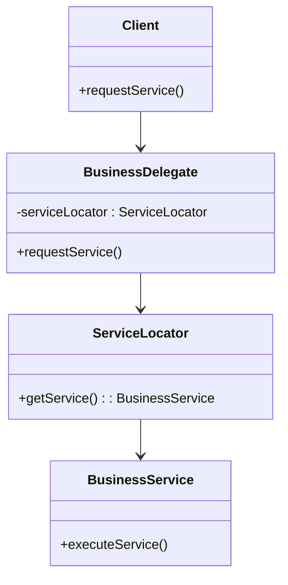
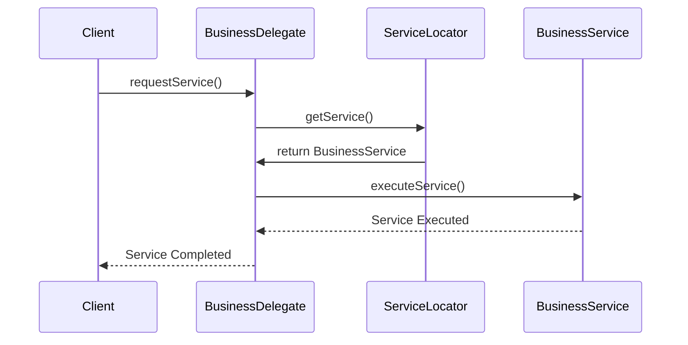

## 8.6 Business Delegate Pattern

In the realm of enterprise applications, where complexity and scalability are paramount, the Business Delegate pattern emerges as a vital design strategy. This pattern serves as a bridge between the presentation layer and business services, effectively decoupling them and reducing the direct dependency of the presentation layer on the business logic. By doing so, it simplifies the interaction with business services and provides a centralized point of control.

### Understanding the Business Delegate Pattern

The Business Delegate pattern is a structural design pattern that acts as an intermediary between the client (often the presentation layer) and the business services. Its primary intent is to hide the complexities of business service interactions from the client, thus reducing the coupling between the presentation layer and the business logic. This pattern is particularly useful in enterprise applications where business logic is often encapsulated in remote services, such as EJBs (Enterprise JavaBeans) or web services.

#### Intent and Motivation

The intent of the Business Delegate pattern is to provide a façade or intermediary that abstracts the underlying business service interactions. By doing so, it allows the client to focus on its core responsibilities without being burdened by the intricacies of service communication, error handling, or service lookup.

**Motivation:**

- **Simplification:** By abstracting the complexity of business service interactions, the Business Delegate pattern simplifies the client-side code.
- **Decoupling:** It reduces the direct dependency of the client on the business services, promoting a more modular and maintainable architecture.
- **Centralized Control:** The pattern provides a single point of control for accessing business services, making it easier to manage changes and enhancements.

### Components of the Business Delegate Pattern

The Business Delegate pattern typically involves the following components:

1. **Business Delegate:** This is the main component that acts as an intermediary between the client and the business services. It provides a simplified interface for the client to interact with the business services.

2. **Service Locator (Optional):** This component is responsible for locating and returning references to the business services. It abstracts the complexity of service lookup, which can involve JNDI (Java Naming and Directory Interface) lookups or other mechanisms.

3. **Business Service:** This represents the actual business logic or service that the client wants to interact with. It can be a remote service, such as an EJB or a web service.

4. **Client:** The client interacts with the Business Delegate to access the business services.

#### UML Diagram of the Business Delegate Pattern

To better understand the structure and flow of the Business Delegate pattern, let's examine a UML diagram:



**Diagram Explanation:**

- The **Client** interacts with the **BusinessDelegate** to request a service.
- The **BusinessDelegate** uses the **ServiceLocator** to find the appropriate **BusinessService**.
- The **ServiceLocator** returns a reference to the **BusinessService**, which the **BusinessDelegate** uses to execute the requested service.

### Advantages of the Business Delegate Pattern

The Business Delegate pattern offers several advantages that make it a valuable design strategy in enterprise applications:

1. **Hides Complexity:** By abstracting the complexities of business service interactions, the Business Delegate pattern simplifies the client-side code and reduces the cognitive load on developers.

2. **Reduces Coupling:** The pattern decouples the presentation layer from the business logic, promoting a more modular and maintainable architecture. This separation of concerns makes it easier to manage changes and enhancements.

3. **Centralized Control:** The Business Delegate pattern provides a single point of control for accessing business services. This centralized control makes it easier to manage service interactions, error handling, and service lookup.

4. **Improved Maintainability:** By decoupling the client from the business services, the pattern improves the maintainability of the application. Changes to the business logic or service interfaces can be made without affecting the client.

5. **Flexibility and Scalability:** The pattern allows for greater flexibility and scalability in the application architecture. It enables the use of different business services without requiring changes to the client code.

### Practical Implementation Strategies

When implementing the Business Delegate pattern, consider the following strategies and best practices:

1. **Define Clear Interfaces:** Define clear and concise interfaces for the Business Delegate and Business Service components. This promotes a clean separation of concerns and makes it easier to manage changes.

2. **Use Service Locator Wisely:** If your application involves complex service lookups, consider using a Service Locator to abstract the lookup logic. However, be mindful of the potential for increased complexity and performance overhead.

3. **Handle Exceptions Gracefully:** Implement robust error handling in the Business Delegate to manage exceptions and failures in service interactions. This ensures that the client is not burdened with handling service-related errors.

4. **Optimize for Performance:** Consider the performance implications of using the Business Delegate pattern, especially in high-load scenarios. Optimize service lookups and interactions to minimize latency and overhead.

5. **Leverage Dependency Injection:** Use dependency injection frameworks, such as Spring, to manage dependencies and promote a more modular and testable architecture.

### Code Example: Implementing the Business Delegate Pattern

Let's walk through a practical example of implementing the Business Delegate pattern in Java. In this example, we'll create a simple application that uses the pattern to interact with a business service.

#### Step 1: Define the Business Service Interface

First, define an interface for the business service that the client wants to interact with:

```java
public interface BusinessService {
    void executeService();
}
```

#### Step 2: Implement the Business Service

Next, implement the business service interface:

```java
public class OrderService implements BusinessService {
    @Override
    public void executeService() {
        System.out.println("Executing Order Service");
    }
}
```

#### Step 3: Create the Service Locator

Implement the Service Locator to manage service lookups:

```java
public class ServiceLocator {
    public BusinessService getService(String serviceName) {
        if (serviceName.equalsIgnoreCase("OrderService")) {
            return new OrderService();
        }
        // Add more services as needed
        return null;
    }
}
```

#### Step 4: Implement the Business Delegate

Create the Business Delegate that interacts with the Service Locator and Business Service:

```java
public class BusinessDelegate {
    private ServiceLocator serviceLocator = new ServiceLocator();
    private BusinessService businessService;

    public void setService(String serviceName) {
        businessService = serviceLocator.getService(serviceName);
    }

    public void executeService() {
        if (businessService != null) {
            businessService.executeService();
        } else {
            System.out.println("No service found");
        }
    }
}
```

#### Step 5: Implement the Client

Finally, implement the client that uses the Business Delegate to access the business service:

```java
public class Client {
    private BusinessDelegate businessDelegate;

    public Client(BusinessDelegate businessDelegate) {
        this.businessDelegate = businessDelegate;
    }

    public void requestService(String serviceName) {
        businessDelegate.setService(serviceName);
        businessDelegate.executeService();
    }

    public static void main(String[] args) {
        BusinessDelegate businessDelegate = new BusinessDelegate();
        Client client = new Client(businessDelegate);

        client.requestService("OrderService");
    }
}
```

### Try It Yourself

Now that we've walked through a basic implementation of the Business Delegate pattern, try experimenting with the code:

- **Add More Services:** Extend the example by adding more business services, such as `PaymentService` or `ShippingService`.
- **Implement Error Handling:** Enhance the Business Delegate to handle exceptions and errors gracefully.
- **Use Dependency Injection:** Refactor the code to use a dependency injection framework, such as Spring, to manage dependencies.

### Visualizing the Business Delegate Pattern

To further enhance your understanding, let's visualize the flow of interactions in the Business Delegate pattern using a sequence diagram:



**Diagram Explanation:**

- The **Client** initiates a service request by calling `requestService()` on the **BusinessDelegate**.
- The **BusinessDelegate** uses the **ServiceLocator** to find the appropriate **BusinessService**.
- The **ServiceLocator** returns a reference to the **BusinessService**.
- The **BusinessDelegate** calls `executeService()` on the **BusinessService** to perform the requested operation.
- Once the service is executed, control returns to the **Client**.

### Preparing for Practical Implementation

When preparing to implement the Business Delegate pattern in a real-world application, consider the following practical considerations:

- **Scalability:** Ensure that the pattern can scale with the application's growth. Consider using caching or pooling mechanisms to optimize service lookups.
- **Security:** Implement security measures to protect sensitive data and ensure secure communication between components.
- **Testing:** Develop comprehensive test cases to validate the functionality and performance of the Business Delegate pattern. Use mocking frameworks to simulate service interactions.
- **Documentation:** Document the design and implementation of the pattern to facilitate maintenance and future enhancements.

### Conclusion

The Business Delegate pattern is a powerful design strategy for decoupling the presentation layer from business services in enterprise applications. By abstracting the complexities of service interactions, it simplifies client-side code, reduces coupling, and provides a centralized point of control. As you explore and implement this pattern, remember to consider scalability, security, and testing to ensure a robust and maintainable architecture.

## Quiz Time!



### What is the primary intent of the Business Delegate pattern?

- [x] To decouple the presentation layer from business services
- [ ] To enhance the performance of business services
- [ ] To simplify database interactions
- [ ] To provide a user interface for business services

> **Explanation:** The primary intent of the Business Delegate pattern is to decouple the presentation layer from business services, reducing the coupling and hiding implementation details.

### Which component of the Business Delegate pattern acts as an intermediary between the client and business services?

- [x] Business Delegate
- [ ] Service Locator
- [ ] Business Service
- [ ] Client

> **Explanation:** The Business Delegate acts as an intermediary between the client and business services, providing a simplified interface for the client.

### What is the role of the Service Locator in the Business Delegate pattern?

- [x] To locate and return references to business services
- [ ] To execute business logic
- [ ] To manage client requests
- [ ] To provide a user interface

> **Explanation:** The Service Locator is responsible for locating and returning references to business services, abstracting the complexity of service lookup.

### How does the Business Delegate pattern improve maintainability?

- [x] By decoupling the client from business services
- [ ] By increasing the complexity of service interactions
- [ ] By embedding business logic in the client
- [ ] By reducing the number of services

> **Explanation:** The Business Delegate pattern improves maintainability by decoupling the client from business services, making it easier to manage changes and enhancements.

### Which of the following is NOT an advantage of the Business Delegate pattern?

- [ ] Hides the complexities of business service interactions
- [ ] Reduces coupling between the presentation layer and business logic
- [x] Increases the number of service calls
- [ ] Provides a single point of control for accessing business services

> **Explanation:** The Business Delegate pattern does not increase the number of service calls; it abstracts and simplifies service interactions.

### In the provided code example, what does the `executeService()` method in the `BusinessDelegate` class do?

- [x] It calls the `executeService()` method on the `BusinessService`
- [ ] It locates the business service
- [ ] It handles client requests
- [ ] It initializes the service locator

> **Explanation:** The `executeService()` method in the `BusinessDelegate` class calls the `executeService()` method on the `BusinessService` to perform the requested operation.

### Why might you use a Service Locator in the Business Delegate pattern?

- [x] To abstract the complexity of service lookups
- [ ] To execute business logic
- [ ] To manage client requests
- [ ] To provide a user interface

> **Explanation:** A Service Locator is used to abstract the complexity of service lookups, making it easier to manage service references.

### What is a potential drawback of using the Business Delegate pattern?

- [x] It can introduce additional complexity and overhead
- [ ] It tightly couples the client and business services
- [ ] It reduces the maintainability of the application
- [ ] It limits the scalability of the application

> **Explanation:** A potential drawback of using the Business Delegate pattern is that it can introduce additional complexity and overhead, especially in high-load scenarios.

### True or False: The Business Delegate pattern is only applicable in Java applications.

- [ ] True
- [x] False

> **Explanation:** False. The Business Delegate pattern is a general design pattern that can be applied in various programming languages and platforms, not just Java.

### Which of the following best describes the role of the Client in the Business Delegate pattern?

- [x] It interacts with the Business Delegate to access business services
- [ ] It locates and returns references to business services
- [ ] It executes business logic
- [ ] It provides a user interface

> **Explanation:** The Client interacts with the Business Delegate to access business services, using the delegate as an intermediary.


