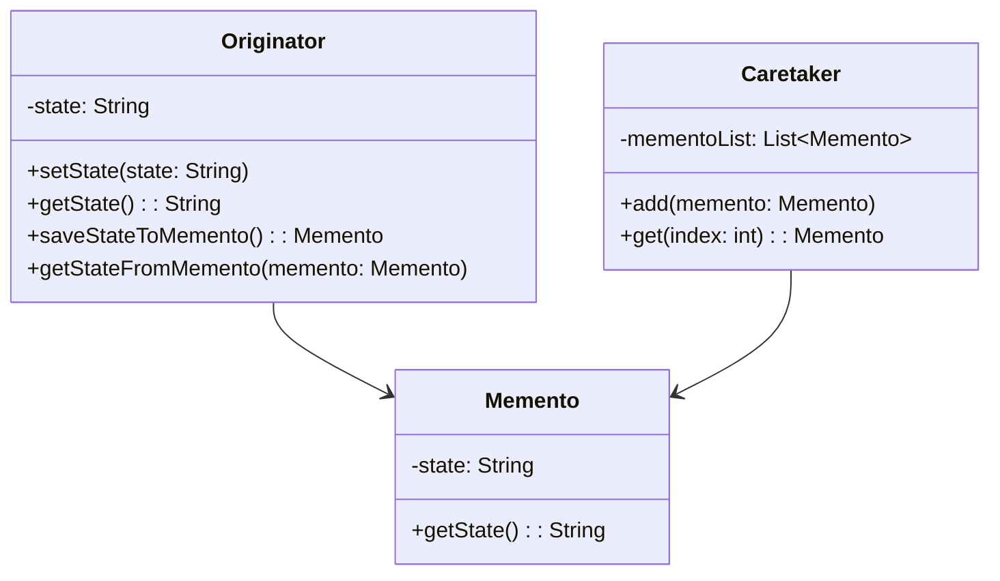

## 8.7.1 Implementing Memento in Java

The Memento pattern is a behavioral design pattern that provides the ability to restore an object to its previous state. This pattern is particularly useful in scenarios where you need to implement undo mechanisms or rollback operations without exposing the internal details of the object. In this section, we will explore the intent, structure, and implementation of the Memento pattern in Java.

### Intent

The primary intent of the Memento pattern is to capture and externalize an object's internal state so that the object can be restored to this state later, without violating encapsulation. This pattern is beneficial in applications that require undo/redo functionality, state rollback, or versioning.

### Benefits

- **Encapsulation**: The Memento pattern preserves encapsulation boundaries by keeping the object's state private.
- **Undo/Redo Functionality**: It provides a straightforward way to implement undo and redo operations.
- **State Management**: Facilitates state management by allowing the state to be saved and restored efficiently.

### Participants

The Memento pattern involves three primary participants:

1. **Originator**: The object whose state needs to be saved and restored.
2. **Memento**: A representation of the Originator's state at a particular point in time.
3. **Caretaker**: Manages the mementos and is responsible for storing and restoring the Originator's state.

### Structure

The following class diagram illustrates the relationships between the participants in the Memento pattern:



**Diagram Explanation**: The `Originator` class interacts with the `Memento` class to save and restore its state. The `Caretaker` class manages the list of mementos.

### Implementation

#### Step-by-Step Implementation

1. **Define the Memento Class**: This class will store the state of the Originator. It should be immutable and only accessible by the Originator.

```java
public class Memento {
    private final String state;

    public Memento(String state) {
        this.state = state;
    }

    public String getState() {
        return state;
    }
}
```

2. **Implement the Originator Class**: This class will create and restore mementos.

```java
public class Originator {
    private String state;

    public void setState(String state) {
        this.state = state;
    }

    public String getState() {
        return state;
    }

    public Memento saveStateToMemento() {
        return new Memento(state);
    }

    public void getStateFromMemento(Memento memento) {
        state = memento.getState();
    }
}
```

3. **Create the Caretaker Class**: This class will manage the mementos.

```java
import java.util.ArrayList;
import java.util.List;

public class Caretaker {
    private List<Memento> mementoList = new ArrayList<>();

    public void add(Memento state) {
        mementoList.add(state);
    }

    public Memento get(int index) {
        return mementoList.get(index);
    }
}
```

4. **Demonstrate Usage**: The following example demonstrates how to use the Memento pattern to save and restore states.

```java
public class MementoPatternDemo {
    public static void main(String[] args) {
        Originator originator = new Originator();
        Caretaker caretaker = new Caretaker();

        originator.setState("State #1");
        originator.setState("State #2");
        caretaker.add(originator.saveStateToMemento());

        originator.setState("State #3");
        caretaker.add(originator.saveStateToMemento());

        originator.setState("State #4");
        System.out.println("Current State: " + originator.getState());

        originator.getStateFromMemento(caretaker.get(0));
        System.out.println("First saved State: " + originator.getState());
        originator.getStateFromMemento(caretaker.get(1));
        System.out.println("Second saved State: " + originator.getState());
    }
}
```

**Explanation**: In this example, the `Originator` object changes its state multiple times. The `Caretaker` stores the states in mementos. The `Originator` can then restore its state from any of the saved mementos.

### Encapsulation and Accessibility

The Memento pattern ensures that the internal state of the Originator is not exposed to other objects. The `Memento` class is typically a nested class within the `Originator` to restrict access to its state. This encapsulation is crucial to maintain the integrity of the Originator's state.

### Serialization as a Memento

In some cases, Java's serialization mechanism can be used as a form of memento. Serialization allows an object's state to be converted into a byte stream and restored later. However, this approach may not be suitable for all scenarios due to performance overhead and security concerns.

```java
import java.io.*;

public class SerializableMemento implements Serializable {
    private static final long serialVersionUID = 1L;
    private String state;

    public SerializableMemento(String state) {
        this.state = state;
    }

    public String getState() {
        return state;
    }
}

public class SerializableOriginator {
    private String state;

    public void setState(String state) {
        this.state = state;
    }

    public String getState() {
        return state;
    }

    public SerializableMemento saveStateToMemento() {
        return new SerializableMemento(state);
    }

    public void getStateFromMemento(SerializableMemento memento) {
        state = memento.getState();
    }

    public byte[] serializeMemento(SerializableMemento memento) throws IOException {
        try (ByteArrayOutputStream bos = new ByteArrayOutputStream();
             ObjectOutputStream out = new ObjectOutputStream(bos)) {
            out.writeObject(memento);
            return bos.toByteArray();
        }
    }

    public SerializableMemento deserializeMemento(byte[] data) throws IOException, ClassNotFoundException {
        try (ByteArrayInputStream bis = new ByteArrayInputStream(data);
             ObjectInputStream in = new ObjectInputStream(bis)) {
            return (SerializableMemento) in.readObject();
        }
    }
}
```

**Explanation**: This example demonstrates how to serialize and deserialize a memento using Java's serialization mechanism. The `SerializableMemento` class implements `Serializable`, allowing its state to be saved and restored.

### Best Practices

- **Encapsulation**: Ensure that the Memento's state is not accessible to any class other than the Originator.
- **Performance**: Consider the performance implications of storing large numbers of mementos.
- **Security**: Be cautious when using serialization, as it can introduce security vulnerabilities.

### Sample Use Cases

- **Text Editors**: Implementing undo and redo functionality.
- **Game Development**: Saving and loading game states.
- **Database Transactions**: Rolling back to a previous state in case of errors.

### Related Patterns

- **[Command Pattern]( "Command Pattern")**: Often used in conjunction with the Memento pattern to implement undo/redo functionality.
- **[Prototype Pattern]( "Prototype Pattern")**: Can be used to create a copy of an object, similar to saving a state.

### Known Uses

- **Java Swing**: The undo/redo functionality in text components.
- **Version Control Systems**: Storing and restoring different versions of files.

### Conclusion

The Memento pattern is a powerful tool for managing state in Java applications. By encapsulating the state within a memento, developers can implement robust undo/redo functionality while preserving encapsulation. Understanding and applying the Memento pattern can significantly enhance the flexibility and maintainability of your software designs.

## Test Your Knowledge: Memento Pattern in Java Quiz



### What is the primary purpose of the Memento pattern?

- [x] To capture and restore an object's state without violating encapsulation.
- [ ] To provide a way to create objects without specifying their concrete classes.
- [ ] To define a family of algorithms and make them interchangeable.
- [ ] To ensure a class has only one instance and provide a global point of access to it.

> **Explanation:** The Memento pattern is designed to capture and restore an object's state without exposing its internal structure.

### Which participant in the Memento pattern is responsible for storing the mementos?

- [ ] Originator
- [x] Caretaker
- [ ] Memento
- [ ] Observer

> **Explanation:** The Caretaker is responsible for storing and managing the mementos.

### How does the Memento pattern maintain encapsulation?

- [x] By keeping the Memento's state private and only accessible by the Originator.
- [ ] By using public methods to access the Memento's state.
- [ ] By allowing the Caretaker to modify the Memento's state.
- [ ] By storing the state in a global variable.

> **Explanation:** The Memento pattern maintains encapsulation by ensuring that the Memento's state is only accessible by the Originator.

### What is a potential drawback of using the Memento pattern?

- [x] It can consume a lot of memory if many mementos are stored.
- [ ] It exposes the internal state of the Originator.
- [ ] It makes the system less flexible.
- [ ] It complicates the code unnecessarily.

> **Explanation:** Storing a large number of mementos can lead to high memory consumption.

### In which scenario is the Memento pattern particularly useful?

- [x] Implementing undo/redo functionality in applications.
- [ ] Creating complex object hierarchies.
- [ ] Managing concurrent access to shared resources.
- [ ] Simplifying the creation of complex objects.

> **Explanation:** The Memento pattern is ideal for implementing undo/redo functionality by saving and restoring states.

### What is the role of the Originator in the Memento pattern?

- [x] To create and restore mementos.
- [ ] To manage the list of mementos.
- [ ] To provide a global point of access to mementos.
- [ ] To define a family of algorithms.

> **Explanation:** The Originator is responsible for creating mementos and restoring its state from them.

### Can Java's serialization mechanism be used as a form of memento?

- [x] Yes, but it may have performance and security implications.
- [ ] No, serialization cannot be used as a memento.
- [ ] Yes, without any drawbacks.
- [ ] No, because it violates encapsulation.

> **Explanation:** Serialization can be used as a memento, but it may introduce performance overhead and security concerns.

### Which design pattern is often used with the Memento pattern to implement undo/redo functionality?

- [ ] Singleton Pattern
- [x] Command Pattern
- [ ] Observer Pattern
- [ ] Factory Pattern

> **Explanation:** The Command pattern is often used with the Memento pattern to implement undo/redo functionality.

### What is a key consideration when using the Memento pattern?

- [x] Ensuring that the Memento's state is not accessible to other objects.
- [ ] Making the Memento's state publicly accessible.
- [ ] Allowing the Caretaker to modify the Memento's state.
- [ ] Storing the Memento's state in a global variable.

> **Explanation:** A key consideration is to ensure that the Memento's state is only accessible by the Originator to maintain encapsulation.

### True or False: The Memento pattern is a creational design pattern.

- [ ] True
- [x] False

> **Explanation:** The Memento pattern is a behavioral design pattern, not a creational one.



By mastering the Memento pattern, Java developers can enhance their ability to manage object states effectively, leading to more robust and maintainable applications.
