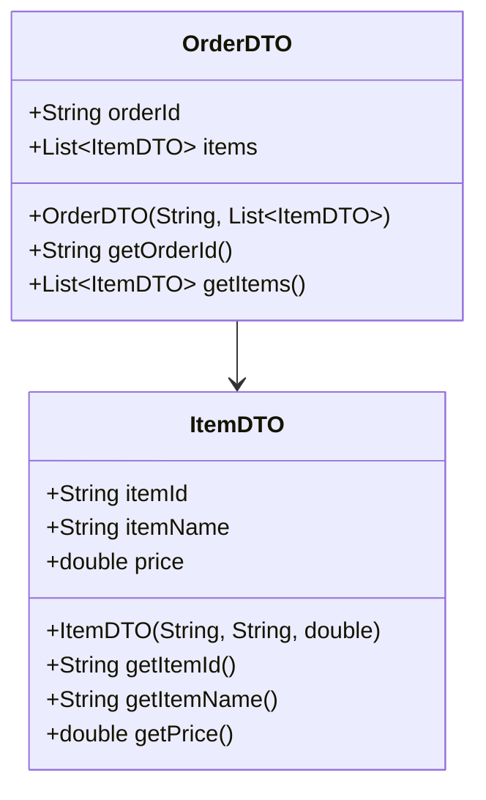

## 8.7.1 Implementing Transfer Object in Java

In this section, we delve into the Transfer Object pattern, also known as the Value Object pattern, and its implementation in Java. This pattern is essential for efficiently transferring data across different layers of an application, particularly in enterprise environments where data integrity and performance are crucial.

### Understanding the Transfer Object Pattern

The Transfer Object pattern is designed to encapsulate data in a simple, serializable object that can be easily transferred across different layers or systems. These objects are typically used to transport data between client and server in distributed applications. By using Transfer Objects, you can reduce the number of method calls, which is particularly beneficial in remote interfaces where each call can be costly.

### Defining Transfer Objects

Transfer Objects are typically defined as simple Java classes with private fields and public getters. While setters can be included, immutability is often preferred to prevent unintended modifications. Here's a basic structure of a Transfer Object:

```java
public class UserDTO implements Serializable {
    private static final long serialVersionUID = 1L;
    
    private final String username;
    private final String email;
    private final int age;

    public UserDTO(String username, String email, int age) {
        this.username = username;
        this.email = email;
        this.age = age;
    }

    public String getUsername() {
        return username;
    }

    public String getEmail() {
        return email;
    }

    public int getAge() {
        return age;
    }
}
```

### Making Transfer Objects Serializable

To facilitate the transmission of Transfer Objects over a network or their persistence, they should implement the `Serializable` interface. This allows Java's serialization mechanism to convert the object into a byte stream, which can then be sent over a network or saved to a file.

### Best Practices for Transfer Objects

1. **Keep Transfer Objects Simple**: Focus on carrying data without embedding business logic.
2. **Use Immutability**: Define fields as `final` and provide only getters to prevent unintended modifications.
3. **Avoid Business Logic**: Transfer Objects should not contain any business logic. They are purely for data transport.
4. **Handle Nested Structures**: For complex data structures, consider using nested Transfer Objects or collections.

### Handling Nested or Complex Data Structures

When dealing with nested or complex data structures, it's important to maintain clarity and simplicity. You can achieve this by using nested Transfer Objects or collections like `List` or `Map`. Here's an example:

```java
public class OrderDTO implements Serializable {
    private static final long serialVersionUID = 1L;
    
    private final String orderId;
    private final List<ItemDTO> items;

    public OrderDTO(String orderId, List<ItemDTO> items) {
        this.orderId = orderId;
        this.items = Collections.unmodifiableList(new ArrayList<>(items));
    }

    public String getOrderId() {
        return orderId;
    }

    public List<ItemDTO> getItems() {
        return items;
    }
}

public class ItemDTO implements Serializable {
    private static final long serialVersionUID = 1L;
    
    private final String itemId;
    private final String itemName;
    private final double price;

    public ItemDTO(String itemId, String itemName, double price) {
        this.itemId = itemId;
        this.itemName = itemName;
        this.price = price;
    }

    public String getItemId() {
        return itemId;
    }

    public String getItemName() {
        return itemName;
    }

    public double getPrice() {
        return price;
    }
}
```

### Versioning and Compatibility

When Transfer Objects are shared between different systems or services, versioning and compatibility become important considerations. Here are some strategies to manage these challenges:

- **Version Fields**: Include a version field in your Transfer Object to handle changes over time.
- **Backward Compatibility**: Ensure that new versions of your Transfer Object are backward compatible with older versions.
- **Use of Optional Fields**: Consider using optional fields or default values to accommodate changes without breaking existing clients.

### Try It Yourself

To better understand how Transfer Objects work, try modifying the `UserDTO` class to include additional fields, such as `address` or `phoneNumber`. Implement serialization and deserialization methods to see how data is transferred and stored.

### Visualizing Transfer Object Relationships

Below is a class diagram illustrating the relationship between `OrderDTO` and `ItemDTO`:



### Key Takeaways

- Transfer Objects are simple, serializable Java classes used to transport data.
- Immutability is preferred to prevent unintended modifications.
- Avoid embedding business logic within Transfer Objects.
- Handle nested or complex data structures with care.
- Consider versioning and compatibility when sharing Transfer Objects across systems.

### References and Further Reading

- [Java Serialization](https://docs.oracle.com/javase/8/docs/platform/serialization/spec/serialTOC.html)
- [Effective Java by Joshua Bloch](https://www.oreilly.com/library/view/effective-java-3rd/9780134686097/)
- [Design Patterns: Elements of Reusable Object-Oriented Software](https://www.amazon.com/Design-Patterns-Elements-Reusable-Object-Oriented/dp/0201633612)

## Quiz Time!



### What is the primary purpose of a Transfer Object?

- [x] To encapsulate data for transfer across different layers or systems.
- [ ] To perform business logic operations.
- [ ] To manage database connections.
- [ ] To handle user authentication.

> **Explanation:** Transfer Objects are used to encapsulate data for efficient transfer across different layers or systems, reducing the number of method calls.

### Why is immutability preferred in Transfer Objects?

- [x] To prevent unintended modifications.
- [ ] To increase the complexity of the object.
- [ ] To allow for dynamic changes in data.
- [ ] To embed business logic within the object.

> **Explanation:** Immutability is preferred to prevent unintended modifications, ensuring data integrity during transfer.

### What interface should Transfer Objects implement for network transmission?

- [x] Serializable
- [ ] Cloneable
- [ ] Comparable
- [ ] Runnable

> **Explanation:** Transfer Objects should implement the `Serializable` interface to facilitate network transmission or persistence.

### Which of the following is NOT a best practice for Transfer Objects?

- [ ] Keep them simple and focused on carrying data.
- [ ] Use immutability to prevent unintended modifications.
- [x] Embed business logic within Transfer Objects.
- [ ] Avoid embedding business logic within Transfer Objects.

> **Explanation:** Transfer Objects should not contain business logic; they are meant solely for data transport.

### How can you handle nested data structures in Transfer Objects?

- [x] Use nested Transfer Objects or collections.
- [ ] Embed all data in a single flat structure.
- [ ] Use only primitive data types.
- [ ] Avoid using nested data structures altogether.

> **Explanation:** Nested Transfer Objects or collections can be used to handle complex data structures effectively.

### What is a potential issue when sharing Transfer Objects between systems?

- [x] Versioning and compatibility
- [ ] Lack of serialization
- [ ] Excessive business logic
- [ ] Overuse of primitive types

> **Explanation:** Versioning and compatibility are important considerations when sharing Transfer Objects between different systems or services.

### How can you ensure backward compatibility in Transfer Objects?

- [x] Include version fields and use optional fields or default values.
- [ ] Avoid any changes to the Transfer Object.
- [ ] Use only primitive data types.
- [ ] Embed business logic within the object.

> **Explanation:** Including version fields and using optional fields or default values can help ensure backward compatibility.

### What is the role of the `serialVersionUID` in a Transfer Object?

- [x] To ensure consistent serialization and deserialization.
- [ ] To perform business logic operations.
- [ ] To manage database connections.
- [ ] To handle user authentication.

> **Explanation:** The `serialVersionUID` is used to ensure consistent serialization and deserialization of objects.

### Which pattern is also known as the Value Object pattern?

- [x] Transfer Object
- [ ] Singleton
- [ ] Factory Method
- [ ] Observer

> **Explanation:** The Transfer Object pattern is also known as the Value Object pattern.

### True or False: Transfer Objects should contain business logic to enhance their functionality.

- [ ] True
- [x] False

> **Explanation:** Transfer Objects should not contain business logic; they are meant solely for data transport.



Remember, this is just the beginning. As you progress, you'll build more complex and interactive applications. Keep experimenting, stay curious, and enjoy the journey!
