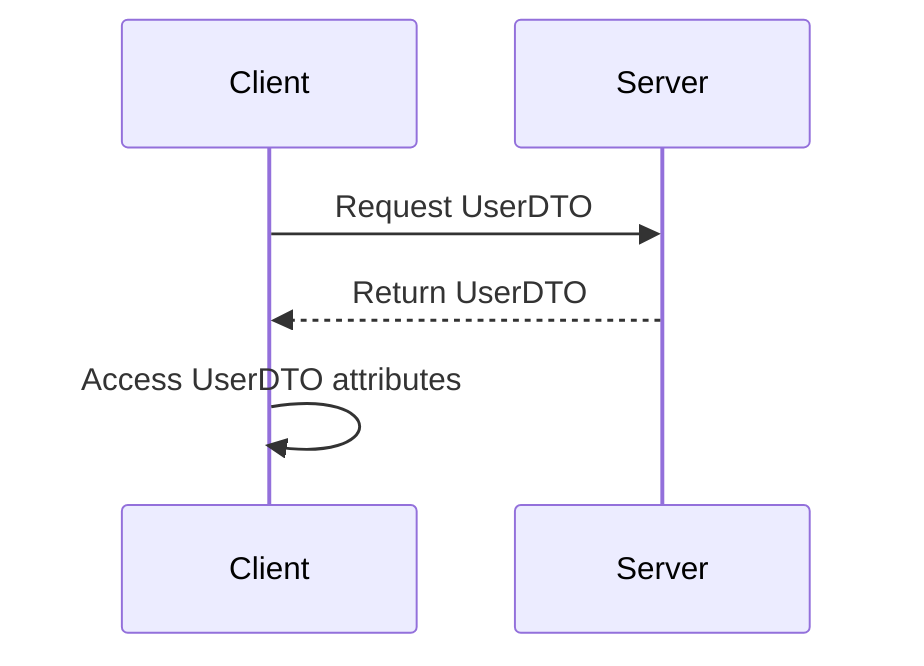

## 8.7.2 Reducing Remote Calls

In the realm of distributed systems, remote method invocations (RMIs) are a common mechanism for communication between different components. However, these RMIs come with inherent overheads that can significantly impact the performance and scalability of an application. In this section, we delve into how the Transfer Object Pattern, also known as the Value Object Pattern, can be leveraged to reduce the number of remote calls, thereby enhancing system performance and reducing network congestion.

### Understanding Remote Method Invocation Overhead

Remote method invocations are essential for enabling communication in distributed systems, where components may reside on different machines or networks. However, each RMI involves several costly operations:

1. **Network Latency**: Each call incurs network latency, which can be substantial, especially in geographically distributed systems.
2. **Serialization/Deserialization**: Data must be serialized before transmission and deserialized upon receipt, adding processing overhead.
3. **Connection Management**: Establishing and maintaining connections between remote components can be resource-intensive.
4. **Protocol Overhead**: Communication protocols add additional data to each message, increasing the payload size.

These factors contribute to the overall cost of remote calls, making it imperative to minimize their frequency and optimize their execution.

### The Transfer Object Pattern

The Transfer Object Pattern addresses the inefficiencies associated with frequent remote calls by bundling data into a single object, known as a Transfer Object or Data Transfer Object (DTO). This pattern is particularly useful when multiple pieces of data need to be transferred between client and server or between different layers of an application.

#### Key Benefits

- **Reduced Network Traffic**: By consolidating multiple data items into a single transfer, the number of remote calls is reduced, leading to less network traffic.
- **Improved Performance**: Fewer remote calls mean reduced latency and processing overhead, resulting in faster response times.
- **Simplified Code**: The pattern encourages a cleaner separation of concerns, with data encapsulated in dedicated objects.

### Implementing the Transfer Object Pattern

Let's explore how the Transfer Object Pattern can be implemented in Java to reduce remote calls.

#### Scenario: Before Using Transfer Object

Consider a scenario where a client needs to retrieve multiple attributes of a user from a remote server. Without the Transfer Object Pattern, the client might make separate remote calls for each attribute:

```java
// Remote interface
public interface UserService {
    String getUserName(int userId) throws RemoteException;
    String getUserEmail(int userId) throws RemoteException;
    String getUserPhone(int userId) throws RemoteException;
}

// Client code
UserService userService = // obtain remote service reference
String name = userService.getUserName(userId);
String email = userService.getUserEmail(userId);
String phone = userService.getUserPhone(userId);
```

In this example, three separate remote calls are made, each incurring the overheads discussed earlier.

#### Scenario: After Using Transfer Object

By employing the Transfer Object Pattern, we can bundle these attributes into a single object and retrieve them in one call:

```java
// Transfer Object
public class UserDTO implements Serializable {
    private String name;
    private String email;
    private String phone;

    // Getters and setters
}

// Remote interface
public interface UserService {
    UserDTO getUserDetails(int userId) throws RemoteException;
}

// Client code
UserService userService = // obtain remote service reference
UserDTO user = userService.getUserDetails(userId);
String name = user.getName();
String email = user.getEmail();
String phone = user.getPhone();
```

Here, a single remote call retrieves all necessary data, significantly reducing the overhead.

### Performance Improvements and Network Congestion Reduction

The primary advantage of using the Transfer Object Pattern is the reduction in the number of remote calls. This reduction leads to several performance improvements:

- **Decreased Latency**: Fewer calls mean less waiting time for network round-trips.
- **Lower CPU Usage**: Reduced serialization and deserialization operations decrease CPU load.
- **Reduced Network Congestion**: By minimizing the number of messages sent over the network, congestion is alleviated, benefiting overall system throughput.

### Balancing Transfer Object Size

While the Transfer Object Pattern offers substantial benefits, it's crucial to balance the size of Transfer Objects. Overly large objects can lead to:

- **Increased Memory Usage**: Large objects consume more memory, which can be a concern in memory-constrained environments.
- **Higher Serialization Costs**: Larger objects take longer to serialize and deserialize, potentially negating performance gains.
- **Unnecessary Data Transfer**: Including unused data in Transfer Objects can lead to inefficiencies.

#### Best Practices for Transfer Object Design

1. **Include Only Necessary Data**: Ensure that Transfer Objects contain only the data required for the operation.
2. **Use Lazy Loading**: For large datasets, consider lazy loading strategies to fetch data only when needed.
3. **Optimize Serialization**: Use efficient serialization mechanisms, such as protocol buffers or JSON, to minimize serialization overhead.

### Visualizing the Transfer Object Pattern

To better understand the flow of data and the reduction in remote calls, let's visualize the process using a sequence diagram.



**Diagram Description**: This sequence diagram illustrates the interaction between a client and server using the Transfer Object Pattern. The client makes a single request for a `UserDTO`, and the server returns the object containing all necessary attributes. The client then accesses these attributes locally, eliminating the need for multiple remote calls.

### Considerations and Challenges

While the Transfer Object Pattern is effective in reducing remote calls, there are considerations and challenges to keep in mind:

- **Versioning**: As systems evolve, Transfer Objects may need to change. Implement versioning strategies to handle backward compatibility.
- **Security**: Ensure that sensitive data is protected during transfer, using encryption and secure communication channels.
- **Complexity**: For complex systems, managing Transfer Objects can become challenging. Use automated tools and frameworks to streamline this process.

### Try It Yourself

To gain hands-on experience with the Transfer Object Pattern, try modifying the provided code examples:

- **Add Additional Attributes**: Extend the `UserDTO` to include additional user attributes and observe the impact on remote calls.
- **Implement Lazy Loading**: Modify the `UserDTO` to fetch certain attributes lazily, only when accessed.
- **Experiment with Serialization**: Change the serialization format of `UserDTO` to JSON and measure the performance impact.

### Knowledge Check

Before moving on, let's reinforce our understanding of the Transfer Object Pattern with a few questions:

- What are the main benefits of using the Transfer Object Pattern in distributed systems?
- How does the pattern reduce network congestion?
- What are some potential drawbacks of using large Transfer Objects?

### Conclusion

The Transfer Object Pattern is a powerful tool for optimizing remote communication in distributed systems. By bundling data into a single object, we can significantly reduce the number of remote calls, leading to improved performance and reduced network congestion. However, it's essential to carefully design Transfer Objects to balance efficiency with resource usage. As you continue to explore design patterns, remember that the key to success lies in understanding the specific needs of your application and selecting the right patterns to address them.

## Quiz Time!



### What is the primary purpose of the Transfer Object Pattern?

- [x] To reduce the number of remote calls by bundling data into a single object.
- [ ] To increase the number of remote calls for better data distribution.
- [ ] To enhance the security of data during transmission.
- [ ] To simplify the serialization process.

> **Explanation:** The Transfer Object Pattern is used to reduce the number of remote calls by bundling multiple pieces of data into a single object, thus minimizing network traffic and latency.

### Which of the following is a benefit of using the Transfer Object Pattern?

- [x] Reduced network traffic
- [x] Improved performance
- [ ] Increased memory usage
- [ ] More complex code

> **Explanation:** The Transfer Object Pattern reduces network traffic and improves performance by minimizing the number of remote calls. It does not inherently increase memory usage or complexity.

### What is a potential drawback of using large Transfer Objects?

- [x] Increased memory usage
- [x] Higher serialization costs
- [ ] Reduced network latency
- [ ] Simplified code

> **Explanation:** Large Transfer Objects can lead to increased memory usage and higher serialization costs, which may offset some of the performance gains from reducing remote calls.

### How can you ensure that Transfer Objects contain only necessary data?

- [x] By carefully designing the Transfer Object to include only required attributes.
- [ ] By including all possible data to avoid future changes.
- [ ] By using a single Transfer Object for all operations.
- [ ] By avoiding the use of Transfer Objects altogether.

> **Explanation:** Transfer Objects should be carefully designed to include only the data necessary for the operation to avoid unnecessary data transfer and resource usage.

### What is a common strategy for handling changes in Transfer Object structure over time?

- [x] Implementing versioning strategies
- [ ] Avoiding any changes to Transfer Objects
- [ ] Using a single version of Transfer Objects for all time
- [ ] Ignoring backward compatibility

> **Explanation:** Implementing versioning strategies allows systems to handle changes in Transfer Object structure over time while maintaining backward compatibility.

### Which of the following can help optimize the serialization of Transfer Objects?

- [x] Using efficient serialization mechanisms like JSON or protocol buffers
- [ ] Using plain text serialization
- [ ] Avoiding serialization altogether
- [ ] Using XML serialization exclusively

> **Explanation:** Efficient serialization mechanisms like JSON or protocol buffers can help optimize the serialization process, reducing overhead and improving performance.

### What is the effect of reducing the number of remote calls on network congestion?

- [x] It reduces network congestion.
- [ ] It increases network congestion.
- [ ] It has no effect on network congestion.
- [ ] It complicates network management.

> **Explanation:** Reducing the number of remote calls decreases the amount of data transmitted over the network, thereby reducing network congestion.

### What is a key consideration when designing Transfer Objects?

- [x] Balancing the size of Transfer Objects to avoid unnecessary data transfer
- [ ] Including as much data as possible to cover all use cases
- [ ] Avoiding the use of Transfer Objects
- [ ] Using Transfer Objects only for small datasets

> **Explanation:** It's important to balance the size of Transfer Objects to ensure that only necessary data is transferred, avoiding unnecessary data transfer and resource usage.

### How does the Transfer Object Pattern improve performance?

- [x] By reducing the number of remote calls and associated overhead
- [ ] By increasing the number of remote calls for better distribution
- [ ] By simplifying the client-side code
- [ ] By avoiding the use of serialization

> **Explanation:** The Transfer Object Pattern improves performance by reducing the number of remote calls, thus minimizing the associated overhead and latency.

### True or False: The Transfer Object Pattern can help in reducing the serialization and deserialization overhead.

- [x] True
- [ ] False

> **Explanation:** True. By bundling data into a single Transfer Object, the pattern reduces the number of serialization and deserialization operations, thereby decreasing overhead.


