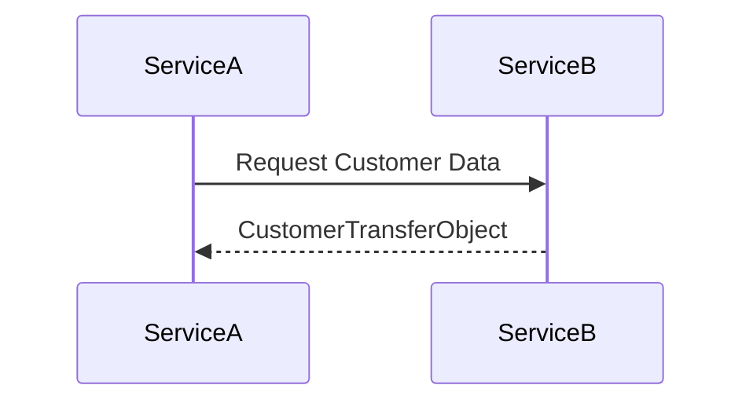

## 8.7.3 Use Cases and Examples

The Transfer Object pattern, also known as the Value Object pattern, is a design pattern used to transfer data between software application subsystems. This pattern is particularly useful in distributed systems and web services, where it helps to encapsulate data in a single object to reduce the number of method calls. Let's delve into some practical applications and examples of this pattern in Java, focusing on its usage in application clients, web services, and microservices.

### Application Client Retrieving Customer Details

Imagine a scenario where an application client needs to retrieve customer details from a remote server. Without the Transfer Object pattern, the client might make multiple calls to the server to fetch each piece of information, leading to increased network traffic and latency. By using a Transfer Object, we can encapsulate all the required data in a single object, reducing the number of remote calls.

#### Code Example

Let's consider a simple example where a client retrieves customer details using a Transfer Object:

```java
// CustomerTransferObject.java
public class CustomerTransferObject {
    private String customerId;
    private String name;
    private String email;
    private String phoneNumber;

    // Constructor
    public CustomerTransferObject(String customerId, String name, String email, String phoneNumber) {
        this.customerId = customerId;
        this.name = name;
        this.email = email;
        this.phoneNumber = phoneNumber;
    }

    // Getters
    public String getCustomerId() {
        return customerId;
    }

    public String getName() {
        return name;
    }

    public String getEmail() {
        return email;
    }

    public String getPhoneNumber() {
        return phoneNumber;
    }
}

// CustomerService.java
public class CustomerService {
    public CustomerTransferObject getCustomerDetails(String customerId) {
        // Simulate retrieving customer details from a database
        return new CustomerTransferObject(customerId, "John Doe", "john.doe@example.com", "123-456-7890");
    }
}

// Client.java
public class Client {
    public static void main(String[] args) {
        CustomerService service = new CustomerService();
        CustomerTransferObject customer = service.getCustomerDetails("CUST123");

        System.out.println("Customer ID: " + customer.getCustomerId());
        System.out.println("Name: " + customer.getName());
        System.out.println("Email: " + customer.getEmail());
        System.out.println("Phone Number: " + customer.getPhoneNumber());
    }
}
```

In this example, the `CustomerTransferObject` encapsulates all the customer details. The `CustomerService` class uses this object to return customer data to the client in a single call, reducing network overhead.

### Web Services Exchanging Data

In web services, data is often exchanged between clients and servers using JSON or XML representations of Transfer Objects. This approach ensures that data contracts are clear and consistent, facilitating easier data manipulation and integration.

#### JSON Representation Example

Consider a web service that provides customer data in JSON format:

```java
// CustomerTransferObject.java
import com.fasterxml.jackson.annotation.JsonProperty;

public class CustomerTransferObject {
    @JsonProperty("customer_id")
    private String customerId;

    @JsonProperty("name")
    private String name;

    @JsonProperty("email")
    private String email;

    @JsonProperty("phone_number")
    private String phoneNumber;

    // Constructor, getters, and setters omitted for brevity
}

// CustomerService.java
import com.fasterxml.jackson.databind.ObjectMapper;

public class CustomerService {
    public String getCustomerDetailsAsJson(String customerId) throws Exception {
        CustomerTransferObject customer = new CustomerTransferObject(customerId, "Jane Doe", "jane.doe@example.com", "098-765-4321");
        ObjectMapper mapper = new ObjectMapper();
        return mapper.writeValueAsString(customer);
    }
}

// Client.java
public class Client {
    public static void main(String[] args) {
        CustomerService service = new CustomerService();
        try {
            String customerJson = service.getCustomerDetailsAsJson("CUST456");
            System.out.println("Customer JSON: " + customerJson);
        } catch (Exception e) {
            e.printStackTrace();
        }
    }
}
```

In this example, the `CustomerTransferObject` is annotated with Jackson annotations to facilitate JSON serialization. The `CustomerService` class converts the Transfer Object into a JSON string, which can be easily transmitted over the network.

### Microservices Communication

Microservices often need to communicate complex data structures efficiently. The Transfer Object pattern is ideal for this purpose, as it allows microservices to exchange data in a structured and consistent manner.

#### Diagram: Microservices Communication Using Transfer Objects



In this diagram, `ServiceA` requests customer data from `ServiceB`. `ServiceB` responds with a `CustomerTransferObject`, encapsulating all the necessary information in a single object.

#### Code Example

Let's see how microservices can use Transfer Objects for communication:

```java
// CustomerTransferObject.java remains the same

// ServiceA.java
public class ServiceA {
    private ServiceBClient serviceBClient = new ServiceBClient();

    public void requestCustomerData(String customerId) {
        CustomerTransferObject customer = serviceBClient.getCustomerDetails(customerId);
        System.out.println("Received Customer Data: " + customer.getName());
    }
}

// ServiceBClient.java
public class ServiceBClient {
    public CustomerTransferObject getCustomerDetails(String customerId) {
        // Simulate a remote call to ServiceB
        return new CustomerTransferObject(customerId, "Alice Smith", "alice.smith@example.com", "555-123-4567");
    }
}

// Main.java
public class Main {
    public static void main(String[] args) {
        ServiceA serviceA = new ServiceA();
        serviceA.requestCustomerData("CUST789");
    }
}
```

In this example, `ServiceA` communicates with `ServiceB` through a client class, `ServiceBClient`. The `CustomerTransferObject` is used to encapsulate customer data, ensuring efficient data transfer between the services.

### Benefits of Using Transfer Objects

The Transfer Object pattern offers several benefits:

1. **Improved Performance**: By reducing the number of remote calls, Transfer Objects minimize network latency and improve application performance.
2. **Clear Data Contracts**: Transfer Objects define clear data contracts, making it easier to understand and manipulate data structures.
3. **Easier Data Manipulation**: With all related data encapsulated in a single object, manipulating and processing data becomes straightforward.

### Challenges and Considerations

While the Transfer Object pattern provides numerous advantages, it also presents some challenges:

1. **Consistency Maintenance**: Keeping Transfer Objects consistent with domain models can be challenging, especially as the application evolves.
2. **Overhead**: If not used judiciously, Transfer Objects can introduce additional overhead, particularly if they encapsulate large amounts of data.
3. **Complexity**: Designing and maintaining Transfer Objects can add complexity to the application architecture.

### Encouragement to Use Transfer Objects

We encourage you to consider using Transfer Objects in your distributed applications to optimize data transfer. By encapsulating data in a single object, you can reduce network overhead, improve performance, and ensure clear data contracts. As you implement this pattern, keep in mind the potential challenges and strive to maintain consistency between Transfer Objects and domain models.

### Try It Yourself

To deepen your understanding of the Transfer Object pattern, try modifying the examples provided:

- **Experiment with Different Data Formats**: Modify the JSON example to use XML instead. Consider how this affects serialization and deserialization.
- **Add Additional Fields**: Extend the `CustomerTransferObject` to include additional fields, such as address or order history. Observe how this impacts the client and server interactions.
- **Simulate Network Latency**: Introduce artificial delays in the `CustomerService` to simulate network latency. Measure the performance impact of using Transfer Objects versus multiple remote calls.

By experimenting with these modifications, you'll gain a deeper understanding of the Transfer Object pattern and its applications in distributed systems.

## Quiz Time!



### What is the primary purpose of the Transfer Object pattern?

- [x] To encapsulate data for efficient transfer between subsystems
- [ ] To provide a singleton instance of a class
- [ ] To manage object creation
- [ ] To define a family of algorithms

> **Explanation:** The Transfer Object pattern is used to encapsulate data for efficient transfer between different parts of an application, particularly in distributed systems.

### In the provided code examples, what is the role of the `CustomerTransferObject` class?

- [x] It encapsulates customer data for transfer
- [ ] It manages database connections
- [ ] It handles user authentication
- [ ] It processes payment transactions

> **Explanation:** The `CustomerTransferObject` class is designed to encapsulate customer data, making it easier to transfer between different parts of the application.

### Which of the following is a benefit of using Transfer Objects?

- [x] Improved performance by reducing remote calls
- [ ] Increased memory usage
- [ ] More complex codebase
- [ ] Slower data processing

> **Explanation:** Transfer Objects improve performance by reducing the number of remote calls needed to transfer data, thus minimizing network latency.

### What challenge might arise when using Transfer Objects?

- [x] Maintaining consistency with domain models
- [ ] Decreasing application performance
- [ ] Increasing network latency
- [ ] Simplifying data contracts

> **Explanation:** One challenge of using Transfer Objects is maintaining consistency with domain models, especially as the application evolves.

### How can Transfer Objects be represented in web services?

- [x] As JSON or XML
- [ ] As binary data
- [ ] As plain text
- [ ] As HTML

> **Explanation:** Transfer Objects can be serialized into JSON or XML formats for transmission in web services, ensuring compatibility and readability.

### What is a potential downside of using Transfer Objects?

- [x] They can introduce additional overhead if not used judiciously
- [ ] They always improve performance
- [ ] They simplify application architecture
- [ ] They reduce code complexity

> **Explanation:** If not used carefully, Transfer Objects can introduce additional overhead, particularly if they encapsulate large amounts of data.

### In a microservices architecture, how do Transfer Objects facilitate communication?

- [x] By encapsulating complex data structures in a single object
- [ ] By managing service discovery
- [ ] By handling authentication
- [ ] By providing load balancing

> **Explanation:** Transfer Objects encapsulate complex data structures, making it easier for microservices to communicate efficiently.

### What is a common use case for Transfer Objects in distributed systems?

- [x] Optimizing data transfer between client and server
- [ ] Managing user sessions
- [ ] Handling file uploads
- [ ] Processing real-time data streams

> **Explanation:** Transfer Objects are commonly used to optimize data transfer between client and server in distributed systems, reducing network overhead.

### Which Java library is used in the example to serialize a Transfer Object to JSON?

- [x] Jackson
- [ ] Gson
- [ ] JSON.simple
- [ ] org.json

> **Explanation:** The example uses the Jackson library to serialize the `CustomerTransferObject` to JSON format.

### True or False: Transfer Objects can only be used in Java applications.

- [ ] True
- [x] False

> **Explanation:** Transfer Objects are a design pattern that can be implemented in any programming language, not just Java.


