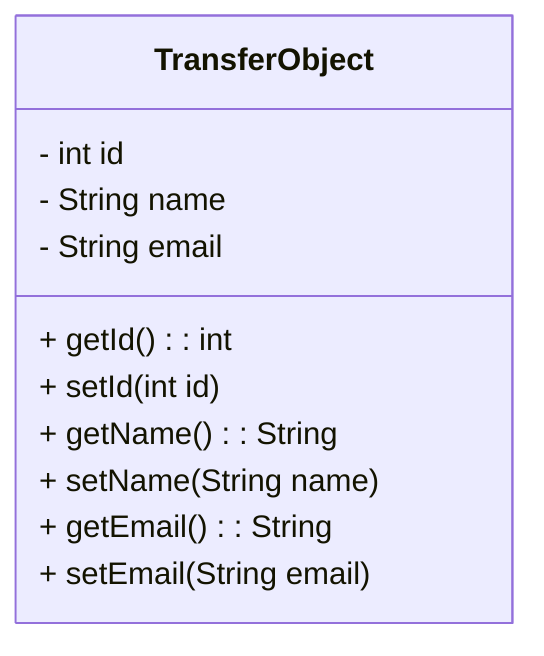
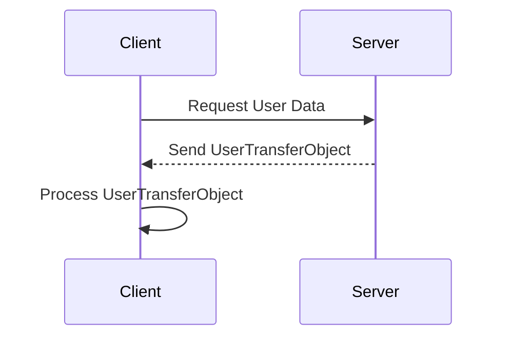

## 8.7 Transfer Object (Value Object) Pattern

In the realm of enterprise application development, efficient data transfer between different components or layers is crucial. The Transfer Object Pattern, also known as the Value Object Pattern, is a design pattern that addresses this need by encapsulating data into objects that can be easily transferred across different layers or processes. This pattern is particularly useful in distributed systems where reducing the number of remote calls can significantly enhance performance.

### Understanding the Transfer Object Pattern

The Transfer Object Pattern is designed to encapsulate data for transfer between client and server or across different layers of an application. By bundling multiple pieces of data into a single object, this pattern minimizes the number of remote calls required, thereby optimizing network performance and reducing latency.

#### Intent of the Transfer Object Pattern

The primary intent of the Transfer Object Pattern is to:

- **Encapsulate Data**: Create objects that carry data across different layers or processes.
- **Reduce Remote Calls**: Minimize the number of network calls by bundling data into a single object.
- **Simplify Data Transfer**: Provide a straightforward mechanism for transferring data between components.
- **Promote Clear Contracts**: Establish a well-defined structure for the data exchanged between components.

### How Transfer Objects Work

Transfer Objects, often referred to as Data Transfer Objects (DTOs), are simple Java objects that contain fields to store data and getter/setter methods to access or modify these fields. They are typically used to transfer data between the client and server in a distributed application.

#### Key Characteristics of Transfer Objects

- **Serializable**: Transfer Objects are usually serializable to facilitate easy transmission over the network.
- **No Business Logic**: They do not contain any business logic; their sole purpose is to carry data.
- **Immutable or Mutable**: Depending on the use case, Transfer Objects can be immutable or mutable.

### Benefits of Using Transfer Objects

The Transfer Object Pattern offers several advantages, particularly in distributed systems:

1. **Reduced Remote Calls**: By bundling multiple data fields into a single object, Transfer Objects reduce the number of remote calls required to fetch or send data. This can significantly improve performance in networked applications.

2. **Simplified Serialization**: Transfer Objects are designed to be easily serializable, making it straightforward to convert them into a format suitable for transmission over a network.

3. **Clear Data Contracts**: Transfer Objects provide a clear contract for the data exchanged between components, ensuring consistency and reliability in data transfer.

4. **Decoupling**: By using Transfer Objects, the client and server can be decoupled from the underlying data representation, allowing for greater flexibility and easier maintenance.

### UML Diagram of Transfer Objects

To better understand the structure of Transfer Objects, let's examine a UML class diagram that illustrates their typical design.



**Diagram Explanation**: The `TransferObject` class contains private fields for storing data (`id`, `name`, `email`) and public getter and setter methods to access or modify these fields. This encapsulation ensures that data can be easily transferred between different layers or components.

### Transfer Objects vs. Data Transfer Objects (DTOs)

While the terms Transfer Object and Data Transfer Object (DTO) are often used interchangeably, there can be subtle differences depending on the context:

- **Transfer Object**: Generally used to describe objects that encapsulate data for transfer between different layers or processes, often in a distributed system.
- **Data Transfer Object (DTO)**: A specific type of Transfer Object used primarily for transferring data between the client and server in a networked application.

In practice, both terms refer to the same concept of encapsulating data for efficient transfer, and the distinction is largely semantic.

### Practical Implementation Strategies

Implementing the Transfer Object Pattern in Java involves creating serializable Java classes that encapsulate the data to be transferred. Here are some practical strategies for implementing this pattern:

#### Step 1: Define the Transfer Object Class

Create a Java class that encapsulates the data you need to transfer. Ensure that the class implements the `Serializable` interface to facilitate easy serialization.

```java
import java.io.Serializable;

public class UserTransferObject implements Serializable {
    private static final long serialVersionUID = 1L;
    private int id;
    private String name;
    private String email;

    public UserTransferObject(int id, String name, String email) {
        this.id = id;
        this.name = name;
        this.email = email;
    }

    public int getId() {
        return id;
    }

    public void setId(int id) {
        this.id = id;
    }

    public String getName() {
        return name;
    }

    public void setName(String name) {
        this.name = name;
    }

    public String getEmail() {
        return email;
    }

    public void setEmail(String email) {
        this.email = email;
    }
}
```

**Code Explanation**: The `UserTransferObject` class encapsulates user data with fields for `id`, `name`, and `email`. It implements the `Serializable` interface to allow for easy serialization and deserialization.

#### Step 2: Use the Transfer Object in Data Transfer

In a distributed application, you can use the Transfer Object to send data between the client and server. Here's an example of how you might use the `UserTransferObject` in a client-server communication scenario.

**Server-Side Code**:

```java
import java.util.ArrayList;
import java.util.List;

public class UserService {

    public List<UserTransferObject> getAllUsers() {
        List<UserTransferObject> users = new ArrayList<>();
        users.add(new UserTransferObject(1, "Alice", "alice@example.com"));
        users.add(new UserTransferObject(2, "Bob", "bob@example.com"));
        return users;
    }
}
```

**Client-Side Code**:

```java
import java.util.List;

public class ClientApp {

    public static void main(String[] args) {
        UserService userService = new UserService();
        List<UserTransferObject> users = userService.getAllUsers();
        
        for (UserTransferObject user : users) {
            System.out.println("ID: " + user.getId());
            System.out.println("Name: " + user.getName());
            System.out.println("Email: " + user.getEmail());
        }
    }
}
```

**Code Explanation**: The `UserService` class on the server side provides a method `getAllUsers()` that returns a list of `UserTransferObject` instances. The `ClientApp` class on the client side retrieves this list and prints the user details.

### Try It Yourself

To get a better understanding of the Transfer Object Pattern, try modifying the code examples provided. Here are some suggestions:

- **Add More Fields**: Extend the `UserTransferObject` class to include additional fields such as `address` or `phoneNumber`.
- **Implement Immutable Transfer Objects**: Modify the `UserTransferObject` class to make it immutable by removing setter methods and initializing fields through a constructor.
- **Experiment with Serialization**: Serialize the `UserTransferObject` instances to a file and then deserialize them to verify data integrity.

### Visualizing Transfer Object Usage

To further illustrate the usage of Transfer Objects, let's consider a sequence diagram that depicts the interaction between a client and a server using Transfer Objects.



**Diagram Explanation**: The sequence diagram shows a client requesting user data from a server. The server responds by sending a `UserTransferObject`, which the client then processes. This interaction highlights the role of Transfer Objects in facilitating data exchange between distributed components.

### Knowledge Check

Before we wrap up this section, let's reinforce what we've learned about the Transfer Object Pattern:

- **What is the primary purpose of a Transfer Object?**
  - To encapsulate data for transfer between different layers or processes.
  
- **What are the benefits of using Transfer Objects?**
  - They reduce remote calls, simplify serialization, and promote clear data contracts.

- **How do Transfer Objects differ from Data Transfer Objects (DTOs)?**
  - While often used interchangeably, DTOs specifically refer to objects used for transferring data between client and server.

### Conclusion

The Transfer Object Pattern is a powerful tool for optimizing data transfer in distributed applications. By encapsulating data into objects, this pattern reduces the number of remote calls, simplifies serialization, and promotes clear data contracts. As you continue to develop enterprise applications, consider leveraging Transfer Objects to enhance performance and maintainability.

### Further Reading

For more information on the Transfer Object Pattern and related concepts, consider exploring the following resources:

- [Oracle Java Documentation](https://docs.oracle.com/javase/tutorial/)
- [Martin Fowler's Patterns of Enterprise Application Architecture](https://martinfowler.com/books/eaa.html)
- [Effective Java by Joshua Bloch](https://www.oreilly.com/library/view/effective-java/9780134686097/)

## Quiz Time!



### What is the primary purpose of a Transfer Object?

- [x] To encapsulate data for transfer between different layers or processes.
- [ ] To execute business logic within the application.
- [ ] To manage database connections.
- [ ] To perform data validation.

> **Explanation:** Transfer Objects are designed to encapsulate data for efficient transfer across different layers or processes, reducing the number of remote calls.

### Which of the following is a benefit of using Transfer Objects?

- [x] Reduces the number of remote calls.
- [x] Simplifies data serialization.
- [ ] Increases the complexity of the application.
- [ ] Requires additional database connections.

> **Explanation:** Transfer Objects reduce remote calls by bundling data and simplify serialization, making data transfer more efficient.

### What is a key characteristic of Transfer Objects?

- [x] They are serializable.
- [ ] They contain business logic.
- [ ] They manage database transactions.
- [ ] They are used for user authentication.

> **Explanation:** Transfer Objects are typically serializable to facilitate easy transmission over a network.

### How do Transfer Objects differ from Data Transfer Objects (DTOs)?

- [x] They are often used interchangeably, but DTOs specifically refer to objects used for transferring data between client and server.
- [ ] Transfer Objects are used for database operations, while DTOs are not.
- [ ] DTOs contain business logic, while Transfer Objects do not.
- [ ] Transfer Objects are only used in desktop applications.

> **Explanation:** While the terms are often used interchangeably, DTOs specifically refer to objects used for transferring data between client and server.

### What is a common use case for Transfer Objects?

- [x] Transferring data between client and server in a distributed application.
- [ ] Executing complex algorithms.
- [ ] Managing user sessions.
- [ ] Handling file uploads.

> **Explanation:** Transfer Objects are commonly used to transfer data between client and server in distributed applications.

### Which interface is commonly implemented by Transfer Objects to facilitate serialization?

- [x] Serializable
- [ ] Cloneable
- [ ] Runnable
- [ ] Comparable

> **Explanation:** Transfer Objects implement the `Serializable` interface to facilitate easy serialization and deserialization.

### What is the role of getter and setter methods in a Transfer Object?

- [x] To access and modify the encapsulated data.
- [ ] To execute business logic.
- [ ] To manage database connections.
- [ ] To perform data validation.

> **Explanation:** Getter and setter methods in a Transfer Object are used to access and modify the encapsulated data.

### How can Transfer Objects enhance the maintainability of an application?

- [x] By decoupling the client and server from the underlying data representation.
- [ ] By increasing the complexity of the data model.
- [ ] By requiring additional database connections.
- [ ] By embedding business logic within the object.

> **Explanation:** Transfer Objects enhance maintainability by decoupling the client and server from the underlying data representation, allowing for greater flexibility.

### What is a typical structure of a Transfer Object?

- [x] Private fields with public getter and setter methods.
- [ ] Public fields with no methods.
- [ ] Methods for executing business logic.
- [ ] Interfaces for database operations.

> **Explanation:** Transfer Objects typically have private fields with public getter and setter methods to encapsulate data.

### True or False: Transfer Objects are used to execute business logic within the application.

- [ ] True
- [x] False

> **Explanation:** Transfer Objects do not contain business logic; their sole purpose is to carry data between different layers or processes.


