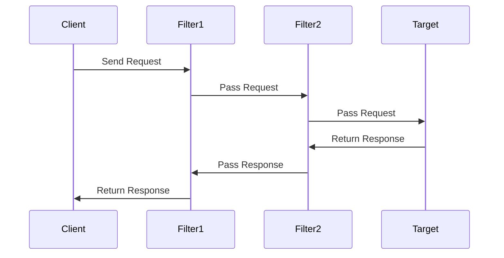

## 8.8.1 Implementing Intercepting Filter in Java

The Intercepting Filter pattern is a powerful design pattern used to pre-process or post-process requests and responses in a web application. In Java, this pattern is often implemented using the `javax.servlet.Filter` interface, which provides a mechanism to intercept requests and responses in a web application. This guide will walk you through the implementation of the Intercepting Filter pattern in Java, covering everything from creating filters to configuring and chaining them, as well as best practices for implementation.

### Understanding the Intercepting Filter Pattern

The Intercepting Filter pattern allows developers to define a chain of filters that can process requests and responses before they reach the target resource (such as a servlet or JSP). This pattern is particularly useful for tasks such as logging, authentication, input validation, and transformation of request or response data.

**Key Concepts:**

- **Filter**: A component that performs filtering tasks on either the request to a resource, the response from a resource, or both.
- **Filter Chain**: A sequence of filters that are applied to a request or response.
- **Target Resource**: The final destination of the request, such as a servlet or JSP.

### Java Servlets and the Filter Interface

Java Servlets provide a built-in mechanism for implementing filters through the `javax.servlet.Filter` interface. This interface defines three key methods:

1. **`init(FilterConfig filterConfig)`**: Called by the web container to indicate to a filter that it is being placed into service.
2. **`doFilter(ServletRequest request, ServletResponse response, FilterChain chain)`**: The core method of the filter, where the request and response are processed.
3. **`destroy()`**: Called by the web container to indicate to a filter that it is being taken out of service.

Let's explore how to create a filter in Java.

### Creating a Filter in Java

To create a filter, you need to implement the `Filter` interface and override its methods. Here's an example of a simple logging filter:

```java
import javax.servlet.*;
import javax.servlet.annotation.WebFilter;
import java.io.IOException;

// Annotate the filter to map it to a specific URL pattern
@WebFilter("/example/*")
public class LoggingFilter implements Filter {

    @Override
    public void init(FilterConfig filterConfig) throws ServletException {
        // Initialization code, if needed
    }

    @Override
    public void doFilter(ServletRequest request, ServletResponse response, FilterChain chain)
            throws IOException, ServletException {
        // Log the request details
        System.out.println("Request received at " + new java.util.Date());

        // Pass the request and response to the next filter in the chain
        chain.doFilter(request, response);

        // Log the response details
        System.out.println("Response sent at " + new java.util.Date());
    }

    @Override
    public void destroy() {
        // Cleanup code, if needed
    }
}
```

### Configuring Filters

Filters can be configured using deployment descriptors (`web.xml`) or annotations like `@WebFilter`. Let's look at both methods.

#### Using Deployment Descriptors (`web.xml`)

In the `web.xml` file, you can define a filter and map it to a URL pattern or servlet name.

```xml
<filter>
    <filter-name>LoggingFilter</filter-name>
    <filter-class>com.example.LoggingFilter</filter-class>
</filter>

<filter-mapping>
    <filter-name>LoggingFilter</filter-name>
    <url-pattern>/example/*</url-pattern>
</filter-mapping>
```

#### Using Annotations

Java EE 6 introduced annotations, which simplify the configuration process. The `@WebFilter` annotation can be used to map a filter to a URL pattern directly in the code, as shown in the previous example.

### Chaining Filters

Filters are often used in a chain, where multiple filters are applied to a request or response. The order of execution is determined by the order in which filters are declared in the `web.xml` file or by the `@Order` annotation if using Spring.

**Example of Filter Chain:**

```xml
<filter>
    <filter-name>AuthenticationFilter</filter-name>
    <filter-class>com.example.AuthenticationFilter</filter-class>
</filter>

<filter>
    <filter-name>LoggingFilter</filter-name>
    <filter-class>com.example.LoggingFilter</filter-class>
</filter>

<filter-mapping>
    <filter-name>AuthenticationFilter</filter-name>
    <url-pattern>/secure/*</url-pattern>
</filter-mapping>

<filter-mapping>
    <filter-name>LoggingFilter</filter-name>
    <url-pattern>/secure/*</url-pattern>
</filter-mapping>
```

In this example, the `AuthenticationFilter` will be executed before the `LoggingFilter` for requests to `/secure/*`.

### Best Practices for Filter Implementation

When implementing filters, consider the following best practices:

- **Thread Safety**: Filters must be thread-safe because they can be accessed by multiple threads simultaneously. Avoid using instance variables unless they are immutable or properly synchronized.
  
- **Passing Requests and Responses**: Always call `chain.doFilter(request, response)` to pass the request and response to the next filter in the chain or the target resource.

- **Exception Handling**: Properly handle exceptions within the `doFilter` method to ensure that resources are cleaned up and appropriate error messages are sent to the client.

- **Resource Cleanup**: Use the `destroy()` method to release any resources that were acquired during the filter's lifecycle.

- **Specific URL Patterns**: Apply filters to specific URL patterns or servlet names to avoid unnecessary processing of unrelated requests.

### Advanced Concepts

#### Applying Filters to Specific URL Patterns

Filters can be applied to specific URL patterns or servlet names, allowing for fine-grained control over which requests are intercepted. This is useful for applying security or logging filters only to certain parts of an application.

**Example:**

```xml
<filter-mapping>
    <filter-name>SecurityFilter</filter-name>
    <url-pattern>/admin/*</url-pattern>
</filter-mapping>
```

#### Handling Filter Order with Annotations

In Spring applications, you can use the `@Order` annotation to specify the order of filter execution. Lower values indicate higher priority.

```java
import org.springframework.core.annotation.Order;
import org.springframework.stereotype.Component;

@Component
@Order(1)
public class FirstFilter implements Filter {
    // Filter implementation
}
```

### Visualizing the Intercepting Filter Pattern

To better understand how the Intercepting Filter pattern works, let's visualize the flow of a request through a filter chain.



**Diagram Description**: This sequence diagram illustrates how a request from a client passes through a chain of filters before reaching the target resource. Each filter has the opportunity to process the request and response.

### Try It Yourself

To get hands-on experience with the Intercepting Filter pattern, try modifying the example code to add additional functionality. For instance, you could:

- Add a filter that checks for a specific header in the request and logs a warning if it's missing.
- Create a filter that modifies the response content, such as adding a footer to HTML pages.
- Experiment with different filter orders to see how it affects the processing of requests.

### References and Further Reading

For more information on Java Servlets and filters, consider the following resources:

- [Oracle's Java EE Documentation](https://docs.oracle.com/javaee/7/tutorial/servlets.htm)
- [Java Servlet Specification](https://javaee.github.io/servlet-spec/)
- [Spring Framework Documentation](https://spring.io/projects/spring-framework)

### Knowledge Check

Before moving on, let's reinforce what we've learned:

- What is the primary purpose of the Intercepting Filter pattern?
- How do you configure a filter using annotations?
- What are some best practices for implementing filters in Java?

### Embrace the Journey

Remember, mastering design patterns like the Intercepting Filter is a journey. As you continue to explore and implement these patterns, you'll gain a deeper understanding of how to build robust and scalable web applications. Keep experimenting, stay curious, and enjoy the journey!

## Quiz Time!



### What is the primary purpose of the Intercepting Filter pattern?

- [x] To pre-process or post-process requests and responses in a web application.
- [ ] To manage database connections efficiently.
- [ ] To handle user authentication and authorization.
- [ ] To provide a user interface for web applications.

> **Explanation:** The Intercepting Filter pattern is used to pre-process or post-process requests and responses, allowing for tasks such as logging, authentication, and input validation.

### Which method in the Filter interface is used to perform the filtering task?

- [ ] init()
- [x] doFilter()
- [ ] destroy()
- [ ] filter()

> **Explanation:** The `doFilter()` method is the core method of the filter, where the request and response are processed.

### How can filters be configured in a Java web application?

- [x] Using deployment descriptors (`web.xml`) or annotations (`@WebFilter`).
- [ ] Only through deployment descriptors (`web.xml`).
- [ ] Only through annotations (`@WebFilter`).
- [ ] Using a configuration file named `filters.xml`.

> **Explanation:** Filters can be configured using either deployment descriptors (`web.xml`) or annotations (`@WebFilter`).

### What is the correct order of filter execution in a filter chain?

- [ ] Random order.
- [ ] Reverse order of declaration.
- [x] Order of declaration in `web.xml` or by `@Order` annotation.
- [ ] Alphabetical order of filter names.

> **Explanation:** The order of execution is determined by the order in which filters are declared in the `web.xml` file or by the `@Order` annotation if using Spring.

### What should be considered to ensure thread safety in filters?

- [x] Avoid using instance variables unless they are immutable or properly synchronized.
- [ ] Use global variables to share data between filters.
- [ ] Always use the `synchronized` keyword for all methods.
- [ ] Use static methods to handle requests.

> **Explanation:** Filters must be thread-safe, and using instance variables can lead to concurrency issues unless they are immutable or properly synchronized.

### How is a filter applied to a specific URL pattern?

- [x] By specifying the URL pattern in the filter mapping in `web.xml` or using `@WebFilter`.
- [ ] By hardcoding the URL pattern in the filter class.
- [ ] By using a configuration file named `url-patterns.xml`.
- [ ] By specifying the URL pattern in the `init()` method.

> **Explanation:** Filters are applied to specific URL patterns by specifying them in the filter mapping in `web.xml` or using the `@WebFilter` annotation.

### What is a common use case for the Intercepting Filter pattern?

- [x] Logging requests and responses.
- [ ] Rendering HTML pages.
- [ ] Managing database transactions.
- [ ] Handling file uploads.

> **Explanation:** A common use case for the Intercepting Filter pattern is logging requests and responses.

### Which method is used for resource cleanup in a filter?

- [ ] init()
- [ ] doFilter()
- [x] destroy()
- [ ] cleanup()

> **Explanation:** The `destroy()` method is used for resource cleanup when a filter is taken out of service.

### What is the role of the FilterChain in the Intercepting Filter pattern?

- [x] To pass the request and response to the next filter or target resource.
- [ ] To initialize the filter.
- [ ] To destroy the filter.
- [ ] To log the request and response details.

> **Explanation:** The `FilterChain` is used to pass the request and response to the next filter in the chain or the target resource.

### True or False: Filters can modify both the request and the response.

- [x] True
- [ ] False

> **Explanation:** Filters can modify both the request and the response as they pass through the filter chain.


