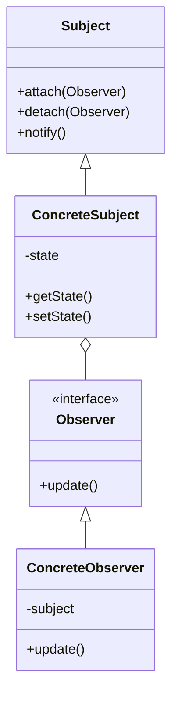

## 8.8.1 Implementing Observer Pattern in Java

### Introduction

The Observer Pattern is a fundamental design pattern in software engineering, particularly useful in scenarios where an object (known as the subject) needs to notify a list of dependent objects (observers) about changes in its state. This pattern is a cornerstone of the behavioral design patterns category, promoting a one-to-many dependency between objects. By implementing the Observer Pattern, developers can create systems that are more modular, flexible, and maintainable.

### Intent

The primary intent of the Observer Pattern is to define a one-to-many dependency between objects so that when one object changes state, all its dependents are notified and updated automatically. This pattern is particularly useful in event-driven programming, where changes in one part of the system need to be propagated to other parts.

### Structure

The Observer Pattern involves several key components:

- **Subject**: The core entity that maintains a list of observers and provides methods to attach, detach, and notify them.
- **Observer**: An interface or abstract class defining the update method, which is called when the subject's state changes.
- **ConcreteSubject**: A specific implementation of the subject that stores the state of interest to the observers.
- **ConcreteObserver**: A specific implementation of the observer that maintains a reference to the concrete subject and implements the update method to keep its state consistent with the subject.

#### UML Diagram

Below is a UML diagram illustrating the structure of the Observer Pattern:



**Diagram Explanation**: The `Subject` class maintains a list of `Observer` objects and provides methods to attach, detach, and notify them. The `ConcreteSubject` class implements the `Subject` interface and maintains the state of interest. The `ConcreteObserver` class implements the `Observer` interface and updates its state in response to changes in the `ConcreteSubject`.

### Participants

- **Subject**: Defines an interface for attaching and detaching observer objects.
- **Observer**: Defines an interface for objects that should be notified of changes in a subject.
- **ConcreteSubject**: Stores the state of interest to `ConcreteObserver` objects and sends notifications to its observers when its state changes.
- **ConcreteObserver**: Implements the `Observer` interface to keep its state consistent with the subject's state.

### Collaborations

- **Subject** notifies its observers whenever a change occurs that could make its observers' state inconsistent with its own.
- After being informed of a change in the subject, a `ConcreteObserver` may query the subject for information.

### Consequences

The Observer Pattern offers several benefits:

- **Loose Coupling**: The subject and observers are loosely coupled. The subject knows only that it has a list of observers, each conforming to the `Observer` interface. It does not need to know the concrete class of any observer.
- **Dynamic Relationships**: Observers can be added or removed at any time, allowing for dynamic relationships between subjects and observers.
- **Broadcast Communication**: Notifications are broadcast automatically to all interested objects that have registered themselves with the subject.

However, there are also potential drawbacks:

- **Unexpected Updates**: Observers are not aware of each other and may be updated in an unexpected order.
- **Memory Leaks**: If observers are not properly detached, they may continue to receive updates, leading to memory leaks.

### Implementation

#### Implementation Guidelines

1. **Define the Subject Interface**: Create an interface or abstract class for the subject that includes methods for attaching, detaching, and notifying observers.
2. **Define the Observer Interface**: Create an interface or abstract class for observers that includes an update method.
3. **Implement ConcreteSubject**: Implement the subject interface in a concrete class that maintains the state of interest.
4. **Implement ConcreteObserver**: Implement the observer interface in a concrete class that updates its state in response to changes in the subject.

#### Sample Code Snippets

Below is a Java implementation of the Observer Pattern:

```java
// Observer interface
interface Observer {
    void update(String message);
}

// Subject interface
interface Subject {
    void attach(Observer observer);
    void detach(Observer observer);
    void notifyObservers();
}

// ConcreteSubject class
class ConcreteSubject implements Subject {
    private List<Observer> observers = new ArrayList<>();
    private String state;

    public void setState(String state) {
        this.state = state;
        notifyObservers();
    }

    public String getState() {
        return state;
    }

    @Override
    public void attach(Observer observer) {
        observers.add(observer);
    }

    @Override
    public void detach(Observer observer) {
        observers.remove(observer);
    }

    @Override
    public void notifyObservers() {
        for (Observer observer : observers) {
            observer.update(state);
        }
    }
}

// ConcreteObserver class
class ConcreteObserver implements Observer {
    private String observerState;
    private ConcreteSubject subject;

    public ConcreteObserver(ConcreteSubject subject) {
        this.subject = subject;
        this.subject.attach(this);
    }

    @Override
    public void update(String state) {
        this.observerState = state;
        System.out.println("Observer state updated to: " + observerState);
    }
}

// Main class to demonstrate the Observer Pattern
public class ObserverPatternDemo {
    public static void main(String[] args) {
        ConcreteSubject subject = new ConcreteSubject();

        ConcreteObserver observer1 = new ConcreteObserver(subject);
        ConcreteObserver observer2 = new ConcreteObserver(subject);

        subject.setState("State 1");
        subject.setState("State 2");
    }
}
```

**Explanation**: In this example, `ConcreteSubject` maintains a list of observers and notifies them whenever its state changes. `ConcreteObserver` implements the `Observer` interface and updates its state in response to changes in the subject. The `ObserverPatternDemo` class demonstrates how observers are notified of changes in the subject's state.

### Registration and Notification Mechanisms

The registration mechanism involves adding observers to the subject's list of observers. This is typically done through an `attach` method. The notification mechanism involves iterating over the list of observers and calling their `update` method whenever the subject's state changes.

### Promoting Loose Coupling

The Observer Pattern promotes loose coupling by ensuring that the subject and observers are independent of each other. The subject only knows that it has a list of observers, and each observer only knows that it is observing a subject. This separation of concerns allows for greater flexibility and scalability in software design.

### Sample Use Cases

- **Graphical User Interfaces (GUIs)**: In GUIs, the Observer Pattern is often used to update the display in response to user actions.
- **Event Handling Systems**: The pattern is commonly used in event handling systems, where multiple components need to respond to events generated by a single source.
- **Data Binding**: In data binding scenarios, the Observer Pattern can be used to synchronize data between models and views.

### Related Patterns

- **Mediator Pattern**: The Mediator Pattern can be used to reduce the complexity of communication between multiple objects, similar to the Observer Pattern.
- **Publish-Subscribe Pattern**: This pattern is similar to the Observer Pattern but allows for more complex event filtering and handling.

### Known Uses

- **Java's `java.util.Observer` and `java.util.Observable`**: Although deprecated in Java 9, these classes were part of the Java API and implemented the Observer Pattern.
- **Swing and AWT Event Handling**: Java's Swing and AWT libraries use the Observer Pattern extensively for event handling.

### Conclusion

The Observer Pattern is a powerful tool for creating dynamic and responsive applications. By promoting loose coupling and enabling broadcast communication, it allows developers to build systems that are both flexible and maintainable. However, it is important to manage observer lifecycles carefully to avoid memory leaks and unexpected updates.

### Exercises

1. Modify the provided code to include a third observer and demonstrate how it responds to state changes.
2. Implement a custom event filtering mechanism that allows observers to register interest in specific types of state changes.
3. Explore the use of Java's `java.beans.PropertyChangeListener` as an alternative to the Observer Pattern.

## Test Your Knowledge: Observer Pattern in Java Quiz



### What is the primary intent of the Observer Pattern?

- [x] To define a one-to-many dependency between objects so that when one object changes state, all its dependents are notified and updated automatically.
- [ ] To create a one-to-one relationship between objects.
- [ ] To encapsulate a request as an object.
- [ ] To provide a way to access the elements of an aggregate object sequentially.

> **Explanation:** The Observer Pattern is designed to define a one-to-many dependency between objects, allowing automatic updates to dependents when the subject changes state.

### Which of the following is NOT a participant in the Observer Pattern?

- [ ] Subject
- [ ] Observer
- [x] Mediator
- [ ] ConcreteObserver

> **Explanation:** The Mediator is not a participant in the Observer Pattern. The pattern involves the Subject, Observer, ConcreteSubject, and ConcreteObserver.

### How does the Observer Pattern promote loose coupling?

- [x] By ensuring that the subject and observers are independent of each other.
- [ ] By tightly integrating the subject and observers.
- [ ] By using a single class for both subject and observer.
- [ ] By eliminating the need for interfaces.

> **Explanation:** The Observer Pattern promotes loose coupling by keeping the subject and observers independent, allowing them to interact without knowing each other's concrete classes.

### What is a potential drawback of the Observer Pattern?

- [x] Observers may be updated in an unexpected order.
- [ ] It increases the coupling between subject and observers.
- [ ] It requires a single observer for each subject.
- [ ] It eliminates the need for event handling.

> **Explanation:** A potential drawback of the Observer Pattern is that observers may be updated in an unexpected order, which can lead to inconsistencies.

### Which Java classes were part of the API for implementing the Observer Pattern but are now deprecated?

- [x] `java.util.Observer` and `java.util.Observable`
- [ ] `java.awt.Observer` and `java.awt.Observable`
- [ ] `javax.swing.Observer` and `javax.swing.Observable`
- [ ] `java.beans.Observer` and `java.beans.Observable`

> **Explanation:** `java.util.Observer` and `java.util.Observable` were part of the Java API for implementing the Observer Pattern but have been deprecated since Java 9.

### In the provided Java code example, what method is used to notify observers of a state change?

- [x] `notifyObservers()`
- [ ] `updateObservers()`
- [ ] `informObservers()`
- [ ] `alertObservers()`

> **Explanation:** The `notifyObservers()` method is used to iterate over the list of observers and call their `update` method when the subject's state changes.

### What is the role of the `ConcreteObserver` in the Observer Pattern?

- [x] To implement the `Observer` interface and update its state in response to changes in the subject.
- [ ] To maintain the list of observers.
- [ ] To define the interface for attaching and detaching observers.
- [ ] To encapsulate the state of interest to observers.

> **Explanation:** The `ConcreteObserver` implements the `Observer` interface and updates its state in response to changes in the subject.

### Which pattern is similar to the Observer Pattern but allows for more complex event filtering and handling?

- [x] Publish-Subscribe Pattern
- [ ] Singleton Pattern
- [ ] Factory Pattern
- [ ] Adapter Pattern

> **Explanation:** The Publish-Subscribe Pattern is similar to the Observer Pattern but allows for more complex event filtering and handling.

### What is a common use case for the Observer Pattern in graphical user interfaces?

- [x] Updating the display in response to user actions.
- [ ] Managing database connections.
- [ ] Handling network requests.
- [ ] Performing mathematical calculations.

> **Explanation:** In graphical user interfaces, the Observer Pattern is commonly used to update the display in response to user actions.

### True or False: The Observer Pattern can be used to synchronize data between models and views.

- [x] True
- [ ] False

> **Explanation:** True. The Observer Pattern can be used in data binding scenarios to synchronize data between models and views.


