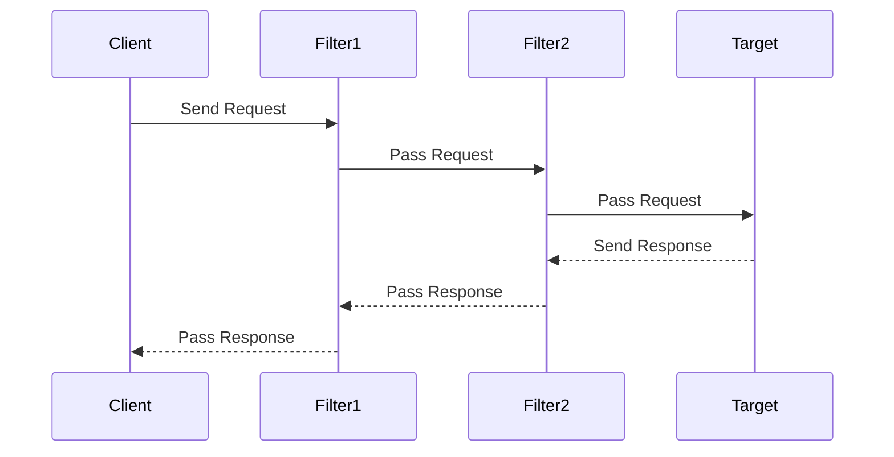

## 8.8.2 Managing Request Handling

In the realm of enterprise software development, managing the flow of requests efficiently and securely is paramount. The Intercepting Filter pattern provides a robust mechanism to modify or reject requests, thereby controlling the processing flow. This section delves into the intricacies of managing request handling using this pattern, exploring how filters can inspect, modify, and even halt requests based on predefined criteria.

### Understanding the Intercepting Filter Pattern

The Intercepting Filter pattern is a design pattern used to process requests before they reach the target object. It allows for pre-processing and post-processing of requests and responses, enabling developers to apply common services such as logging, authentication, validation, and more, across multiple requests.

#### Key Concepts

- **Filter**: A component that performs a specific task, such as modifying request parameters or validating input data.
- **Filter Chain**: A sequence of filters through which a request passes. Each filter in the chain can decide whether to pass the request to the next filter or halt the processing.
- **Target**: The final destination of the request, typically a resource or service that processes the request.

### Inspecting and Modifying Requests

Filters can inspect various parts of a request, including parameters, headers, and body content. This capability is crucial for tasks such as input validation, authentication, and logging.

#### Example: Input Validation and Sanitization

Input validation is a critical task that ensures the data received by the application is both expected and safe. Filters can be employed to sanitize inputs, removing or escaping potentially harmful data.

```java
public class InputValidationFilter implements Filter {
    public void doFilter(Request request, Response response, FilterChain chain) {
        String input = request.getParameter("userInput");
        if (isValid(input)) {
            request.setParameter("userInput", sanitize(input));
            chain.doFilter(request, response);
        } else {
            response.sendError(HttpServletResponse.SC_BAD_REQUEST, "Invalid input");
        }
    }

    private boolean isValid(String input) {
        // Implement validation logic
        return input.matches("[a-zA-Z0-9]+");
    }

    private String sanitize(String input) {
        // Implement sanitization logic
        return input.replaceAll("<", "&lt;").replaceAll(">", "&gt;");
    }
}
```

In this example, the `InputValidationFilter` checks if the input is valid and sanitizes it before passing the request along the chain. If the input is invalid, the filter sends an error response, effectively rejecting the request.

### Rejecting Requests

Filters can prevent further processing by not passing the request along the chain. This capability is essential for tasks like authentication checks, where unauthorized requests must be blocked.

#### Example: Authentication Check

Authentication filters ensure that only authenticated users can access certain resources. If a request lacks proper authentication, the filter can halt processing.

```java
public class AuthenticationFilter implements Filter {
    public void doFilter(Request request, Response response, FilterChain chain) {
        String authToken = request.getHeader("Authorization");
        if (isAuthenticated(authToken)) {
            chain.doFilter(request, response);
        } else {
            response.sendError(HttpServletResponse.SC_UNAUTHORIZED, "Unauthorized");
        }
    }

    private boolean isAuthenticated(String authToken) {
        // Implement authentication logic
        return authToken != null && authToken.equals("valid-token");
    }
}
```

Here, the `AuthenticationFilter` checks for a valid authorization token. If the token is invalid or missing, the filter sends an unauthorized error response, stopping the request from reaching the target.

### Common Filtering Tasks

Filters are versatile and can be used for a variety of tasks beyond authentication and input validation. Some common filtering tasks include:

- **Logging and Auditing**: Filters can log request details for auditing purposes, providing a record of who accessed what resources and when.
- **Compression**: Filters can compress responses to reduce bandwidth usage, improving performance for end-users.
- **Caching**: Filters can cache responses for certain requests, reducing the load on backend systems.

#### Example: Logging Filter

A logging filter captures details about each request, which can be invaluable for debugging and auditing.

```java
public class LoggingFilter implements Filter {
    public void doFilter(Request request, Response response, FilterChain chain) {
        System.out.println("Request received: " + request.getRequestURI());
        chain.doFilter(request, response);
        System.out.println("Response sent: " + response.getStatus());
    }
}
```

The `LoggingFilter` logs the request URI and response status, providing a simple yet effective way to track request handling.

### Importance of Filter Ordering

The order in which filters are applied can significantly impact the processing of requests. Filters must be carefully ordered to ensure that they operate correctly and efficiently.

#### Example: Filter Ordering

Consider a scenario where both authentication and logging filters are used. The authentication filter should precede the logging filter to ensure that only authenticated requests are logged.

```java
FilterChain chain = new FilterChain();
chain.addFilter(new AuthenticationFilter());
chain.addFilter(new LoggingFilter());
```

In this setup, the `AuthenticationFilter` runs first, blocking unauthorized requests before they reach the `LoggingFilter`.

### Designing Filters Thoughtfully

When designing filters, it's crucial to consider their impact on the overall system. Poorly designed filters can introduce unintended side effects, such as performance bottlenecks or security vulnerabilities.

#### Best Practices for Filter Design

- **Keep Filters Focused**: Each filter should perform a single, well-defined task. This approach simplifies maintenance and reduces the risk of unintended interactions between filters.
- **Avoid Side Effects**: Filters should not alter the request or response in ways that affect other filters unless explicitly intended.
- **Ensure Reusability**: Design filters to be reusable across different parts of the application, promoting consistency and reducing duplication.
- **Test Thoroughly**: Filters should be thoroughly tested to ensure they handle all expected scenarios and edge cases.

### Visualizing Filter Chains

To better understand how filters interact within a chain, let's visualize a typical filter chain using a sequence diagram.



In this diagram, the client sends a request that passes through two filters before reaching the target. Each filter can modify the request or response as needed.

### Try It Yourself

To gain a deeper understanding of the Intercepting Filter pattern, try modifying the code examples provided:

- **Add a new filter** that performs a different task, such as compressing responses.
- **Reorder the filters** in the chain to see how it affects processing.
- **Implement a filter** that caches responses for specific requests.

Experimenting with these modifications will help solidify your understanding of how filters manage request handling.

### References and Further Reading

- [Oracle Java Documentation](https://docs.oracle.com/javase/tutorial/uiswing/components/intermediate.html)
- [Design Patterns: Elements of Reusable Object-Oriented Software](https://en.wikipedia.org/wiki/Design_Patterns)
- [Java Servlet Filter](https://www.javatpoint.com/servlet-filter)

### Knowledge Check

1. **What is the primary purpose of the Intercepting Filter pattern?**
   - To manage and control the flow of requests and responses in an application.

2. **How can filters reject a request?**
   - By not passing the request along the filter chain and sending an error response instead.

3. **Why is filter ordering important?**
   - Because the order of filters can affect how requests are processed and whether certain tasks are performed.

4. **What are some common tasks performed by filters?**
   - Logging, authentication, input validation, compression, and caching.

5. **What is a best practice for designing filters?**
   - Keeping filters focused on a single task to simplify maintenance and reduce unintended side effects.

### Embrace the Journey

Remember, mastering the Intercepting Filter pattern is just one step in your journey as a software engineer. As you continue to explore and apply design patterns, you'll build more robust and maintainable applications. Keep experimenting, stay curious, and enjoy the journey!

## Quiz Time!



### What is the primary purpose of the Intercepting Filter pattern?

- [x] To manage and control the flow of requests and responses in an application.
- [ ] To store and retrieve data from a database.
- [ ] To handle user interface events.
- [ ] To compile and execute code.

> **Explanation:** The Intercepting Filter pattern is used to manage and control the flow of requests and responses in an application by applying common services such as logging, authentication, and validation.

### How can filters reject a request?

- [x] By not passing the request along the filter chain and sending an error response instead.
- [ ] By modifying the request parameters.
- [ ] By logging the request details.
- [ ] By compressing the response.

> **Explanation:** Filters can reject a request by not passing it along the filter chain and sending an error response to the client, effectively halting further processing.

### Why is filter ordering important?

- [x] Because the order of filters can affect how requests are processed and whether certain tasks are performed.
- [ ] Because filters need to be executed in alphabetical order.
- [ ] Because filters are only executed once.
- [ ] Because filters must always modify the request.

> **Explanation:** Filter ordering is important because the sequence in which filters are applied can impact the processing of requests and the execution of specific tasks.

### What are some common tasks performed by filters?

- [x] Logging, authentication, input validation, compression, and caching.
- [ ] Data storage, retrieval, and deletion.
- [ ] User interface rendering and event handling.
- [ ] Compilation and execution of code.

> **Explanation:** Filters commonly perform tasks such as logging, authentication, input validation, compression, and caching to manage request handling effectively.

### What is a best practice for designing filters?

- [x] Keeping filters focused on a single task to simplify maintenance and reduce unintended side effects.
- [ ] Combining multiple tasks into a single filter for efficiency.
- [ ] Designing filters to always modify the request.
- [ ] Ensuring filters are executed in reverse order.

> **Explanation:** A best practice for designing filters is to keep them focused on a single task, which simplifies maintenance and reduces the risk of unintended side effects.

### How does the Intercepting Filter pattern enhance security?

- [x] By allowing filters to perform authentication checks and reject unauthorized requests.
- [ ] By encrypting all request data.
- [ ] By storing user credentials in plain text.
- [ ] By allowing direct access to the database.

> **Explanation:** The Intercepting Filter pattern enhances security by allowing filters to perform authentication checks and reject unauthorized requests, preventing them from reaching the target resource.

### What role does the Filter Chain play in the Intercepting Filter pattern?

- [x] It sequences the filters through which a request passes, allowing each filter to process the request.
- [ ] It stores all request data for future reference.
- [ ] It directly handles user interface events.
- [ ] It compiles and executes code.

> **Explanation:** The Filter Chain sequences the filters through which a request passes, allowing each filter to process the request and decide whether to pass it to the next filter or halt processing.

### How can filters improve application performance?

- [x] By caching responses for certain requests, reducing the load on backend systems.
- [ ] By increasing the number of database queries.
- [ ] By logging every detail of the request.
- [ ] By compressing all request data.

> **Explanation:** Filters can improve application performance by caching responses for certain requests, which reduces the load on backend systems and speeds up response times for clients.

### What is the role of the Target in the Intercepting Filter pattern?

- [x] It is the final destination of the request, typically a resource or service that processes the request.
- [ ] It stores all request data for future reference.
- [ ] It directly handles user interface events.
- [ ] It compiles and executes code.

> **Explanation:** The Target is the final destination of the request in the Intercepting Filter pattern, typically a resource or service that processes the request after it has passed through the filters.

### True or False: Filters should always modify the request or response.

- [ ] True
- [x] False

> **Explanation:** False. Filters should not always modify the request or response. They should only do so when necessary and intended, to avoid unintended side effects and maintain system integrity.


