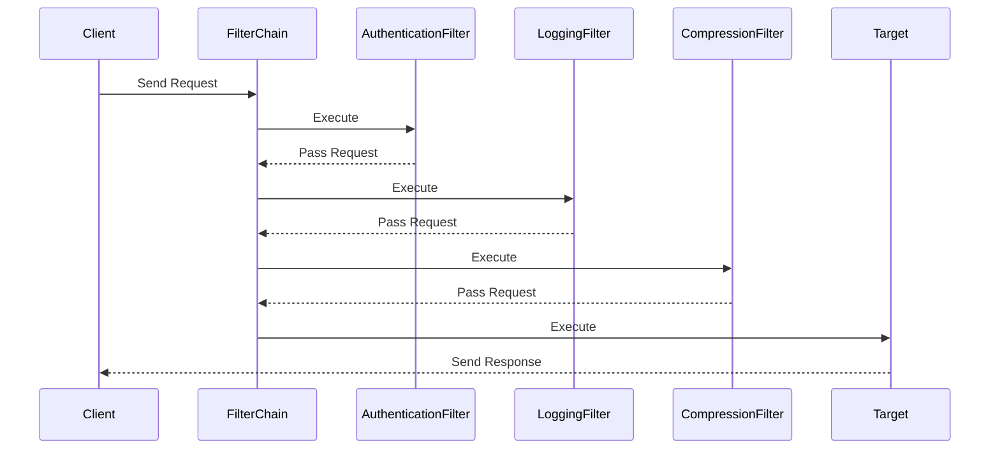

## 8.8.3 Use Cases and Examples

The Intercepting Filter pattern is a powerful design pattern used to manage and process requests and responses in a web application. By using filters, we can handle cross-cutting concerns such as authentication, logging, and data compression in a centralized manner. This section will delve into practical use cases of the Intercepting Filter pattern, illustrating its application through code examples and diagrams. We will also discuss the benefits and challenges associated with this pattern, and encourage its use to enhance modularity and scalability in web applications.

### Understanding the Intercepting Filter Pattern

Before diving into specific use cases, let's briefly recap what the Intercepting Filter pattern is. This pattern allows us to define a chain of filters that can process requests or responses before they reach the target handler or client. Each filter performs a specific function, such as authentication or logging, and can either modify the request/response or pass it along the chain.

**Key Components:**
- **Filter:** An interface or abstract class defining the `execute` method to process requests or responses.
- **FilterChain:** Manages the sequence of filters and ensures each filter is executed in order.
- **Target:** The final handler that processes the request after all filters have been applied.

### Use Case 1: Authentication Filter

Authentication is a critical aspect of web applications, ensuring that only authorized users can access certain resources. An authentication filter intercepts requests to verify user credentials before allowing access.

#### Code Example: Authentication Filter

```java
// Define the Filter interface
interface Filter {
    void execute(Request request);
}

// Implement the AuthenticationFilter
class AuthenticationFilter implements Filter {
    @Override
    public void execute(Request request) {
        if (authenticate(request)) {
            System.out.println("Authentication successful for user: " + request.getUser());
        } else {
            throw new SecurityException("Authentication failed for user: " + request.getUser());
        }
    }

    private boolean authenticate(Request request) {
        // Simulate authentication logic
        return "validUser".equals(request.getUser()) && "validPassword".equals(request.getPassword());
    }
}

// Define the Request class
class Request {
    private String user;
    private String password;

    // Constructor, getters, and setters
    public Request(String user, String password) {
        this.user = user;
        this.password = password;
    }

    public String getUser() {
        return user;
    }

    public String getPassword() {
        return password;
    }
}
```

#### Benefits of Authentication Filter
- **Centralized Security:** Authentication logic is centralized, making it easier to manage and update.
- **Reusability:** The filter can be reused across different parts of the application.
- **Scalability:** New authentication mechanisms can be added without altering existing code.

#### Challenges
- **Performance Overhead:** Each request incurs the cost of authentication checks.
- **Complexity:** Managing different authentication schemes can increase complexity.

### Use Case 2: Logging Filter

Logging is essential for monitoring application behavior and debugging issues. A logging filter captures request and response details, providing valuable insights into application performance and user interactions.

#### Code Example: Logging Filter

```java
// Implement the LoggingFilter
class LoggingFilter implements Filter {
    @Override
    public void execute(Request request) {
        System.out.println("Logging request: User - " + request.getUser());
        // Proceed with the next filter or target
    }
}

// Implement the FilterChain
class FilterChain {
    private List<Filter> filters = new ArrayList<>();
    private Target target;

    public void addFilter(Filter filter) {
        filters.add(filter);
    }

    public void execute(Request request) {
        for (Filter filter : filters) {
            filter.execute(request);
        }
        target.execute(request);
    }

    public void setTarget(Target target) {
        this.target = target;
    }
}

// Define the Target class
class Target {
    public void execute(Request request) {
        System.out.println("Executing request for user: " + request.getUser());
    }
}
```

#### Benefits of Logging Filter
- **Visibility:** Provides insights into application usage and potential issues.
- **Debugging:** Facilitates troubleshooting by recording detailed request/response data.
- **Compliance:** Helps in meeting regulatory requirements for logging and monitoring.

#### Challenges
- **Data Volume:** Large volumes of log data can be generated, requiring efficient storage and management.
- **Performance Impact:** Logging can introduce latency, especially if synchronous.

### Use Case 3: Compression Filter

To improve network efficiency, a compression filter can be used to compress response data, reducing the amount of data transmitted over the network.

#### Code Example: Compression Filter

```java
// Implement the CompressionFilter
class CompressionFilter implements Filter {
    @Override
    public void execute(Request request) {
        System.out.println("Compressing response for user: " + request.getUser());
        // Simulate compression logic
    }
}

// Main application to demonstrate the use of filters
public class FilterDemo {
    public static void main(String[] args) {
        Request request = new Request("validUser", "validPassword");

        FilterChain filterChain = new FilterChain();
        filterChain.addFilter(new AuthenticationFilter());
        filterChain.addFilter(new LoggingFilter());
        filterChain.addFilter(new CompressionFilter());

        Target target = new Target();
        filterChain.setTarget(target);

        filterChain.execute(request);
    }
}
```

#### Benefits of Compression Filter
- **Reduced Bandwidth:** Compressing data reduces the amount of bandwidth required.
- **Faster Transmission:** Smaller data sizes lead to quicker transmission times.
- **Improved User Experience:** Faster load times enhance the user experience.

#### Challenges
- **Processing Overhead:** Compression and decompression add computational overhead.
- **Compatibility:** Not all clients may support the same compression algorithms.

### Visualizing the Intercepting Filter Pattern

To better understand how the Intercepting Filter pattern operates, let's visualize the flow of a request through the filter chain.



**Diagram Description:** This sequence diagram illustrates the flow of a request through a series of filters in the Intercepting Filter pattern. Each filter processes the request and passes it along the chain until it reaches the target, which then sends a response back to the client.

### Encouragement to Use the Intercepting Filter Pattern

The Intercepting Filter pattern is a versatile tool that can greatly enhance the modularity and scalability of web applications. By centralizing cross-cutting concerns such as authentication, logging, and compression, developers can create cleaner, more maintainable codebases. The pattern also facilitates the addition of new filters without disrupting existing functionality, making it an excellent choice for evolving applications.

### Try It Yourself

To deepen your understanding of the Intercepting Filter pattern, try modifying the code examples provided. Here are a few suggestions:

- **Add a New Filter:** Implement a new filter, such as a caching filter, to store and retrieve responses for repeated requests.
- **Modify Filter Order:** Change the order of filters in the chain and observe how it affects the request processing.
- **Implement Asynchronous Filters:** Explore how to implement filters that operate asynchronously, improving performance for long-running tasks.

### Conclusion

The Intercepting Filter pattern is a powerful design pattern that addresses cross-cutting concerns in web applications. By implementing filters for authentication, logging, and compression, developers can create modular, scalable, and maintainable applications. While there are challenges such as performance overhead and complexity, the benefits of centralized control and code reuse make this pattern an invaluable tool in a developer's toolkit.

## Quiz Time!



### Which of the following is a key benefit of using the Intercepting Filter pattern?

- [x] Centralized control of cross-cutting concerns
- [ ] Reduced code complexity
- [ ] Improved database performance
- [ ] Enhanced user interface design

> **Explanation:** The Intercepting Filter pattern centralizes control of cross-cutting concerns like authentication and logging, making it easier to manage and update these aspects of the application.


### What is the primary role of the `FilterChain` in the Intercepting Filter pattern?

- [x] To manage the sequence of filters and ensure each is executed in order
- [ ] To authenticate user requests
- [ ] To compress response data
- [ ] To log request and response details

> **Explanation:** The `FilterChain` manages the sequence of filters, ensuring that each filter is executed in the correct order before the request reaches the target.


### In the provided code example, what does the `AuthenticationFilter` do?

- [x] It checks user credentials before allowing access to resources
- [ ] It compresses response data
- [ ] It logs request details
- [ ] It manages the sequence of filters

> **Explanation:** The `AuthenticationFilter` checks user credentials to ensure that only authorized users can access certain resources.


### Which of the following is a potential challenge when using the Intercepting Filter pattern?

- [x] Performance impacts due to excessive filtering
- [ ] Lack of centralized control
- [ ] Inability to handle cross-cutting concerns
- [ ] Difficulty in adding new filters

> **Explanation:** Excessive filtering can lead to performance impacts, as each filter adds overhead to request processing.


### How does the `LoggingFilter` benefit an application?

- [x] By providing insights into application usage and potential issues
- [ ] By compressing response data
- [ ] By authenticating users
- [ ] By managing the sequence of filters

> **Explanation:** The `LoggingFilter` captures request and response details, providing valuable insights into application performance and user interactions.


### What is a key advantage of using a compression filter?

- [x] Reduced bandwidth usage
- [ ] Improved authentication security
- [ ] Enhanced logging capabilities
- [ ] Simplified filter management

> **Explanation:** A compression filter reduces the amount of data transmitted over the network, lowering bandwidth usage and improving transmission speed.


### Which component in the Intercepting Filter pattern is responsible for processing the request after all filters have been applied?

- [x] Target
- [ ] FilterChain
- [ ] AuthenticationFilter
- [ ] LoggingFilter

> **Explanation:** The `Target` is the final handler that processes the request after all filters have been applied.


### What is the purpose of the `execute` method in a filter?

- [x] To process requests or responses
- [ ] To manage the sequence of filters
- [ ] To authenticate users
- [ ] To compress data

> **Explanation:** The `execute` method in a filter is used to process requests or responses, performing the filter's specific function.


### How can the Intercepting Filter pattern enhance the scalability of web applications?

- [x] By allowing new filters to be added without disrupting existing functionality
- [ ] By reducing the number of user requests
- [ ] By improving database query performance
- [ ] By simplifying user interface design

> **Explanation:** The pattern allows new filters to be added easily, enhancing the application's ability to scale and adapt to new requirements.


### True or False: The Intercepting Filter pattern can only be used for authentication and logging.

- [ ] True
- [x] False

> **Explanation:** The Intercepting Filter pattern can be used for various cross-cutting concerns, including authentication, logging, compression, caching, and more.



Remember, this is just the beginning. As you progress, you'll build more complex and interactive web applications. Keep experimenting, stay curious, and enjoy the journey!
