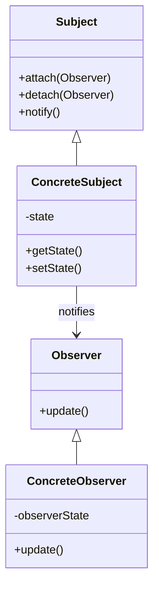
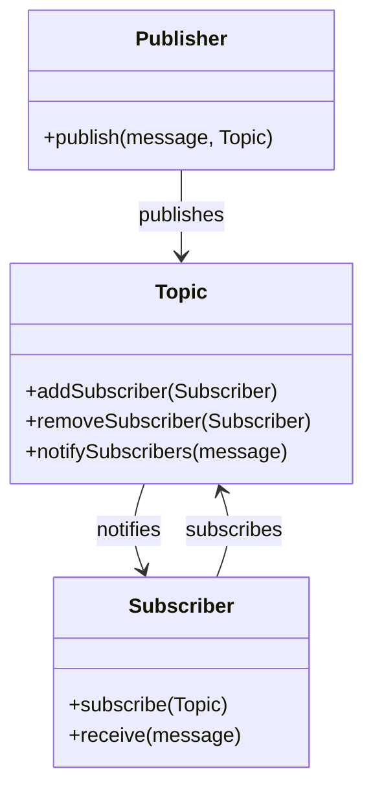

## 8.8.4 Observer Pattern vs. Pub/Sub Models

In the realm of software design, the **Observer Pattern** and **Publish/Subscribe (Pub/Sub) Models** are pivotal in managing communication between components. Both patterns facilitate a way for objects to notify other objects about changes in state, but they do so in distinct ways that suit different architectural needs. This section delves into the nuances of these patterns, their implementations in Java, and their applicability in modern software development.

### Understanding the Observer Pattern

The **Observer Pattern** is a behavioral design pattern that defines a one-to-many dependency between objects. When one object changes state, all its dependents are notified and updated automatically. This pattern is particularly useful in scenarios where a change in one object requires changes in others, without tightly coupling them.

#### Key Components of the Observer Pattern

- **Subject**: The core object that maintains a list of observers and notifies them of any state changes.
- **Observer**: An interface or abstract class that defines the update method, which is called when the subject changes.
- **ConcreteSubject**: A class that implements the subject interface and maintains the state of interest to observers.
- **ConcreteObserver**: A class that implements the observer interface and updates its state in response to notifications from the subject.

#### Structure



*Diagram 1: Structure of the Observer Pattern.*

#### Implementation Example

```java
// Observer interface
interface Observer {
    void update(String message);
}

// Concrete Observer
class ConcreteObserver implements Observer {
    private String observerState;

    @Override
    public void update(String message) {
        this.observerState = message;
        System.out.println("Observer State updated: " + observerState);
    }
}

// Subject interface
interface Subject {
    void attach(Observer observer);
    void detach(Observer observer);
    void notifyObservers();
}

// Concrete Subject
class ConcreteSubject implements Subject {
    private List<Observer> observers = new ArrayList<>();
    private String state;

    public void setState(String state) {
        this.state = state;
        notifyObservers();
    }

    @Override
    public void attach(Observer observer) {
        observers.add(observer);
    }

    @Override
    public void detach(Observer observer) {
        observers.remove(observer);
    }

    @Override
    public void notifyObservers() {
        for (Observer observer : observers) {
            observer.update(state);
        }
    }
}

// Usage
public class ObserverPatternDemo {
    public static void main(String[] args) {
        ConcreteSubject subject = new ConcreteSubject();
        Observer observer1 = new ConcreteObserver();
        Observer observer2 = new ConcreteObserver();

        subject.attach(observer1);
        subject.attach(observer2);

        subject.setState("New State");
    }
}
```

*Code Example 1: Implementation of the Observer Pattern in Java.*

### Exploring Publish/Subscribe Models

The **Publish/Subscribe (Pub/Sub) Model** is a messaging pattern where senders of messages, called publishers, do not send messages directly to specific receivers. Instead, messages are published to channels or topics, and subscribers receive messages from these channels. This model decouples the sender and receiver, allowing for more flexible and scalable systems.

#### Key Components of Pub/Sub Models

- **Publisher**: The entity that sends messages to a topic.
- **Subscriber**: The entity that receives messages from a topic.
- **Topic/Channel**: An intermediary that holds messages and delivers them to subscribers.

#### Structure



*Diagram 2: Structure of the Publish/Subscribe Model.*

#### Implementation Example with JMS

Java Message Service (JMS) is a Java API that provides a way to create, send, receive, and read messages. It is a key technology for implementing Pub/Sub models in Java.

```java
import javax.jms.*;
import org.apache.activemq.ActiveMQConnectionFactory;

public class PubSubExample {
    public static void main(String[] args) throws JMSException {
        // Create a ConnectionFactory
        ConnectionFactory connectionFactory = new ActiveMQConnectionFactory("tcp://localhost:61616");

        // Create a Connection
        Connection connection = connectionFactory.createConnection();
        connection.start();

        // Create a Session
        Session session = connection.createSession(false, Session.AUTO_ACKNOWLEDGE);

        // Create the Topic
        Topic topic = session.createTopic("exampleTopic");

        // Create a MessageProducer from the Session to the Topic
        MessageProducer producer = session.createProducer(topic);
        producer.setDeliveryMode(DeliveryMode.NON_PERSISTENT);

        // Create a Message
        String text = "Hello from Publisher!";
        TextMessage message = session.createTextMessage(text);

        // Send the Message
        producer.send(message);
        System.out.println("Sent message: " + text);

        // Create a MessageConsumer from the Session to the Topic
        MessageConsumer consumer = session.createConsumer(topic);

        // Wait for a message
        Message receivedMessage = consumer.receive(1000);

        if (receivedMessage instanceof TextMessage) {
            TextMessage textMessage = (TextMessage) receivedMessage;
            System.out.println("Received message: " + textMessage.getText());
        }

        // Clean up
        session.close();
        connection.close();
    }
}
```

*Code Example 2: Implementation of a Pub/Sub model using JMS.*

For more information on JMS, visit the [Java Message Service (JMS)](https://www.oracle.com/java/technologies/java-message-service.html) page.

### Comparing Observer Pattern and Pub/Sub Models

#### Similarities

- **Notification Mechanism**: Both patterns involve notifying interested parties about changes or events.
- **Decoupling**: They aim to decouple the source of changes from the recipients, promoting loose coupling.

#### Differences

- **Coupling**: The Observer Pattern involves direct coupling between the subject and observers, while Pub/Sub decouples publishers and subscribers through topics or channels.
- **Scalability**: Pub/Sub models are generally more scalable, as they can handle a large number of subscribers and publishers without direct connections.
- **Flexibility**: Pub/Sub allows for dynamic subscription and unsubscription, making it more flexible in dynamic environments.

### When to Use Pub/Sub Over Observer Pattern

- **Distributed Systems**: Pub/Sub is ideal for distributed systems where components are spread across different nodes or services.
- **Scalability Needs**: When the system needs to handle a large number of messages or subscribers, Pub/Sub is more suitable.
- **Decoupling Requirements**: If the system requires a high degree of decoupling between components, Pub/Sub is preferable.

### Modern Implementations of Pub/Sub

Modern frameworks and platforms, such as Apache Kafka, RabbitMQ, and Google Cloud Pub/Sub, implement the Pub/Sub model to provide robust messaging solutions. These platforms offer features like message persistence, fault tolerance, and high availability, making them suitable for enterprise-level applications.

### Conclusion

Both the Observer Pattern and Pub/Sub Models have their place in software design. Understanding their differences and appropriate use cases is crucial for designing robust and scalable systems. While the Observer Pattern is suitable for simpler, tightly-coupled systems, Pub/Sub models excel in complex, distributed environments where scalability and flexibility are paramount.

### Key Takeaways

- **Observer Pattern**: Best for simple, tightly-coupled systems where direct notification is needed.
- **Pub/Sub Model**: Ideal for distributed, scalable systems with a need for high decoupling.
- **Modern Messaging Systems**: Utilize frameworks like JMS, Kafka, and RabbitMQ for implementing Pub/Sub in real-world applications.

### Exercises

1. Implement a simple Observer Pattern in Java and modify it to use a Pub/Sub model.
2. Explore a messaging system like Apache Kafka and create a basic producer-consumer application.
3. Analyze a real-world system and determine whether Observer Pattern or Pub/Sub would be more appropriate.

### References

- [Java Message Service (JMS)](https://www.oracle.com/java/technologies/java-message-service.html)
- [Apache Kafka](https://kafka.apache.org/)
- [RabbitMQ](https://www.rabbitmq.com/)
- [Google Cloud Pub/Sub](https://cloud.google.com/pubsub)

## Test Your Knowledge: Observer Pattern vs. Pub/Sub Models Quiz



### Which pattern involves direct coupling between the subject and observers?

- [x] Observer Pattern
- [ ] Publish/Subscribe Model
- [ ] Both
- [ ] Neither

> **Explanation:** The Observer Pattern involves direct coupling between the subject and its observers.

### What is a key advantage of the Pub/Sub model over the Observer Pattern?

- [x] Scalability
- [ ] Simplicity
- [ ] Direct communication
- [ ] Tight coupling

> **Explanation:** The Pub/Sub model is more scalable as it decouples publishers and subscribers through topics or channels.

### In which scenario is the Observer Pattern more appropriate?

- [x] Simple, tightly-coupled systems
- [ ] Distributed systems
- [ ] Systems requiring high scalability
- [ ] Systems with dynamic subscription needs

> **Explanation:** The Observer Pattern is more suitable for simple, tightly-coupled systems where direct notification is needed.

### What is the role of a topic in a Pub/Sub model?

- [x] It acts as an intermediary between publishers and subscribers.
- [ ] It directly notifies observers.
- [ ] It stores messages permanently.
- [ ] It couples publishers and subscribers.

> **Explanation:** A topic acts as an intermediary that holds messages and delivers them to subscribers in a Pub/Sub model.

### Which of the following is a modern framework that implements the Pub/Sub model?

- [x] Apache Kafka
- [ ] Java Message Service (JMS)
- [ ] JavaFX
- [ ] Spring Boot

> **Explanation:** Apache Kafka is a modern framework that implements the Pub/Sub model for messaging systems.

### What is a common use case for the Pub/Sub model?

- [x] Distributed systems with high decoupling needs
- [ ] Simple GUI applications
- [ ] Direct communication between components
- [ ] Systems with no scalability requirements

> **Explanation:** The Pub/Sub model is commonly used in distributed systems where high decoupling and scalability are needed.

### How does the Observer Pattern notify its observers?

- [x] Directly through method calls
- [ ] Through a messaging broker
- [ ] By publishing to a topic
- [ ] By sending emails

> **Explanation:** The Observer Pattern notifies its observers directly through method calls.

### Which pattern is more flexible in dynamic environments?

- [x] Publish/Subscribe Model
- [ ] Observer Pattern
- [ ] Both
- [ ] Neither

> **Explanation:** The Publish/Subscribe Model is more flexible as it allows for dynamic subscription and unsubscription.

### What is a disadvantage of the Observer Pattern?

- [x] Tight coupling between subject and observers
- [ ] Lack of scalability
- [ ] Complexity
- [ ] High decoupling

> **Explanation:** A disadvantage of the Observer Pattern is the tight coupling between the subject and its observers.

### True or False: The Observer Pattern is more suitable for enterprise-level applications than the Pub/Sub model.

- [ ] True
- [x] False

> **Explanation:** The Pub/Sub model is generally more suitable for enterprise-level applications due to its scalability and decoupling capabilities.


