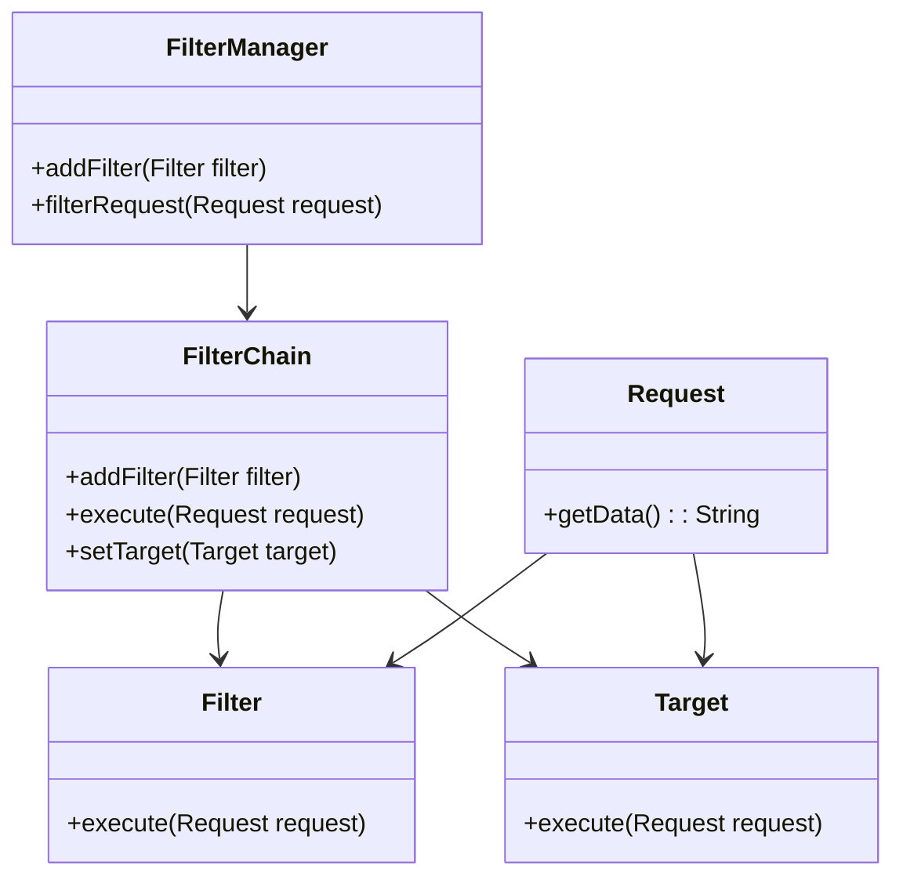
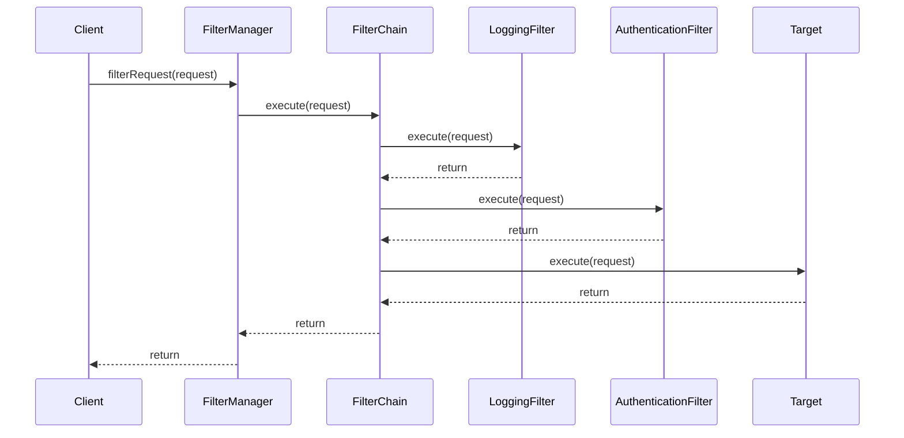

## 8.8 Intercepting Filter Pattern

The Intercepting Filter pattern is a powerful design pattern used in enterprise applications to manage and process requests and responses. It provides a mechanism to intercept and manipulate incoming requests and outgoing responses, enabling developers to apply common processing logic such as authentication, logging, and data transformation in a modular and reusable manner.

### Understanding the Intercepting Filter Pattern

The Intercepting Filter pattern is akin to a chain of responsibility, where multiple filters are applied to a request or response in a sequential manner. Each filter performs a specific task, and the chain of filters can be dynamically configured, allowing for flexible and reusable processing logic. This pattern is particularly useful in web applications, where requests and responses need to be processed in a consistent and modular way.

#### Intent of the Intercepting Filter Pattern

The primary intent of the Intercepting Filter pattern is to provide a centralized mechanism for processing requests and responses. By using this pattern, developers can:

- **Pre-process requests**: Modify or validate requests before they reach the target component.
- **Post-process responses**: Alter or log responses after they are generated by the target component.
- **Apply cross-cutting concerns**: Implement common functionalities like logging, authentication, and data compression without scattering code across the application.

### Components of the Intercepting Filter Pattern

The Intercepting Filter pattern consists of several key components, each playing a crucial role in the processing of requests and responses:

#### 1. Filter

A Filter is a component that performs a specific processing task on a request or response. Filters can be used to validate input, log requests, authenticate users, or modify data. Each filter implements a common interface, allowing them to be easily added or removed from the filter chain.

```java
public interface Filter {
    void execute(Request request);
}
```

#### 2. Filter Chain

The Filter Chain manages the sequence of filters and ensures that each filter is executed in the correct order. It acts as a conduit through which requests and responses pass, invoking each filter in turn.

```java
public class FilterChain {
    private List<Filter> filters = new ArrayList<>();
    private Target target;

    public void addFilter(Filter filter) {
        filters.add(filter);
    }

    public void execute(Request request) {
        for (Filter filter : filters) {
            filter.execute(request);
        }
        target.execute(request);
    }

    public void setTarget(Target target) {
        this.target = target;
    }
}
```

#### 3. Filter Manager

The Filter Manager is responsible for creating and configuring the Filter Chain. It provides an interface for adding filters and setting the target component.

```java
public class FilterManager {
    private FilterChain filterChain;

    public FilterManager(Target target) {
        filterChain = new FilterChain();
        filterChain.setTarget(target);
    }

    public void addFilter(Filter filter) {
        filterChain.addFilter(filter);
    }

    public void filterRequest(Request request) {
        filterChain.execute(request);
    }
}
```

#### 4. Target

The Target is the final processor of the request. It represents the core functionality of the application, such as a servlet or a business logic component.

```java
public class Target {
    public void execute(Request request) {
        System.out.println("Executing request: " + request.getData());
    }
}
```

### Advantages of the Intercepting Filter Pattern

The Intercepting Filter pattern offers several advantages that make it an attractive choice for enterprise applications:

- **Promotes Reuse**: By encapsulating common processing logic in filters, developers can reuse these components across different parts of the application.
- **Enhances Modularity**: The pattern separates concerns by isolating processing logic from the core application code, making it easier to manage and maintain.
- **Simplifies Changes**: Adding or removing processing steps is straightforward, as it involves modifying the filter chain without altering the core application logic.
- **Improves Maintainability**: The pattern encourages clean and organized code, reducing the risk of errors and simplifying debugging.

### UML Diagram

To better understand the structure and flow of the Intercepting Filter pattern, let's visualize it using a UML diagram:



### Practical Implementation Strategies

To implement the Intercepting Filter pattern effectively, consider the following strategies:

1. **Define Clear Interfaces**: Ensure that all filters implement a common interface, allowing them to be easily added or removed from the filter chain.

2. **Use Dependency Injection**: Leverage dependency injection frameworks to manage the creation and configuration of filters, enhancing flexibility and testability.

3. **Implement Logging and Monitoring**: Incorporate logging and monitoring within filters to track request processing and identify performance bottlenecks.

4. **Test Filters Independently**: Write unit tests for each filter to verify its functionality in isolation, ensuring that it behaves as expected.

5. **Optimize Filter Order**: Arrange filters in the most efficient order to minimize processing time and resource consumption.

### Code Example: Implementing an Intercepting Filter

Let's implement a simple example of the Intercepting Filter pattern in a Java application. We'll create filters for logging and authentication, and demonstrate how they can be applied to a request.

```java
// Request class
public class Request {
    private String data;

    public Request(String data) {
        this.data = data;
    }

    public String getData() {
        return data;
    }
}

// LoggingFilter class
public class LoggingFilter implements Filter {
    @Override
    public void execute(Request request) {
        System.out.println("Logging request: " + request.getData());
    }
}

// AuthenticationFilter class
public class AuthenticationFilter implements Filter {
    @Override
    public void execute(Request request) {
        System.out.println("Authenticating request: " + request.getData());
    }
}

// Main class to demonstrate the pattern
public class Main {
    public static void main(String[] args) {
        Target target = new Target();

        FilterManager filterManager = new FilterManager(target);
        filterManager.addFilter(new LoggingFilter());
        filterManager.addFilter(new AuthenticationFilter());

        Request request = new Request("Sample request data");
        filterManager.filterRequest(request);
    }
}
```

### Try It Yourself

Experiment with the code example by adding new filters or modifying existing ones. Consider implementing additional filters for data validation, compression, or encryption. Observe how easily you can extend the processing logic without altering the core application code.

### Visualizing the Flow

To further illustrate the flow of the Intercepting Filter pattern, let's create a sequence diagram:



### Knowledge Check

Before we wrap up, let's pose a few questions to reinforce your understanding of the Intercepting Filter pattern:

- What are the key components of the Intercepting Filter pattern?
- How does the Filter Chain manage the sequence of filters?
- What are some advantages of using the Intercepting Filter pattern in enterprise applications?

### Summary

The Intercepting Filter pattern is a versatile and powerful tool for managing request and response processing in enterprise applications. By encapsulating common processing logic in filters, developers can create modular, reusable, and maintainable code. This pattern enhances the flexibility and scalability of applications, making it an essential part of the software engineer's toolkit.

### Embrace the Journey

Remember, mastering design patterns is an ongoing journey. As you continue to explore and implement patterns in your projects, you'll gain deeper insights into their benefits and applications. Keep experimenting, stay curious, and enjoy the process of building robust and scalable software solutions.

## Quiz Time!



### What is the primary intent of the Intercepting Filter pattern?

- [x] To provide a centralized mechanism for processing requests and responses.
- [ ] To manage database connections efficiently.
- [ ] To optimize memory usage in applications.
- [ ] To facilitate user interface design.

> **Explanation:** The Intercepting Filter pattern is designed to provide a centralized mechanism for processing requests and responses, allowing for modular and reusable filtering logic.

### Which component of the Intercepting Filter pattern manages the sequence of filters?

- [ ] Filter
- [x] Filter Chain
- [ ] Filter Manager
- [ ] Target

> **Explanation:** The Filter Chain is responsible for managing the sequence of filters and ensuring that each filter is executed in the correct order.

### What is the role of the Target in the Intercepting Filter pattern?

- [ ] To log requests and responses.
- [ ] To authenticate users.
- [x] To process the final request.
- [ ] To manage the filter chain.

> **Explanation:** The Target is the final processor of the request, representing the core functionality of the application.

### How does the Intercepting Filter pattern enhance modularity?

- [x] By separating processing logic from core application code.
- [ ] By embedding processing logic within the application.
- [ ] By using a single filter for all processing tasks.
- [ ] By hardcoding processing steps.

> **Explanation:** The pattern enhances modularity by isolating processing logic in filters, separate from the core application code.

### Which of the following is NOT an advantage of the Intercepting Filter pattern?

- [ ] Promotes reuse of common processing logic.
- [ ] Simplifies adding or removing processing steps.
- [ ] Enhances modularity by separating concerns.
- [x] Increases the complexity of the core application code.

> **Explanation:** The Intercepting Filter pattern simplifies the core application code by encapsulating processing logic in filters.

### What is a practical implementation strategy for the Intercepting Filter pattern?

- [x] Define clear interfaces for all filters.
- [ ] Hardcode all filter logic within the application.
- [ ] Use a single filter for all processing tasks.
- [ ] Avoid testing filters independently.

> **Explanation:** Defining clear interfaces for all filters allows them to be easily added or removed from the filter chain.

### How can the order of filters in the Filter Chain affect performance?

- [x] Arranging filters efficiently can minimize processing time.
- [ ] The order of filters has no impact on performance.
- [ ] Filters should always be arranged alphabetically.
- [ ] Filters should be executed randomly.

> **Explanation:** The order of filters can affect performance, and arranging them efficiently can minimize processing time and resource consumption.

### What is the purpose of the Filter Manager in the Intercepting Filter pattern?

- [ ] To execute the final request.
- [x] To create and configure the Filter Chain.
- [ ] To log requests and responses.
- [ ] To authenticate users.

> **Explanation:** The Filter Manager is responsible for creating and configuring the Filter Chain, providing an interface for adding filters and setting the target component.

### How does the Intercepting Filter pattern promote reuse?

- [x] By encapsulating common processing logic in filters.
- [ ] By embedding processing logic within the application.
- [ ] By using a single filter for all processing tasks.
- [ ] By hardcoding processing steps.

> **Explanation:** The pattern promotes reuse by encapsulating common processing logic in filters, which can be reused across different parts of the application.

### True or False: The Intercepting Filter pattern is only applicable to web applications.

- [ ] True
- [x] False

> **Explanation:** While the Intercepting Filter pattern is commonly used in web applications, it can be applied to any application where requests and responses need to be processed in a modular and reusable manner.


