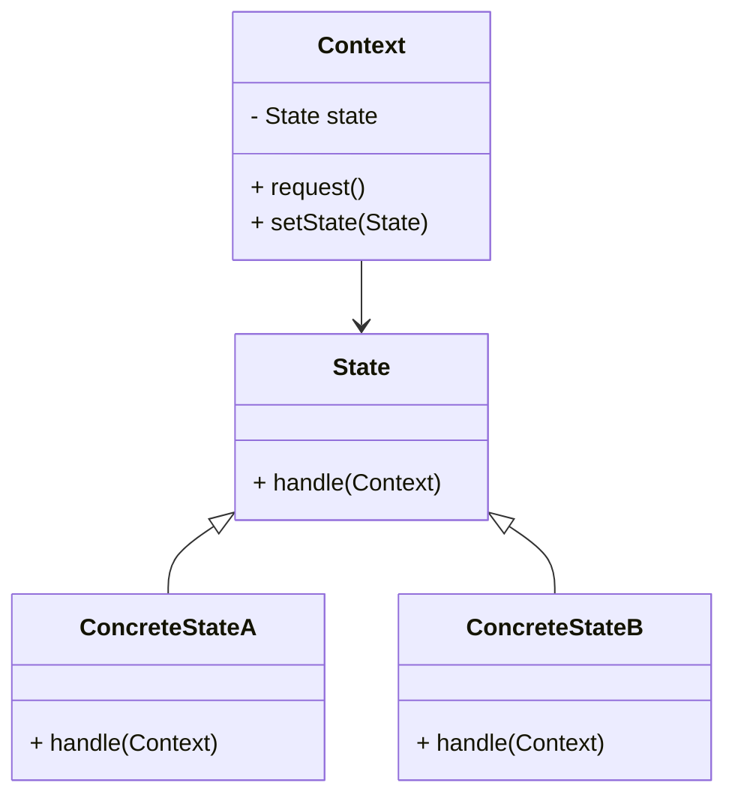

## 8.9.1 Implementing State in Java

The State pattern is a behavioral design pattern that allows an object to change its behavior when its internal state changes. This pattern is particularly useful in scenarios where an object must exhibit different behaviors depending on its current state, effectively enabling state-specific behavior encapsulation. This guide will explore the State pattern's intent, participants, and implementation in Java, complete with UML diagrams and code examples.

### Intent of the State Pattern

The primary intent of the State pattern is to allow an object to alter its behavior when its internal state changes. The object will appear to change its class, providing a clean way to manage state-specific behavior without resorting to complex conditional logic.

#### Advantages of the State Pattern

- **Encapsulation of State-Specific Behavior**: The State pattern encapsulates state-specific behavior within separate classes, promoting cleaner and more maintainable code.
- **Simplification of Complex Conditional Logic**: By delegating state-specific behavior to individual state classes, the State pattern reduces the need for complex conditional statements.
- **Improved Flexibility and Scalability**: Adding new states or modifying existing ones becomes straightforward, enhancing the system's flexibility and scalability.

### Participants in the State Pattern

The State pattern involves three primary participants:

1. **Context**: Maintains an instance of a ConcreteState subclass that defines the current state.
2. **State**: Defines an interface for encapsulating the behavior associated with a particular state of the Context.
3. **ConcreteState**: Implements the behavior associated with a state of the Context.

### UML Diagram of the State Pattern

Below is a UML diagram illustrating the structure and state transitions of the State pattern:



**Caption**: UML diagram showing the relationship between Context, State, and ConcreteState classes.

### Implementing the State Pattern in Java

#### Step-by-Step Implementation

1. **Define the State Interface**

   The `State` interface declares a method for handling a request, which will be implemented by ConcreteState classes.

   ```java
   public interface State {
       void handle(Context context);
   }
   ```

2. **Implement ConcreteState Classes**

   Each `ConcreteState` class implements the `State` interface and provides specific behavior for the state.

   ```java
   public class ConcreteStateA implements State {
       @Override
       public void handle(Context context) {
           System.out.println("Handling request in State A.");
           context.setState(new ConcreteStateB());
       }
   }

   public class ConcreteStateB implements State {
       @Override
       public void handle(Context context) {
           System.out.println("Handling request in State B.");
           context.setState(new ConcreteStateA());
       }
   }
   ```

3. **Create the Context Class**

   The `Context` class maintains an instance of a `State` subclass and delegates state-specific behavior to the current `State` object.

   ```java
   public class Context {
       private State state;

       public Context(State state) {
           this.state = state;
       }

       public void setState(State state) {
           this.state = state;
       }

       public void request() {
           state.handle(this);
       }
   }
   ```

4. **Demonstrate the State Pattern**

   The following code demonstrates how the `Context` class interacts with different states.

   ```java
   public class StatePatternDemo {
       public static void main(String[] args) {
           Context context = new Context(new ConcreteStateA());
           context.request(); // Output: Handling request in State A.
           context.request(); // Output: Handling request in State B.
           context.request(); // Output: Handling request in State A.
       }
   }
   ```

#### Explanation of the Code Example

- **State Interface**: The `State` interface defines a method `handle()` that takes a `Context` object as a parameter. This method is responsible for performing actions based on the current state and transitioning to another state if necessary.
- **ConcreteState Classes**: `ConcreteStateA` and `ConcreteStateB` implement the `State` interface, providing specific behavior for each state. They also manage state transitions by setting the next state in the `Context`.
- **Context Class**: The `Context` class maintains a reference to a `State` object and delegates the handling of requests to this object. It also provides a method `setState()` to change the current state.

### Encapsulation of State-Specific Behaviors

The State pattern encapsulates state-specific behaviors within separate classes, allowing each state to manage its behavior independently. This encapsulation promotes cleaner code and simplifies the management of state transitions.

### Simplifying Complex Conditional Logic

The State pattern simplifies complex conditional logic by delegating state-specific behavior to individual state classes. This delegation reduces the need for large conditional statements and makes the code more readable and maintainable.

### Sample Use Cases

The State pattern is applicable in various scenarios, including:

- **User Interface Components**: Managing different states of UI components, such as buttons or menus, based on user interactions.
- **Game Development**: Handling different states of game characters or objects, such as idle, running, or jumping.
- **Workflow Systems**: Managing different states of a workflow, such as pending, approved, or rejected.

### Related Patterns

The State pattern is closely related to the [Strategy Pattern]( "Strategy Pattern"), as both patterns encapsulate behavior. However, the Strategy pattern allows for the selection of behavior at runtime, while the State pattern focuses on changing behavior based on the object's state.

### Known Uses

The State pattern is widely used in various libraries and frameworks, including:

- **Java AWT and Swing**: Managing different states of UI components.
- **State Machines**: Implementing state machines in software systems.

### Conclusion

The State pattern is a powerful tool for managing state-specific behavior in Java applications. By encapsulating behavior within separate classes, the pattern promotes cleaner code and simplifies the management of state transitions. Implementing the State pattern can significantly enhance the flexibility and maintainability of your software systems.

## Test Your Knowledge: Java State Pattern Quiz



### What is the primary intent of the State pattern?

- [x] To allow an object to alter its behavior when its internal state changes.
- [ ] To provide a way to create objects without specifying their concrete classes.
- [ ] To define a family of algorithms and make them interchangeable.
- [ ] To separate the construction of a complex object from its representation.

> **Explanation:** The State pattern's primary intent is to enable an object to change its behavior when its internal state changes, making it appear as if the object has changed its class.

### Which participant in the State pattern maintains an instance of a ConcreteState subclass?

- [x] Context
- [ ] State
- [ ] ConcreteState
- [ ] Client

> **Explanation:** The Context class maintains an instance of a ConcreteState subclass and delegates state-specific behavior to this instance.

### What is the role of the State interface in the State pattern?

- [x] To define an interface for encapsulating behavior associated with a particular state.
- [ ] To implement the behavior associated with a state.
- [ ] To maintain the current state of the Context.
- [ ] To provide a way to create objects without specifying their concrete classes.

> **Explanation:** The State interface defines a method for encapsulating behavior associated with a particular state, which ConcreteState classes implement.

### How does the State pattern simplify complex conditional logic?

- [x] By delegating state-specific behavior to individual state classes.
- [ ] By using large conditional statements to manage state transitions.
- [ ] By encapsulating all behavior within the Context class.
- [ ] By providing a single method to handle all state transitions.

> **Explanation:** The State pattern simplifies complex conditional logic by delegating state-specific behavior to individual state classes, reducing the need for large conditional statements.

### In the provided Java code example, what happens when the `request()` method is called on the Context object?

- [x] The current state's `handle()` method is invoked, and the state may change.
- [ ] The Context object changes its state to a default state.
- [ ] The Context object performs a default action regardless of its state.
- [ ] The Context object remains in its current state without any action.

> **Explanation:** When the `request()` method is called, the current state's `handle()` method is invoked, which may change the state of the Context object.

### Which of the following is a benefit of using the State pattern?

- [x] It encapsulates state-specific behavior within separate classes.
- [ ] It increases the complexity of the code.
- [ ] It requires extensive use of conditional statements.
- [ ] It limits the flexibility of the system.

> **Explanation:** The State pattern encapsulates state-specific behavior within separate classes, promoting cleaner and more maintainable code.

### What is a common use case for the State pattern?

- [x] Managing different states of UI components.
- [ ] Implementing singleton objects.
- [ ] Creating complex object hierarchies.
- [ ] Defining a family of algorithms.

> **Explanation:** A common use case for the State pattern is managing different states of UI components, such as buttons or menus.

### How does the State pattern relate to the Strategy pattern?

- [x] Both patterns encapsulate behavior, but the State pattern focuses on changing behavior based on the object's state.
- [ ] Both patterns are used to create objects without specifying their concrete classes.
- [ ] Both patterns define a family of algorithms and make them interchangeable.
- [ ] Both patterns are used to separate the construction of a complex object from its representation.

> **Explanation:** Both the State and Strategy patterns encapsulate behavior, but the State pattern focuses on changing behavior based on the object's state, while the Strategy pattern allows for the selection of behavior at runtime.

### What is the role of ConcreteState classes in the State pattern?

- [x] To implement the behavior associated with a state of the Context.
- [ ] To define an interface for encapsulating behavior associated with a particular state.
- [ ] To maintain the current state of the Context.
- [ ] To provide a way to create objects without specifying their concrete classes.

> **Explanation:** ConcreteState classes implement the behavior associated with a state of the Context, providing specific behavior for each state.

### True or False: The State pattern is used to manage state-specific behavior in Java applications.

- [x] True
- [ ] False

> **Explanation:** True. The State pattern is used to manage state-specific behavior in Java applications, allowing objects to change behavior based on their internal state.



By mastering the State pattern, Java developers can create more robust, maintainable, and flexible applications that effectively manage state-specific behavior.
