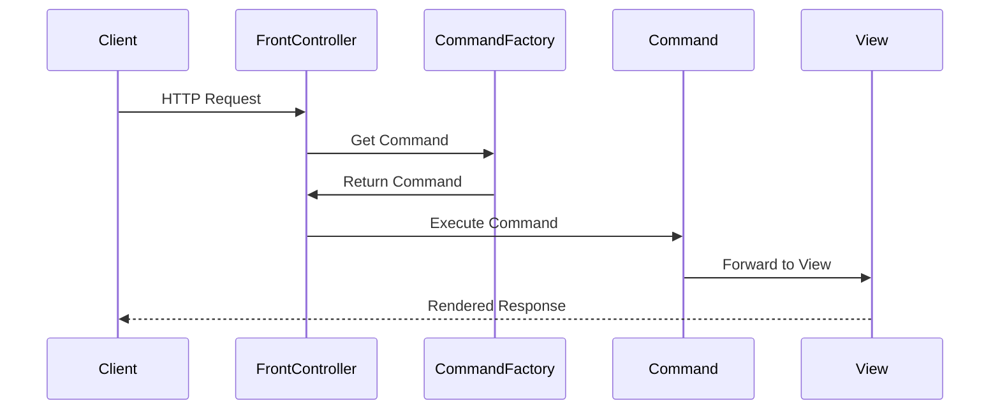

## 8.9.1 Implementing Front Controller in Java

The Front Controller pattern is a crucial design pattern in web application architecture. It provides a centralized entry point for handling all incoming requests, allowing for a streamlined and organized approach to request processing. In this section, we will explore how to implement a Front Controller in Java using servlets, which are a fundamental component of Java web applications.

### Understanding the Front Controller Pattern

Before diving into the implementation, let's briefly understand the Front Controller pattern. This pattern involves a single controller that handles all requests for a web application. The controller is responsible for:

- Intercepting incoming requests.
- Delegating requests to appropriate handlers or views.
- Managing application-wide concerns such as authentication, logging, and error handling.

By centralizing control, the Front Controller pattern simplifies request processing and enhances maintainability.

### Setting Up a Front Controller Using Java Servlets

Java servlets provide an excellent mechanism for implementing a Front Controller. A servlet can be configured to intercept all incoming requests to the application, acting as the central point of control.

#### Step 1: Creating the Front Controller Servlet

To start, we need to create a servlet that will serve as the Front Controller. This servlet will intercept all requests and delegate them to appropriate handlers based on the request URL or parameters.

```java
import javax.servlet.ServletException;
import javax.servlet.annotation.WebServlet;
import javax.servlet.http.HttpServlet;
import javax.servlet.http.HttpServletRequest;
import javax.servlet.http.HttpServletResponse;
import java.io.IOException;

@WebServlet(urlPatterns = "/*")
public class FrontControllerServlet extends HttpServlet {

    @Override
    protected void doGet(HttpServletRequest request, HttpServletResponse response) throws ServletException, IOException {
        processRequest(request, response);
    }

    @Override
    protected void doPost(HttpServletRequest request, HttpServletResponse response) throws ServletException, IOException {
        processRequest(request, response);
    }

    private void processRequest(HttpServletRequest request, HttpServletResponse response) throws ServletException, IOException {
        String action = request.getParameter("action");
        if (action == null) {
            action = "default";
        }

        switch (action) {
            case "view":
                forwardToView(request, response);
                break;
            case "edit":
                forwardToEdit(request, response);
                break;
            default:
                forwardToDefault(request, response);
                break;
        }
    }

    private void forwardToView(HttpServletRequest request, HttpServletResponse response) throws ServletException, IOException {
        request.getRequestDispatcher("/view.jsp").forward(request, response);
    }

    private void forwardToEdit(HttpServletRequest request, HttpServletResponse response) throws ServletException, IOException {
        request.getRequestDispatcher("/edit.jsp").forward(request, response);
    }

    private void forwardToDefault(HttpServletRequest request, HttpServletResponse response) throws ServletException, IOException {
        request.getRequestDispatcher("/default.jsp").forward(request, response);
    }
}
```

**Explanation:**

- **Annotation `@WebServlet(urlPatterns = "/*")`:** This annotation configures the servlet to intercept all requests to the application. The `/*` pattern ensures that every request is routed through this servlet.
- **`processRequest` Method:** This method determines the action to be taken based on request parameters and forwards the request to the appropriate handler or view.

#### Step 2: Configuring the Servlet

The servlet configuration is crucial for ensuring that the Front Controller intercepts all requests. The `@WebServlet` annotation is used to define the URL pattern that the servlet should handle. In this case, `/*` is used to capture all requests.

#### Step 3: Using a Dispatcher for Request Handling

The Front Controller servlet uses a dispatcher to forward requests to specific handlers or views. This is typically done using the `RequestDispatcher` interface, which allows for forwarding requests to other resources within the application.

### Best Practices for Implementing a Front Controller

Implementing a Front Controller involves more than just setting up a servlet. Here are some best practices to consider:

#### Organize Request Handling Logic

- **Use Command Patterns or Action Classes:** Organize request handling logic into separate classes or components. This approach makes the codebase more modular and easier to maintain.
  
```java
public interface Command {
    void execute(HttpServletRequest request, HttpServletResponse response) throws ServletException, IOException;
}

public class ViewCommand implements Command {
    @Override
    public void execute(HttpServletRequest request, HttpServletResponse response) throws ServletException, IOException {
        request.getRequestDispatcher("/view.jsp").forward(request, response);
    }
}

public class EditCommand implements Command {
    @Override
    public void execute(HttpServletRequest request, HttpServletResponse response) throws ServletException, IOException {
        request.getRequestDispatcher("/edit.jsp").forward(request, response);
    }
}
```

- **Command Pattern Implementation:** Define a `Command` interface and implement different commands for various actions. This pattern helps in decoupling the action logic from the controller.

#### Centralize Exception and Error Management

- **Global Exception Handling:** Implement a centralized mechanism for handling exceptions and errors. This can be done using a custom error page or a dedicated error-handling servlet.

```java
@WebServlet(urlPatterns = "/error")
public class ErrorHandlerServlet extends HttpServlet {
    @Override
    protected void doGet(HttpServletRequest request, HttpServletResponse response) throws ServletException, IOException {
        Throwable throwable = (Throwable) request.getAttribute("javax.servlet.error.exception");
        Integer statusCode = (Integer) request.getAttribute("javax.servlet.error.status_code");
        
        request.setAttribute("errorMessage", throwable != null ? throwable.getMessage() : "Unknown error");
        request.setAttribute("statusCode", statusCode);
        request.getRequestDispatcher("/error.jsp").forward(request, response);
    }
}
```

- **Error Handling Servlet:** This servlet captures exceptions and forwards the user to a custom error page.

#### Support Extension and Modification

- **Flexible Request Handling:** Design the Front Controller to support easy extension and modification. This can be achieved by using configuration files or annotations to define new request handlers.

```java
public class CommandFactory {
    public static Command getCommand(String action) {
        switch (action) {
            case "view":
                return new ViewCommand();
            case "edit":
                return new EditCommand();
            default:
                return new DefaultCommand();
        }
    }
}
```

- **Command Factory:** Use a factory pattern to create command instances based on the action. This approach allows for adding new commands without modifying the Front Controller.

### Visualizing the Front Controller Architecture

To better understand the flow of requests in a Front Controller pattern, let's visualize the architecture using a sequence diagram.



**Diagram Explanation:**

- **Client:** Initiates an HTTP request to the application.
- **FrontController:** Intercepts the request and delegates it to the appropriate command.
- **CommandFactory:** Determines the command to execute based on the request.
- **Command:** Executes the action and forwards the request to the appropriate view.
- **View:** Renders the response back to the client.

### Try It Yourself

To deepen your understanding, try modifying the code examples provided:

- **Add a New Command:** Implement a new command class and update the `CommandFactory` to handle a new action.
- **Customize Error Handling:** Create a more detailed error page that displays additional information about the error.
- **Experiment with URL Patterns:** Change the URL pattern in the `@WebServlet` annotation to see how it affects request handling.

### References and Further Reading

- [Java EE 8 Tutorial](https://javaee.github.io/tutorial/)
- [Oracle's Java Servlet Documentation](https://docs.oracle.com/javaee/7/tutorial/servlets.htm)
- [Design Patterns: Elements of Reusable Object-Oriented Software](https://en.wikipedia.org/wiki/Design_Patterns)

### Knowledge Check

To reinforce your understanding, consider the following questions:

- How does the Front Controller pattern improve maintainability in web applications?
- What are the advantages of using a command pattern with a Front Controller?
- How can you handle errors centrally in a Front Controller architecture?

### Embrace the Journey

Implementing the Front Controller pattern is a significant step towards building scalable and maintainable web applications. Remember, this is just the beginning. As you progress, you'll discover more patterns and techniques that will enhance your development skills. Keep experimenting, stay curious, and enjoy the journey!

## Quiz Time!



### What is the primary role of a Front Controller in a web application?

- [x] To act as a centralized entry point for handling all incoming requests.
- [ ] To manage database connections.
- [ ] To serve static content.
- [ ] To handle user authentication exclusively.

> **Explanation:** The Front Controller pattern centralizes request handling, allowing for a streamlined and organized approach to processing requests.

### Which Java component is typically used to implement a Front Controller?

- [x] Servlet
- [ ] JSP
- [ ] EJB
- [ ] JavaBean

> **Explanation:** Servlets are used to intercept and process HTTP requests, making them ideal for implementing a Front Controller.

### How can a servlet be configured to intercept all requests in a Java web application?

- [x] By using the URL pattern `/*` in the `@WebServlet` annotation.
- [ ] By setting the servlet name to "FrontController".
- [ ] By placing the servlet in the root directory.
- [ ] By using the `@RequestMapping` annotation.

> **Explanation:** The `/*` URL pattern ensures that all requests are routed through the servlet.

### What is the purpose of using a dispatcher in a Front Controller?

- [x] To forward requests to appropriate handlers or views.
- [ ] To manage session data.
- [ ] To log request details.
- [ ] To handle database transactions.

> **Explanation:** A dispatcher forwards requests to the correct handler or view, facilitating organized request processing.

### Which pattern can be used to organize request handling logic in a Front Controller?

- [x] Command Pattern
- [ ] Singleton Pattern
- [ ] Observer Pattern
- [ ] Factory Pattern

> **Explanation:** The Command Pattern helps in decoupling action logic from the controller, making the codebase more modular.

### How can error handling be centralized in a Front Controller architecture?

- [x] By implementing a dedicated error-handling servlet.
- [ ] By using try-catch blocks in every method.
- [ ] By logging errors to a file.
- [ ] By displaying error messages directly in the servlet.

> **Explanation:** A dedicated error-handling servlet can capture exceptions and forward users to a custom error page.

### What is a benefit of using a Command Factory in a Front Controller?

- [x] It allows for adding new commands without modifying the Front Controller.
- [ ] It reduces the number of servlets needed.
- [ ] It simplifies database interactions.
- [ ] It enhances user interface design.

> **Explanation:** A Command Factory enables the creation of command instances based on actions, supporting easy extension and modification.

### Which of the following is NOT a responsibility of a Front Controller?

- [ ] Intercepting incoming requests.
- [ ] Delegating requests to appropriate handlers.
- [x] Managing database transactions.
- [ ] Handling application-wide concerns like logging.

> **Explanation:** Managing database transactions is typically handled by other components, not the Front Controller.

### True or False: The Front Controller pattern can help reduce code duplication in request handling.

- [x] True
- [ ] False

> **Explanation:** By centralizing request handling, the Front Controller pattern reduces code duplication and enhances maintainability.

### True or False: The Front Controller pattern is only applicable to Java web applications.

- [ ] True
- [x] False

> **Explanation:** While commonly used in Java, the Front Controller pattern can be applied in various web application frameworks and languages.


