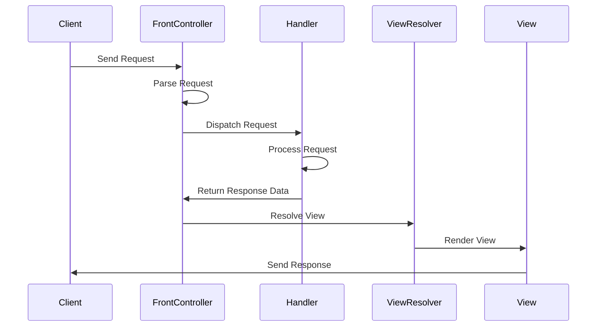

## 8.9.2 Request Processing Flow

In the realm of web application architecture, the Front Controller pattern serves as a pivotal design strategy that centralizes request handling. This pattern is instrumental in managing the flow of requests and responses, ensuring a streamlined and organized approach to web application development. In this section, we will delve into the intricacies of the request processing flow within the Front Controller pattern, exploring each step in detail and providing practical examples to illustrate these concepts.

### Understanding the Front Controller Pattern

The Front Controller pattern is a design pattern used in web applications to provide a centralized entry point for handling all incoming requests. This pattern is particularly beneficial in applications with complex navigation and multiple request types, as it simplifies request processing and enhances maintainability.

### Steps in Request Processing Flow

The request processing flow in the Front Controller pattern involves several key steps, each crucial for ensuring efficient request handling and response generation. Let's explore these steps in detail:

#### 1. Receiving the Request in the Front Controller

The first step in the request processing flow is receiving the incoming request. The Front Controller acts as the single entry point for all requests, intercepting them before they reach any specific handler or service. This centralization allows for consistent processing of requests and the implementation of common functionalities such as logging, authentication, and authorization.

```java
@WebServlet("/controller")
public class FrontController extends HttpServlet {
    protected void doGet(HttpServletRequest request, HttpServletResponse response) throws ServletException, IOException {
        processRequest(request, response);
    }

    protected void doPost(HttpServletRequest request, HttpServletResponse response) throws ServletException, IOException {
        processRequest(request, response);
    }

    private void processRequest(HttpServletRequest request, HttpServletResponse response) throws ServletException, IOException {
        // Common request processing logic
    }
}
```

In this example, the `FrontController` servlet intercepts both GET and POST requests, delegating them to a common `processRequest` method for further processing.

#### 2. Parsing Request Parameters and Determining the Action

Once the request is received, the next step is to parse the request parameters and determine the appropriate action. This involves extracting relevant information from the request, such as query parameters, form data, and headers, to identify the requested operation.

```java
private void processRequest(HttpServletRequest request, HttpServletResponse response) throws ServletException, IOException {
    String action = request.getParameter("action");
    if ("login".equals(action)) {
        // Forward to login handler
    } else if ("register".equals(action)) {
        // Forward to registration handler
    } else {
        // Default action
    }
}
```

In this snippet, the `action` parameter is used to determine the specific operation requested by the client, allowing the controller to dispatch the request to the appropriate handler.

#### 3. Dispatching to the Appropriate Handler or Service

After determining the action, the Front Controller dispatches the request to the appropriate handler or service. This step involves invoking the necessary business logic or service layer to process the request and generate a response.

```java
if ("login".equals(action)) {
    LoginHandler loginHandler = new LoginHandler();
    loginHandler.handleRequest(request, response);
} else if ("register".equals(action)) {
    RegistrationHandler registrationHandler = new RegistrationHandler();
    registrationHandler.handleRequest(request, response);
}
```

Here, specific handler classes are instantiated based on the action parameter, and the `handleRequest` method is called to process the request.

#### 4. Selecting the Appropriate View for Rendering the Response

Once the request is processed, the next step is to select the appropriate view for rendering the response. This involves determining the view template or page to display the results of the request processing.

```java
RequestDispatcher dispatcher = request.getRequestDispatcher("/WEB-INF/views/login.jsp");
dispatcher.forward(request, response);
```

In this example, a `RequestDispatcher` is used to forward the request to a JSP page for rendering the response. The choice of view can be influenced by the outcome of the request processing or other factors such as user preferences.

### Implementing View Selection Logic

View selection is a crucial aspect of the request processing flow, as it determines how the response is presented to the user. There are several strategies for implementing view selection logic, including the use of view resolvers and templating engines.

#### Using View Resolvers

View resolvers are components that map logical view names to actual view templates. They provide a flexible way to manage view selection, allowing for easy changes to view templates without modifying the controller logic.

```java
@Configuration
@EnableWebMvc
public class WebConfig implements WebMvcConfigurer {
    @Bean
    public InternalResourceViewResolver viewResolver() {
        InternalResourceViewResolver resolver = new InternalResourceViewResolver();
        resolver.setPrefix("/WEB-INF/views/");
        resolver.setSuffix(".jsp");
        return resolver;
    }
}
```

In this Spring configuration example, an `InternalResourceViewResolver` is used to map view names to JSP files located in the `/WEB-INF/views/` directory.

#### Using Templating Engines

Templating engines such as Thymeleaf, FreeMarker, or Velocity provide powerful tools for generating dynamic views. They allow for complex view logic and integration with backend data, enhancing the flexibility and maintainability of the view layer.

```java
@Controller
public class HomeController {
    @GetMapping("/home")
    public String home(Model model) {
        model.addAttribute("message", "Welcome to the Home Page!");
        return "home"; // Thymeleaf template name
    }
}
```

In this example, a Thymeleaf template named `home` is used to render the response, with data passed through the `Model` object.

### Handling POST and GET Requests Differently

In web applications, POST and GET requests often require different handling due to their distinct purposes. GET requests are typically used for retrieving data, while POST requests are used for submitting data. The Front Controller pattern can accommodate these differences by implementing separate logic for each request type.

#### Handling GET Requests

GET requests are generally idempotent and should not modify server state. They are used to retrieve data or resources, and their responses can be cached for improved performance.

```java
protected void doGet(HttpServletRequest request, HttpServletResponse response) throws ServletException, IOException {
    String action = request.getParameter("action");
    if ("viewProfile".equals(action)) {
        // Retrieve and display user profile
    }
}
```

#### Handling POST Requests

POST requests are used for actions that modify server state, such as creating or updating resources. They require careful handling to ensure data integrity and security.

```java
protected void doPost(HttpServletRequest request, HttpServletResponse response) throws ServletException, IOException {
    String action = request.getParameter("action");
    if ("updateProfile".equals(action)) {
        // Update user profile
    }
}
```

### Maintaining a Clear Flow and Avoiding Complexity

One of the key challenges in implementing the Front Controller pattern is maintaining a clear and manageable request processing flow. As the central point for handling requests, the Front Controller can become a bottleneck if not designed carefully. Here are some strategies to avoid excessive complexity:

- **Modularize Handlers**: Break down request handling logic into smaller, reusable components or handlers. This promotes separation of concerns and makes the controller easier to maintain.
- **Use Command Pattern**: Implement the Command pattern to encapsulate request handling logic as command objects. This allows for flexible request processing and easier integration of new actions.
- **Implement Interceptors**: Use interceptors or filters to handle cross-cutting concerns such as logging, authentication, and authorization. This keeps the controller logic focused on request handling.

### Managing Session State and Security Concerns

In web applications, managing session state and security is crucial for ensuring a secure and consistent user experience. The Front Controller pattern provides a centralized point for implementing session management and security measures.

#### Session Management

Session management involves tracking user interactions across multiple requests and maintaining state information. This can be achieved using session attributes or cookies.

```java
HttpSession session = request.getSession();
session.setAttribute("user", user);
```

In this example, a user object is stored in the session to maintain user state across requests.

#### Security Concerns

Security is a critical aspect of web application development, and the Front Controller pattern can help enforce security measures consistently. Common security practices include:

- **Authentication and Authorization**: Implement authentication mechanisms to verify user identity and authorization checks to control access to resources.
- **Input Validation**: Validate and sanitize user input to prevent injection attacks and other vulnerabilities.
- **HTTPS**: Use HTTPS to encrypt data transmitted between the client and server, protecting sensitive information from interception.

### Try It Yourself

To deepen your understanding of the Front Controller pattern and request processing flow, try implementing a simple web application using the concepts discussed in this section. Experiment with different view selection strategies, request handling logic, and security measures. Consider the following exercises:

- **Modify the Code**: Change the view resolver configuration to use a different templating engine, such as Thymeleaf or FreeMarker.
- **Add New Actions**: Implement additional actions in the Front Controller, such as user registration or password reset, and create corresponding handlers.
- **Enhance Security**: Integrate authentication and authorization mechanisms into the Front Controller to restrict access to certain actions based on user roles.

### Visualizing the Request Processing Flow

To further illustrate the request processing flow in the Front Controller pattern, let's use a sequence diagram to visualize the interactions between the components involved in handling a request.



In this diagram, the sequence of interactions between the client, Front Controller, handler, view resolver, and view is depicted, highlighting the flow of request processing and response generation.

### References and Links

For further reading on the Front Controller pattern and request processing flow, consider exploring the following resources:

- [Oracle Java EE Documentation](https://docs.oracle.com/javaee/)
- [Spring Framework Documentation](https://spring.io/projects/spring-framework)
- [Thymeleaf Documentation](https://www.thymeleaf.org/documentation.html)

### Knowledge Check

To reinforce your understanding of the request processing flow in the Front Controller pattern, consider the following questions:

- What are the benefits of using a centralized controller for request handling?
- How can view resolvers enhance the flexibility of view selection?
- What strategies can be used to handle POST and GET requests differently?
- How does the Front Controller pattern help manage session state and security concerns?

### Embrace the Journey

Remember, mastering the Front Controller pattern and request processing flow is a journey that requires practice and experimentation. As you continue to explore and implement these concepts, you'll gain valuable insights into building scalable and maintainable web applications. Keep experimenting, stay curious, and enjoy the journey!

## Quiz Time!



### What is the primary role of the Front Controller in a web application?

- [x] To act as a single entry point for all requests.
- [ ] To handle database interactions.
- [ ] To manage user sessions.
- [ ] To render views directly.

> **Explanation:** The Front Controller serves as a centralized entry point for handling all incoming requests, allowing for consistent processing and management of requests.

### Which component is responsible for determining the view to render in the Front Controller pattern?

- [ ] Handler
- [x] View Resolver
- [ ] Client
- [ ] Session Manager

> **Explanation:** The View Resolver maps logical view names to actual view templates, facilitating flexible view selection.

### How can POST and GET requests be handled differently in the Front Controller pattern?

- [x] By implementing separate logic for each request type.
- [ ] By using the same handler for all request types.
- [ ] By ignoring the request method.
- [ ] By using only GET requests.

> **Explanation:** POST and GET requests often require different handling due to their distinct purposes, and the Front Controller can implement separate logic for each.

### What is a common strategy to avoid complexity in the Front Controller?

- [ ] Use a single handler for all actions.
- [x] Modularize handlers and use interceptors.
- [ ] Ignore security concerns.
- [ ] Hardcode view paths.

> **Explanation:** Modularizing handlers and using interceptors helps maintain a clear and manageable request processing flow, avoiding excessive complexity.

### Which of the following is a security concern that the Front Controller pattern can help address?

- [x] Authentication and Authorization
- [ ] Database normalization
- [ ] Caching strategies
- [ ] Load balancing

> **Explanation:** The Front Controller pattern can enforce security measures such as authentication and authorization consistently across requests.

### What is the purpose of session management in web applications?

- [x] To track user interactions across multiple requests.
- [ ] To render views.
- [ ] To handle database transactions.
- [ ] To manage server resources.

> **Explanation:** Session management involves tracking user interactions and maintaining state information across multiple requests.

### Which of the following is NOT a benefit of using the Front Controller pattern?

- [ ] Centralized request handling
- [ ] Consistent security enforcement
- [ ] Simplified view selection
- [x] Direct database access

> **Explanation:** The Front Controller pattern does not provide direct database access; it focuses on centralized request handling and consistent processing.

### How can view resolvers enhance the flexibility of view selection?

- [x] By mapping logical view names to actual view templates.
- [ ] By directly rendering views.
- [ ] By handling request parameters.
- [ ] By managing user sessions.

> **Explanation:** View resolvers enhance flexibility by mapping logical view names to actual view templates, allowing for easy changes to view templates.

### What is a common use case for POST requests in web applications?

- [ ] Retrieving data
- [x] Submitting data
- [ ] Caching responses
- [ ] Rendering views

> **Explanation:** POST requests are typically used for actions that modify server state, such as creating or updating resources.

### True or False: The Front Controller pattern can help manage session state and security concerns.

- [x] True
- [ ] False

> **Explanation:** The Front Controller pattern provides a centralized point for implementing session management and security measures consistently.


