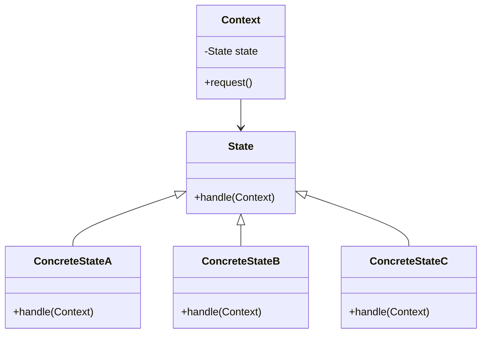
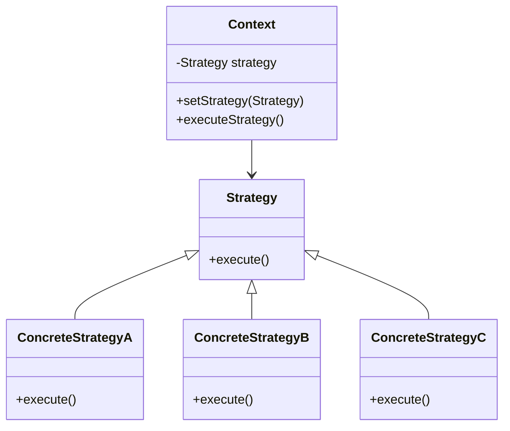

## 8.9.3 State vs. Strategy Pattern

Design patterns are essential tools in a software architect's toolkit, providing proven solutions to common design problems. Among these, the **State** and **Strategy** patterns are frequently discussed due to their similarities and differences. Both patterns leverage composition to delegate behavior, yet they serve distinct purposes in software design. This section delves into the nuances of these patterns, offering insights into their appropriate applications.

### Understanding the State Pattern

#### Intent

The **State Pattern** is a behavioral design pattern that allows an object to alter its behavior when its internal state changes. This pattern is particularly useful when an object must change its behavior at runtime depending on its state.

#### Motivation

Consider a simple example of a traffic light system. The traffic light can be in one of several states: Red, Yellow, or Green. Each state dictates different behavior for the traffic light. The State pattern allows the traffic light to change its behavior dynamically as it transitions from one state to another.

#### Structure



*Diagram: Structure of the State Pattern, showing the relationship between Context and State classes.*

#### Implementation

```java
// State interface
interface State {
    void handle(Context context);
}

// Concrete states
class ConcreteStateA implements State {
    public void handle(Context context) {
        System.out.println("State A handling request.");
        context.setState(new ConcreteStateB());
    }
}

class ConcreteStateB implements State {
    public void handle(Context context) {
        System.out.println("State B handling request.");
        context.setState(new ConcreteStateC());
    }
}

class ConcreteStateC implements State {
    public void handle(Context context) {
        System.out.println("State C handling request.");
        context.setState(new ConcreteStateA());
    }
}

// Context class
class Context {
    private State state;

    public Context(State state) {
        this.state = state;
    }

    public void setState(State state) {
        this.state = state;
    }

    public void request() {
        state.handle(this);
    }
}

// Usage
public class StatePatternDemo {
    public static void main(String[] args) {
        Context context = new Context(new ConcreteStateA());
        context.request();
        context.request();
        context.request();
    }
}
```

*Explanation: The `Context` class maintains an instance of a `State` subclass, which defines the current state. The `request()` method delegates the state-specific behavior to the current state object.*

### Understanding the Strategy Pattern

#### Intent

The **Strategy Pattern** is a behavioral design pattern that enables selecting an algorithm's behavior at runtime. It defines a family of algorithms, encapsulates each one, and makes them interchangeable.

#### Motivation

Imagine a payment processing system that supports multiple payment methods such as credit card, PayPal, and bank transfer. The Strategy pattern allows the system to choose the appropriate payment method at runtime without altering the client code.

#### Structure



*Diagram: Structure of the Strategy Pattern, illustrating the relationship between Context and Strategy classes.*

#### Implementation

```java
// Strategy interface
interface Strategy {
    void execute();
}

// Concrete strategies
class ConcreteStrategyA implements Strategy {
    public void execute() {
        System.out.println("Executing strategy A.");
    }
}

class ConcreteStrategyB implements Strategy {
    public void execute() {
        System.out.println("Executing strategy B.");
    }
}

class ConcreteStrategyC implements Strategy {
    public void execute() {
        System.out.println("Executing strategy C.");
    }
}

// Context class
class Context {
    private Strategy strategy;

    public void setStrategy(Strategy strategy) {
        this.strategy = strategy;
    }

    public void executeStrategy() {
        strategy.execute();
    }
}

// Usage
public class StrategyPatternDemo {
    public static void main(String[] args) {
        Context context = new Context();

        context.setStrategy(new ConcreteStrategyA());
        context.executeStrategy();

        context.setStrategy(new ConcreteStrategyB());
        context.executeStrategy();

        context.setStrategy(new ConcreteStrategyC());
        context.executeStrategy();
    }
}
```

*Explanation: The `Context` class is configured with a `Strategy` object, which it uses to execute the algorithm defined by the strategy.*

### Comparing State and Strategy Patterns

#### Similarities

- **Composition Over Inheritance**: Both patterns use composition to delegate behavior to different classes, promoting flexibility and reusability.
- **Encapsulation**: They encapsulate varying behavior, allowing the client to change behavior dynamically.

#### Differences

- **Purpose**: The State pattern is focused on managing state transitions, while the Strategy pattern is concerned with selecting an algorithm.
- **Context Awareness**: In the State pattern, the state is aware of the context and can change it, whereas in the Strategy pattern, the strategy is unaware of the context.
- **Behavior Change**: The State pattern changes behavior based on state transitions, while the Strategy pattern changes behavior based on the chosen algorithm.

#### When to Use Each Pattern

- **State Pattern**: Use when an object must change its behavior based on its internal state, such as a finite state machine.
- **Strategy Pattern**: Use when you need to select from a family of algorithms at runtime, such as different sorting algorithms.

### Practical Applications

#### State Pattern Use Case

In a video player application, the player can be in different states such as Playing, Paused, or Stopped. Each state has distinct behavior, and the State pattern can manage these transitions seamlessly.

#### Strategy Pattern Use Case

In a data processing application, different compression algorithms might be used based on the data type. The Strategy pattern allows selecting the appropriate algorithm without modifying the client code.

### Conclusion

Understanding the distinctions between the State and Strategy patterns is crucial for applying them effectively in software design. While they share similarities in using composition to delegate behavior, their purposes and applications differ significantly. By recognizing these differences, developers can choose the appropriate pattern to address specific design challenges, leading to more robust and maintainable software solutions.

### Further Reading

- [Oracle Java Documentation](https://docs.oracle.com/en/java/)
- [Design Patterns: Elements of Reusable Object-Oriented Software](https://en.wikipedia.org/wiki/Design_Patterns)

## Test Your Knowledge: State vs. Strategy Pattern Quiz



### What is the primary focus of the State pattern?

- [x] Managing state transitions
- [ ] Selecting an algorithm
- [ ] Encapsulating behavior
- [ ] Improving performance

> **Explanation:** The State pattern is primarily concerned with managing state transitions and altering behavior based on the current state.

### How does the Strategy pattern differ from the State pattern in terms of context awareness?

- [x] The Strategy pattern is unaware of the context.
- [ ] The Strategy pattern changes the context.
- [ ] The Strategy pattern is aware of the context.
- [ ] The Strategy pattern manages state transitions.

> **Explanation:** The Strategy pattern is designed to be independent of the context, focusing on selecting an algorithm without altering the context.

### In which scenario is the State pattern most applicable?

- [x] When an object must change behavior based on its internal state
- [ ] When selecting from a family of algorithms
- [ ] When improving code readability
- [ ] When optimizing performance

> **Explanation:** The State pattern is ideal for scenarios where an object's behavior changes based on its internal state, such as a finite state machine.

### What is a key similarity between the State and Strategy patterns?

- [x] Both use composition to delegate behavior
- [ ] Both manage state transitions
- [ ] Both select algorithms at runtime
- [ ] Both improve performance

> **Explanation:** Both patterns use composition to delegate behavior, promoting flexibility and reusability.

### Which pattern is best suited for selecting a sorting algorithm at runtime?

- [x] Strategy Pattern
- [ ] State Pattern
- [ ] Singleton Pattern
- [ ] Observer Pattern

> **Explanation:** The Strategy pattern is designed for selecting from a family of algorithms at runtime, making it suitable for choosing sorting algorithms.

### What is a key difference between the State and Strategy patterns?

- [x] The State pattern manages state transitions, while the Strategy pattern selects an algorithm.
- [ ] The State pattern selects an algorithm, while the Strategy pattern manages state transitions.
- [ ] Both patterns manage state transitions.
- [ ] Both patterns select algorithms.

> **Explanation:** The State pattern focuses on managing state transitions, whereas the Strategy pattern is concerned with selecting an algorithm.

### When should the Strategy pattern be used?

- [x] When selecting from a family of algorithms at runtime
- [ ] When managing state transitions
- [x] When encapsulating varying behavior
- [ ] When improving performance

> **Explanation:** The Strategy pattern is used for selecting from a family of algorithms at runtime and encapsulating varying behavior.

### How does the State pattern handle behavior changes?

- [x] By altering behavior based on state transitions
- [ ] By selecting an algorithm
- [ ] By improving performance
- [ ] By encapsulating behavior

> **Explanation:** The State pattern changes behavior based on state transitions, allowing an object to alter its behavior dynamically.

### Which pattern is more suitable for a traffic light system?

- [x] State Pattern
- [ ] Strategy Pattern
- [ ] Singleton Pattern
- [ ] Observer Pattern

> **Explanation:** The State pattern is suitable for systems like traffic lights, where behavior changes based on different states.

### True or False: The Strategy pattern is aware of the context and can change it.

- [ ] True
- [x] False

> **Explanation:** False. The Strategy pattern is not aware of the context and does not change it; it focuses on selecting an algorithm.


