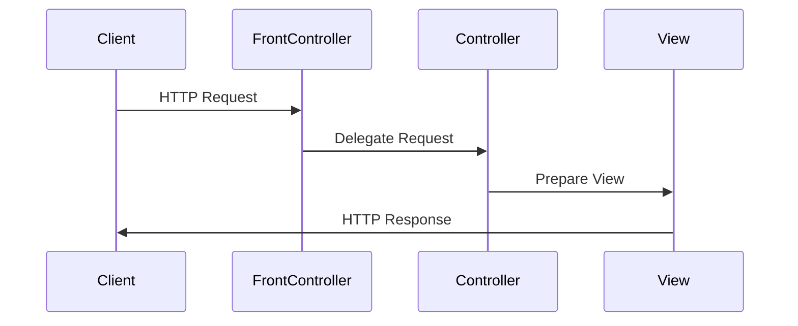

## 8.9.3 Use Cases and Examples

The Front Controller pattern is a crucial design pattern in the realm of web application development, particularly within the Model-View-Controller (MVC) architecture. It provides a centralized entry point for handling all requests in a web application, allowing for more organized and manageable code. In this section, we will delve into practical applications of the Front Controller pattern, including its implementation in popular frameworks like Spring MVC, as well as custom web applications. We will also discuss the benefits and challenges associated with this pattern, and provide code snippets and diagrams to illustrate its use.

### Implementing the Front Controller in Spring MVC

Spring MVC is a widely used framework that employs the Front Controller pattern through its `DispatcherServlet`. This servlet acts as the central dispatcher for requests, routing them to appropriate handlers based on configuration.

#### How Spring MVC Uses the Front Controller

In Spring MVC, the `DispatcherServlet` is configured in the `web.xml` file or through Java configuration. It intercepts all incoming requests and delegates them to the appropriate controller based on the URL pattern and other factors defined in the application context.

```xml
<!-- web.xml configuration for DispatcherServlet -->
<servlet>
    <servlet-name>dispatcher</servlet-name>
    <servlet-class>org.springframework.web.servlet.DispatcherServlet</servlet-class>
    <load-on-startup>1</load-on-startup>
</servlet>
<servlet-mapping>
    <servlet-name>dispatcher</servlet-name>
    <url-pattern>/</url-pattern>
</servlet-mapping>
```

In this configuration, the `DispatcherServlet` is mapped to the root URL pattern (`/`), meaning it will handle all requests to the application. The servlet then uses handler mappings to determine which controller should handle a given request.

#### Example: A Simple Spring MVC Application

Let's consider a simple Spring MVC application that handles requests for a bookstore. The `DispatcherServlet` routes requests to the `BookController`, which processes the request and returns a view name.

```java
@Controller
public class BookController {

    @RequestMapping("/books")
    public String listBooks(Model model) {
        List<Book> books = bookService.findAllBooks();
        model.addAttribute("books", books);
        return "bookList";
    }
}
```

In this example, the `BookController` is annotated with `@Controller`, and the `listBooks` method is mapped to the `/books` URL. The method retrieves a list of books from a service and adds it to the model, returning the name of the view (`bookList`) to be rendered.

#### Integrating with View Technologies

Spring MVC supports various view technologies, including JSP and Thymeleaf. The view resolver is responsible for mapping the view name returned by the controller to an actual view.

```xml
<!-- Spring configuration for view resolver -->
<bean id="viewResolver"
      class="org.springframework.web.servlet.view.InternalResourceViewResolver">
    <property name="prefix" value="/WEB-INF/views/" />
    <property name="suffix" value=".jsp" />
</bean>
```

In this configuration, the `InternalResourceViewResolver` is used to resolve view names to JSP files located in the `/WEB-INF/views/` directory. For example, the view name `bookList` would be resolved to `/WEB-INF/views/bookList.jsp`.

### Custom Web Application with a Front Controller

In addition to using frameworks like Spring MVC, you can implement the Front Controller pattern in a custom web application using Java Servlets. This involves creating a single servlet that handles all incoming requests and delegates them to appropriate action classes.

#### Example: Custom Front Controller Implementation

Consider a simple web application where a `FrontControllerServlet` handles all requests and delegates them to specific action classes based on the request URL.

```java
@WebServlet("/*")
public class FrontControllerServlet extends HttpServlet {

    protected void doGet(HttpServletRequest request, HttpServletResponse response)
            throws ServletException, IOException {
        String action = request.getPathInfo();
        Action actionInstance = ActionFactory.getAction(action);
        if (actionInstance != null) {
            actionInstance.execute(request, response);
        } else {
            response.sendError(HttpServletResponse.SC_NOT_FOUND);
        }
    }
}
```

In this example, the `FrontControllerServlet` intercepts all requests (`/*`) and uses an `ActionFactory` to obtain an instance of the appropriate action class based on the request path. The action class then processes the request and generates a response.

#### Action Classes and Delegation

Action classes encapsulate the logic for handling specific requests. They are responsible for processing the request, interacting with the model, and forwarding the request to a view.

```java
public class ListBooksAction implements Action {

    @Override
    public void execute(HttpServletRequest request, HttpServletResponse response)
            throws ServletException, IOException {
        List<Book> books = bookService.findAllBooks();
        request.setAttribute("books", books);
        RequestDispatcher dispatcher = request.getRequestDispatcher("/WEB-INF/views/bookList.jsp");
        dispatcher.forward(request, response);
    }
}
```

The `ListBooksAction` class retrieves a list of books and sets it as a request attribute before forwarding the request to the `bookList.jsp` view.

### Benefits of the Front Controller Pattern

Implementing the Front Controller pattern provides several benefits:

1. **Centralized Request Handling**: By having a single entry point for all requests, you can manage and configure request handling in one place, making it easier to implement and maintain.

2. **Improved Control Over Navigation**: The Front Controller can manage navigation logic, such as redirecting requests or forwarding them to different views based on the application's state or user input.

3. **Integration of Cross-Cutting Concerns**: The pattern allows for easier integration of cross-cutting concerns, such as logging, authentication, and authorization, by centralizing these aspects in the Front Controller.

4. **Consistent Error Handling**: With a centralized controller, you can implement consistent error handling and response generation across the application.

### Challenges and Considerations

Despite its benefits, the Front Controller pattern also presents some challenges:

1. **Single Point of Failure**: The Front Controller can become a bottleneck or single point of failure if not implemented correctly. It's crucial to ensure that it is robust and can handle high loads efficiently.

2. **Complexity in Large Applications**: As the application grows, the Front Controller may become complex and difficult to manage. It's important to modularize and delegate responsibilities to maintain clarity and simplicity.

3. **Performance Overhead**: The additional layer of request handling can introduce performance overhead. Optimizing the controller's logic and minimizing unnecessary processing can mitigate this issue.

### Visualizing the Front Controller Pattern

To better understand the flow of the Front Controller pattern, let's visualize it using a sequence diagram.



In this diagram, the client sends an HTTP request to the Front Controller, which delegates the request to the appropriate controller. The controller processes the request, prepares the view, and sends the HTTP response back to the client.

### Try It Yourself

To deepen your understanding of the Front Controller pattern, try implementing a simple web application using Java Servlets. Create a `FrontControllerServlet` that handles requests and delegates them to action classes. Experiment with different URL patterns and view technologies to see how they affect the application's behavior.

### Encouragement and Next Steps

Remember, mastering design patterns like the Front Controller is a journey. As you continue to explore and implement these patterns, you'll gain a deeper understanding of how they can improve your application's architecture and maintainability. Keep experimenting, stay curious, and enjoy the journey!

## Quiz Time!



### What is the primary role of the Front Controller pattern in web applications?

- [x] To provide a centralized entry point for handling all requests.
- [ ] To manage database connections.
- [ ] To serve as the main data storage.
- [ ] To perform client-side rendering.

> **Explanation:** The Front Controller pattern provides a centralized entry point for handling all requests, allowing for more organized and manageable code.

### In Spring MVC, which component acts as the Front Controller?

- [x] DispatcherServlet
- [ ] ModelAndView
- [ ] ApplicationContext
- [ ] ViewResolver

> **Explanation:** In Spring MVC, the `DispatcherServlet` acts as the Front Controller, intercepting all incoming requests and delegating them to appropriate handlers.

### What is a key benefit of using the Front Controller pattern?

- [x] Improved control over navigation and easier integration of cross-cutting concerns.
- [ ] Increased database performance.
- [ ] Simplified client-side scripting.
- [ ] Enhanced graphics rendering.

> **Explanation:** The Front Controller pattern improves control over navigation and allows for easier integration of cross-cutting concerns like logging and authentication.

### What challenge might arise from implementing the Front Controller pattern?

- [x] It can become a single point of failure.
- [ ] It simplifies error handling.
- [ ] It reduces code complexity.
- [ ] It eliminates the need for a database.

> **Explanation:** The Front Controller can become a single point of failure if not implemented correctly, as it handles all incoming requests.

### Which of the following is a common use case for the Front Controller pattern?

- [x] MVC frameworks like Spring MVC.
- [ ] Database indexing.
- [ ] Client-side animations.
- [ ] File compression algorithms.

> **Explanation:** The Front Controller pattern is commonly used in MVC frameworks like Spring MVC to handle requests centrally.

### How does the Front Controller pattern help with cross-cutting concerns?

- [x] By centralizing aspects like logging and authentication in one place.
- [ ] By distributing them across multiple modules.
- [ ] By eliminating the need for them.
- [ ] By handling them on the client side.

> **Explanation:** The Front Controller pattern centralizes cross-cutting concerns, making it easier to manage aspects like logging and authentication.

### What is the role of action classes in a custom Front Controller implementation?

- [x] To encapsulate the logic for handling specific requests.
- [ ] To manage database transactions.
- [ ] To render client-side graphics.
- [ ] To perform network routing.

> **Explanation:** In a custom Front Controller implementation, action classes encapsulate the logic for handling specific requests.

### Which view technologies can be integrated with Spring MVC?

- [x] JSP and Thymeleaf
- [ ] HTML and CSS
- [ ] XML and JSON
- [ ] SQL and NoSQL

> **Explanation:** Spring MVC supports integration with view technologies like JSP and Thymeleaf for rendering views.

### What is a potential performance issue with the Front Controller pattern?

- [x] Performance overhead due to an additional layer of request handling.
- [ ] Increased database query time.
- [ ] Slower client-side rendering.
- [ ] Reduced network bandwidth.

> **Explanation:** The additional layer of request handling in the Front Controller pattern can introduce performance overhead.

### True or False: The Front Controller pattern is only applicable to web applications.

- [x] False
- [ ] True

> **Explanation:** While commonly used in web applications, the Front Controller pattern can be adapted for other types of applications requiring centralized request handling.


