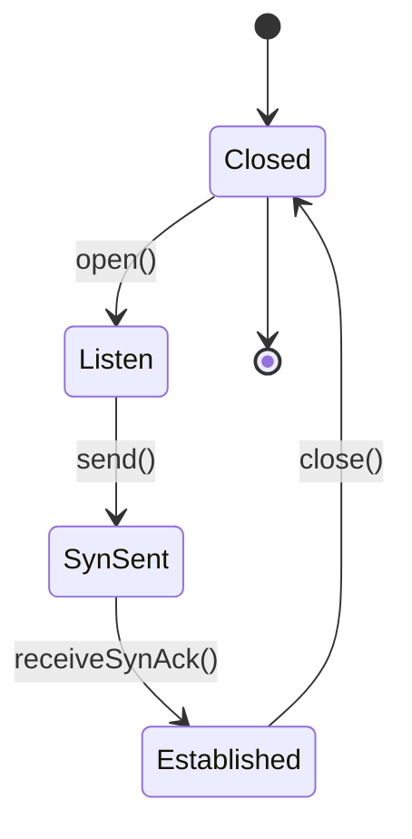
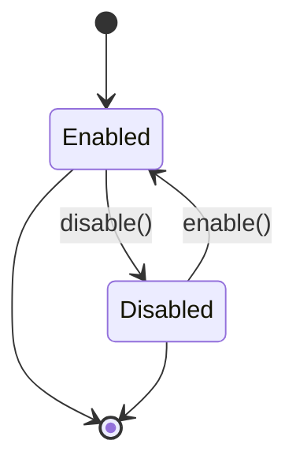

## 8.9.4 Use Cases and Examples

The State pattern is a behavioral design pattern that allows an object to change its behavior when its internal state changes. This pattern is particularly useful in scenarios where an object must exhibit different behaviors in different states, and it provides a clean way to organize code that would otherwise be cluttered with conditional statements. In this section, we will explore practical applications of the State pattern, including its implementation in a TCP connection's state machine and UI components that change behavior based on state. We will also discuss the benefits of using the State pattern in terms of code organization and clarity, as well as address any complexities in managing state transitions.

### TCP Connection State Machine

One of the classic examples of the State pattern is the implementation of a TCP connection's state machine. In a TCP connection, the connection can be in various states such as `CLOSED`, `LISTEN`, `SYN_SENT`, `ESTABLISHED`, and so on. Each state has its own set of behaviors and transitions to other states based on events like sending or receiving packets.

#### Intent

- **Description**: The State pattern allows an object to alter its behavior when its internal state changes. It appears as if the object changes its class.

#### Structure



- **Caption**: This diagram illustrates the state transitions in a TCP connection using the State pattern.

#### Implementation

Let's implement a simple TCP connection state machine using the State pattern in Java.

```java
// State interface
interface TCPState {
    void open(TCPConnection connection);
    void close(TCPConnection connection);
    void acknowledge(TCPConnection connection);
}

// Concrete States
class ClosedState implements TCPState {
    @Override
    public void open(TCPConnection connection) {
        System.out.println("Opening connection...");
        connection.setState(new ListenState());
    }

    @Override
    public void close(TCPConnection connection) {
        System.out.println("Connection is already closed.");
    }

    @Override
    public void acknowledge(TCPConnection connection) {
        System.out.println("No connection to acknowledge.");
    }
}

class ListenState implements TCPState {
    @Override
    public void open(TCPConnection connection) {
        System.out.println("Connection is already open.");
    }

    @Override
    public void close(TCPConnection connection) {
        System.out.println("Closing connection...");
        connection.setState(new ClosedState());
    }

    @Override
    public void acknowledge(TCPConnection connection) {
        System.out.println("Acknowledging connection...");
        connection.setState(new SynSentState());
    }
}

class SynSentState implements TCPState {
    @Override
    public void open(TCPConnection connection) {
        System.out.println("Connection is already open.");
    }

    @Override
    public void close(TCPConnection connection) {
        System.out.println("Closing connection...");
        connection.setState(new ClosedState());
    }

    @Override
    public void acknowledge(TCPConnection connection) {
        System.out.println("Connection established.");
        connection.setState(new EstablishedState());
    }
}

class EstablishedState implements TCPState {
    @Override
    public void open(TCPConnection connection) {
        System.out.println("Connection is already established.");
    }

    @Override
    public void close(TCPConnection connection) {
        System.out.println("Closing connection...");
        connection.setState(new ClosedState());
    }

    @Override
    public void acknowledge(TCPConnection connection) {
        System.out.println("Connection is already established.");
    }
}

// Context
class TCPConnection {
    private TCPState state;

    public TCPConnection() {
        state = new ClosedState();
    }

    public void setState(TCPState state) {
        this.state = state;
    }

    public void open() {
        state.open(this);
    }

    public void close() {
        state.close(this);
    }

    public void acknowledge() {
        state.acknowledge(this);
    }
}

// Client code
public class StatePatternDemo {
    public static void main(String[] args) {
        TCPConnection connection = new TCPConnection();
        connection.open();
        connection.acknowledge();
        connection.acknowledge();
        connection.close();
    }
}
```

#### Explanation

In this implementation, the `TCPConnection` class acts as the context that maintains an instance of a `TCPState` subclass representing the current state. The `TCPState` interface defines the methods that each state must implement. Concrete state classes like `ClosedState`, `ListenState`, `SynSentState`, and `EstablishedState` implement these methods to define the behavior for each state.

The client code demonstrates how the `TCPConnection` object changes its behavior as its state changes. By calling methods like `open()`, `close()`, and `acknowledge()`, the connection transitions between different states, and each state handles these method calls differently.

### UI Components with State-Dependent Behavior

Another common use case for the State pattern is in UI components that change behavior based on their state. For example, a button can be in an `Enabled` or `Disabled` state, and its behavior changes accordingly. When enabled, the button can be clicked to perform an action; when disabled, it does nothing.

#### Intent

- **Description**: Use the State pattern to allow UI components to change their behavior dynamically based on their state.

#### Structure



- **Caption**: This diagram illustrates the state transitions of a UI button using the State pattern.

#### Implementation

Let's implement a simple UI button with state-dependent behavior using the State pattern in Java.

```java
// State interface
interface ButtonState {
    void click(Button button);
}

// Concrete States
class EnabledState implements ButtonState {
    @Override
    public void click(Button button) {
        System.out.println("Button clicked! Performing action...");
    }
}

class DisabledState implements ButtonState {
    @Override
    public void click(Button button) {
        System.out.println("Button is disabled. No action performed.");
    }
}

// Context
class Button {
    private ButtonState state;

    public Button() {
        state = new EnabledState();
    }

    public void setState(ButtonState state) {
        this.state = state;
    }

    public void click() {
        state.click(this);
    }

    public void enable() {
        System.out.println("Enabling button...");
        setState(new EnabledState());
    }

    public void disable() {
        System.out.println("Disabling button...");
        setState(new DisabledState());
    }
}

// Client code
public class StatePatternDemo {
    public static void main(String[] args) {
        Button button = new Button();
        button.click();
        button.disable();
        button.click();
        button.enable();
        button.click();
    }
}
```

#### Explanation

In this implementation, the `Button` class acts as the context that maintains an instance of a `ButtonState` subclass representing the current state. The `ButtonState` interface defines the `click()` method that each state must implement. Concrete state classes like `EnabledState` and `DisabledState` implement this method to define the behavior for each state.

The client code demonstrates how the `Button` object changes its behavior as its state changes. By calling methods like `click()`, `enable()`, and `disable()`, the button transitions between different states, and each state handles the `click()` method differently.

### Benefits of the State Pattern

The State pattern offers several benefits in terms of code organization and clarity:

1. **Encapsulation of State-Specific Behavior**: By encapsulating state-specific behavior in separate classes, the State pattern promotes a cleaner and more organized codebase. Each state class is responsible for its own behavior, reducing the complexity of the context class.

2. **Simplified State Transitions**: The State pattern simplifies state transitions by allowing each state to manage its own transitions. This eliminates the need for complex conditional statements in the context class, making the code easier to read and maintain.

3. **Improved Maintainability**: By separating state-specific behavior into distinct classes, the State pattern makes it easier to add new states or modify existing ones without affecting other parts of the code. This improves the maintainability of the codebase.

4. **Enhanced Flexibility**: The State pattern allows for dynamic changes in behavior at runtime, enabling objects to change their behavior based on their state. This enhances the flexibility of the code and allows for more dynamic and responsive applications.

### Complexities in Managing State Transitions

While the State pattern offers many benefits, it also introduces some complexities in managing state transitions:

1. **Increased Number of Classes**: The State pattern requires the creation of separate classes for each state, which can lead to an increased number of classes in the codebase. This can make the codebase more complex and harder to navigate.

2. **Potential for State Explosion**: In systems with a large number of states, the State pattern can lead to a state explosion, where the number of state classes becomes unmanageable. This can make it difficult to maintain and extend the codebase.

3. **Complex State Transition Logic**: In some cases, the logic for transitioning between states can become complex, especially if there are many possible transitions. This can make it difficult to ensure that the state transitions are correct and consistent.

### Best Practices for Using the State Pattern

To effectively use the State pattern, consider the following best practices:

1. **Identify State-Dependent Behavior**: Before implementing the State pattern, identify the behavior that depends on the state of the object. This will help you determine which behaviors should be encapsulated in separate state classes.

2. **Minimize State Explosion**: To avoid state explosion, try to minimize the number of states and transitions in your system. Consider combining similar states or using a hierarchical state machine to manage complex state transitions.

3. **Use State Pattern for Complex State Logic**: The State pattern is most beneficial in systems with complex state logic, where the behavior of an object changes significantly based on its state. In simpler systems, other patterns like the Strategy pattern may be more appropriate.

4. **Test State Transitions Thoroughly**: Ensure that state transitions are thoroughly tested to prevent errors and inconsistencies. Consider using automated tests to verify that the state transitions are correct and that the behavior of the object is as expected.

### Conclusion

The State pattern is a powerful tool for managing state-dependent behavior in Java applications. By encapsulating state-specific behavior in separate classes, the State pattern promotes a cleaner and more organized codebase, simplifies state transitions, and improves maintainability. However, it also introduces some complexities, such as an increased number of classes and potential state explosion. By following best practices and carefully managing state transitions, developers can effectively use the State pattern to create flexible and dynamic applications.

## Test Your Knowledge: State Pattern in Java Quiz



### What is the primary benefit of using the State pattern in Java?

- [x] It encapsulates state-specific behavior in separate classes.
- [ ] It reduces the number of classes in the codebase.
- [ ] It eliminates the need for state transitions.
- [ ] It simplifies the user interface.

> **Explanation:** The State pattern encapsulates state-specific behavior in separate classes, promoting a cleaner and more organized codebase.

### In the TCP connection example, which state does the connection transition to after receiving a SYN-ACK?

- [ ] Closed
- [ ] Listen
- [x] Established
- [ ] SynSent

> **Explanation:** After receiving a SYN-ACK, the connection transitions to the Established state.

### How does the State pattern improve maintainability?

- [x] By separating state-specific behavior into distinct classes.
- [ ] By reducing the number of methods in the context class.
- [ ] By eliminating the need for conditional statements.
- [ ] By simplifying the user interface.

> **Explanation:** The State pattern improves maintainability by separating state-specific behavior into distinct classes, making it easier to add or modify states.

### What is a potential drawback of using the State pattern?

- [x] Increased number of classes in the codebase.
- [ ] Reduced flexibility in behavior changes.
- [ ] Difficulty in testing state transitions.
- [ ] Simplified state transition logic.

> **Explanation:** The State pattern can lead to an increased number of classes in the codebase, which can make it more complex.

### Which of the following is a best practice for using the State pattern?

- [x] Identify state-dependent behavior before implementation.
- [ ] Minimize the number of state classes.
- [x] Test state transitions thoroughly.
- [ ] Use the State pattern for all state-dependent logic.

> **Explanation:** Identifying state-dependent behavior and testing state transitions thoroughly are best practices for using the State pattern.

### In the UI button example, what happens when the button is clicked in the Disabled state?

- [ ] The button performs its action.
- [x] No action is performed.
- [ ] The button transitions to the Enabled state.
- [ ] An error is thrown.

> **Explanation:** When the button is clicked in the Disabled state, no action is performed.

### How can state explosion be minimized when using the State pattern?

- [x] By combining similar states.
- [ ] By increasing the number of state classes.
- [x] By using a hierarchical state machine.
- [ ] By eliminating state transitions.

> **Explanation:** State explosion can be minimized by combining similar states and using a hierarchical state machine.

### What is the role of the context class in the State pattern?

- [x] It maintains an instance of a state subclass representing the current state.
- [ ] It defines the behavior for each state.
- [ ] It eliminates the need for state transitions.
- [ ] It simplifies the user interface.

> **Explanation:** The context class maintains an instance of a state subclass representing the current state.

### Which pattern is more appropriate for simpler systems with less complex state logic?

- [ ] State pattern
- [x] Strategy pattern
- [ ] Singleton pattern
- [ ] Observer pattern

> **Explanation:** The Strategy pattern may be more appropriate for simpler systems with less complex state logic.

### True or False: The State pattern allows for dynamic changes in behavior at runtime.

- [x] True
- [ ] False

> **Explanation:** The State pattern allows for dynamic changes in behavior at runtime, enabling objects to change their behavior based on their state.



By understanding and applying the State pattern, Java developers can create more flexible, maintainable, and organized applications. This pattern is particularly useful in scenarios where an object's behavior changes significantly based on its state, such as in TCP connections and UI components. By following best practices and carefully managing state transitions, developers can effectively leverage the State pattern to enhance their applications.
