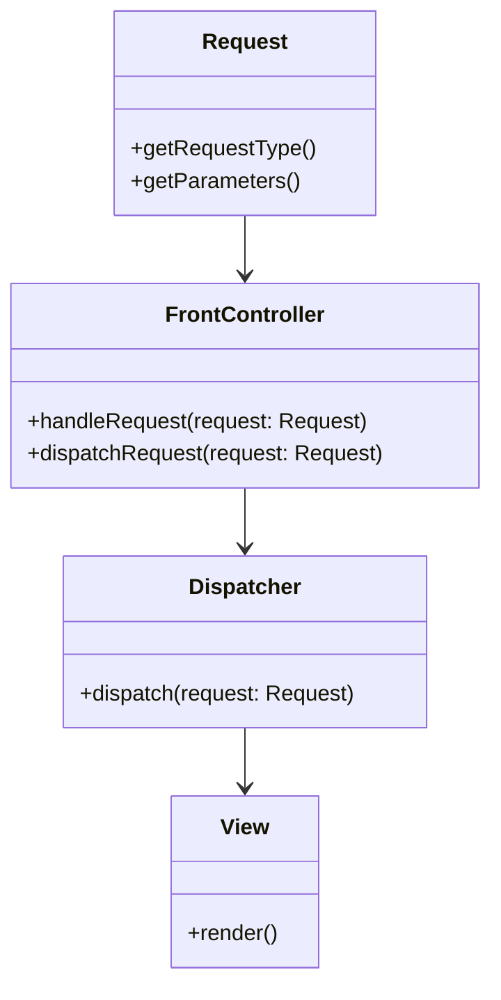

## 8.9 Front Controller Pattern

In the realm of web application architecture, the Front Controller Pattern stands out as a pivotal design pattern that streamlines request handling by centralizing control. This pattern is instrumental in managing the flow of requests and responses, ensuring consistency, and simplifying security measures. Let's delve into the intricacies of the Front Controller Pattern, its components, advantages, and practical implementation strategies in Java.

### Understanding the Front Controller Pattern

The Front Controller Pattern is a structural design pattern that provides a centralized entry point for handling all incoming requests in a web application. Its primary intent is to manage the flow of requests and responses, ensuring that all requests are processed through a single controller. This centralization facilitates consistent request handling, simplifies security and logging, and enables centralized control over navigation and flow.

#### Key Components of the Front Controller Pattern

The Front Controller Pattern comprises three main components:

1. **Front Controller**: The core component that processes incoming requests. It acts as the initial contact point for all requests, determining the appropriate action to take based on the request's nature.

2. **Dispatcher**: Responsible for dispatching requests to the appropriate handlers or views. The dispatcher decouples the request handling logic from the presentation logic, allowing for flexible and modular application design.

3. **View**: Represents the output presentation. The view component is responsible for rendering the response to the client, ensuring that the output is consistent and user-friendly.

### How the Front Controller Pattern Works

The Front Controller Pattern operates by intercepting all incoming requests and routing them through a single controller. This controller then delegates the request to the appropriate handler or view based on predefined rules or configurations. The following steps outline the typical flow of the Front Controller Pattern:

1. **Request Interception**: The front controller intercepts all incoming requests, acting as the single entry point for the application.

2. **Request Processing**: The front controller processes the request, determining the appropriate action to take based on the request's parameters and context.

3. **Request Dispatching**: The dispatcher component routes the request to the appropriate handler or view, decoupling the request handling logic from the presentation logic.

4. **Response Rendering**: The view component renders the response, ensuring that the output is consistent and user-friendly.

5. **Response Delivery**: The response is delivered to the client, completing the request-response cycle.

### Advantages of the Front Controller Pattern

The Front Controller Pattern offers several advantages that make it a popular choice for web application architecture:

- **Single Point of Entry**: By centralizing request handling, the front controller provides a single point of entry for all requests, simplifying security and logging.

- **Consistent Request Handling**: The pattern facilitates consistent handling of requests and responses, ensuring that all requests are processed uniformly.

- **Centralized Control**: The front controller enables centralized control over navigation and flow, allowing for flexible and modular application design.

- **Simplified Maintenance**: By decoupling request handling logic from presentation logic, the pattern simplifies maintenance and enhances code reusability.

- **Enhanced Security**: Centralizing request handling allows for easier implementation of security measures, such as authentication and authorization.

### UML Diagram: Visualizing the Front Controller Pattern

To better understand the structure and flow of the Front Controller Pattern, let's examine a UML diagram that illustrates the key components and their interactions.



**Diagram Description**: The UML diagram above illustrates the Front Controller Pattern's structure. The `FrontController` class intercepts incoming `Request` objects, processes them, and delegates them to the `Dispatcher`. The `Dispatcher` then routes the request to the appropriate `View` for rendering.

### Implementing the Front Controller Pattern in Java

Now that we have a solid understanding of the Front Controller Pattern's structure and advantages, let's explore how to implement it in a Java web application. We'll walk through a practical example, demonstrating each component's role and functionality.

#### Step 1: Define the Front Controller

The front controller is the central component that intercepts all incoming requests. In a Java web application, this is typically implemented as a servlet.

```java
import javax.servlet.*;
import javax.servlet.http.*;
import java.io.IOException;

public class FrontControllerServlet extends HttpServlet {

    private Dispatcher dispatcher;

    @Override
    public void init() throws ServletException {
        dispatcher = new Dispatcher();
    }

    @Override
    protected void doGet(HttpServletRequest request, HttpServletResponse response) throws ServletException, IOException {
        processRequest(request, response);
    }

    @Override
    protected void doPost(HttpServletRequest request, HttpServletResponse response) throws ServletException, IOException {
        processRequest(request, response);
    }

    private void processRequest(HttpServletRequest request, HttpServletResponse response) throws ServletException, IOException {
        String requestType = request.getParameter("action");
        dispatcher.dispatch(requestType, request, response);
    }
}
```

**Code Explanation**: The `FrontControllerServlet` class extends `HttpServlet` and overrides the `doGet` and `doPost` methods to handle incoming requests. It initializes a `Dispatcher` object and delegates request processing to the `processRequest` method, which determines the request type and dispatches it accordingly.

#### Step 2: Implement the Dispatcher

The dispatcher is responsible for routing requests to the appropriate handlers or views. It decouples the request handling logic from the presentation logic, allowing for flexible and modular application design.

```java
import javax.servlet.*;
import javax.servlet.http.*;
import java.io.IOException;

public class Dispatcher {

    public void dispatch(String requestType, HttpServletRequest request, HttpServletResponse response) throws ServletException, IOException {
        if (requestType == null) {
            requestType = "default";
        }

        switch (requestType) {
            case "home":
                new HomeView().render(request, response);
                break;
            case "profile":
                new ProfileView().render(request, response);
                break;
            default:
                new DefaultView().render(request, response);
                break;
        }
    }
}
```

**Code Explanation**: The `Dispatcher` class contains a `dispatch` method that takes the request type, request, and response as parameters. It uses a switch statement to determine the appropriate view to render based on the request type.

#### Step 3: Create the View Components

The view components are responsible for rendering the response to the client. Each view implements a `render` method that generates the output presentation.

```java
import javax.servlet.*;
import javax.servlet.http.*;
import java.io.IOException;

public class HomeView {

    public void render(HttpServletRequest request, HttpServletResponse response) throws ServletException, IOException {
        response.getWriter().println("<html><body><h1>Welcome to the Home Page</h1></body></html>");
    }
}

public class ProfileView {

    public void render(HttpServletRequest request, HttpServletResponse response) throws ServletException, IOException {
        response.getWriter().println("<html><body><h1>User Profile</h1></body></html>");
    }
}

public class DefaultView {

    public void render(HttpServletRequest request, HttpServletResponse response) throws ServletException, IOException {
        response.getWriter().println("<html><body><h1>Default Page</h1></body></html>");
    }
}
```

**Code Explanation**: Each view class (`HomeView`, `ProfileView`, `DefaultView`) implements a `render` method that generates the HTML output for the response. The `Dispatcher` class routes requests to these views based on the request type.

### Practical Implementation Strategies

Implementing the Front Controller Pattern in a Java web application involves several practical strategies to ensure optimal performance and maintainability:

- **Modular Design**: Organize your application into modular components, separating request handling logic from presentation logic. This enhances code reusability and simplifies maintenance.

- **Configuration Management**: Use configuration files or databases to manage request routing rules, enabling dynamic updates without modifying code.

- **Security Measures**: Implement security measures, such as authentication and authorization, at the front controller level to ensure consistent enforcement across the application.

- **Logging and Monitoring**: Integrate logging and monitoring tools to track request handling and performance metrics, facilitating debugging and optimization.

- **Scalability Considerations**: Design your application to handle increased load by optimizing the front controller's performance and leveraging caching mechanisms.

### Try It Yourself

To gain hands-on experience with the Front Controller Pattern, try modifying the code examples provided. Experiment with adding new request types and views, or implement additional features such as authentication and logging. This will help reinforce your understanding of the pattern and its practical applications.

### Conclusion

The Front Controller Pattern is a powerful design pattern that centralizes request handling in Java web applications, enhancing control, consistency, and security. By understanding its components, advantages, and implementation strategies, you can effectively leverage this pattern to build robust and maintainable web applications.

### Further Reading

For more information on the Front Controller Pattern and related design patterns, consider exploring the following resources:

- [Design Patterns: Elements of Reusable Object-Oriented Software](https://www.amazon.com/Design-Patterns-Elements-Reusable-Object-Oriented/dp/0201633612) by Erich Gamma, Richard Helm, Ralph Johnson, and John Vlissides
- [Java EE Design Patterns](https://www.oracle.com/java/technologies/java-ee-design-patterns.html) by Oracle
- [Spring Framework Documentation](https://spring.io/projects/spring-framework) for insights into implementing design patterns in Spring applications

## Quiz Time!



### What is the primary intent of the Front Controller Pattern?

- [x] To centralize request handling in a web application
- [ ] To manage database connections
- [ ] To handle user authentication
- [ ] To optimize performance

> **Explanation:** The Front Controller Pattern centralizes request handling, providing a single entry point for all requests in a web application.

### Which component of the Front Controller Pattern is responsible for dispatching requests to appropriate handlers or views?

- [ ] Front Controller
- [x] Dispatcher
- [ ] View
- [ ] Model

> **Explanation:** The Dispatcher is responsible for routing requests to the appropriate handlers or views.

### What advantage does the Front Controller Pattern provide in terms of security?

- [x] Simplifies implementation of security measures
- [ ] Increases application speed
- [ ] Reduces code complexity
- [ ] Enhances user interface design

> **Explanation:** By centralizing request handling, the Front Controller Pattern simplifies the implementation of security measures like authentication and authorization.

### In the provided Java example, what does the `processRequest` method do?

- [x] Determines the request type and dispatches it
- [ ] Renders the response
- [ ] Manages database transactions
- [ ] Handles user input validation

> **Explanation:** The `processRequest` method determines the request type and dispatches it to the appropriate handler or view.

### Which of the following is NOT a component of the Front Controller Pattern?

- [x] Model
- [ ] Front Controller
- [ ] Dispatcher
- [ ] View

> **Explanation:** The Model is not a component of the Front Controller Pattern; it is typically associated with the MVC pattern.

### How does the Front Controller Pattern facilitate consistent handling of requests?

- [x] By routing all requests through a single controller
- [ ] By using multiple controllers for different requests
- [ ] By directly connecting views to models
- [ ] By bypassing the dispatcher

> **Explanation:** The Front Controller Pattern routes all requests through a single controller, ensuring consistent handling.

### What role does the View component play in the Front Controller Pattern?

- [x] Represents the output presentation
- [ ] Handles request dispatching
- [ ] Manages security
- [ ] Processes incoming requests

> **Explanation:** The View component is responsible for rendering the response and representing the output presentation.

### Which Java class is typically used to implement the Front Controller in a web application?

- [x] Servlet
- [ ] JSP
- [ ] JavaBean
- [ ] Applet

> **Explanation:** In Java web applications, a Servlet is typically used to implement the Front Controller.

### True or False: The Front Controller Pattern is only applicable in Java web applications.

- [ ] True
- [x] False

> **Explanation:** While commonly used in Java web applications, the Front Controller Pattern can be applied in various web development environments.

### Which of the following is a practical strategy for implementing the Front Controller Pattern?

- [x] Use configuration files for request routing
- [ ] Hardcode all request routes
- [ ] Avoid using a dispatcher
- [ ] Directly connect the front controller to the database

> **Explanation:** Using configuration files for request routing allows for dynamic updates and enhances maintainability.


