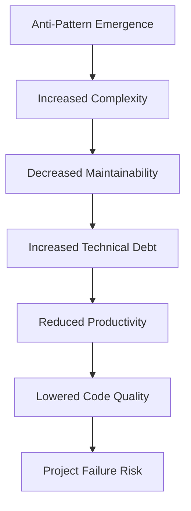

## 9.1 Understanding Anti-Patterns

In the realm of software engineering, the concept of patterns is often associated with best practices and proven solutions to recurring problems. However, not all patterns lead to optimal outcomes. Enter anti-patterns—common responses to recurring problems that are ineffective and counterproductive. Understanding anti-patterns is crucial for expert developers aiming to maintain high code quality and ensure the long-term health of their projects.

### What Are Anti-Patterns?

Anti-patterns are essentially the opposite of design patterns. While design patterns provide a template for solving problems effectively, anti-patterns represent poor solutions that developers might mistakenly adopt. They are often the result of a misunderstanding of design principles, lack of experience, or pressure from tight deadlines. Recognizing and addressing anti-patterns is vital to prevent their negative impact on software projects.

### Differentiating Anti-Patterns from Design Patterns

Design patterns are established solutions that have been refined and proven effective over time. They encapsulate best practices and guide developers in creating maintainable and scalable software. In contrast, anti-patterns emerge from common mistakes or misconceptions. They may seem like quick fixes but often lead to more significant problems down the line.

#### Key Differences:

- **Intent**: Design patterns aim to solve problems efficiently, while anti-patterns often arise from attempts to solve problems inappropriately.
- **Outcome**: Design patterns enhance code quality and maintainability; anti-patterns degrade them.
- **Recognition**: Design patterns are widely recognized and documented; anti-patterns are identified through experience and reflection on past mistakes.

### The Importance of Recognizing Anti-Patterns

Identifying anti-patterns is a critical skill for developers. It allows teams to:

- **Prevent Technical Debt**: By avoiding anti-patterns, teams can reduce the accumulation of technical debt, which can hinder future development and increase maintenance costs.
- **Enhance Code Maintainability**: Recognizing and refactoring anti-patterns leads to cleaner, more maintainable code.
- **Improve Team Productivity**: By eliminating ineffective practices, teams can focus on delivering value rather than fixing recurring issues.

### How Anti-Patterns Emerge

Anti-patterns often emerge from a combination of factors, including:

- **Tight Deadlines**: Under pressure, developers might resort to quick fixes that seem to work initially but lead to problems later.
- **Lack of Experience**: Inexperienced developers may not be aware of best practices and might unknowingly implement anti-patterns.
- **Misunderstanding of Design Principles**: Misinterpretation of design principles can lead to the adoption of ineffective solutions.
- **Lack of Code Reviews**: Without regular code reviews, anti-patterns can go unnoticed and proliferate within the codebase.

### Impact of Anti-Patterns on Software Projects

The presence of anti-patterns in a project can have several detrimental effects:

- **Decreased Maintainability**: Anti-patterns often result in code that is difficult to understand and modify.
- **Increased Technical Debt**: Inefficient solutions accumulate technical debt, requiring more effort to address in the future.
- **Reduced Team Productivity**: Teams may spend excessive time dealing with issues caused by anti-patterns instead of focusing on new features.
- **Lowered Code Quality**: Anti-patterns can lead to bugs and performance issues, affecting the overall quality of the software.

### Continuous Learning and Code Reviews

To combat anti-patterns, developers should embrace continuous learning and regular code reviews. These practices help in:

- **Identifying Anti-Patterns**: Code reviews provide an opportunity to spot anti-patterns early and address them before they become entrenched.
- **Sharing Knowledge**: Continuous learning and code reviews facilitate knowledge sharing among team members, promoting best practices.
- **Adhering to Design Principles**: Regular reviews reinforce adherence to design principles, reducing the likelihood of anti-patterns emerging.

### Setting the Stage for Common Anti-Patterns

In the subsequent sections, we will delve into specific anti-patterns that are prevalent in software development. These include:

- **Spaghetti Code**: Code with tangled control structures that are hard to follow.
- **God Object**: A class that centralizes too much intelligence and responsibility.
- **Golden Hammer**: The overuse of a familiar solution without considering its suitability.
- **Magic Numbers and Strings**: Using literals without explanation, leading to confusion.
- **Hard Coding**: Embedding configuration data directly in the code, reducing flexibility.

### Encouraging a Mindset Focused on Code Quality

As developers, we must cultivate a mindset that prioritizes code quality and long-term project health. This involves:

- **Being Mindful of Design Choices**: Consider the long-term implications of design decisions.
- **Embracing Best Practices**: Continuously seek to learn and apply best practices in software design.
- **Encouraging Open Communication**: Foster an environment where team members feel comfortable discussing and addressing anti-patterns.

By understanding and addressing anti-patterns, we can create software that is not only functional but also robust, maintainable, and scalable. Remember, the journey to mastering software design is ongoing. Keep learning, stay curious, and strive for excellence in every line of code you write.

### Code Example: Identifying and Refactoring an Anti-Pattern

Let's explore a common anti-pattern: the God Object. This anti-pattern occurs when a single class takes on too many responsibilities, making it difficult to maintain and extend.

```java
// Example of a God Object
public class OrderProcessor {
    // Handles order processing, payment, and notification
    public void processOrder(Order order) {
        // Process order
        // ...

        // Handle payment
        processPayment(order);

        // Send notification
        sendNotification(order);
    }

    private void processPayment(Order order) {
        // Payment processing logic
        // ...
    }

    private void sendNotification(Order order) {
        // Notification logic
        // ...
    }
}
```

In this example, the `OrderProcessor` class is responsible for processing orders, handling payments, and sending notifications. This violates the Single Responsibility Principle, making the class difficult to maintain.

#### Refactoring the God Object

To refactor this anti-pattern, we can separate the responsibilities into distinct classes.

```java
// Refactored version with separate responsibilities

public class OrderProcessor {
    private PaymentProcessor paymentProcessor;
    private NotificationService notificationService;

    public OrderProcessor(PaymentProcessor paymentProcessor, NotificationService notificationService) {
        this.paymentProcessor = paymentProcessor;
        this.notificationService = notificationService;
    }

    public void processOrder(Order order) {
        // Process order
        // ...

        // Delegate payment processing
        paymentProcessor.processPayment(order);

        // Delegate notification
        notificationService.sendNotification(order);
    }
}

public class PaymentProcessor {
    public void processPayment(Order order) {
        // Payment processing logic
        // ...
    }
}

public class NotificationService {
    public void sendNotification(Order order) {
        // Notification logic
        // ...
    }
}
```

By refactoring the `OrderProcessor` class, we have improved the maintainability and scalability of the code. Each class now has a single responsibility, making it easier to understand and modify.

### Try It Yourself

Experiment with the refactored code by adding new features or modifying existing ones. For instance, try adding a new notification method or updating the payment processing logic. Observe how the separation of responsibilities simplifies these changes.

### Visualizing the Impact of Anti-Patterns

To better understand how anti-patterns affect software projects, let's visualize the concept using a diagram.



**Diagram Description**: This flowchart illustrates the impact of anti-patterns on software projects. It shows how the emergence of anti-patterns leads to increased complexity, decreased maintainability, and other negative consequences, ultimately increasing the risk of project failure.

### References and Further Reading

- [Refactoring: Improving the Design of Existing Code](https://martinfowler.com/books/refactoring.html) by Martin Fowler
- [Design Patterns: Elements of Reusable Object-Oriented Software](https://www.oreilly.com/library/view/design-patterns-elements/0201633612/) by Erich Gamma et al.
- [AntiPatterns: Refactoring Software, Architectures, and Projects in Crisis](https://www.amazon.com/AntiPatterns-Refactoring-Software-Architectures-Projects/dp/0471197130) by William J. Brown et al.

### Knowledge Check

- What is an anti-pattern, and how does it differ from a design pattern?
- How can tight deadlines contribute to the emergence of anti-patterns?
- What are some common consequences of anti-patterns in software projects?
- How can continuous learning and code reviews help in identifying anti-patterns?
- Why is it important to refactor anti-patterns, and what benefits does it bring?

### Embrace the Journey

Remember, understanding anti-patterns is just the beginning. As you progress, you'll develop a keen eye for identifying and addressing these pitfalls. Keep experimenting, stay curious, and enjoy the journey of mastering software design!

## Quiz Time!



### What is an anti-pattern?

- [x] A common response to a recurring problem that is ineffective and counterproductive
- [ ] A proven solution to a recurring problem
- [ ] A design principle for creating maintainable code
- [ ] A pattern used to enhance performance

> **Explanation:** An anti-pattern is a common response to a recurring problem that is ineffective and counterproductive, unlike design patterns which are proven solutions.

### How do anti-patterns differ from design patterns?

- [x] Anti-patterns represent poor solutions, while design patterns represent best practices
- [ ] Anti-patterns are always more efficient than design patterns
- [ ] Anti-patterns are used in specific programming languages, while design patterns are universal
- [ ] Anti-patterns are only applicable to small projects

> **Explanation:** Anti-patterns represent poor solutions to problems, whereas design patterns encapsulate best practices and proven solutions.

### What is a common cause of anti-patterns?

- [x] Tight deadlines
- [ ] Over-documentation
- [ ] Excessive testing
- [ ] Use of design patterns

> **Explanation:** Tight deadlines often lead to quick fixes and shortcuts, resulting in the emergence of anti-patterns.

### What is a consequence of anti-patterns in software projects?

- [x] Increased technical debt
- [ ] Improved code readability
- [ ] Enhanced performance
- [ ] Reduced complexity

> **Explanation:** Anti-patterns often lead to increased technical debt, making future maintenance and development more challenging.

### How can code reviews help in identifying anti-patterns?

- [x] By providing an opportunity to spot and address anti-patterns early
- [ ] By increasing the number of lines of code
- [ ] By ensuring all code follows a single pattern
- [ ] By reducing the need for documentation

> **Explanation:** Code reviews allow team members to identify and address anti-patterns early, preventing them from becoming entrenched.

### What is the impact of anti-patterns on team productivity?

- [x] Reduced productivity
- [ ] Increased productivity
- [ ] No impact
- [ ] Enhanced creativity

> **Explanation:** Anti-patterns can reduce team productivity as developers spend more time dealing with issues caused by ineffective solutions.

### Why is it important to refactor anti-patterns?

- [x] To improve code maintainability and scalability
- [ ] To increase the number of lines of code
- [ ] To make code more complex
- [ ] To reduce the need for testing

> **Explanation:** Refactoring anti-patterns improves code maintainability and scalability, making it easier to understand and modify.

### What mindset should developers adopt to avoid anti-patterns?

- [x] A mindset focused on code quality and long-term project health
- [ ] A mindset focused on quick fixes and immediate results
- [ ] A mindset focused on reducing lines of code
- [ ] A mindset focused on using as many patterns as possible

> **Explanation:** Developers should focus on code quality and long-term project health to avoid anti-patterns and their negative consequences.

### What is one benefit of continuous learning in software development?

- [x] It helps in identifying and avoiding anti-patterns
- [ ] It reduces the need for code reviews
- [ ] It ensures all code follows a single pattern
- [ ] It eliminates the need for documentation

> **Explanation:** Continuous learning helps developers stay updated with best practices and identify anti-patterns, enhancing code quality.

### True or False: Anti-patterns always lead to project failure.

- [ ] True
- [x] False

> **Explanation:** While anti-patterns can increase the risk of project failure, they do not always lead to it. Addressing anti-patterns can mitigate their negative impact.


