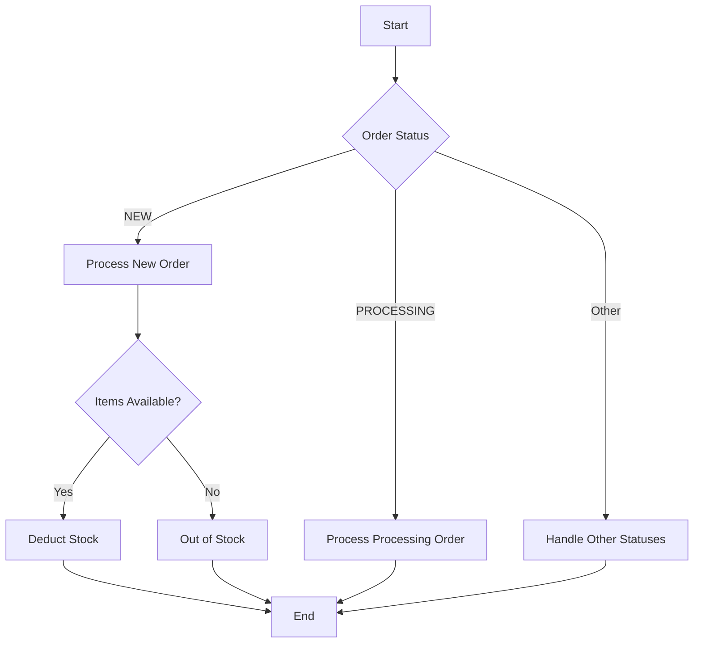

## 9.2.1 Spaghetti Code

In the realm of software engineering, "spaghetti code" is a term that evokes a sense of dread among developers. It refers to a style of programming that is characterized by tangled and complex control structures, making the code difficult to read, understand, and maintain. In this section, we will delve into the origins of spaghetti code, its characteristics, the negative impacts it has on the software development lifecycle, and strategies for prevention and refactoring.

### Understanding Spaghetti Code

**Spaghetti code** is a pejorative term for code that is unstructured and poorly organized. It often arises from a lack of planning, insufficient understanding of programming principles, or the absence of coding standards. This type of code is typically the result of continuous patching and quick fixes over time, leading to a convoluted and tangled mess.

#### Characteristics of Spaghetti Code

Spaghetti code is marked by several distinct characteristics:

- **Lack of Modularity**: Functions and classes are not well-defined, leading to a monolithic codebase where everything is interconnected.
- **Excessive Nested Loops and Conditionals**: Deeply nested loops and conditionals make the code hard to follow and understand.
- **Convoluted Control Flow**: The flow of execution is not straightforward, often jumping around unpredictably.
- **Poor Naming Conventions**: Variables and functions are often poorly named, adding to the confusion.
- **Lack of Documentation**: Little to no comments or documentation to explain the code's purpose or logic.

### The Negative Impacts of Spaghetti Code

Spaghetti code can have severe repercussions on the software development lifecycle:

- **Difficult Debugging**: Tracing bugs in spaghetti code is challenging due to its complex and tangled nature.
- **Testing Challenges**: Writing tests for such code is difficult, often leading to inadequate test coverage.
- **Hindered Feature Addition**: Adding new features becomes a daunting task as changes in one part of the code can have unforeseen effects elsewhere.
- **Increased Maintenance Costs**: The time and effort required to maintain spaghetti code are significantly higher, leading to increased costs.

#### Real-World Examples

In the real world, spaghetti code has led to numerous project delays and failures. For instance, a well-known case is the development of a financial application where the lack of modularity and excessive nesting led to a six-month delay in deployment. The team spent countless hours debugging and testing, only to find that changes in one module broke functionality in others.

### Preventing Spaghetti Code

Preventing spaghetti code requires a proactive approach to software development. Here are some strategies to consider:

1. **Break Down Complex Functions**: Divide large functions into smaller, single-purpose methods. This promotes readability and reusability.

2. **Use Proper Control Structures**: Avoid deep nesting by using guard clauses or early returns. This simplifies the control flow.

3. **Apply Object-Oriented Principles**: Encapsulation and modularity are key to preventing spaghetti code. Use classes and interfaces to define clear boundaries.

4. **Adopt Coding Standards**: Establish and adhere to coding standards to ensure consistency across the codebase.

5. **Conduct Regular Code Reviews**: Peer reviews can catch potential spaghetti code early in the development process.

6. **Thorough Documentation**: Maintain comprehensive documentation to explain the code's logic and purpose.

### Refactoring Spaghetti Code

Refactoring is the process of restructuring existing code without changing its external behavior. Here are some techniques to untangle spaghetti code:

- **Restructure Code**: Identify and isolate tightly coupled code segments. Refactor them into separate methods or classes.

- **Apply Design Patterns**: Use design patterns like Strategy, Observer, or Factory to introduce structure and modularity.

- **Simplify Control Flow**: Replace complex conditional logic with polymorphism or state machines where applicable.

- **Improve Naming Conventions**: Rename variables and functions to better reflect their purpose.

#### Java Code Example: Spaghetti Code vs. Refactored Code

Let's look at an example of spaghetti code and its refactored version.

**Spaghetti Code Example:**

```java
public class OrderProcessor {
    public void processOrder(Order order) {
        if (order != null) {
            if (order.getStatus().equals("NEW")) {
                // Process new order
                if (order.getItems() != null && !order.getItems().isEmpty()) {
                    for (Item item : order.getItems()) {
                        if (item.getStock() > 0) {
                            // Deduct stock
                            item.setStock(item.getStock() - 1);
                        } else {
                            System.out.println("Item out of stock");
                        }
                    }
                }
            } else if (order.getStatus().equals("PROCESSING")) {
                // Process processing order
                // ...
            } else {
                // Handle other statuses
                // ...
            }
        }
    }
}
```

**Refactored Code Example:**

```java
public class OrderProcessor {
    public void processOrder(Order order) {
        if (order == null) return;

        switch (order.getStatus()) {
            case "NEW":
                processNewOrder(order);
                break;
            case "PROCESSING":
                processProcessingOrder(order);
                break;
            default:
                handleOtherStatuses(order);
                break;
        }
    }

    private void processNewOrder(Order order) {
        if (order.getItems() == null || order.getItems().isEmpty()) return;

        for (Item item : order.getItems()) {
            processItem(item);
        }
    }

    private void processItem(Item item) {
        if (item.getStock() > 0) {
            item.setStock(item.getStock() - 1);
        } else {
            System.out.println("Item out of stock");
        }
    }

    private void processProcessingOrder(Order order) {
        // Process processing order
        // ...
    }

    private void handleOtherStatuses(Order order) {
        // Handle other statuses
        // ...
    }
}
```

In the refactored code, we have broken down the complex `processOrder` method into smaller, single-purpose methods. This not only improves readability but also makes the code easier to maintain and test.

### Visualizing Spaghetti Code

To better understand the complexity of spaghetti code, let's visualize its structure using a flowchart. This flowchart represents the tangled control flow often found in spaghetti code.



### Best Practices to Prevent Spaghetti Code

1. **Code Reviews**: Regular code reviews help catch potential spaghetti code early and ensure adherence to coding standards.

2. **Adherence to Coding Standards**: Establish clear coding standards and ensure all team members follow them.

3. **Thorough Documentation**: Maintain comprehensive documentation to explain the code's logic and purpose.

4. **Continuous Learning**: Encourage continuous learning and adaptation to new coding practices and technologies.

### Knowledge Check

- **Question**: What are the main characteristics of spaghetti code?
- **Answer**: Lack of modularity, excessive nested loops and conditionals, convoluted control flow, poor naming conventions, and lack of documentation.

- **Question**: How can spaghetti code impact the software development lifecycle?
- **Answer**: It can make debugging difficult, hinder testing, complicate feature addition, and increase maintenance costs.

- **Question**: What are some strategies to prevent spaghetti code?
- **Answer**: Break down complex functions, use proper control structures, apply object-oriented principles, adopt coding standards, conduct regular code reviews, and maintain thorough documentation.

### Try It Yourself

Experiment with the provided code examples by:

- Adding new order statuses and processing logic.
- Refactoring the code further to introduce design patterns like Strategy or Observer.
- Implementing unit tests to ensure the refactored code works as expected.

### Conclusion

Spaghetti code is a common anti-pattern that can severely impact the quality and maintainability of software. By understanding its characteristics and impacts, and by employing strategies to prevent and refactor it, we can ensure our code remains clean, modular, and maintainable. Remember, the key to avoiding spaghetti code lies in planning, adhering to coding standards, and continuously refactoring and reviewing code.

## Quiz Time!



### What is spaghetti code?

- [x] Code with tangled and complex control structures
- [ ] Code that is well-organized and modular
- [ ] Code that follows design patterns
- [ ] Code with thorough documentation

> **Explanation:** Spaghetti code is characterized by tangled and complex control structures, making it difficult to read and maintain.


### Which of the following is a characteristic of spaghetti code?

- [x] Lack of modularity
- [ ] Clear and concise control flow
- [ ] Well-defined functions
- [ ] Adherence to coding standards

> **Explanation:** Spaghetti code lacks modularity, making it difficult to understand and maintain.


### What is one negative impact of spaghetti code?

- [x] Increased maintenance costs
- [ ] Improved readability
- [ ] Easier debugging
- [ ] Faster feature addition

> **Explanation:** Spaghetti code increases maintenance costs due to its complexity and lack of structure.


### How can we prevent spaghetti code?

- [x] Break down complex functions into smaller methods
- [ ] Use deep nesting in control structures
- [ ] Avoid coding standards
- [ ] Ignore code reviews

> **Explanation:** Breaking down complex functions into smaller methods helps prevent spaghetti code.


### What is a refactoring technique for spaghetti code?

- [x] Restructuring code into separate methods or classes
- [ ] Adding more nested loops
- [ ] Ignoring design patterns
- [ ] Avoiding documentation

> **Explanation:** Restructuring code into separate methods or classes helps untangle spaghetti code.


### Which design pattern can help refactor spaghetti code?

- [x] Strategy pattern
- [ ] Spaghetti pattern
- [ ] Hard coding pattern
- [ ] Magic numbers pattern

> **Explanation:** The Strategy pattern can help introduce structure and modularity to spaghetti code.


### What is a common cause of spaghetti code?

- [x] Lack of planning and coding standards
- [ ] Adherence to best practices
- [ ] Use of design patterns
- [ ] Thorough documentation

> **Explanation:** Spaghetti code often arises from a lack of planning and coding standards.


### Why is spaghetti code difficult to debug?

- [x] Due to its complex and tangled nature
- [ ] Because it is well-structured
- [ ] Because it follows design patterns
- [ ] Due to thorough documentation

> **Explanation:** Spaghetti code is difficult to debug because of its complex and tangled nature.


### How does spaghetti code affect testing?

- [x] It hinders writing tests and reduces test coverage
- [ ] It makes testing easier
- [ ] It improves test coverage
- [ ] It simplifies test cases

> **Explanation:** Spaghetti code hinders writing tests and reduces test coverage due to its complexity.


### True or False: Spaghetti code is beneficial for software development.

- [ ] True
- [x] False

> **Explanation:** Spaghetti code is detrimental to software development as it makes code difficult to read, maintain, and extend.


