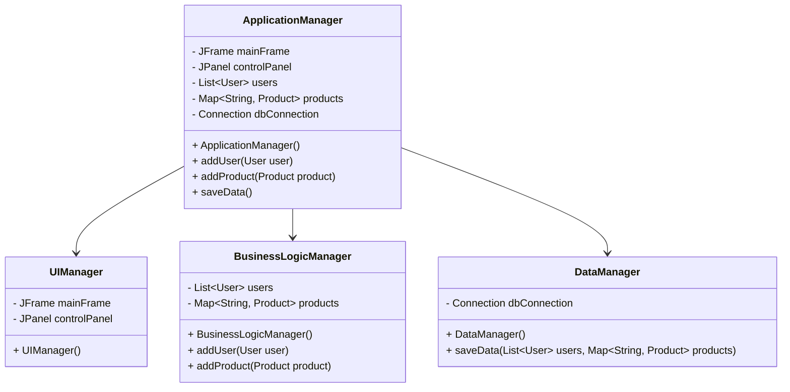

## 9.2.2 God Object

In the realm of software engineering, particularly in object-oriented programming, the term "God Object" refers to an anti-pattern where a single class assumes too many responsibilities. This centralization of control leads to tight coupling, decreased maintainability, and a host of other issues. In this section, we'll delve into the characteristics of the God Object anti-pattern, explore the problems it causes, and provide strategies for refactoring such objects to adhere to best practices in software design.

### Understanding the God Object Anti-Pattern

The God Object anti-pattern is characterized by a class that knows too much or does too much. It often emerges in systems where design principles are not strictly followed, leading to a single class handling multiple aspects of the application, such as user interface, business logic, and data access. This violates the Single Responsibility Principle (SRP), which states that a class should have only one reason to change, and High Cohesion, which emphasizes that a class should only contain related functionalities.

#### Characteristics of a God Object

1. **Centralized Control**: The God Object tends to act as a central hub for various functionalities, making it a bottleneck in the system.
2. **Excessive Responsibilities**: It handles multiple unrelated tasks, from managing data to controlling UI elements.
3. **High Coupling**: The class is tightly coupled with many other classes, making changes difficult and error-prone.
4. **Complexity**: The sheer size and complexity of the God Object make it hard to understand and maintain.

### Problems Caused by God Objects

The presence of a God Object in a codebase can lead to several significant issues:

1. **Difficulty in Understanding and Maintaining the Code**: The complexity of a God Object makes it challenging for developers to comprehend its functionality, leading to increased maintenance costs.

2. **Challenges in Testing**: Due to its extensive dependencies, testing a God Object becomes cumbersome. Unit tests may require setting up numerous dependencies, making them fragile and hard to maintain.

3. **Reduced Flexibility**: Modifying or extending a system with a God Object is difficult because changes in the God Object can have widespread repercussions throughout the codebase.

4. **Violation of Design Principles**: By not adhering to the Single Responsibility Principle and High Cohesion, the God Object leads to a design that is not modular or scalable.

### Example of a God Object in Java

Consider a Java application where a single class, `ApplicationManager`, handles UI rendering, business logic, and database interactions. Here's a simplified example:

```java
public class ApplicationManager {
    // UI components
    private JFrame mainFrame;
    private JPanel controlPanel;

    // Business logic
    private List<User> users;
    private Map<String, Product> products;

    // Database connection
    private Connection dbConnection;

    public ApplicationManager() {
        // Initialize UI
        setupUI();

        // Initialize business logic
        users = new ArrayList<>();
        products = new HashMap<>();

        // Initialize database connection
        dbConnection = DriverManager.getConnection("jdbc:mysql://localhost:3306/mydb", "user", "password");
    }

    private void setupUI() {
        mainFrame = new JFrame("Application");
        controlPanel = new JPanel();
        mainFrame.add(controlPanel);
        mainFrame.setVisible(true);
    }

    public void addUser(User user) {
        users.add(user);
        // Additional business logic
    }

    public void addProduct(Product product) {
        products.put(product.getId(), product);
        // Additional business logic
    }

    public void saveData() {
        // Save users and products to the database
    }

    // More methods handling various tasks...
}
```

### Strategies to Avoid or Refactor God Objects

To refactor a God Object, we need to decompose it into smaller, focused classes with clear responsibilities. Here are some strategies:

1. **Decompose Responsibilities**: Break down the God Object into smaller classes, each handling a specific responsibility. For instance, separate classes for UI management, business logic, and data access.

2. **Use Design Patterns**: Implement design patterns like Facade, Mediator, or Controller to distribute responsibilities and reduce coupling.

3. **Adhere to SOLID Principles**: Ensure that each class follows the Single Responsibility Principle and High Cohesion to prevent the creation of God Objects.

#### Refactoring the God Object Example

Let's refactor the `ApplicationManager` class by decomposing it into smaller classes:

```java
// UIManager.java
public class UIManager {
    private JFrame mainFrame;
    private JPanel controlPanel;

    public UIManager() {
        setupUI();
    }

    private void setupUI() {
        mainFrame = new JFrame("Application");
        controlPanel = new JPanel();
        mainFrame.add(controlPanel);
        mainFrame.setVisible(true);
    }
}

// BusinessLogicManager.java
public class BusinessLogicManager {
    private List<User> users;
    private Map<String, Product> products;

    public BusinessLogicManager() {
        users = new ArrayList<>();
        products = new HashMap<>();
    }

    public void addUser(User user) {
        users.add(user);
        // Additional business logic
    }

    public void addProduct(Product product) {
        products.put(product.getId(), product);
        // Additional business logic
    }
}

// DataManager.java
public class DataManager {
    private Connection dbConnection;

    public DataManager() throws SQLException {
        dbConnection = DriverManager.getConnection("jdbc:mysql://localhost:3306/mydb", "user", "password");
    }

    public void saveData(List<User> users, Map<String, Product> products) {
        // Save users and products to the database
    }
}
```

### Benefits of Refactoring God Objects

Refactoring a God Object into smaller, focused classes offers several benefits:

1. **Improved Modularity**: Each class has a specific responsibility, making the system more modular and easier to understand.

2. **Easier Testing**: Smaller classes with fewer dependencies are easier to test, leading to more robust and maintainable unit tests.

3. **Enhanced Code Readability**: With responsibilities clearly defined, the code becomes more readable and easier to navigate.

4. **Increased Flexibility**: Changes can be made to individual classes without affecting the entire system, enhancing flexibility and scalability.

### Visualizing the Refactoring Process

To better understand the refactoring process, let's visualize the transition from a God Object to a more modular design using a class diagram.



### Try It Yourself

To solidify your understanding, try refactoring a God Object in your own projects. Identify a class that seems to handle too many responsibilities, and apply the strategies discussed to decompose it into smaller, focused classes. Experiment with different design patterns to see how they can help distribute responsibilities effectively.

### Knowledge Check

1. **Identify a God Object**: Look for classes in your codebase that seem overly complex or handle multiple unrelated tasks. Consider how you might refactor them.

2. **Apply Design Patterns**: Choose a design pattern that could help distribute responsibilities and refactor the God Object accordingly.

3. **Test the Refactored Code**: Ensure that your refactored code is easier to test and maintain. Check for improvements in modularity and readability.

### Conclusion

The God Object anti-pattern is a common pitfall in software design that can lead to tightly coupled, hard-to-maintain code. By understanding its characteristics and employing strategies to refactor such objects, we can create more modular, maintainable, and scalable systems. Adhering to SOLID principles and leveraging design patterns are key to preventing the creation of God Objects in future development.

Remember, refactoring is an ongoing process. As you continue to develop and maintain your codebase, regularly review your classes to ensure they adhere to best practices in software design.

## Quiz Time!



### What is a God Object?

- [x] A class that assumes too many responsibilities and centralizes control.
- [ ] A class that follows the Single Responsibility Principle.
- [ ] A design pattern that promotes modularity.
- [ ] A class that handles only UI-related tasks.

> **Explanation:** A God Object is an anti-pattern where a single class handles multiple unrelated responsibilities, leading to tight coupling and decreased maintainability.


### Which principle does a God Object violate?

- [x] Single Responsibility Principle
- [ ] Open/Closed Principle
- [ ] Liskov Substitution Principle
- [ ] Interface Segregation Principle

> **Explanation:** A God Object violates the Single Responsibility Principle by taking on too many responsibilities instead of focusing on one.


### What is a common problem caused by God Objects?

- [x] Difficulty in understanding and maintaining the code.
- [ ] Increased modularity.
- [ ] Simplified testing.
- [ ] Enhanced flexibility.

> **Explanation:** God Objects are complex and tightly coupled, making them difficult to understand, maintain, and test.


### How can you refactor a God Object?

- [x] Decompose it into smaller, focused classes with clear responsibilities.
- [ ] Combine it with other classes to increase functionality.
- [ ] Add more responsibilities to make it comprehensive.
- [ ] Ignore it, as it doesn't affect the codebase.

> **Explanation:** Refactoring a God Object involves breaking it down into smaller classes, each with a specific responsibility, to improve modularity and maintainability.


### Which design pattern can help distribute responsibilities in a God Object?

- [x] Facade
- [x] Mediator
- [ ] Singleton
- [ ] Prototype

> **Explanation:** Patterns like Facade and Mediator can help distribute responsibilities and reduce coupling in a God Object.


### What is a benefit of refactoring a God Object?

- [x] Improved modularity
- [ ] Increased complexity
- [ ] Reduced code readability
- [ ] Tighter coupling

> **Explanation:** Refactoring a God Object improves modularity, making the code easier to understand and maintain.


### What is a characteristic of a God Object?

- [x] Centralized control and excessive responsibilities.
- [ ] High cohesion and low coupling.
- [ ] Adherence to SOLID principles.
- [ ] Focused on a single responsibility.

> **Explanation:** A God Object is characterized by centralized control, excessive responsibilities, and tight coupling.


### Which Java class in the example was a God Object?

- [x] ApplicationManager
- [ ] UIManager
- [ ] BusinessLogicManager
- [ ] DataManager

> **Explanation:** The `ApplicationManager` class was a God Object, handling UI, business logic, and data access.


### What is a key takeaway from refactoring God Objects?

- [x] It leads to more modular and maintainable code.
- [ ] It increases the complexity of the codebase.
- [ ] It reduces the flexibility of the system.
- [ ] It makes testing more difficult.

> **Explanation:** Refactoring God Objects results in more modular, maintainable, and testable code.


### True or False: A God Object is a recommended design pattern.

- [ ] True
- [x] False

> **Explanation:** False. A God Object is an anti-pattern, not a recommended design pattern, as it leads to tightly coupled and hard-to-maintain code.


