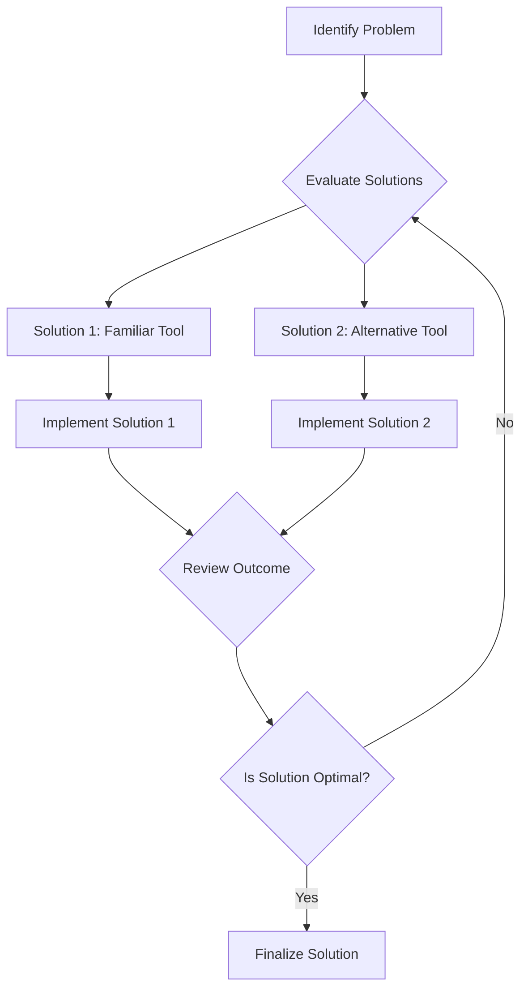

## 9.2.3 Golden Hammer

In the realm of software development, the Golden Hammer anti-pattern is a common pitfall that can lead to suboptimal solutions and increased complexity. This anti-pattern arises when developers rely too heavily on a familiar technology or solution, applying it to problems for which it is not well-suited. The origin of the term "Golden Hammer" comes from the saying, "If all you have is a hammer, everything looks like a nail." This section will delve into the nuances of the Golden Hammer anti-pattern, its consequences, and strategies to avoid it, with a focus on Java development.

### Understanding the Golden Hammer Anti-Pattern

The Golden Hammer anti-pattern occurs when a developer becomes overly reliant on a particular technology, tool, or design pattern, using it indiscriminately across various projects. This reliance often stems from familiarity, past success, or a lack of awareness of alternative solutions. While the chosen tool may have been effective in previous scenarios, it may not be the best fit for every problem.

#### Origins and Explanation

The phrase "If all you have is a hammer, everything looks like a nail" succinctly captures the essence of the Golden Hammer. It highlights the tendency to apply a familiar tool or solution to every problem, regardless of its appropriateness. In software development, this can manifest as the overuse of a specific programming language, framework, or design pattern, leading to solutions that are not tailored to the unique requirements of the project.

### Consequences of the Golden Hammer

The overuse of a familiar solution can have several negative consequences, including:

- **Suboptimal Solutions**: Applying an inappropriate tool or pattern can result in solutions that are inefficient or ineffective. For example, using a heavyweight framework for a simple task can lead to unnecessary complexity and overhead.

- **Increased Complexity**: Over-reliance on a single tool can lead to convoluted codebases that are difficult to maintain and extend. This complexity can hinder future development and increase the risk of bugs.

- **Missed Opportunities**: By failing to explore alternative solutions, developers may miss out on more efficient or innovative approaches that could better address the problem at hand.

### Examples of the Golden Hammer in Java

To illustrate the Golden Hammer anti-pattern, let's consider some examples in Java development:

#### Overusing Inheritance

Inheritance is a powerful feature in object-oriented programming, but it can be overused. Developers may default to inheritance when composition would be more appropriate, leading to rigid and tightly coupled code.

```java
// Overuse of inheritance
class Vehicle {
    void start() {
        System.out.println("Vehicle started");
    }
}

class Car extends Vehicle {
    void drive() {
        System.out.println("Car is driving");
    }
}

class Boat extends Vehicle {
    void sail() {
        System.out.println("Boat is sailing");
    }
}
```

In this example, both `Car` and `Boat` inherit from `Vehicle`, but they have distinct behaviors that could be better represented using composition.

```java
// Using composition instead of inheritance
interface Drivable {
    void drive();
}

interface Sailable {
    void sail();
}

class Car {
    private Drivable drivable;

    Car(Drivable drivable) {
        this.drivable = drivable;
    }

    void start() {
        System.out.println("Car started");
        drivable.drive();
    }
}

class Boat {
    private Sailable sailable;

    Boat(Sailable sailable) {
        this.sailable = sailable;
    }

    void start() {
        System.out.println("Boat started");
        sailable.sail();
    }
}
```

By using composition, we can create more flexible and maintainable code that better represents the distinct behaviors of `Car` and `Boat`.

#### Misusing Frameworks

Another common example of the Golden Hammer is the misuse of frameworks. Developers may choose a framework they are comfortable with, even if it is not the best fit for the project. For instance, using a full-fledged enterprise framework like Spring for a simple application can introduce unnecessary complexity.

### Strategies to Avoid the Golden Hammer

To avoid falling into the trap of the Golden Hammer, developers can adopt several strategies:

#### Continuous Learning

Stay informed about new technologies, tools, and design patterns. By expanding your knowledge, you can make more informed decisions about which solutions are best suited for a given problem.

#### Thorough Problem Analysis

Before selecting a solution, take the time to thoroughly analyze the problem requirements. Consider the specific needs of the project and evaluate multiple options before settling on a particular approach.

#### Openness to New Tools

Be open to using different tools or approaches when they better fit the problem. This may involve stepping outside your comfort zone, but it can lead to more effective solutions.

### Case Studies: Avoiding the Golden Hammer

Let's explore some case studies where avoiding the Golden Hammer led to more effective solutions:

#### Case Study 1: Choosing the Right Database

A team was developing a high-traffic web application and initially chose a relational database because of their familiarity with SQL. However, after analyzing the application's requirements, they realized that a NoSQL database would better handle the application's scalability and performance needs. By switching to a more suitable database, they improved the application's performance and scalability.

#### Case Study 2: Selecting the Appropriate Framework

In another scenario, a developer was tasked with building a simple REST API. Their initial inclination was to use a comprehensive framework they had used in the past. However, after evaluating the project's requirements, they opted for a lightweight framework that was easier to set up and maintain. This decision resulted in a more streamlined development process and a more maintainable codebase.

### Emphasizing Adaptability and Critical Thinking

In software development, adaptability and critical thinking are crucial skills. By remaining open to new ideas and approaches, developers can avoid the pitfalls of the Golden Hammer and create solutions that are truly tailored to the problem at hand. Remember, the goal is not to find a one-size-fits-all solution, but to select the right tool for the job.

### Try It Yourself

To further explore the concept of the Golden Hammer, try modifying the code examples provided. Experiment with different design patterns and frameworks to see how they impact the solution. Consider how you might approach a problem differently if you were not constrained by familiarity with a particular tool.

### Visualizing the Golden Hammer

To better understand the Golden Hammer anti-pattern, let's visualize the decision-making process when selecting a solution:



This diagram illustrates the importance of evaluating multiple solutions and reviewing the outcome to ensure the chosen solution is optimal.

### Knowledge Check

Before moving on, consider the following questions:

- What are some potential consequences of the Golden Hammer anti-pattern?
- How can continuous learning help prevent the overuse of familiar solutions?
- Why is it important to thoroughly analyze problem requirements before selecting a solution?

### Summary

In this section, we explored the Golden Hammer anti-pattern and its implications in software development. By understanding the potential pitfalls of over-reliance on familiar solutions, developers can make more informed decisions and create more effective solutions. Remember, adaptability and critical thinking are key to avoiding the Golden Hammer and achieving success in software development.

## Quiz Time!



### What is the Golden Hammer anti-pattern?

- [x] Overusing a familiar solution regardless of its suitability
- [ ] Using a new technology without understanding it
- [ ] Applying multiple solutions to a single problem
- [ ] Ignoring established design patterns

> **Explanation:** The Golden Hammer anti-pattern involves overusing a familiar solution, even when it's not suitable for the problem at hand.

### Which of the following is a consequence of the Golden Hammer?

- [x] Suboptimal solutions
- [ ] Increased innovation
- [ ] Reduced complexity
- [ ] Enhanced problem-solving

> **Explanation:** The Golden Hammer can lead to suboptimal solutions because the chosen tool or pattern may not be the best fit for the problem.

### How can developers avoid the Golden Hammer?

- [x] By continuously learning about new technologies
- [ ] By sticking to familiar tools
- [ ] By ignoring problem requirements
- [ ] By using the same solution for every problem

> **Explanation:** Continuous learning about new technologies helps developers make informed decisions and avoid over-reliance on familiar solutions.

### What is an example of the Golden Hammer in Java?

- [x] Overusing inheritance instead of composition
- [ ] Using interfaces for abstraction
- [ ] Applying design patterns appropriately
- [ ] Writing clean and maintainable code

> **Explanation:** Overusing inheritance when composition is more suitable is an example of the Golden Hammer in Java.

### Why is it important to analyze problem requirements thoroughly?

- [x] To select the most suitable solution
- [ ] To save time and effort
- [ ] To avoid using any design patterns
- [ ] To ensure the use of familiar tools

> **Explanation:** Thorough analysis of problem requirements helps in selecting the most suitable solution, avoiding the Golden Hammer.

### What role does adaptability play in avoiding the Golden Hammer?

- [x] It allows developers to use different tools as needed
- [ ] It encourages sticking to one solution
- [ ] It limits the use of new technologies
- [ ] It focuses on familiar patterns only

> **Explanation:** Adaptability allows developers to choose different tools and approaches based on the problem's needs, avoiding the Golden Hammer.

### How can case studies help in understanding the Golden Hammer?

- [x] By providing real-world examples of avoiding the pattern
- [ ] By showing the benefits of using familiar solutions
- [ ] By discouraging the use of new technologies
- [ ] By emphasizing the use of one tool for all problems

> **Explanation:** Case studies provide real-world examples of how avoiding the Golden Hammer leads to more effective solutions.

### What is a potential benefit of avoiding the Golden Hammer?

- [x] More effective solutions
- [ ] Increased reliance on one tool
- [ ] Reduced learning opportunities
- [ ] Greater complexity

> **Explanation:** Avoiding the Golden Hammer can lead to more effective solutions by using the right tool for the job.

### What is the key takeaway from understanding the Golden Hammer?

- [x] Adaptability and critical thinking are crucial
- [ ] Familiarity with tools is sufficient
- [ ] One solution fits all problems
- [ ] Complexity is unavoidable

> **Explanation:** Adaptability and critical thinking are crucial in avoiding the Golden Hammer and achieving success in software development.

### True or False: The Golden Hammer anti-pattern is beneficial in all scenarios.

- [ ] True
- [x] False

> **Explanation:** The Golden Hammer anti-pattern is not beneficial as it leads to suboptimal solutions and increased complexity.


